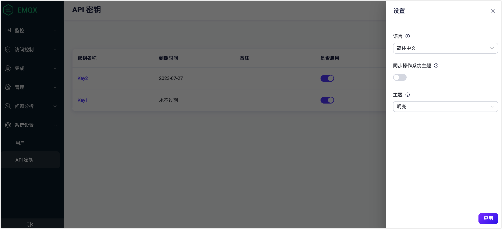

# 系统设置

EMQX Dashboard 的**系统**菜单包括**用户**、**API 密钥**、**License** 和**单点登录**子菜单。每个子菜单都允许您在其各自的页面上高效管理和配置用户帐户、API 密钥、License 设置和单点登录选项。

## 用户

**用户**页面提供了所有活跃的 Dashboard 用户的概览，包括通过[命令行](../cli.md)生成的用户。

要添加新用户，点击页面右上角的**创建**按钮，在弹出的对话框中填写用户信息后点击**创建**即可。如需编辑用户信息、更新密码或删除用户，可通过**操作**列进行操作。

::: tip
出于安全考虑，从 EMQX 5.0.0 开始，Dashboard 用户无法用于 REST API 认证。如需通过程序访问，请使用 [API 密钥](../api-keys.md)。
:::

从 EMQX 5.3 开始，Dashboard 用户被分配两种预定义角色之一，用于控制其操作权限。关于角色和权限的详细说明，参考[基于角色的访问控制](../dashboard-security.md#基于角色的访问控制)。

## API 密钥

**API 密钥**页面用于创建和管理认证 [HTTP API](../../guides/api.md) 请求所需的 API 密钥。操作说明参考 [API 密钥](../api-keys.md)。

## License

点击左侧**系统设置**菜单下的 **License** 可以来到 License 页面。在该页面上可以查看当前 License 的基础信息，包括**签发对象**、 **License 使用情况**、**EMQX 版本信息**、**签发邮箱**、**签发时间**和**到期时间**。

点击**更新 License** 可以上传 License Key。在 **License 设置**区域可以设置 License 连接配额使用量的高水位线和低水位线。更多关于 License 的内容，参考[EMQX 企业版 License](../../get-started/deploy/license.md)。

## 单点登录

单点登录页面为管理员提供了用户登录管理中单点登录功能的配置。有关单点登录功能的详细介绍，参阅[单点登录](../sso.md)。

## 设置

点击页面右上角的设置图标可以修改系统设置，包括修改 Dashboard 的语言及主题色，主题色可选择是否需要同步操作系统主题，如开启同步操作系统主题，Dashboard 主题将自动同步用户的操作系统主题，无法手动进行选择；

