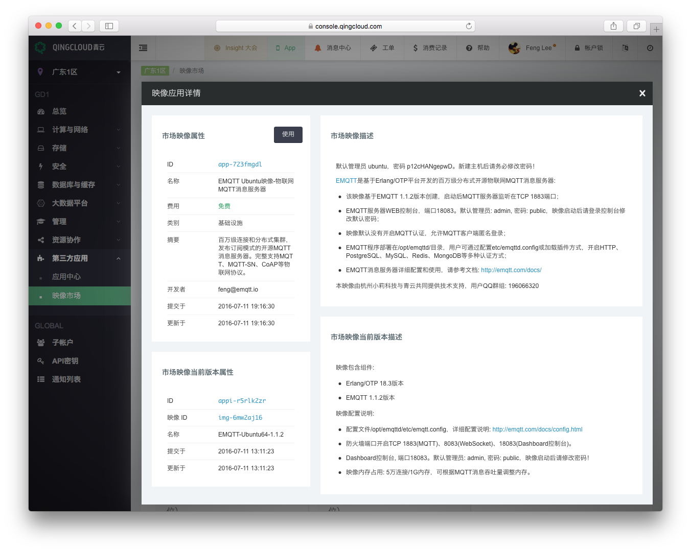

# 青云映像(Image)

EMQTT 消息服务器 1.1.2 版本正式登陆 [ 青云 ](https://www.qingcloud.com)
映像市场，用户可直接创建映像启用 EMQTT 消息服务器:

## 映像属性

| 属性     | 值                                                                                                        |
| -------- | --------------------------------------------------------------------------------------------------------- |
| 名称     | EMQTT Ubuntu 映像-百万级分布式物联网 MQTT 消息服务器                                                      |
| 费用     | 免费                                                                                                      |
| 类别     | 物联网                                                                                                    |
| 摘要     | 百万级连接和分布式集群，发布订阅模式的开 源 MQTT 消息服务器。完整支持 MQTT、MQTT-SN、 CoAP 等物联网协议。 |
| 开发者   | feng@emqx.io                                                                                              |
| 提交时间 | 2016-07-11                                                                                                |
| 更新时间 | 2016-07-11                                                                                                |

## 映像描述

1. 该映像基于 EMQTT 1.1.2 版本创建，启动后 MQTT 服务器监听在 TCP 1883 端口；
2. EMQTT 服务器 WEB 控制台，端口 18083。默认管理员: admin, 密码: public，映像启动后请登录控制台修改默认密码；
3. 映像默认没有开启 MQTT 认证，允许 MQTT 客户端匿名登录；
4. EMQTT 程序部署在/opt/emqttd/目录，用户可通过配置 etc/emqttd.config 或加载插件方式，开启 HTTP、PostgreSQL、MySQL、Redis、MongoDB 等多种认证方式；
5. EMQTT 消息服务器详细配置和使用，请参考文档: [ http://emqtt.com/docs/ ](http://emqtt.com/docs/)

本映像由 emqtt.com 与青云共同提供技术支持，用户 QQ 群组: 196066320

## 映像当前版本

映像包含组件:

1. Erlang/OTP 18.3 版本环境
2. EMQTT 1.1.2 版本

映像配置说明:

1. 防火墙开启 1883(MQTT)、8083(WebSocket)、18083(Dashboard 控制台)端口。
2. Dashboard 控制台, 端口 18083。默认管理员: admin, 密码: public，映像启动后请立即修改密码！
3. 映像默认允许 1 万线 MQTT 连接，最大可配置到 10 万线。
4. 映像内存占用: 5 万连接/1G 内存。请用户根据 MQTT 消息吞吐量调整内存。

## EMQTT 手工启停

    systemctl start emqttd
    systemctl stop emqttd
