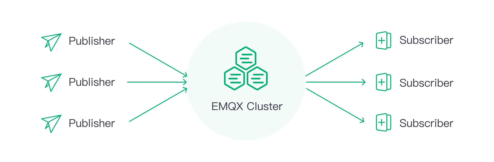


# EMQX 企业版概览



# EMQX 概览




EMQX 是一款[开源](https://github.com/emqx/emqx)的大规模分布式 MQTT 消息服务器，功能丰富，专为物联网和实时通信应用而设计。EMQX 5.0 单集群支持 MQTT 并发连接数高达 1 亿条，单服务器的传输与处理吞吐量可达每秒百万级 MQTT 消息，同时保证毫秒级的低时延。

EMQX 支持多种协议，包括 MQTT (3.1、3.1.1 和 5.0)、HTTP、QUIC 和 WebSocket 等，保证各种网络环境和硬件设备的可访问性。EMQX 还提供了全面的 SSL/TLS 功能支持，比如双向认证以及多种身份验证机制，为物联网设备和应用程序提供可靠和高效的通信基础设施。

内置基于 SQL 的[规则引擎](https://www.emqx.com/zh/solutions/iot-rule-engine)，EMQX 可以实时提取、过滤、丰富和转换物联网数据。此外，EMQX 采用了无主分布式架构，以确保高可用性和水平扩展性，并提供操作友好的用户体验和出色的可观测性。

EMQX 拥有来自 50 多个国家的 20,000 多家企业用户，连接全球超过 1 亿台物联网设备，服务企业数字化、实时化、智能化转型。





[EMQX 企业版](https://www.emqx.com/zh/products/emqx)是一款「无限连接，任意集成，随处运行」的大规模分布式物联网接入平台，同时作为一个高性能、可扩展的 MQTT 消息服务器，它可以为物联网（IoT）应用提供可靠的实时消息传输和设备连接解决方案。通过强大的内置规则引擎和数据集成功能，EMQX 企业版可以对海量 IoT 数据进行实时数据处理、数据转换和路由，还可以将 IoT 数据无缝集成到各种后端数据库和分析工具中，助力企业快速构建关键业务的 IoT 平台与应用。



## 产品优势



[**超大规模**](https://www.emqx.com/zh/blog/how-emqx-5-0-achieves-100-million-mqtt-connections)

EMQX 5.0 单集群可支持 MQTT 并发连接数高达 **1 亿**条。

[**高性能**](https://www.emqx.com/en/blog/mqtt-performance-benchmark-testing-emqx-single-node-supports-2m-message-throughput)

单服务器的传输与处理吞吐量可达**每秒百万级** MQTT 消息。

[**低延时**](https://www.emqx.com/en/blog/mqtt-performance-benchmark-testing-emqx-single-node-message-latency-response-time)

近乎实时的信息传递，保证延迟在亚毫秒级。

[**全面支持 MQTT 5.0 标准**](https://www.emqx.com/zh/blog/introduction-to-mqtt-5)

100% 符合 MQTT 5.0 和 3.x 标准，具有更好的可扩展性、安全性和可靠性。

[**高可用**](./deploy/cluster/mria-introduction.md)

通过无主节点分布式架构实现高可用和水平扩展性。

[**云原生**](https://www.emqx.com/zh/emqx-kubernetes-operator)

通过 Kubernetes Operator 和 Terraform，可以轻松地在企业内部和公共云中进行部署。

<!-- Add a section called Use Cases when optimizing the use case-->





- [**海量连接**](https://www.emqx.com/zh/blog/reaching-100m-mqtt-connections-with-emqx-5-0)：单节点支持 500 万 MQTT 设备连接，集群可水平扩展至支持 1 亿并发的 MQTT 连接。

- [**高可靠**](./deploy/cluster/mria-introduction.md)：弹性伸缩，无单点故障。内置 RocksDB 可靠地持久化 MQTT 消息，确保无数据损失。

- [**数据安全**](https://www.emqx.com/zh/use-cases/mqtt-security)：端到端数据加密（支持国密），细粒度访问控制，保障数据安全，满足企业合规需求。

- [**多协议**](https://www.emqx.com/zh/blog/iot-protocols-mqtt-coap-lwm2m)：支持 MQTT、HTTP、QUIC、WebSocket、LwM2M/CoAP 或专有协议连接任何设备。

- [**高性能**](https://www.emqx.com/en/blog/mqtt-performance-benchmark-testing-emqx-single-node-supports-2m-message-throughput)：单节点支持每秒实时接收、处理与分发数百万条的 MQTT 消息。[毫秒级](https://www.emqx.com/en/blog/mqtt-performance-benchmark-testing-emqx-single-node-message-latency-response-time)消息交付时延。

- [**易运维**](./dashboard/introduction.md)：图形化配置、操作与管理，实时监测运行状态。支持 MQTT 跟踪进行端到端问题分析。





## 产品对比

EMQX 有 4 种部署模式，包括两种云服务模式（EMQX Cloud Serverless 和 EMQX Cloud 专有版）和两种自托管模式（EMQX 开源版 和 EMQX 企业版）。以下列出了这些部署模式的主要功能对比，以帮助您根据业务需求进行选择。

<table>
<thead>
  <tr>
    <th>主要特性</th>
    <th colspan="2">云服务模式</th>
    <th colspan="2">自托管模式</th>
  </tr>
</thead>
<tbody>
  <tr>
    <td width="12%" rowspan="2"></td>
    <td width="22%">EMQX Cloud Serverless</td>
    <td width="22%">EMQX Cloud 专有版</td>
    <td width="22%">EMQX 开源版</td>
    <td width="22%">EMQX 企业版</td>
  </tr>
  <tr>
    <td><a href="https://accounts-zh.emqx.com/signup?continue=https%3A%2F%2Fcloud.emqx.com%2Fconsole%2Fdeployments%2F0%3Foper%3Dnew">免费使用 Serverless</a></td>
    <td><a href="https://accounts-zh.emqx.com/signup?continue=https%3A%2F%2Fcloud.emqx.com%2Fconsole%2Fdeployments%2F0%3Foper%3Dnew">14 天免费试用</a></td>
    <td><a href="https://www.emqx.com/zh/try?product=broker">立即下载</a></td>
    <td><a href="https://www.emqx.com/zh/apply-licenses/emqx">免费试用</a></td>
  </tr>
  <tr>
    <td><b>可扩展性</b></td>
    <td>自动扩展，最多 1,000 条连接</td>
    <td>无限制</td>
    <td style="text-align:left;">单集群支持 MQTT 并发连接数高达 1 亿条</td>
    <td style="text-align:left;">单集群支持 MQTT 并发连接数高达 1 亿条</td>
  </tr>
  <tr>
    <td><b>吞吐量</b></td>
    <td>1000 TPS</td>
    <td>> 500 万 MQTT 消息每秒</td>
    <td>> 500 万 MQTT 消息每秒</td>
    <td>> 500 万 MQTT 消息每秒</td>
  </tr>
  <tr>
    <td><b>延迟</b></td>
    <td>1~5 毫秒</td>
    <td>1~5 毫秒</td>
    <td>1~5 毫秒</td>
    <td>1~5 毫秒</td>
  </tr>
  <tr>
    <td><b>数据集成（开箱即用）</b></td>
    <td>不支持</td>
    <td style="text-align:left;">支持 40 多种数据集成，包括 Webhook、MQTT 数据桥接、MySQL、PostgreSQL、Kafka、MongoDB、Oracle 等。</td>
    <td style="text-align:left;">支持 Webhook 和 MQTT 数据桥接</td>
    <td style="text-align:left;">支持 40 多种数据集成，包括 Webhook、MQTT 数据桥接、MySQL、PostgreSQL、Kafka、MongoDB、Oracle 等。</td>
  </tr>
  <tr>
    <td><b>MQTT 5.0 Broker</b></td>
    <td></td>
    <td></td>
    <td></td>
    <td></td>
  </tr>
  <tr>
    <td><b>MQTT over QUIC</b></td>
    <td></td>
    <td></td>
    <td></td>
    <td></td>
  </tr>
  <tr>
    <td><b>MQTT 扩展</b></td>
    <td></td>
    <td></td>
    <td></td>
    <td></td>
  </tr>
  <tr>
    <td><b>多协议网关</b></td>
    <td></td>
    <td></td>
    <td></td>
    <td></td>
  </tr>
  <tr>
    <td><b>Schema Registry</b></td>
    <td></td>
    <td></td>
    <td></td>
    <td></td>
  </tr>
  <tr>
    <td><b>消息编解码</b></td>
    <td></td>
    <td></td>
    <td></td>
    <td></td>
  </tr>
  <tr>
    <td><b>规则引擎</b></td>
    <td></td>
    <td></td>
    <td></td>
    <td></td>
  </tr>
  <tr>
    <td><b>文件传输</b></td>
    <td></td>
    <td></td>
    <td></td>
    <td></td>
  </tr>
  <tr>
    <td><b>故障排查</b></td>
    <td></td>
    <td></td>
    <td></td>
    <td></td>
  </tr>
  <tr>
    <td><b>Cloud-Native &amp; K8s</b></td>
    <td>N/A</td>
    <td>N/A</td>
    <td></td>
    <td></td>
  </tr>
  <tr>
    <td><b>SLA 等级</b></td>
    <td>99.9%</td>
    <td>99.99%</td>
    <td>N/A</td>
    <td>N/A</td>
  </tr>
  <tr>
    <td><b>License</b></td>
    <td>SaaS 模式，按需计费</td>
    <td>SaaS 模式，按小时计费</td>
    <td>Apache Version 2.0</td>
    <td>商业许可证（商业源代码许可证）</td>
  </tr>
  <tr>
    <td><b>技术支持</b></td>
    <td>5x8 全球支持</td>
    <td>7x24 全球支持</td>
    <td>开源社区</td>
    <td>7x24 全球支持</td>
  </tr>
</tbody>
</table>





<!-- 

以下列出了 EMQX 企业版和开源版的主要功能对比。

| **项目**                 | **EMQX 企业版**                                             | **EMQX 开源版**                                             |
| ------------------------ | ----------------------------------------------------------- | ----------------------------------------------------------- |
| **伸缩性**               | 单集群至多 1 亿 MQTT 连接                                   | 单集群至多 1 亿 MQTT 连接                                   |
| **性能**                 | > 500 万 MQTT 消息每秒                                      | > 500 万 MQTT 消息每秒                                      |
| **可靠性**               | RocksDB 数据存储（即将支持）                                | 内存数据存储                                                |
| **延迟**                 | 1~5 毫秒                                                    | 1~5 毫秒                                                    |
| **数据集成（开箱即用）** | 40+                                                         | 2                                                           |
| **License**              | Commercial License (Business source license)                | Apache Version 2.0                                          |
| **技术支持**             | 7x24 全球支持                                               | 开源社区                                                    |
| **MQTT 5.0**             |  |  |
| **MQTT over QUIC**       |  |  |
| **MQTT 扩展**            |  |  |
| **多协议网关**           |  |  |
| **Schema Registry**      |  |   |
| **消息编解码**           |  |   |
| **规则引擎**             |  |  |
| **文件传输**             |  |   |
| **企业系统集成**         |  |   |
| **故障排查**             |  |  |
| **云原生 & K8s**         |  |  |

-->

## 核心组件

EMQX 企业版由多个组件组成，这些组件共同构建了一个功能强大、可扩展的 MQTT 消息服务器和物联网平台。以下是 EMQX 企业版核心组成部分：

### 设备连接

EMQX 企业版 100% 兼容 MQTT 5.0 和 3.x 规范，出色的扩展性使其能够轻松处理海量的 MQTT 设备客户端[连接](https://www.emqx.com/zh/blog/reaching-100m-mqtt-connections-with-emqx-5-0)。与此同时它还提供了包括 HTTP、QUIC 以及 LwM2M/CoAP 在内的其他开放标准协议接入，从而实现更多物联网设备与场景接入。EMQX 企业版还扩展实现了文件传输、延迟发布等功能，丰富使用场景。

#### MQTT over QUIC

EMQX 企业版开创性地引入了 [MQTT over QUIC](./mqtt-over-quic/introduction.md) 协议，允许物联网客户端通过 QUIC 与 EMQX 建立连接并进行通信。采用 QUIC 的设备可以提高连接与消息吞吐性能并减少消息延迟。特别是对于弱网、链路频繁变化、不稳定网络环境很常见的车联网场景，MQTT over QUIC 能够满足消息传输的实时性和高效性的要求。

#### 多协议网关

[多协议网关](./gateway/gateway.md)使 EMQX 企业版能够支持除使用 MQTT 协议以外的不同通信协议的设备连接到 EMQX 服务器。多协议网关会监听设备的连接请求并识别设备使用的通信协议，随后根据相应的协议规范解析设备发送的消息、命令和数据，并将其转换为 MQTT 消息格式进行消息处理。

### 消息路由

EMQX 企业版通过支持[发布/订阅](./messaging/introduction.md)模式提供了高度可靠的消息传输机制，确保消息能够可靠地传递到目标设备或应用程序。借助 QoS 机制和保留会话能力，即便在不稳定的网络环境下，也能确保数据快速和可靠地传递，从而保障业务的连续性和稳定性。

### 分布式集群

EMQX 企业版提供原生的[集群](./deploy/cluster/introduction.md)能力，能够实现无缝弹性伸缩，避免单点故障。通过极致的优化，单节点每秒能够低时延地实时接收、处理与分发数百万条 MQTT 消息，并通过集群水平扩展支持 1 亿并发的 MQTT 连接，这对于大规模 IoT 部署至关重要，如车联网、工业自动化和智能家居等领域。

### 访问控制和数据安全

通过 [TLS/SSL 加密](./network/overview.md)、[认证授权机制](./access-control/overview.md)，EMQX 企业版能够保障设备数据传输的机密性和完整性。

EMQX 企业版内置了多重客户端认证机制，包括用户名密码、JWT、增强认证以及 PSK、X.509 证书，提供了基于 ACL 的发布订阅授权机制。认证与授权数据支持通过 LDAP、HTTP 服务、SQL 和 NoSQL 数据库等外部企业安全系统进行集成管理，实现灵活多样的客户端安全保护方案。

同时，EMQX 企业版还提供了[审计日志](./dashboard/audit-log.md)、角色与权限管理以及[单点登录](./dashboard/sso.md)，以满足 SOC 2 合规性要求和 GDPR 数据隐私保护。全面的安全功能，帮助企业构建符合行业安全标准的可信赖的物联网应用。

### 规则引擎与数据集成

EMQX 企业版包含一个强大的[规则引擎](./data-integration/rules.md)，您可以根据您的需求在 EMQX 中配置规则 ，对传入的数据进行处理和路由。您还可以使用 EMQX 的数据桥接功能来实现将 EMQX 企业版与云端服务或数据库[集成](./data-integration/data-bridges.md)，以便将 IoT 数据传输到云端进行存储和分析。

#### **即时数据处理**

内置基于 SQL 的规则引擎、Schema Registry、消息编解码器和 [Flow 设计器](./flow-designer/introduction.md)，能够轻松编排设备事件与消息处理流程，实时地提取、验证、过滤和转换物联网数据。

#### **企业数据集成**

通过开箱即用的 Webhook 与数据桥接，将物联网数据与 40 多个云服务和企业系统进行完美整合，包括 Kafka、AWS RDS、MongoDB、Oracle、SAP 以及时序数据库等。助力企业有效地管理、分析和利用来自物联网设备的数据，从而支持各种应用和业务需求。

### 管理与监控仪表板

EMQX 企业版提供图形化的管理系统 [Dashboard](./dashboard/introduction.md)，能够实时监控关键指标与运行状态，轻松管理客户端连接与功能配置。它还允许对客户端和集群异常行为进行诊断与调试，在线进行 MQTT 设备端到端的问题分析，大大缩短故障排查的时间。除此之外，还支持将可观测性指标集成到外部 Prometheus，Datadog 以及支持 OpenTelemetry 的服务中，实现更完善的运维监控能力。

## 典型用例

EMQX 企业版是一个全面的物联网消息平台，它在物联网接入与数据传输的不同阶段发挥着关键作用，为各类业务需求提供了多种强大功能和灵活性。

基于发布-订阅的消息传递模型，EMQX 企业版能够实现数百万主题、不同模式的灵活消息通信，满足各类场景下的实时消息传递。通过内置的规则引擎和数据桥接，EMQX 企业版允许您将消息发送到云端各类服务中，实现设备数据与企业系统之间的无缝集成，能够轻松实现数据处理、存储、分析以及业务指令下发等用例。以下是常见的用例：

### 双向通信

EMQX 企业版支持各类设备与应用端连接，为设备及应用程序提供双向通信。例如智能家居场景下，手机 App 能够获取各类设备传感器数据，并在需要时将控制指令下发到设备。此模式允许设备与设备、设备与应用进行灵活的一对一或一对多通信。

### 遥测数据上传

EMQX 企业版支持设备数据上云，并对来自指定主题的数据进行处理和云端存储。例如工业生产场景下，EMQX 能够实时处理来自工厂车间的各种工业设备数据，并将其存储到数据库中，以实现产品质量追溯，生产分析等业务。此模式能够通过可视化的方式进行配置，使用丰富的数据处理能力实现快速开发。

### 大文件数据上传

EMQX 企业版提供了 MQTT 协议[文件传输](./file-transfer/introduction.md)能力，允许设备上传大文件数据并将其存储到本地磁盘或 S3 存储中。例如车联网场景下，机器学习日志文件、打包后的 CAN Bus 数据可以传输到云端存储，以驱动智能驾驶算法模型更新。此模式将结构化数据与文件类型数据结合，通过统一的数据通道，降低应用的复杂性和维护成本。

### 云端控制指令下发

EMQX 企业版允许通过 MQTT 消息、REST API 以及 Kafka 等数据桥接进行消息下发，推送数据或远程控制设备。例如金融交易场景下，云端服务可以根据用户关注列表，进行分组实时数据推送。此模式提供了主题映射、下发数据处理以及数据触达统计，能够实现灵活且可靠的数据下发。


