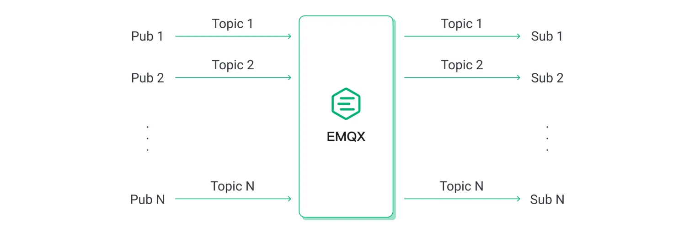
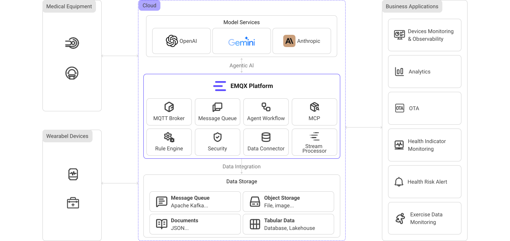

# EMQX 概览

EMQX 是一款「无限连接，任意集成，随处运行」的大规模分布式物联网接入平台，同时作为一个高性能、可扩展的 MQTT 消息服务器，它可以为物联网（IoT）应用提供可靠的实时消息传输和设备连接解决方案。EMQX 累计拥有来自 50 多个国家的 20,000 多家企业用户，连接全球超过 1 亿台物联网设备，服务企业数字化、实时化、智能化转型。

作为一款商业版的自托管 MQTT 消息平台，[EMQX 企业版](https://www.emqx.com/zh/products/emqx)单集群支持最高 1 亿 MQTT 并发连接，单服务器的传输与处理吞吐量可达每秒百万级 MQTT 消息，同时保证毫秒级的低时延。通过强大的内置规则引擎和数据集成功能，EMQX 企业版可以对海量 IoT 数据进行实时数据处理、数据转换和路由，还可以将 IoT 数据无缝集成到各种后端数据库和分析工具中，助力企业快速构建关键业务的 IoT 平台与应用。

## 产品优势

- [**海量连接**](https://www.emqx.com/zh/blog/reaching-100m-mqtt-connections-with-emqx-5-0)：单节点稳定支持 150 万 MQTT 设备连接，集群可水平扩展至支持 1 亿并发的 MQTT 连接。
- [**高可靠**](./deploy/cluster/mria-introduction.md)：弹性伸缩，无单点故障。内置 RocksDB 可靠地持久化 MQTT 消息，确保无数据损失。
- [**数据安全**](./access-control/security-guide.md)：端到端数据加密（支持国密），细粒度访问控制，保障数据安全，满足企业合规需求。
- [**多协议**](https://www.emqx.com/zh/blog/iot-protocols-mqtt-coap-lwm2m)：支持 MQTT、HTTP、QUIC、WebSocket、LwM2M/CoAP 或专有协议连接任何设备。
- [**全面支持 MQTT 5.0 标准**](https://www.emqx.com/zh/blog/introduction-to-mqtt-5)：100% 符合 MQTT 5.0 和 3.x 标准，具有更好的可扩展性、安全性和可靠性。
- [**高性能**](https://www.emqx.com/en/blog/mqtt-performance-benchmark-testing-emqx-single-node-supports-2m-message-throughput)：单节点支持每秒实时接收、处理与分发数百万条的 MQTT 消息。[毫秒级](https://www.emqx.com/en/blog/mqtt-performance-benchmark-testing-emqx-single-node-message-latency-response-time)消息交付时延。
- [**易运维**](./dashboard/introduction.md)：图形化配置、操作与管理，实时监测运行状态。支持 MQTT 跟踪进行端到端问题分析。
- [**云原生**](./deploy/kubernetes/kubernetes.md)：通过 Kubernetes Operator 和 Terraform，可以轻松地在企业内部和公共云中进行部署。

## 核心组件

EMQX 企业版由多个组件组成，这些组件共同构建了一个功能强大、可扩展的 MQTT 消息服务器和物联网平台。以下是 EMQX 企业版核心组成部分：

### 设备连接

EMQX 企业版 100% 兼容 MQTT 5.0 和 3.x 规范，出色的扩展性使其能够轻松处理海量的 MQTT 设备客户端[连接](https://www.emqx.com/zh/blog/reaching-100m-mqtt-connections-with-emqx-5-0)。与此同时它还提供了包括 HTTP、QUIC 以及 LwM2M/CoAP 在内的其他开放标准协议接入，从而实现更多物联网设备与场景接入。EMQX 企业版还扩展实现了文件传输、延迟发布等功能，丰富使用场景。

#### MQTT over QUIC

EMQX 企业版开创性地引入了 [MQTT over QUIC](./mqtt-over-quic/introduction.md) 协议，允许物联网客户端通过 QUIC 与 EMQX 建立连接并进行通信。采用 QUIC 的设备可以提高连接与消息吞吐性能并减少消息延迟。特别是对于弱网、链路频繁变化、不稳定网络环境很常见的车联网场景，MQTT over QUIC 能够满足消息传输的实时性和高效性的要求。

#### 多协议网关

[多协议网关](./gateway/gateway.md)使 EMQX 企业版能够支持除使用 MQTT 协议以外的不同通信协议的设备连接到 EMQX 服务器。多协议网关会监听设备的连接请求并识别设备使用的通信协议，随后根据相应的协议规范解析设备发送的消息、命令和数据，并将其转换为 MQTT 消息格式进行消息处理。

### 消息路由

EMQX 企业版通过支持[发布/订阅](./messaging/introduction.md)模式提供了高度可靠的消息传输机制，确保消息能够可靠地传递到目标设备或应用程序。借助 QoS 机制和保留会话能力，即便在不稳定的网络环境下，也能确保数据快速和可靠地传递，从而保障业务的连续性和稳定性。

### 分布式集群

EMQX 企业版提供原生的[集群](./deploy/cluster/introduction.md)能力，能够实现无缝弹性伸缩，避免单点故障。通过极致的优化，单节点每秒能够低时延地实时接收、处理与分发数百万条 MQTT 消息，并通过集群水平扩展支持 1 亿并发的 MQTT 连接，这对于大规模 IoT 部署至关重要，如车联网、工业自动化和智能家居等领域。

### 访问控制和数据安全

通过 [TLS/SSL 加密](./network/overview.md)、[认证](./access-control/authn/authn.md)和[授权](./access-control/authz/authz.md)机制，EMQX 企业版能够保障设备数据传输的机密性和完整性。

EMQX 企业版内置了多重客户端认证机制，包括用户名密码、JWT、增强认证以及 PSK、X.509 证书，提供了基于 ACL 的发布订阅授权机制。认证与授权数据支持通过 LDAP、HTTP 服务、SQL 和 NoSQL 数据库等外部企业安全系统进行集成管理，实现灵活多样的客户端安全保护方案。

同时，EMQX 企业版还提供了[审计日志](./dashboard/audit-log.md)、角色与权限管理以及[单点登录](./dashboard/sso.md)，以满足 SOC 2 合规性要求和 GDPR 数据隐私保护。全面的安全功能，帮助企业构建符合行业安全标准的可信赖的物联网应用。

### 规则引擎与数据集成

EMQX 企业版包含一个强大的[规则引擎](./data-integration/rules.md)，您可以根据您的需求在 EMQX 中配置规则 ，对传入的数据进行处理和路由。您还可以使用 EMQX 内置的 Sink 和 Source 来实现将 EMQX 企业版与云端服务或数据库[集成](./data-integration/data-bridges.md)，以便将 IoT 数据传输到云端进行存储和分析。

#### **即时数据处理**

内置基于 SQL 的规则引擎、Schema Registry、消息编解码器和 [Flow 设计器](./flow-designer/introduction.md)，能够轻松编排设备事件与消息处理流程，实时地提取、验证、过滤和转换物联网数据。

#### **企业数据集成**

通过开箱即用的 Webhook 与数据集成组件，将物联网数据与 40 多个云服务和企业系统进行完美整合，包括 Kafka、AWS RDS、MongoDB、Oracle、SAP 以及时序数据库等。助力企业有效地管理、分析和利用来自物联网设备的数据，从而支持各种应用和业务需求。

### 管理与监控 Dashboard

EMQX 企业版提供图形化的管理系统 [Dashboard](./dashboard/introduction.md)，能够实时监控关键指标与运行状态，轻松管理客户端连接与功能配置。它还允许对客户端和集群异常行为进行诊断与调试，在线进行 MQTT 设备端到端的问题分析，大大缩短故障排查的时间。除此之外，还支持将可观测性指标集成到外部 Prometheus，Datadog 以及支持 OpenTelemetry 的服务中，实现更完善的运维监控能力。

## 部署模式和版本对比

EMQX 有三种部署模式，包括两种云服务模式（EMQX Serverless 和 EMQX 专有版）和一种自托管模式（EMQX 企业版）。以下表格列出了这些部署模式的对比，以帮助您根据业务需求进行选择。想进一步了解具体的功能对比，参考[功能对比](./getting-started/feature-comparison.md)。

<table>
<thead>
  <tr>
     <th colspan="1">自托管模式</th>
    <th colspan="2">云服务模式</th>
  </tr>
</thead>
<tbody>
  <tr>
    <td>EMQX 企业版</td>
    <td>EMQX Serverless</td>
    <td>EMQX 专有版</td>
  </tr>
  <tr>
    <td><a href="https://www.emqx.com/zh/apply-licenses/emqx">免费试用</a></td>
    <td><a href="https://accounts.emqx.com/signup?continue=https%3A%2F%2Fcloud-intl.emqx.com%2Fconsole%2Fdeployments%2F0%3Foper%3Dnew">免费使用 Serverless</a></td>
    <td><a href="https://accounts.emqx.com/signup?continue=https%3A%2F%2Fcloud-intl.emqx.com%2Fconsole%2Fdeployments%2F0%3Foper%3Dnew">14 天免费试用</a></td>
  </tr>
  <tr>
    <td>✔️ 商业源代码许可证（BSL）1.1 ✔️ 高可用副本持久存储 ✔️ 先进集群架构、跨 IDC 集群 ✔️ 与 40 多种企业系统双向数据集成，包括 Kafka/Confluent, Timescale, InfluxDB, PostgreSQL, Redis 等 ✔️ 可视化 Flow 设计器 ✔️ 审计日志和单点登录 ✔️ 基于角色的访问控制 （RBAC） ✔️ 文件传输 ✔️ 消息验证 ✔️ 消息转换与编解码 ✔️ 消息队列与流处理 ✔️ 多协议网关支持，包括额外支持 OCPP, JT/808 和 GBT32960 ✔️ 7x24 技术支持  </td>
    <td>✔️ 即用即付 ✔️ 每月免费的使用额度 ✔️ 最高 1000 同时在线连接 ✔️ 极速部署 ✔️ 自动伸缩 ✔️ 5x8 技术支持</td>
    <td>✔️ 14 天免费试用 ✔️ 按小时计费 ✔️ 主流云平台多区域部署 ✔️ 多种连接规格可选，连接无上限 ✔️ VPC 对等连接, 数据集成等更多功能 ✔️ 40+ 种完备的数据集成链路 ✔️ 7x24 技术支持  </td>
  </tr>
</tbody>
</table>

## 典型用例

EMQX 企业版是一个全面的物联网消息平台，它在物联网接入与数据传输的不同阶段发挥着关键作用，为各类业务需求提供了多种强大功能和灵活性。

基于发布-订阅的消息传递模型，EMQX 企业版能够实现数百万主题、不同模式的灵活消息通信，满足各类场景下的实时消息传递。通过内置的规则引擎和数据集成组件，EMQX 企业版允许您将消息发送到云端各类服务中，实现设备数据与企业系统之间的无缝集成，能够轻松实现数据处理、存储、分析以及业务指令下发等用例。以下是常见的用例：

### 双向通信

EMQX 企业版支持各类设备与应用端连接，为设备及应用程序提供双向通信。例如智能家居场景下，手机 App 能够获取各类设备传感器数据，并在需要时将控制指令下发到设备。此模式允许设备与设备、设备与应用进行灵活的一对一或一对多通信。

双向通信在关键任务中的应用可以带来以下优势：

- **基于主题的发布/订阅消息传递**：EMQX 的主题基发布/订阅模型优化了数据流，确保消息路由的高效和灵活。
- **超低延迟传输**：实现低至1毫秒的数据传输延迟，确保实时响应。
- **全面的服务质量（QoS）保证**：EMQX 提供端到端的多级 QoS 保证，实现可靠和灵活的消息传递。

以下是更多详细的使用场景：

#### 点对点通信

您可以使用 EMQX 建立点对点通信。在异步发布/订阅模型中，消息发布者和订阅者是解耦的，根据需要可以动态添加或移除。这种解耦为您的应用程序和消息通信提供了灵活性。

#### 向大量客户端广播消息

在需要一对多消息传递的场景中，如金融市场更新，EMQX 表现出色。它能有效地向大量客户端广播消息，确保信息及时传达。

#### 从大量端点整合数据

EMQX 中的多对一消息模式非常适合在如工厂、现代建筑、零售连锁或电网等大规模网络中整合数据。EMQX 可以帮助您将网络端点的数据传输和传送到云端或现场的中心后端服务器。

#### 可追踪的通信与请求-响应感知

EMQX 支持 MQTT 5.0 的请求-响应功能。利用此功能，您现在可以增强您的异步通信架构中的通信感知和可追踪性。

### 流数据转换

通过基于 SQL 的内置强大[规则引擎](./data-integration/rules.md)，EMQX 可以实时提取、过滤、丰富和转换流数据。处理后的数据可以轻松摄取到外部 HTTP 服务和MQTT 服务。如果您使用的是 EMQX 企业版，还可以将数据摄取到主流数据库、数据存储和消息队列。

### 跨网络的数据集成

在分区或网络环境受限的情况下，EMQX 可以实现数据集成，为您提供无缝的消息传递环境。

### 遥测数据上传

EMQX 企业版支持设备数据上云，并对来自指定主题的数据进行处理和云端存储。例如工业生产场景下，EMQX 能够实时处理来自工厂车间的各种工业设备数据，并将其存储到数据库中，以实现产品质量追溯，生产分析等业务。此模式能够通过可视化的方式进行配置，使用丰富的数据处理能力实现快速开发。

### 大文件数据上传

EMQX 企业版提供了 MQTT 协议[文件传输](./file-transfer/introduction.md)能力，允许设备上传大文件数据并将其存储到本地磁盘或 S3 存储中。例如车联网场景下，机器学习日志文件、打包后的 CAN Bus 数据可以传输到云端存储，以驱动智能驾驶算法模型更新。此模式将结构化数据与文件类型数据结合，通过统一的数据通道，降低应用的复杂性和维护成本。

### 云端控制指令下发

EMQX 企业版允许通过 MQTT 消息、REST API 以及 Kafka 进行消息下发，推送数据或远程控制设备。例如金融交易场景下，云端服务可以根据用户关注列表，进行分组实时数据推送。此模式提供了主题映射、下发数据处理以及数据触达统计，能够实现灵活且可靠的数据下发。

## 行业解决方案

EMQX 企业版为各行各业提供多功能的物联网解决方案，确保可靠的数据连接、高效的传输和灵活的处理，助力创新与卓越运营。

### 汽车与车联网

EMQX 正在赋能软件定义汽车（Software-Defined Vehicles，SDV）的未来，已为全球 5 家十大汽车制造商中的企业连接了 30,000,000+ 辆汽车，覆盖 100+ 款车型。该平台为关键任务型 V2X 与车载信息服务（Telematics）应用提供实时数据骨干，并通过基于 QUIC 的 MQTT 针对不稳定网络环境进行了优化。

- **联网汽车与 SDV**：支持远程诊断、双向命令与控制，以及面向全球车队的空中升级（OTA）。[**了解更多 →**](https://www.emqx.com/zh/solutions/internet-of-vehicles)
- **车队信息服务（Fleet Telematics）**：通过超低延迟的数据流实现实时地理位置跟踪、基于使用情况的保险（UBI）以及预测性维护。[**了解更多 →**](https://www.emqx.com/zh/solutions/fleet-telematics)
- **电动汽车充电网络**：为充电站管理、智能充电以及车网互动（V2G）应用提供可扩展的 MQTT 连接能力。
- **汽车制造**：通过连接机器人、PLC 与传感器，统一工厂车间数据，实现持续监控与质量保障。[**了解更多 →**](https://www.emqx.com/zh/solutions/industrial-iot)

上汽大众依托 EMQX 构建其下一代车联网（IoV）平台，支持超过 160 万辆联网汽车，实现远程控制与实时数据监控。[**阅读案例 →**](https://www.emqx.com/zh/customers/saic-volkswagen)

### 交通运输

在一个分秒必争的行业中，EMQX 提供实时车队可视化、在不稳定网络环境下依然可靠的数据传输能力，以及地理分布式部署以最大程度降低延迟。该平台可将数十万车辆与设备连接至统一的数据骨干。

- **车队管理**：实时跟踪车辆位置、监控驾驶行为并优化路线，以降低燃油成本并提升交付效率。[**了解更多 →**](https://www.emqx.com/zh/solutions/fleet-management)
- **智慧城市交通**：处理海量交通数据，实现实时分析与智能交通系统。
- **V2X 通信**：支持车与万物（Vehicle-to-Everything）通信，提升行车安全、交通效率及自动驾驶应用能力。[**了解更多 →**](https://www.emqx.com/zh/solutions/software-defined-vehicles)
- **冷链监控**：实时监测敏感货物的温度与湿度，确保合规并防止货损。

深圳市城市交通规划设计研究中心（SUTPC）使用 EMQX 处理来自超过 170 万辆车辆的数据，实现实时交通分析与智能交通系统。[**阅读案例 →**](https://www.emqx.com/zh/customers/sutpc)

## 制造业与工业物联网（IIoT）

EMQX 连接从工厂车间到云端的所有机器、系统与应用，通过 AI 原生的数据主干打通 OT 与 IT。平台支持包括 Modbus、OPC-UA、Siemens S7 在内的 100+ 种工业协议，并通过 Sparkplug B 实现统一命名空间（UNS）架构，真正实现即插即用的互操作性。

- **预测性维护**：利用实时传感器数据与 AI 预测设备故障，防止非计划停机并延长设备使用寿命。
- **OEE 优化**：通过实时跟踪设备综合效率（OEE）提升工厂产出，制造商报告 OEE 提升最高达 25%，停机时间减少 40%。
- **质量与可追溯性**：在质量偏差发生的第一时间进行检测，实时监控生产参数，实现完整的产品可追溯性。
- **实时性能监控**：结合 EMQX 的[指标与可观测性](./observability/overview.md)能力，通过实时仪表板可视化整条生产线，并可集成 Prometheus 与 Datadog。

领先的半导体晶圆厂使用 EMQX 统一设备数据，每个工厂处理 350 万以上数据标签，采集周期达 100ms，并保持 100% 的数据完整性，以支撑高精度制造。[**了解更多 →**](https://www.emqx.com/zh/solutions/industrial-iot)

### 能源与公用事业

EMQX 为现代能源电网提供支撑，连接 1,000 万以上终端节点，在关键电网控制与保护应用中实现低于 100ms 的延迟。平台通过多协议网关将传统 OT 协议与现代 IT 系统进行桥接。

#### 智能电网与可再生能源

- **电网平衡**：集成分布式能源资源（DER），实时响应供需变化，确保电网稳定性。
- **电动汽车充电管理**：构建具备智能充电与车网互动（V2G）能力的可扩展 EV 充电网络。
- **资产预测性维护**：实时监测变电站、变压器及可再生能源资产，预测故障并优化维护策略。

#### 石油与天然气

- **远程资产监控**：实时监控并控制井口、泵站与管道等远程资产。
- **管道泄漏检测**：通过分析传感器实时采集的压力与流量数据，即时检测并定位泄漏。

华北油田公司使用 EMQX 连接超过 40,000 个数据采集点，实现油田生产运行的实时监控与智能分析。[**阅读案例 →**](https://www.emqx.com/zh/customers/huabei-oilfield-company)

### 医疗健康

EMQX 通过可扩展且[安全的数据主干](./access-control/security-guide.md)，支持实时患者监护、医疗设备集成以及下一代远程医疗解决方案。平台提供符合 HIPAA 要求的安全特性，包括 TLS/SSL 加密、强认证机制以及细粒度访问控制，以保护敏感的患者数据。

- **远程患者监护（RPM）**：持续监测患者居家环境下的生命体征与健康状态，实现早期干预并减少再入院率。
- **医疗设备集成**：连接并整合输液泵、呼吸机与实验室设备数据，形成统一的患者护理视图。
- **智慧医院自动化**：从医疗资产追踪到患者流转与环境条件优化，实现医院运营自动化。
- **远程医疗与远程诊疗**：支持患者与医疗服务提供者之间的实时通信与数据交换，实现远程会诊。

### 金融服务

EMQX 为实时金融应用提供毫秒级延迟、银行级安全性以及 7×24 小时连续服务。平台已为企业级金融用户提供超过五年的稳定运行。

- **实时 POS 监控**：连接数百万 POS 终端，实时监控交易数据与设备状态，实现主动运维。
- **欺诈检测**：在交易发生的瞬间进行分析，在影响客户之前识别并阻止欺诈行为。
- **现代支付系统**：为移动支付、数字钱包以及实时清结算构建可靠、低延迟的基础设施。
- **行情数据分发**：以极低延迟将股票报价、成交数据等实时行情可靠分发至数千客户端。

[**阅读案例 →**](https://www.emqx.com/zh/customers/emqx-in-finance-and-payment-iot)

### 电信运营商

EMQX 为 5G 物联网服务提供运营商级可扩展能力，单个平台支持 1 亿以上设备并发连接。平台支持 MQTT、CoAP、LwM2M 等多协议，实现 IT / OT / CT 的无缝融合。

- **5G IoT 平台**：通过 5G 网络可靠连接数亿物联网设备，为增值服务提供稳定基础。
- **网络监控**：实时持续监控网络基础设施的健康状态与性能，主动发现并解决问题。
- **智慧城市数据主干**：构建智慧城市的数据基础设施，连接交通系统、公共交通、公用事业与应急服务。

中国电信作为全球最大的电信运营商之一，使用 EMQX 构建其国家级物联网平台 CTWing，支持超过 1 亿设备并发连接。[**阅读案例 →**](https://www.emqx.com/zh/customers/china-telecom)

### 零售与消费级物联网

EMQX 连接数百万零售设备与消费级物联网终端，为全渠道体验、智能家居自动化与交互式应用实现实时数据流转。

- **智慧零售**：为实时库存管理、POS 监控、个性化客户互动及动态定价提供支持，覆盖所有门店。在高峰时段也能确保数千台自助终端的无缝用户体验。
- **智能家居**：通过可扩展的[发布/订阅](./messaging/introduction.md)消息主干连接数百万智能家居设备，实现家庭自动化、能源监控，并与 Alexa、Google Assistant 等平台集成。
- **游戏与社交**：为在线游戏与社交应用构建超低延迟通信能力，支持数百万并发用户的游戏内聊天、实时通知与直播活动。

昕诺飞（原飞利浦照明）使用 EMQX 构建全球智能照明解决方案，确保数百万灯具的可靠实时控制。基于位置的社交应用 JAGAT 使用 EMQX 处理数百万用户的实时消息。[**阅读案例 →**](https://www.emqx.com/zh/customers/how-jagat-achieved-seamless-social-interaction-with-emqx)
