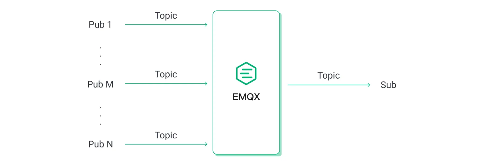
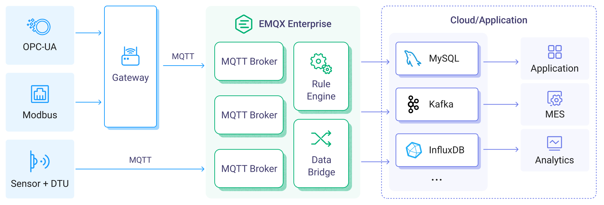
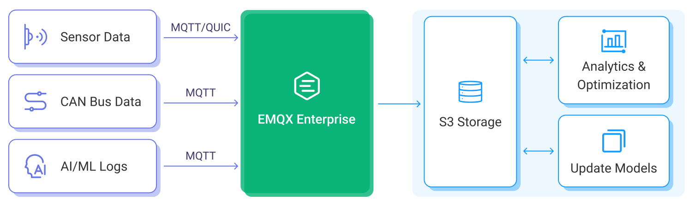
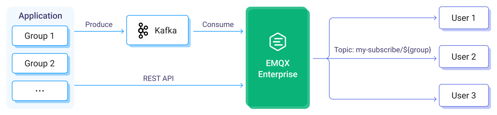
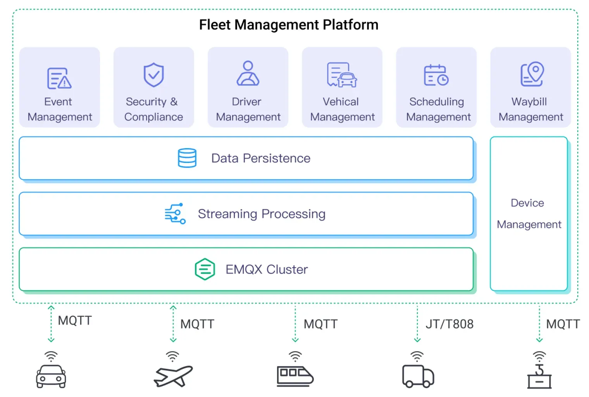
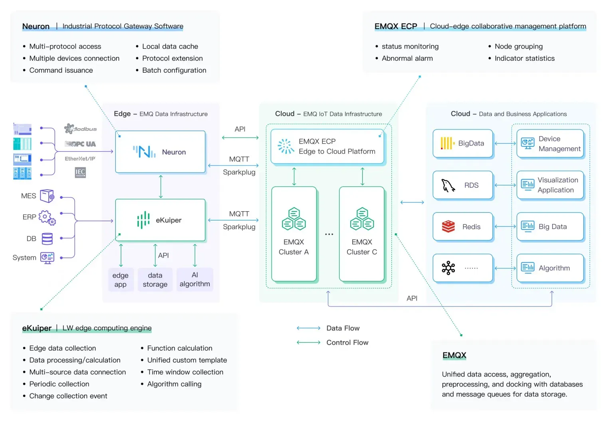

# EMQX 企业版概览
[EMQX 企业版](https://www.emqx.com/zh/products/emqx)是一款「无限连接，任意集成，随处运行」的大规模分布式物联网接入平台，同时作为一个高性能、可扩展的 MQTT 消息服务器，它可以为物联网（IoT）应用提供可靠的实时消息传输和设备连接解决方案。通过强大的内置规则引擎和数据集成功能，EMQX 企业版可以对海量 IoT 数据进行实时数据处理、数据转换和路由，还可以将 IoT 数据无缝集成到各种后端数据库和分析工具中，助力企业快速构建关键业务的 IoT 平台与应用。

EMQ 还提供了一款[开源](https://github.com/emqx/emqx)的大规模分布式 MQTT 消息服务器，即 “EMQX”，它具备丰富的功能，专为物联网和实时通信应用而设计。EMQX 5.0 单集群支持 MQTT 并发连接数高达 1 亿条，单服务器的传输与处理吞吐量可达每秒百万级 MQTT 消息，同时保证毫秒级的低时延。EMQX 拥有来自 50 多个国家的 20,000 多家企业用户，连接全球超过 1 亿台物联网设备，服务企业数字化、实时化、智能化转型。

## 产品优势

- [**海量连接**](https://www.emqx.com/zh/blog/reaching-100m-mqtt-connections-with-emqx-5-0)：单节点支持 500 万 MQTT 设备连接，集群可水平扩展至支持 1 亿并发的 MQTT 连接。
- [**高可靠**](./deploy/cluster/mria-introduction.md)：弹性伸缩，无单点故障。内置 RocksDB 可靠地持久化 MQTT 消息，确保无数据损失。
- [**数据安全**](https://www.emqx.com/zh/use-cases/mqtt-security)：端到端数据加密（支持国密），细粒度访问控制，保障数据安全，满足企业合规需求。
- [**多协议**](https://www.emqx.com/zh/blog/iot-protocols-mqtt-coap-lwm2m)：支持 MQTT、HTTP、QUIC、WebSocket、LwM2M/CoAP 或专有协议连接任何设备。
- [**全面支持 MQTT 5.0 标准**](https://www.emqx.com/zh/blog/introduction-to-mqtt-5)：100% 符合 MQTT 5.0 和 3.x 标准，具有更好的可扩展性、安全性和可靠性。
- [**高性能**](https://www.emqx.com/en/blog/mqtt-performance-benchmark-testing-emqx-single-node-supports-2m-message-throughput)：单节点支持每秒实时接收、处理与分发数百万条的 MQTT 消息。[毫秒级](https://www.emqx.com/en/blog/mqtt-performance-benchmark-testing-emqx-single-node-message-latency-response-time)消息交付时延。
- [**易运维**](./dashboard/introduction.md)：图形化配置、操作与管理，实时监测运行状态。支持 MQTT 跟踪进行端到端问题分析。
- [**云原生**](https://www.emqx.com/zh/emqx-kubernetes-operator)：通过 Kubernetes Operator 和 Terraform，可以轻松地在企业内部和公共云中进行部署。

## 核心组件

EMQX 企业版由多个组件组成，这些组件共同构建了一个功能强大、可扩展的 MQTT 消息服务器和物联网平台。以下是 EMQX 企业版核心组成部分：

### 设备连接

EMQX 企业版 100% 兼容 MQTT 5.0 和 3.x 规范，出色的扩展性使其能够轻松处理海量的 MQTT 设备客户端[连接](https://www.emqx.com/zh/blog/reaching-100m-mqtt-connections-with-emqx-5-0)。与此同时它还提供了包括 HTTP、QUIC 以及 LwM2M/CoAP 在内的其他开放标准协议接入，从而实现更多物联网设备与场景接入。EMQX 企业版还扩展实现了文件传输、延迟发布等功能，丰富使用场景。

#### MQTT over QUIC

EMQX 企业版开创性地引入了 [MQTT over QUIC](./mqtt-over-quic/introduction.md) 协议，允许物联网客户端通过 QUIC 与 EMQX 建立连接并进行通信。采用 QUIC 的设备可以提高连接与消息吞吐性能并减少消息延迟。特别是对于弱网、链路频繁变化、不稳定网络环境很常见的车联网场景，MQTT over QUIC 能够满足消息传输的实时性和高效性的要求。

#### 多协议网关

[多协议网关](./gateway/gateway.md)使 EMQX 企业版能够支持除使用 MQTT 协议以外的不同通信协议的设备连接到 EMQX 服务器。多协议网关会监听设备的连接请求并识别设备使用的通信协议，随后根据相应的协议规范解析设备发送的消息、命令和数据，并将其转换为 MQTT 消息格式进行消息处理。

### 消息路由

EMQX 企业版通过支持[发布/订阅](./messaging/introduction.md)模式提供了高度可靠的消息传输机制，确保消息能够可靠地传递到目标设备或应用程序。借助 QoS 机制和保留会话能力，即便在不稳定的网络环境下，也能确保数据快速和可靠地传递，从而保障业务的连续性和稳定性。

### 分布式集群

EMQX 企业版提供原生的[集群](./deploy/cluster/introduction.md)能力，能够实现无缝弹性伸缩，避免单点故障。通过极致的优化，单节点每秒能够低时延地实时接收、处理与分发数百万条 MQTT 消息，并通过集群水平扩展支持 1 亿并发的 MQTT 连接，这对于大规模 IoT 部署至关重要，如车联网、工业自动化和智能家居等领域。

### 访问控制和数据安全

通过 [TLS/SSL 加密](./network/overview.md)、[认证](./access-control/authn/authn.md)和[授权](./access-control/authz/authz.md)机制，EMQX 企业版能够保障设备数据传输的机密性和完整性。

EMQX 企业版内置了多重客户端认证机制，包括用户名密码、JWT、增强认证以及 PSK、X.509 证书，提供了基于 ACL 的发布订阅授权机制。认证与授权数据支持通过 LDAP、HTTP 服务、SQL 和 NoSQL 数据库等外部企业安全系统进行集成管理，实现灵活多样的客户端安全保护方案。

同时，EMQX 企业版还提供了[审计日志](./dashboard/audit-log.md)、角色与权限管理以及[单点登录](./dashboard/sso.md)，以满足 SOC 2 合规性要求和 GDPR 数据隐私保护。全面的安全功能，帮助企业构建符合行业安全标准的可信赖的物联网应用。

### 规则引擎与数据集成

EMQX 企业版包含一个强大的[规则引擎](./data-integration/rules.md)，您可以根据您的需求在 EMQX 中配置规则 ，对传入的数据进行处理和路由。您还可以使用 EMQX 内置的 Sink 和 Source 来实现将 EMQX 企业版与云端服务或数据库[集成](./data-integration/data-bridges.md)，以便将 IoT 数据传输到云端进行存储和分析。

#### **即时数据处理**

内置基于 SQL 的规则引擎、Schema Registry、消息编解码器和 [Flow 设计器](./flow-designer/introduction.md)，能够轻松编排设备事件与消息处理流程，实时地提取、验证、过滤和转换物联网数据。

#### **企业数据集成**

通过开箱即用的 Webhook 与数据集成组件，将物联网数据与 40 多个云服务和企业系统进行完美整合，包括 Kafka、AWS RDS、MongoDB、Oracle、SAP 以及时序数据库等。助力企业有效地管理、分析和利用来自物联网设备的数据，从而支持各种应用和业务需求。

### 管理与监控 Dashboard

EMQX 企业版提供图形化的管理系统 [Dashboard](./dashboard/introduction.md)，能够实时监控关键指标与运行状态，轻松管理客户端连接与功能配置。它还允许对客户端和集群异常行为进行诊断与调试，在线进行 MQTT 设备端到端的问题分析，大大缩短故障排查的时间。除此之外，还支持将可观测性指标集成到外部 Prometheus，Datadog 以及支持 OpenTelemetry 的服务中，实现更完善的运维监控能力。

## 部署模式和版本对比

EMQX 有 4 种部署模式，包括两种云服务模式（EMQX Cloud Serverless 和 EMQX Cloud 专有版）和两种自托管模式（EMQX 开源版 和 EMQX 企业版）。以下表格列出了这些部署模式的对比，以帮助您根据业务需求进行选择。想进一步了解具体的功能对比，参考[功能对比](./getting-started/feature-comparison.md)。

<table>
<thead>
  <tr>
     <th colspan="2">自托管模式</th>
    <th colspan="2">云服务模式</th>
  </tr>
</thead>
<tbody>
  <tr>
    <td>EMQX 开源版</td>
    <td>EMQX 企业版</td>
    <td>EMQX Cloud Serverless</td>
    <td>EMQX Cloud 专有版</td>
  </tr>
  <tr>
    <td><a href="https://www.emqx.com/en/try?product=broker">立即下载</a></td>
    <td><a href="https://www.emqx.com/en/apply-licenses/emqx">免费试用</a></td>
    <td><a href="https://accounts.emqx.com/signup?continue=https%3A%2F%2Fcloud-intl.emqx.com%2Fconsole%2Fdeployments%2F0%3Foper%3Dnew">免费使用 Serverless</a></td>
    <td><a href="https://accounts.emqx.com/signup?continue=https%3A%2F%2Fcloud-intl.emqx.com%2Fconsole%2Fdeployments%2F0%3Foper%3Dnew">14 天免费试用</a></td>
  </tr>
  <tr>
    <td>✔️ Apache Version 2.0 ✔️ MQTT over QUIC ✔️ 数据存储在内存中 ✔️ 支持 Webhook 和 MQTT 数据桥接 ✔️ 多协议网关支持，包括 MQTT-SN, STOMP 和 CoAP ✔️ 社区和论坛  </td>
    <td>✔️ 商业许可证（商业源代码许可证） ✔️ 基于 RocksDB 的会话持久化 ✔️ 与 40 多种企业系统双向数据集成，包括 Kafka/Confluent, Timescale, InfluxDB, PostgreSQL, Redis 等 ✔️ 审计日志和单点登录 ✔️ 基于角色的访问控制 （RBAC） ✔️ 文件传输 ✔️ 消息编解码 ✔️ 多协议网关支持，包括额外支持 OCPP, JT/808 和 GBT32960 ✔️ 7x24 技术支持  </td>
    <td>✔️ 即用即付 ✔️ 每月免费的使用额度 ✔️ 最高 1000 同时在线连接 ✔️ 极速部署 ✔️ 自动伸缩 ✔️ 5x8 技术支持</td>
    <td>✔️ 14 天免费试用 ✔️ 按小时计费 ✔️ 主流云平台多区域部署 ✔️ 多种连接规格可选，连接无上限 ✔️ VPC 对等连接, 数据集成等更多功能 ✔️ 40+ 种完备的数据集成链路 ✔️ 7x24 技术支持  </td>
  </tr>
</tbody>
</table>
以下列出了 EMQX 企业版和开源版的主要功能对比。

| **项目**                 | **EMQX 企业版**                                             | **EMQX 开源版**                                             |
| ------------------------ | ----------------------------------------------------------- | ----------------------------------------------------------- |
| **伸缩性**               | 单集群至多 1 亿 MQTT 连接                                   | 单集群至多 1 亿 MQTT 连接                                   |
| **性能**                 | > 500 万 MQTT 消息每秒                                      | > 500 万 MQTT 消息每秒                                      |
| **可靠性**               | RocksDB 数据存储（即将支持）                                | 内存数据存储                                                |
| **延迟**                 | 1~5 毫秒                                                    | 1~5 毫秒                                                    |
| **数据集成（开箱即用）** | 40+                                                         | 2                                                           |
| **License**              | Commercial License (Business source license)                | Apache Version 2.0                                          |
| **技术支持**             | 7x24 全球支持                                               | 开源社区                                                    |
| **MQTT 5.0**             |  |  |
| **MQTT over QUIC**       |  |  |
| **MQTT 扩展**            |  |  |
| **多协议网关**           |  |  |
| **Schema Registry**      |  |   |
| **消息编解码**           |  |   |
| **规则引擎**             |  |  |
| **文件传输**             |  |   |
| **企业系统集成**         |  |   |
| **故障排查**             |  |  |
| **云原生 & K8s**         |  |  |

## 典型用例

EMQX 企业版是一个全面的物联网消息平台，它在物联网接入与数据传输的不同阶段发挥着关键作用，为各类业务需求提供了多种强大功能和灵活性。

基于发布-订阅的消息传递模型，EMQX 企业版能够实现数百万主题、不同模式的灵活消息通信，满足各类场景下的实时消息传递。通过内置的规则引擎和数据集成组件，EMQX 企业版允许您将消息发送到云端各类服务中，实现设备数据与企业系统之间的无缝集成，能够轻松实现数据处理、存储、分析以及业务指令下发等用例。以下是常见的用例：

### 双向通信

EMQX 企业版支持各类设备与应用端连接，为设备及应用程序提供双向通信。例如智能家居场景下，手机 App 能够获取各类设备传感器数据，并在需要时将控制指令下发到设备。此模式允许设备与设备、设备与应用进行灵活的一对一或一对多通信。

双向通信在关键任务中的应用可以带来以下优势：

- **基于主题的发布/订阅消息传递：**EMQX 的主题基发布/订阅模型优化了数据流，确保消息路由的高效和灵活。
- **超低延迟传输：**实现低至1毫秒的数据传输延迟，确保实时响应。
- **全面的服务质量（QoS）保证：**EMQX 提供端到端的多级 QoS 保证，实现可靠和灵活的消息传递。

以下是更多详细的使用场景：

#### 点对点通信

您可以使用 EMQX 建立点对点通信。在异步发布/订阅模型中，消息发布者和订阅者是解耦的，根据需要可以动态添加或移除。这种解耦为您的应用程序和消息通信提供了灵活性。

#### 向大量客户端广播消息

在需要一对多消息传递的场景中，如金融市场更新，EMQX 表现出色。它能有效地向大量客户端广播消息，确保信息及时传达。

#### 从大量端点整合数据

EMQX 中的多对一消息模式非常适合在如工厂、现代建筑、零售连锁或电网等大规模网络中整合数据。EMQX 可以帮助您将网络端点的数据传输和传送到云端或现场的中心后端服务器。

#### 可追踪的通信与请求-响应感知

EMQX 支持 MQTT 5.0 的请求-响应功能。利用此功能，您现在可以增强您的异步通信架构中的通信感知和可追踪性。

### 流数据转换

通过基于 SQL 的内置强大[规则引擎](./data-integration/rules.md)，EMQX 可以实时提取、过滤、丰富和转换流数据。处理后的数据可以轻松摄取到外部 HTTP 服务和MQTT 服务。如果您使用的是 EMQX 企业版，还可以将数据摄取到主流数据库、数据存储和消息队列。

### 跨网络的数据集成

在分区或网络环境受限的情况下，EMQX 可以实现数据集成，为您提供无缝的消息传递环境。

### 遥测数据上传

EMQX 企业版支持设备数据上云，并对来自指定主题的数据进行处理和云端存储。例如工业生产场景下，EMQX 能够实时处理来自工厂车间的各种工业设备数据，并将其存储到数据库中，以实现产品质量追溯，生产分析等业务。此模式能够通过可视化的方式进行配置，使用丰富的数据处理能力实现快速开发。

### 大文件数据上传

EMQX 企业版提供了 MQTT 协议[文件传输](./file-transfer/introduction.md)能力，允许设备上传大文件数据并将其存储到本地磁盘或 S3 存储中。例如车联网场景下，机器学习日志文件、打包后的 CAN Bus 数据可以传输到云端存储，以驱动智能驾驶算法模型更新。此模式将结构化数据与文件类型数据结合，通过统一的数据通道，降低应用的复杂性和维护成本。

### 云端控制指令下发

EMQX 企业版允许通过 MQTT 消息、REST API 以及 Kafka 进行消息下发，推送数据或远程控制设备。例如金融交易场景下，云端服务可以根据用户关注列表，进行分组实时数据推送。此模式提供了主题映射、下发数据处理以及数据触达统计，能够实现灵活且可靠的数据下发。

## 行业解决方案

EMQX 企业版为各行各业提供多功能的物联网解决方案，确保可靠的数据连接、高效的传输和灵活的处理，助力创新与卓越运营。

### 汽车行业

#### 车联网及车联网服务提供商

TSP 平台的未来应当是“数据驱动”和“服务导向”的。为了取得成功，TSP 平台必须保障与汽车的稳定连接、数据传输的高效率及数据处理的灵活性。在此基础上，EMQX 对于打造一个坚固、高效且易于维护的数据基础设施发挥着至关重要的作用。[**了解更多 →**](https://www.emqx.com/zh/blog/revolutionizing-tsp-platforms)

#### 智能驾驶舱与车载信息娱乐系统

依托 EMQ 的云端端到端协同软件架构，我们帮助汽车制造商构建以车云协作为核心能力的智能驾驶舱。[**了解更多 →**](https://www.emqx.com/zh/use-cases/smart-cockpit)

#### 电动车充电网络

EV Power 利用 EMQX 赋能充电桩运营平台，解决设备区域分散难以控制、部署环境恶劣等问题。[**了解更多 →**](https://www.emqx.com/zh/customers/ev-power)

### 交通运输

#### 物流资产管理

EMQX 提供一个全面的数据驱动解决方案，用于物流资产管理，具备数据收集、传输和处理的能力。这有助于企业实时监控其资产，并获取有用信息，从而做出明智的管理决策，并提高竞争力。[**了解更多 →**](https://www.emqx.com/zh/blog/a-data-driven-solution-for-logistics-asset-tracking-and-maintenance)

#### 车队管理

鉴于物流行业的复杂和动态性质，有效地监控、调度和优化车队在运输和交付过程中至关重要。及时可靠的货物交付、成本优化和顾客满意度都严重依赖于高效的车队管理实践。[**了解更多 →**](https://www.emqx.com/zh/blog/how-emqx-revolutionizes-logistics-fleet-management)

#### 车辆与一切通信 (V2X)

[V2X (车辆与一切通信)](https://www.emqx.com/zh/blog/what-is-v2x-and-the-future-of-vehicle-to-everything-connectivity)是一种通信技术，使车辆能够与其环境中的各种元素交换数据，包括其他车辆（V2V）、行人（V2P）、基础设施（V2I）和网络（V2N）。合作车辆基础设施系统（CVIS）代表了智能交通系统的一个前景广阔的发展方向，其需整合V2X技术、各类传感器技术、云计算、边缘计算以及交通控制技术。探索 EMQX 在这一整体架构中所扮演的重要角色。[**了解更多 →**](https://www.emqx.com/zh/blog/enhancing-v2x-connectivity-with-emq)

### 制造业与 IIoT

EMQ 智能工厂解决方案旨在建立全面的数据收集、传输、分发等机制。这一解决方案使工厂能够迅速部署广泛的智能应用，包括设备健康管理、能源消耗设备的优化、生产监控与分析、产品质量追溯、供应链中的参数优化、预测性维护和缺陷检测。[**了解更多 →**](https://www.emqx.com/zh/blog/data-infrastructure-for-smart-factory)

### 石油与天然气

EMQ 为石油行业提供物联网数据收集解决方案，支持油田物联网终端设备的实时数据收集和云端协同管理。[**了解更多 →**](https://www.emqx.com/zh/use-cases/oil-extraction-transportation)

### 金融与支付

EMQ 的金融支付行业解决方案帮助客户实现7*24小时连续服务，已为企业级用户提供了5年以上的稳定运营和服务。[**了解更多 →**](https://www.emqx.com/zh/customers/emqx-in-finance-and-payment-iot)

### 能源与公用事业

利用 EMQ 在物联网消息中间件技术方面的领先优势以及 SGITG 在国家电网技术和市场方面的实力，两家公司正紧密合作开发下一代电力物联网产品。[**了解更多 →**](https://www.emqx.com/zh/customers/sgitg-sgcc)

### 运营商

通过与 EMQ 的深入合作，天翼物联网已将 CTWing 建设成为全球最大的集团级 NB-IoT 设备接入平台，该物联网平台的累计连接设备数量已达数百万。[**了解更多 →**](https://www.emqx.com/zh/customers/china-telecom)

### 消费电子与AIoT

基于 EMQX 的物联网数据访问平台为一家智能服务机器人公司提供了稳定高效的数据访问服务，帮助其服务超过5000名终端客户。[**了解更多 →**](https://www.emqx.com/zh/customers/intelligent-service-robot-aiot)
