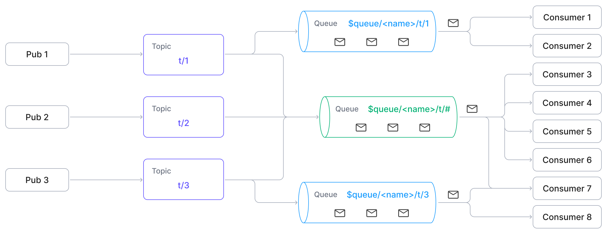
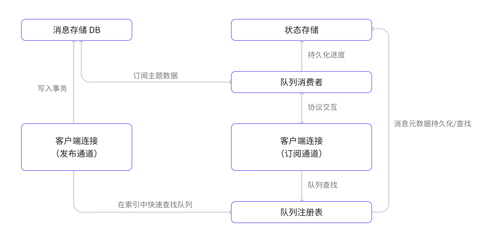

# 消息队列

EMQX 6.0 引入的消息队列功能扩展了 MQTT 的发布/订阅模式，加入了持久化队列语义，从而实现可靠的异步消息传递。它在不依赖外部中间件（如 RabbitMQ）的情况下，提供了类似企业级消息队列的能力，增强了 MQTT 的原生特性。

本文全面介绍了 EMQX 消息队列功能，包括设计初衷、核心概念、内部架构、消息流转机制以及典型应用场景。

## 什么是消息队列？

EMQX 中的消息队列是一个命名的、持久化的服务器端缓冲区，用于在不依赖订阅者在线状态的情况下存储 MQTT 消息。每个队列通过唯一的队列名称进行标识，其主题过滤器用于定义哪些已发布的消息会被加入队列（但主题过滤器并不构成队列的身份标识）。匹配已配置主题过滤器的消息将根据队列的保留策略和分发策略自动持久化存储。

与传统 MQTT 行为不同，消息队列即使在没有任何客户端在线时也会持久化存储消息。客户端可以通过订阅特殊格式的 `$queue/<name>` 或 `$queue/<name>/<topic_filter>` 来消费这些消息。

::: warning 与监听器挂载点不兼容
对于通过带有[挂载点](../configuration/listener.md#挂载点mountpoint)的监听器连接的客户端，消息队列不生效。EMQX 会先应用挂载点，再匹配 `$queue/` 前缀，因此该订阅会被当作对挂载后字面主题的普通订阅处理。此过程不会向客户端报告任何错误。
:::

消息队列使用 EMQX 内嵌持久存储。启用消息队列前，请确保 EMQX 数据目录使用本地文件系统。[内嵌持久存储后端](../design/durable-storage.md#内嵌后端)不支持 NFS、SMB/CIFS 等网络文件系统。



## 为什么需要消息队列？

MQTT 是一种轻量级的、被广泛使用的发布/订阅协议。但其默认行为依赖于订阅者是否在线，不适用于异步或延迟消费场景。

### MQTT 的局限性

虽然 MQTT 通过[共享订阅](../messaging/mqtt-shared-subscription.md)（如 `$share/{group}/topic`）提供了一些类队列功能，但仍存在以下限制：

- **无订阅者在线时，消息不会保留**
- **不支持** TTL（过期时间）、队列长度限制或溢出控制
- **无法去重**，例如按 key 保留最新值
- **无显式队列生命周期管理**

因此，MQTT 难以实现以下场景：

- 设备上线前先下发命令
- 离线时接收任务
- 保留最新的状态或配置

### 使用消息队列扩展 MQTT

EMQX 消息队列扩展了 MQTT 协议，允许消息在无订阅者在线的情况下也能持久化，并提供：

- **持久化消息存储（即使客户端离线）**：队列虽非严格有序，但支持可靠、异步消息分发，弥补 MQTT 的轻量通信与企业级消息中间件之间的差距。
- **显式队列声明与属性配置**：支持 TTL、容量限制、派发策略等，提供灵活的消息存储与分发控制。
- **可选的“最后值语义”**：支持通过`队列键`属性，将同一队列中拥有相同队列键的新消息覆盖旧消息，适用于配置或状态更新等场景。

## 消息队列关键概念

- **队列名称**
  
  用于唯一标识消息队列的标识符。
  
  队列名称仅允许包含以下字符：
  
  - 字母数字字符（`A–Z`、`a–z`、`0–9`）
  - 下划线（`_`）
  - 连字符（`-`）
  - 点号（`.`）
  
  ::: tip
  
  从 EMQX 6.1.1 开始，队列通过名称进行寻址，而不是通过过滤主题。过滤主题是队列的配置属性之一，但不构成队列的身份标识。
  
  :::
  
- **过滤主题**
  
  MQTT 主题过滤器，例如 `devices/+/command`，用于决定哪些已发布的消息会被写入队列。只有主题与已配置过滤器匹配的消息才会进入队列。单条已发布的消息可能同时匹配多个队列，因此也可能被写入多个队列。
  
  ::: tip
  
  过滤主题是一个命名队列的配置元数据，在队列创建后无法修改。
  
  :::
  
- **队列订阅**
  
  一种用于消费队列中消息的特殊 MQTT 订阅方式。客户端可以使用以下格式之一进行订阅：
  
  ```
  SUBSCRIBE $queue/<name>
  SUBSCRIBE $queue/<name>/<topic_filter>
  ```
  
  其中：
  
  - `<name>` 为队列名称（必填）。
  - `<topic_filter>` 在订阅已存在队列时为可选。
  - 当启用自动创建功能时，使用 `$queue/<name>/<topic_filter>` 可以在队列不存在的情况下，使用提供的主题过滤器自动创建该队列。
  
  队列订阅与常规 MQTT 订阅相互独立，由消息队列的消费者机制进行处理。
  
- **最后值语义**
  
  创建队列时设置启用最后值语义功能，并设置`队列键表达式`。当启用后，消息进入队列时，EMQX 会对每条消息执行`队列键`属性提取，使用相同队列键的新消息将会覆盖旧的未消费消息。此行为非常适用于有状态的消息传递或配置更新的场景，在这些场景中，只有最新的值是重要的，较旧的消息可以安全地丢弃。详情请参见[队列键表达式](./message-queue-task.md#队列键表达式)。
  
- **队列声明**
  
  创建一个持久化队列并通过可配置属性定义其行为的过程，包括主题过滤器、分发策略、保留限制以及可选的键表达式。
  
- **队列删除**

  删除队列及其所有已存储消息。

- **队列属性**
  
  控制队列行为的配置项，如保留时间和派发策略等。
  
- **服务质量（QoS）**
  
  无论发布或订阅时使用何种 QoS 等级，消息队列中的所有消息都会以 QoS 1（至少一次）的方式投递。此行为确保了消息的可靠传递，并统一了队列的投递行为。
  
- **消息持久化**
  
  即使没有订阅者连接，消息仍会被保留。默认情况下，队列应用最后值语义。对于未配置键表达式的常规队列，消息将按照接收顺序存储。

## 消息队列工作原理

EMQX 中的消息队列作为一个松耦合的扩展，通过内部钩子（Hook） 拦截发布和订阅操作，并与注册表、存储层协作，实现消息的持久化与可靠分发。

### 核心组件

- **队列注册表**：管理队列生命周期：创建、删除和查找队列。
- **消息存储 DB**：存储所有入队消息，构建于 EMQX 的[持久化存储](../durability/durability_introduction.md#持久存储的架构)之上。
- **状态存储**：保存消费进度与队列元数据（如 TTL、策略等）。
- **队列消费者**：根据派发策略从队列中提取消息并推送给客户端。
- **订阅注册表**：追踪每个客户端（channel）订阅了哪些队列，并在上下文中维护状态。
- **Hook 机制**：拦截发布和订阅事件，将消息路由到队列或消费者。

### 消息队列数据流图示

下图展示了消息队列各主要组件之间的数据流动关系：



### 发布流程

1. 客户端向常规主题（如 `some/topic`）发布一条消息。
2. 内部的消息队列钩子（MQ hook）会被触发以处理该消息。
3. 钩子会检查消息队列注册表，查找是否有与该主题匹配的队列。
4. 如果找到匹配的队列，该消息将被写入该队列的消息数据库。

### 订阅与消费流程

1. 客户端通过 `$queue/<name>` 或 `$queue/<name>/<topic_filter>` 订阅。
2. 消息队列钩子（MQ hook）被触发以处理该订阅请求。
3. Hook 根据名称解析消息队列，在客户端会话上下文中初始化订阅，并建立与消息队列消费者的连接。
4. 如果该队列尚未存在消费者，则会启动一个新的消息队列消费者。
5. 消费者会恢复之前的消息消费进度，并开始从消息数据库中拉取数据。
6. 消费者根据配置的派发策略将接收到的消息分发到各个客户端连接（订阅通道）。
7. 客户端连接（订阅通道）通过标准 MQTT 机制将消息传递给客户端。

## 消息队列核心特性

EMQX 的消息队列功能提供了一套关键能力，用于实现可靠、解耦且可配置的消息传递机制。

- **消息入队**
  
  发布到匹配队列主题过滤器的消息将自动入队。
  
  如果队列配置了队列键表达式（用于启用“最后值语义”），EMQX 会对每条消息执行键提取：
  
  - 如果成功提取出键，则会替换队列中尚未消费的同键消息；
  - 如果在最后值队列中无法提取出键，该消息将被丢弃。
  
- **消息出队**
  
  已订阅客户端将根据配置的分发策略从队列中接收消息。所有消息均以 QoS 1（至少一次）进行投递。当客户端确认消息后，该消息将从队列中移除。
  
- **分发策略**
  
  可以定义消息如何分配给多个订阅者：
  
  - `random`：随机分发；
  - `round_robin`：轮询分发；
  - `least_inflight`：优先分发给未确认消息较少的客户端。
  
- **队列管理**
  
  提供完整的队列生命周期管理能力（创建、更新、删除、查询），支持通过 REST API 调用实现。

## 典型应用场景

消息队列可实现可靠的异步消息通信模式，适用于多种物联网（IoT）和事件驱动型应用场景，特别适用于终端设备或消费者不常在线的情况。

- **设备指令排队**：云端应用可将指令预先写入队列，确保 IoT 设备即使离线，也不会错过指令。
- **批处理任务分发**：将大批量数据或工作负载拆分为小任务，分发给多个工作客户端并行或延迟处理。
- **传感器数据缓冲**：对高频采集的传感器数据进行临时排队，便于后续批量处理、聚合或分析。
- **最新配置下发**：确保设备始终获取并处理最新的配置命令；对于相同配置项的旧命令，队列中会自动替换为最新值或标记为过时。

## 相关功能参考

消息队列构建于 MQTT 协议之上，并与 EMQX 中的其他消息功能互为补充：

- [共享订阅](../messaging/mqtt-shared-subscription.md)：将消息分发给多个订阅者，但在没有客户端在线时不会保留消息。
- [保留消息](../messaging/mqtt-retained-message.md)：保存某个主题的最新消息，但仅在新客户端订阅该主题时发送一次。
- [MQTT 持久会话](../durability/durability_introduction.md)：在客户端断线重连后，保留其会话状态（订阅信息及 QoS 1/2 消息）。
- [规则引擎](../data-integration/rules.md)：通过类 SQL 规则对队列中的消息进行过滤、处理，并可实现转发等操作。

## 安全注意事项

EMQX 针对完整的队列订阅主题过滤器执行授权，包括 `$queue/` 前缀和队列名称。请针对该完整过滤器编写授权规则。队列订阅还会投递该队列在订阅创建之前已存储的消息。

### 队列订阅需要单独的规则

针对普通主题空间编写的规则不会覆盖对应的队列订阅：

- 针对 `t/#` 的规则不适用于 `$queue/orders/t/#`，EMQX 将两者视为不同的主题。
- 以 `#` 或 `+` 开头的授权主题过滤器不会匹配以 `$` 开头的订阅主题过滤器。拒绝 `#` 的规则（包括默认 `acl.conf` 中的 `{eq, "#"}` 规则）不会拒绝 `$queue/orders/#`。

因此，一个被拒绝订阅 `#` 的客户端仍然可以订阅 `$queue/orders/#`，并接收该队列中的所有消息。请为 `$queue/` 命名空间添加显式规则，并确保其严格程度不低于队列主题过滤器所覆盖的普通主题授权规则：

```erlang
%% 允许某个消费者读取预先创建的 "orders" 队列，但不授予自动创建权限。
{allow, {username, "order_worker"}, subscribe, ["$queue/orders"]}.

%% 拒绝其他所有队列订阅，包括已弃用的前缀。
{deny, all, subscribe, ["$queue/#", "$q/#"]}.
```

只要仍有客户端使用已弃用的 `$q/` 前缀，就应在规则中一并包含该前缀。参见[已弃用前缀](#已弃用前缀)。

该行为与[共享订阅](../messaging/mqtt-shared-subscription.md)不同。对于 `$share/<group>/t/#`，EMQX 会去掉前缀并对 `t/#` 授权；对于 `$queue/<name>/t/#`，EMQX 对完整的订阅主题过滤器授权。

### 自动创建允许客户端指定主题过滤器

启用队列自动创建后，由发起订阅的客户端决定新队列的主题过滤器。EMQX 直接使用 `$queue/<name>/<topic_filter>` 中的 `<topic_filter>` 创建队列。EMQX 不会单独检查该客户端是否有权直接订阅 `<topic_filter>`。

例如，获准订阅 `$queue/+/#` 的客户端可以订阅 `$queue/orders/#`。如果 `orders` 队列不存在，EMQX 会创建该队列，并将 `#` 用作其主题过滤器。该队列随后会存储发布到所有非 `$` 主题的消息。因此，客户端可能收到来自其无权直接订阅的主题的消息。

最后值队列的自动创建默认启用。在接受不受信任客户端的部署中，仅允许访问特定的预创建队列（例如 `$queue/orders`），并拒绝与 `$queue/#` 或 `$q/#` 匹配的所有其他订阅。或者，禁用自动创建并通过 Dashboard 或 REST API 创建队列。参见[通过 Dashboard 自动创建队列](./message-queue-task.md#通过-dashboard-自动创建队列)。

## 兼容性说明

本节总结了 EMQX 6.1.1 中引入的兼容性相关变更。

### 命名队列

从 EMQX 6.1.1 开始，所有队列均为显式命名资源。队列的身份基于唯一名称，而不是主题过滤器。

### 旧版队列

此前创建的未命名队列将自动分配基于其主题过滤器生成的名称。

生成名称格式：

```
/<topic_filter>
```

> 该派生名称可保持与现有 `$q/<topic_filter>` 订阅方式的向后兼容性。

### 已弃用前缀

`$q` 前缀仍支持旧版订阅方式，但已被弃用。

新的部署应使用：

```
$queue/<name>
```

### 共享订阅限制

如果启用了消息队列功能，`$queue/` 前缀将被保留用于队列订阅，不能用于共享订阅。

## 下一步

现在您已经了解了消息队列的基本概念，接下来可以进一步实践：

- [创建与配置队列](./message-queue-task.md)：学习如何通过 Dashboard 或 REST API 创建队列，配置分发策略和保留策略。
- [快速开始教程](./message-queue-quick-start.md)：通过 MQTTX 模拟实际的发布者和订阅者场景，完成端到端演示。
