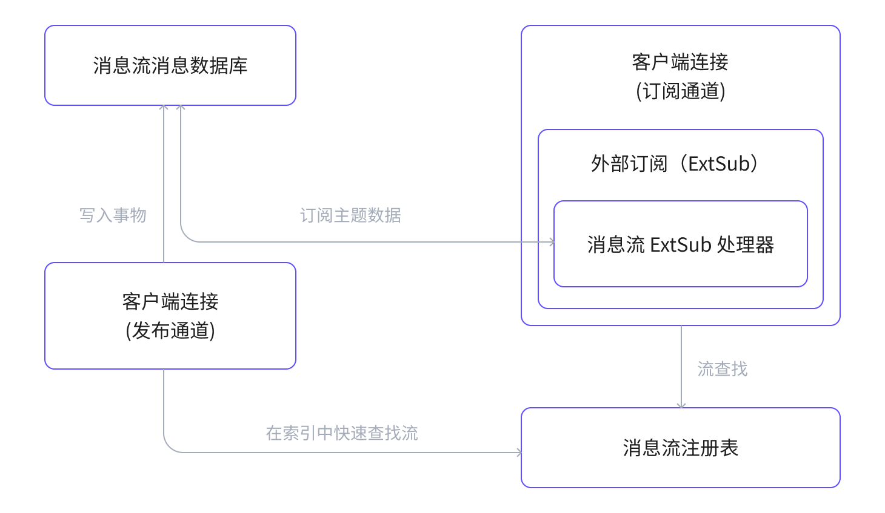

# 消息流

EMQX 6.1 新增了消息流，它是一项面向流式处理与消息重放的功能，通过持久化、可重放的消息流，扩展了 MQTT 的实时发布/订阅模型，并在保持 MQTT 语义的同时提供类似 Kafka 的流式能力。

本页将完整介绍 EMQX 中消息流功能的设计动机、关键概念、内部架构、消息流转过程，以及典型应用场景。

## 什么是消息流？

消息流是一个逻辑上的 MQTT 消息集合。在其生命周期内，它会自动收集与某个主题过滤器匹配的消息，并将这些匹配消息进行持久化存储；客户端可以通过订阅特定的消息流主题来回放历史数据。

## 为什么使用消息流？

MQTT 擅长实时消息传递，但也存在一些固有局限：

- 消息通常只会投递给在线订阅者。
- MQTT 原生不支持历史消息回放。
- 对历史数据进行重放或再处理通常需要外部系统配合。
- 构建有序、可重放的消息历史较为困难。

消息流为 MQTT 增加了持久化存储与回放能力。它允许消费者读取历史消息，并获取设备的最新状态，而无需改变 MQTT 客户端的发布或订阅方式。

## 消息流关键概念

- **消息流**

  消息流是一个由 MQTT 主题过滤器标识的逻辑资源，并具有明确的生命周期。处于启用状态时，它会持续存储与过滤主题匹配的消息，并受配置的时间或大小限制约束。存储的消息可被订阅者回放；发布端无需感知消息流的存在。

  - **常规消息流**：常规消息流会完整存储所有匹配的消息，不会覆盖历史数据。消费者可以通过时间戳订阅回放任意时间点之后的所有消息。
  - **最后值消息流**：最后值消息流启用了[最后值语义](#最后值语义)。对于具有相同流键（key）的消息，新的消息会覆盖旧的消息，消息流中仅保留该 key 对应的最新一条消息。

- **主题过滤器**

  一个 MQTT 主题过滤器（例如 `sensors/+/data`），用于决定哪些已发布消息会被捕获并写入消息流。只有匹配主题过滤器的消息会被摄取；同一条消息也可能同时属于多个消息流。

- **消息流订阅**

  消息流订阅是一种用于消费消息流数据的特殊 MQTT 订阅。客户端通过 `$s/<timestamp>/<topic_filter>` 的格式订阅，其中时间戳用于指定回放起点。消息流订阅与普通 MQTT 订阅相互独立，并通过外部订阅（External Subscription，ExtSub）机制进行投递。

- **流键表达式**

  流键表达式是一个用户定义的表达式，会在每条入流消息上执行以提取一个键。该表达式可以引用消息内容或元数据。提取出的键用于以保证存储分区内消息的顺序性。当消息流启用最后值语义时，键还用于确定覆盖范围：具有相同键的新消息会替换旧消息。

## 消息流架构

消息流以独立的 EMQX 应用形式实现，与 Broker 核心保持松耦合，并复用现有基础设施。它通过内部钩子（Hook）以及外部订阅框架与 EMQX 集成。

::: tip

外部订阅是 EMQX 的一种机制，用于将外部消息源（即不来自实时 MQTT 发布路径的消息）连接到 MQTT 客户端会话，使这些消息能够通过标准的 MQTT 订阅投递给客户端，而无需改变客户端行为。

:::

### 主要组件

- **消息流注册表（Streams Registry）**：管理消息流的生命周期，并维护消息流的元数据与索引。它使用 Mnesia 表按主题过滤器建立索引，以便高效查找匹配的消息流。
- **消息流消息数据库（Streams Message Database）**：为消息流消息提供持久化存储，基于 EMQX 的[持久存储](../design/durable-storage.md)构建。它负责消息落盘、执行保留限制、在启用时应用最后值语义，并在消息按保留策略过期前支持高效读取。
- **消息流 ExtSub 处理器（Streams ExtSub Handler）**：将消息流与 MQTT 客户端会话集成。它从持久化存储中读取消息，并通过外部订阅框架向订阅客户端投递。

### 消息流的数据流示意图

下图展示了消息流组件之间的数据流转关系：

### 发布流程

1. 客户端向某个 MQTT 主题发布消息。
2. 消息发布时触发消息流钩子，用于处理本次发布。
3. 钩子查询消息流注册表，识别过滤主题与该消息主题匹配的消息流。
4. 对每个匹配的消息流，将消息写入消息流并持久化到持久化存储中。

### 订阅与消费流程

1. 客户端订阅消息流主题（`$s/<timesstamp>/<topic_filter>`）。
2. 外部订阅框架处理该订阅，并为该消息流主题初始化一个消息流 ExtSub 处理器。
3. 处理器根据指定的时间戳与保留规则，从持久化存储中读取消息。
4. 读取到的消息会被传递给外部订阅框架。
5. ExtSub 应用通过标准 MQTT 投递流程向客户端下发消息。

## 消息流核心特性

消息流提供了一组核心能力，用于定义消息如何被存储、排序、保留，以及如何面向回放式消费进行投递。

- **基于时间戳的回放**

  消息流支持从指定时间戳开始回放。消费者在订阅时选择时间戳；早于该时间戳发布的消息会被跳过。

- **保留策略**

  消息流的保留策略会限制可回放的范围。消息会按时间或大小限制进行保留；过期消息会自动清理，无论它是否已被消费。

- **按 key 有序投递**

  消息流不保证全局单一的投递顺序。具有相同 key 的消息一定会按发布顺序投递；不同 key 的消息之间可能以任意顺序交错投递。

- **最后值语义**

  消息流可启用最后值语义。key 相同的新消息会覆盖更早的消息，仅保留最新值。无法解析出 key 的消息会按普通消息方式存储。

- **MQTT 原生投递**

  消息流消息通过标准 MQTT 机制投递。发布端无需改变行为；面向订阅者的消息投递通过外部订阅机制集成实现。

## 典型使用场景

- **历史数据回放**：重放过去的 MQTT 事件，用于排障或上线新的业务逻辑。
- **时序分析**：存储并回放传感器数据，用于分析与预测性维护。
- **事件溯源（Event Sourcing）**：将所有状态变化以不可变事件日志形式持久化。
- **IoT 数字孪生**：以数字形态维护物理设备的最新状态。
- **配置同步**：确保设备始终接收最新配置。

## 下一步

了解消息流基础后，你可以继续探索如何在实践中使用它：

- [创建与配置消息流](./message-stream-task.md)：学习如何通过 Dashboard 或 REST API 声明消息流，并设置最后值语义与保留策略。
- [快速开始教程](./message-stream-quick-start.md)：跟随基于 MQTTX 的分步指南，模拟真实的发布端与订阅端场景。
