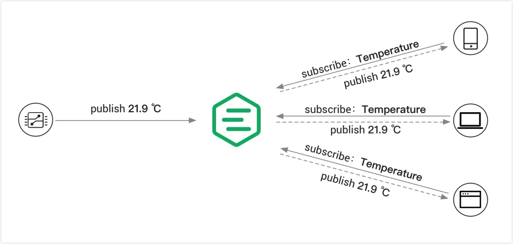

# 发布/订阅

作为世界级的 MQTT 代理，EMQX 支持[发布/订阅消息模式](./mqtt-concepts.md#publish-subscribe-pattern)，这是 MQTT 协议的一个关键特性。EMQX 的发布/订阅功能提供了多种特性，使其非常适用于复杂和高性能的消息应用程序。这些特性包括支持通配符主题、基于主题的消息过滤、消息持久化和消息质量等级（QoS）设置。

发布功能允许连接到 EMQX 的设备向特定主题发送消息。消息可以包含任何类型的数据，例如传感器读数、状态更新或命令。当设备发布消息到一个主题时，EMQX 接收该消息并将其转发给所有订阅了该主题的设备。

EMQX 中的订阅功能允许设备从特定主题接收消息。设备可以订阅一个或多个主题，并接收在这些主题上发布的所有消息。这使得设备能够实时监控特定事件或数据流，而无需不断轮询更新。

本章节将带您了解 [MQTT 核心概念](./mqtt-concepts.md)。同时您也将了解如何使用 MQTT 客户端工具在 EMQX 中尝试发布订阅功能以及以下这些 MQTT 的特定功能：

- [共享订阅](./mqtt-shared-subscription.md)
- [保留消息](./mqtt-retained-message.md)
- [遗嘱消息](./mqtt-will-message.md)
- [主题通配符](./mqtt-wildcard-subscription.md)

除了 MQTT 特定的功能外，EMQX 还实现了一些扩展功能。本章还介绍了以下扩展功能以及如何在 EMQX Dashboard 中进行配置并使用客户端工具进行测试：

- [排他订阅](./mqtt-exclusive-subscription.md)
- [延迟发布](./mqtt-delayed-publish.md)
- [自动订阅](./mqtt-auto-subscription.md)
- [主题重写](./mqtt-topic-rewrite.md)

