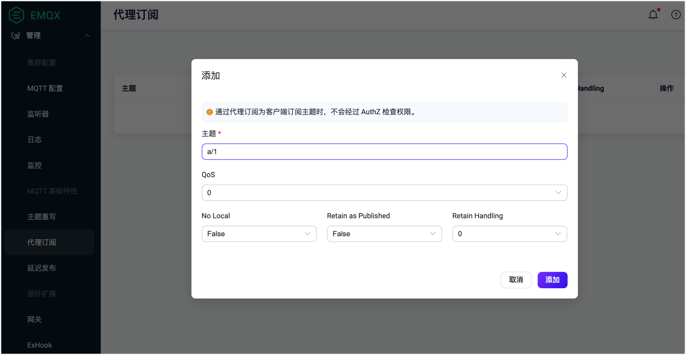
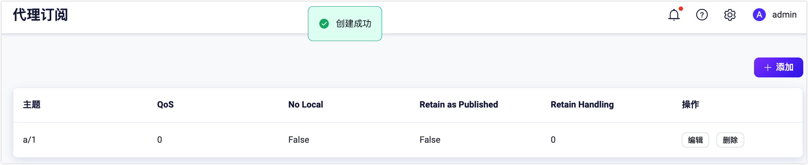
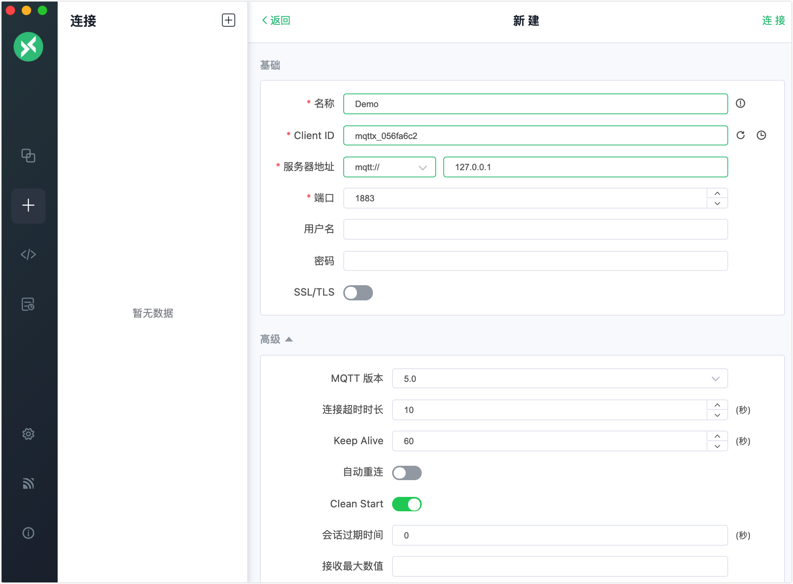
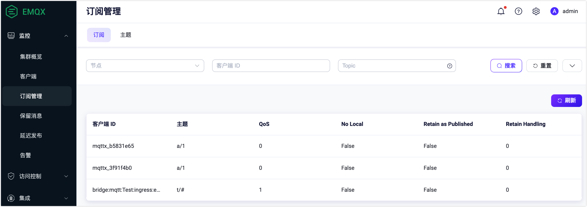
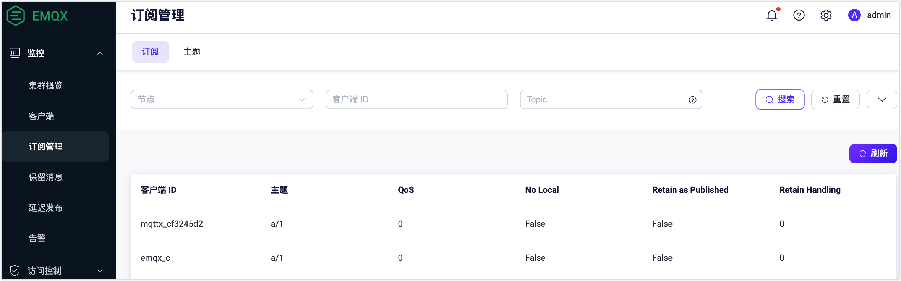

# 自动订阅

::: tip 注意

自动订阅是 EMQX 企业版功能。

:::

自动订阅是 EMQX 支持的 MQTT 扩展功能。自动订阅能够给 EMQX 设置多个规则，在设备成功连接后按照规则为其订阅指定主题，不需要额外发起订阅。

在 EMQX 5.0 之前，该功能叫做代理订阅。

## 通过 Dashboard 配置自动订阅

1. 打开 EMQX Dashboard。在左侧导航菜单中，点击**管理** -> **代理订阅**。

2. 在**代理订阅**页面，点击右上角的 **+ 添加**按钮。

3. 在弹出的对话框中，在**主题**文本框中输入测试主题 `a/1`。其他设置保持默认值。

   - **主题**: 输入客户端自动订阅的主题。
   - **QoS**: 指定主题的服务质量。选项：`0`、`1` 和 `2`。
   - **No local**: 选项：`False` 或 `True`。
   - **保留发布**: 指定是否保留使用指定主题发送的消息。选项：`False` 或 `True`。
   - **保留处理**: 选项：`0`、`1` 和 `2`。

    

   点击对话框中的**添加**按钮。自动订阅主题 `a/1` 创建成功。

   

现在自动订阅功能已启用。新的订阅者一旦连接到代理服务器，将自动订阅主题 `a/1`。

## 使用 MQTTX Desktop 尝试自动订阅

在[通过 Dashboard 配置自动订阅](#通过-dashboard-配置自动订阅)中，将主题 `a/1` 已被配置为自动订阅主题。以下步骤演示了客户端一旦连接到 EMQX，将自动订阅主题 `a/1`。

::: tip 前置准备

能使用 [MQTTX Desktop](./publish-and-subscribe.md#mqttx-desktop) 进行基本的发布和订阅操作。

:::

1. 启动 EMQX 和 MQTTX Desktop。点击**新建连接**创建一个名为 `Demo` 的客户端连接作为发布者。

   - 在**名称**栏中输入 `Demo`。
   - 在本演示中，**服务器地址**使用本地主机 `127.0.0.1` 作为示例。
   - 其它设置保持默认，点击**连接**。

   ::: tip

   [MQTTX Desktop](./publish-and-subscribe.md#mqttx-desktop) 中介绍了更多详细的连接创建信息。

   :::



2. 创建另一个名为 `Subscriber` 的 MQTT 客户端连接作为订阅者。

3. 在**连接**窗格中选择客户端连接 `Demo`。在主题栏中输入 `a/1`。发送一条消息到该主题。

   - 客户端 `Subscriber` 将自动接收到该消息，无需创建新的订阅。

   - 客户端 `Demo` 也收到该消息，因为它也是一个新的连接。

     ::: tip

     在发布/订阅模式下，一个客户端可以既是发送者又是订阅者。

     :::

4. 进入 EMQX Dashboard。在左侧导航菜单中点击**监控** -> **订阅管理**。显示自动订阅主题 `a/1` 的 2 个订阅。

   

## 使用 MQTTX CLI 尝试自动订阅

:::tip 前置准备

能使用 [MQTTX CLI](./publish-and-subscribe.md#mqttx-cli) 进行基本的发布和订阅操作。

:::

1. 创建一个以 `emqx_c` 为客户端 ID 的新连接。

   ```bash
   mqttx conn -i emqx_c
   ```

2. 进入 EMQX Dashboard。在左侧导航菜单中点击**监控** -> **订阅管理**。显示客户端 `emqx_c` 订阅了主题 `a/1`。

   


