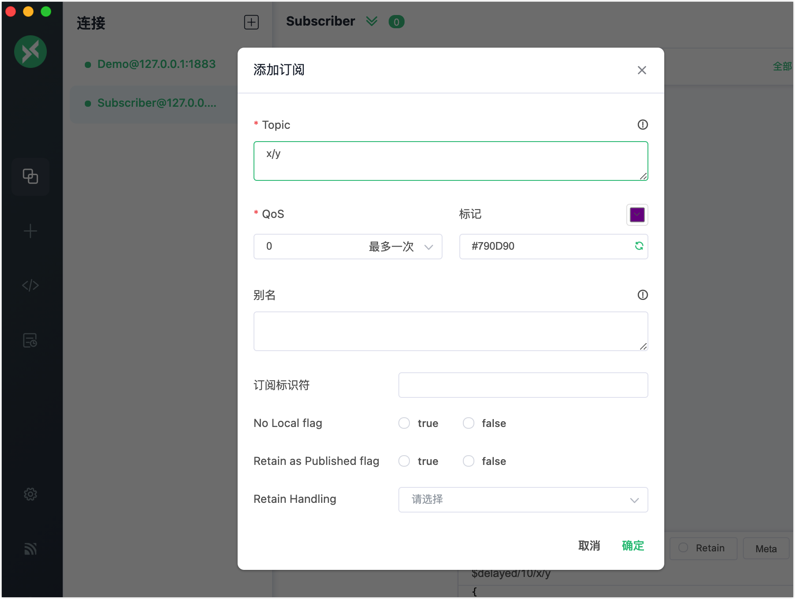
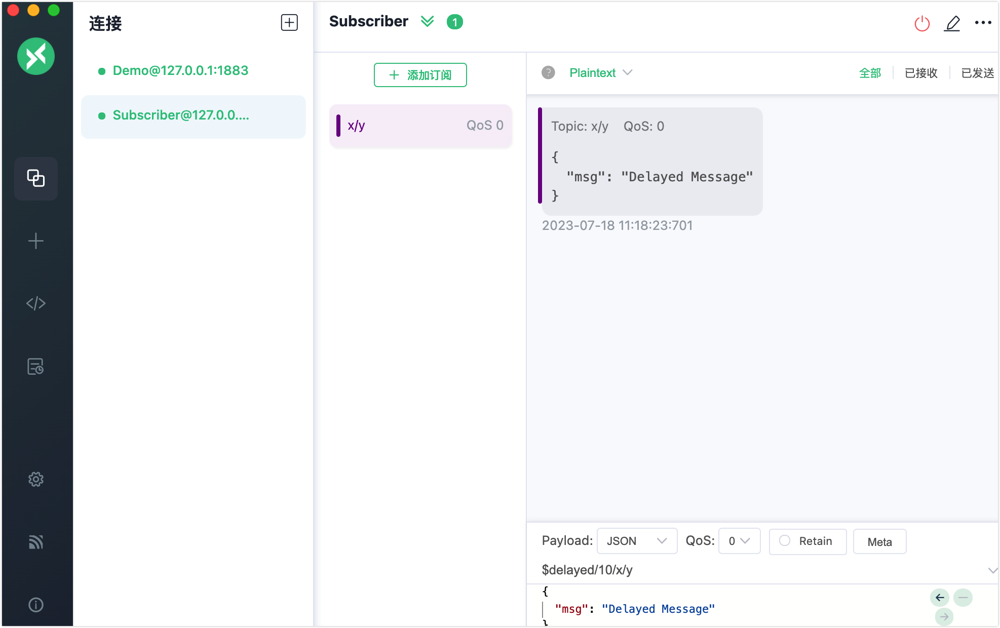

# 延迟发布

延迟发布是 EMQX 支持的 MQTT 扩展功能。当客户端使用特殊主题前缀 `$delayed/{DelayInteval}` 发布消息时，将触发延迟发布功能，可以实现按照用户配置的时间间隔延迟发布消息。

延迟发布主题的具体格式如下：

```bash
$delayed/{DelayInterval}/{TopicName}
```

- `$delayed`：使用 `$delay` 作为主题前缀的消息都将被视为需要延迟发布的消息。延迟间隔由下一主题层级中的内容决定。
- `{DelayInterval}`：指定该 MQTT 消息延迟发布的时间间隔，单位是秒，允许的最大间隔是 4294967 秒。如果 `{DelayInterval}` 无法被解析为一个整型数字，EMQX 将丢弃该消息，客户端不会收到任何信息。
- `{TopicName}`：MQTT 消息的主题名称。

例如:

- `$delayed/15/x/y`：15 秒后将 MQTT 消息发布到主题 `x/y`。
- `$delayed/60/a/b`：1 分钟后将 MQTT 消息发布到 `a/b`。
- `$delayed/3600/$SYS/topic`：1 小时后将 MQTT 消息发布到 `$SYS/topic`。

## 通过 Dashboard 配置延迟发布

1. 打开 EMQX Dashboard，在左侧导航菜单中，点击**管理**-> **延迟发布**。

2. 在**延迟发布**页面，您可以进行以下配置：

   - **启用**: 启用或禁用延迟发布。默认情况下，已启用。
   - 最大延迟消息数：延迟消息的最大数量。
     - 如果您从下拉列表中选择了**无限制**，则无法指定具体数量。
     - 如果您从下拉列表中选择了**自定义**，可以指定具体数量。

   

## 使用 MQTTX Desktop 尝试延迟发布

::: tip 前置准备

能使用 [MQTTX Desktop](./publish-and-subscribe.md#mqttx-desktop) 进行基本的发布和订阅操作。

:::

1. 启动 EMQX 和 MQTTX Desktop。点击**新建连接**创建一个名为 `Demo` 的客户端连接作为发布者。

   - 在**名称**栏中输入`Demo`。
   - 在本演示中，**服务器地址**使用本地主机 `127.0.0.1` 作为示例。
   - 其它设置保持默认，点击**连接**。

   ::: tip

   [MQTTX Desktop](./publish-and-subscribe.md/#mqttx-desktop) 中介绍了更多详细的连接创建信息。

   :::

   

2. 创建另一个 MQTT 客户端连接作为订阅者，将名称设为 `Subscriber`。

3. 在**连接**窗格中选择客户端 `Demo` 。在**Topic**文本框中输入主题名 `$delayed/10/x/y`，并将消息内容输入为 `Delayed Message`。

   - `$delayed`: 表示这是一条延迟消息。
   - `10`: 表示延迟间隔为 10 秒。
   - `x/y`: 表示消息的主题名。

4. 在**连接**窗格中选择客户端 `Subscriber`。点击**新建订阅**按钮创建一个订阅。在**主题**文本框中输入 `x/y`，以订阅该主题。点击**确定**。

   

5. 在**连接**窗格中选择客户端 `Demo`。点击发送按钮，发送带有主题 `$delayed/10/x/y` 的 `Delayed Message`。

6. 等待 10 秒钟。您将看到客户端 `Subscriber` 在 10 秒后接收到延迟消息。

   

## 使用 MQTTX CLI 尝试延迟发布

::: tip 前置准备

能使用 [MQTTX CLI](./publish-and-subscribe.md#mqttx-cli) 进行基本的发布和订阅操作。

:::

1. 创建一个新的连接作为订阅者，并订阅主题 `t/1`。

   ```bash
   mqttx sub -t t/1 -v
   ```

2. 在终端中为客户端打开一个新的窗口，用以下命令发送一条延迟消息。订阅者将在 5 秒后接收到该消息。

   ```bash
   mqttx pub -t "\$delayed/5/t/1" -m "Hello Delayed msg"
   ```

