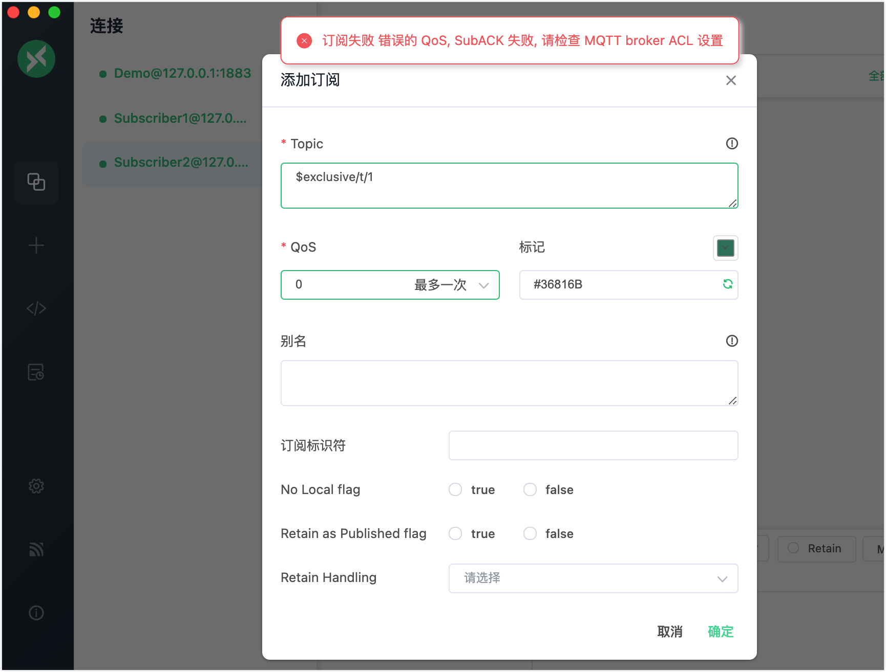

# 排它订阅

排它订阅是 EMQX 支持的 MQTT 扩展功能。排它订阅允许对主题进行互斥订阅，一个主题同一时刻仅被允许存在一个订阅者，在当前订阅者未取消订阅前，其他订阅者都将无法订阅对应主题。

要进行排它订阅，您需要为主题名称添加前缀，如以下表格中的示例：

| 示例            | 前缀        | 真实主题名 |
| --------------- | ----------- | ---------- |
| $exclusive/t/1      | $exclusive/     | t/1        |

当某个客户端 **A** 订阅 `$exclusive/t/1` 后，其他客户端再订阅 `$exclusive/t/1` 时都会失败，直到 **A** 取消了对 `$exclusive/t/1` 的订阅为止。

**注意**: 排它订阅必须使用 `$exclusive/` 前缀，在上面的示例中，其他客户端依然可以通过 `t/1` 成功进行订阅。 

## 订阅失败错误码

| 错误码            | 原因        | 
| --------------- | ----------- | 
| 0x8F     | 使用了 `$exclusive/`，但并未开启排它订阅  | 
| 0x97 | 已经有客户端订阅了该主题 |

## 通过配置文件配置排它订阅

:::tip 

目前只能在配置文件中配置排它订阅，不支持通过 Dashboard 配置。

:::

排它订阅默认未开启，可在 `etc/emqx.conf` 中配置：

```bash
mqtt.exclusive_subscription {
    enable = true
}
```

## 使用 MQTTX Desktop 尝试排它订阅

::: tip 前置准备

- 能使用 [MQTTX Desktop](./publish-and-subscribe.md#mqttx-desktop) 进行基本的发布和订阅操作。
- 排它订阅已开启。

:::

1. 启动 EMQX 和 MQTTX Desktop。点击**新建连接**创建一个名为 `Demo` 的客户端连接作为发布者。

   - 在**名称**栏中输入`Demo`。
   - 在本演示中，**服务器地址**使用本地主机 `127.0.0.1` 作为示例。
   - 其它设置保持默认，点击**连接**。

   ::: tip

   [MQTTX Desktop](./publish-and-subscribe.md/#mqttx-desktop) 中介绍了更多详细的连接创建信息。

   :::

   

2. 创建另外两个 MQTT 客户端连接作为订阅者，并分别将它们配置为 `Subscriber1` 和 `Subscriber2`。

3. 在**连接**窗格中选择客户端连接 `Subscriber1`。点击**+ 添加订阅**创建一个订阅。在**Topic**文本框中输入 `$exclusive/t/1`，以订阅该主题。点击**确定**。

   

4. 在**连接**窗格中选择客户端连接 `Subscriber2`。点击**添加订阅**创建一个订阅。在 **Topic** 文本框中输入 `$exclusive/t/1`，以订阅该主题。点击**确定**。

   - 一条错误消息弹出。

   

## 使用 MQTTX CLI 尝试排它订阅

::: tip Prerequisites

- 能使用 [MQTTX CLI](./publish-and-subscribe.md#mqttx-cli) 进行基本的发布和订阅操作。
- 排它订阅已开启。

:::

1. 使用以下命令进行排它订阅。

   ```bash
   mqttx sub -t "$exclusive/t/1"
   ```

2. 再次使用步骤 1 中的命令订阅主题 `$exclusive/t/1`。它将返回以下结果：

   ```bash
   subscription negated to t/2 with code 135
   ```

   排它订阅错误代码：

   | 代码 | 原因                                           |
   | ---- | ---------------------------------------------- |
   | 0x8F | 在未启用排它订阅的情况下使用了 `$exclusive/`。 |
   | 0x97 | 已有客户端订阅了该主题。                       |

