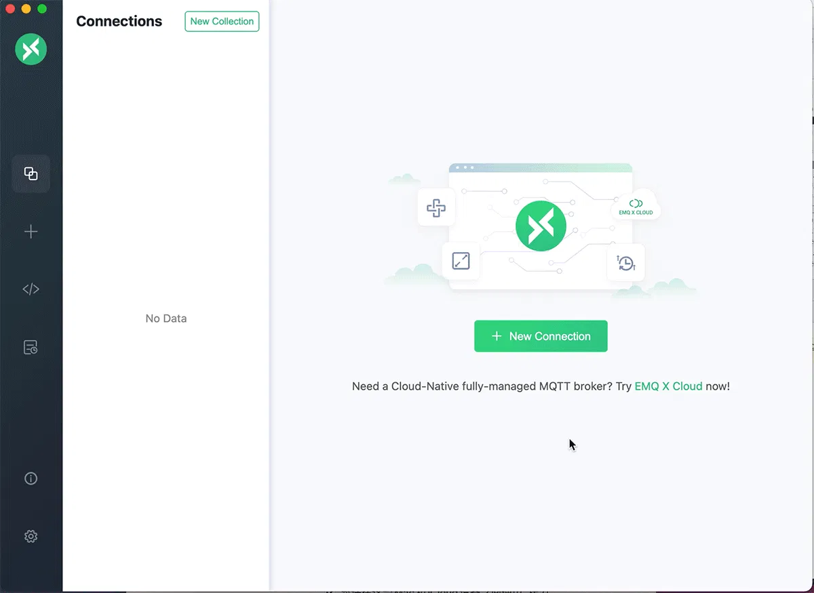

# 发布/订阅

MQTT 基于[发布订阅模式](../mqtt/mqtt-publish-and-subscribe.md)进行消息通信，客户端可以作为发布者发布消息或或者作为订阅者订阅主题，当消息发布时，EMQX 负责接收消息并将其转发给订阅了相关主题的客户端。

本章节将介绍常用的 MQTT 客户端工具，并指导大家完成从建立客户端连接、订阅主题到发布消息、接收并查看消息整个流程。

**消息流程**

以下是 EMQX 中一条消息从发布到发送到订阅者所需的流程及注意事项：

1. 发布者、订阅者连接到 EMQX，需要提供正确的连接地址与认证信息，并确保两者连接到同一个 EMQX；
2. 订阅者订阅主题，默认情况下没有匹配订阅者的消息将被立即丢弃；
3. 发布者发布消息，请确保消息主题能够被订阅者匹配，且订阅者已经订阅对应主题；
4. 订阅者收到消息。

对应的客户端工具操作流程：

:::: tabs type:card

::: tab MQTT X
[MQTT X](https://mqttx.app/zh) 是 EMQ 开源的一款跨平台 MQTT 5.0 客户端工具，它支持 macOS, Linux, Windows，并且支持自定义脚本模拟测试、MQTT 消息格式转换、日志记录等多个功能。

MQTT X 提供了一键式的连接方式和简洁的图形界面，能够测试 MQTT/TCP、MQTT/TLS、MQTT/WebSocket 连接。



> 您也可以使用浏览器打开 [MQTT X Web](http://www.emqx.io/online-mqtt-client#/recent_connections)，无需下载与安装即可通过 MQTT over WebSocket 完成 MQTT 开发和调试操作。

以下是使用 MQTT X 完成连接、发布订阅并查看消息全流程：

1. 下载并安装 MQTT X：前往 [MQTT X 官网](https://mqttx.app/zh)，通过应用商店或直接下载对应操作系统安装包进行安装。详细操作请参考 [MQTT X - 下载与安装](https://mqttx.app/zh/docs/downloading-and-installation)。
2. 配置 MQTT 连接以及消息发布订阅测试：在 MQTT X 中填入 EMQX 连接信息并建立连接，详细操作请参考 [MQTT X - 快速建立连接](https://mqttx.app/zh/docs/get-started#%E5%BF%AB%E9%80%9F%E5%BB%BA%E7%AB%8B%E8%BF%9E%E6%8E%A5)。**服务器地址** 选择 `mqtt://` 协议并填入对应监听器的 IP 地址，默认 IP 地址为 `localhost`，**端口**为 1883，根据情况填入用户名密码，没有启用访问控制的情况下留空即可。
3. 消息发布订阅以及查看消息：连接到 EMQX 后，使用 MQTT X 收发消息，详细操作请参考 [MQTT X - 消息的发布订阅](https://mqttx.app/zh/docs/get-started#%E6%B6%88%E6%81%AF%E7%9A%84%E5%8F%91%E5%B8%83%E8%AE%A2%E9%98%85)。

:::

::: tab MQTT X CLI

[MQTT X CLI](https://mqttx.app/zh/cli) 是 [EMQ](https://www.emqx.com/zh) 开源的一款 MQTT 5.0 命令行客户端工具，也是命令行上的 [MQTT X](https://mqttx.app/zh)，旨在帮助开发者在不需要使用图形化界面的基础上，也能更快的开发和调试 MQTT 服务与应用。

除了跨平台、无依赖、支持完成 MQTT 各项特性之外，MQTT X CLI 还提供了性能测试功能，能够快速测试 MQTT 服务的性能。

以下是使用 MQTT X CLI 完成连接、发布订阅并查看消息全流程：

1. 下载安装 MQTT CLI，此处以 macOS 为例，其他操作系统请参考 [MQTT X CLI 下载与安装](https://mqttx.app/zh/docs/cli/downloading-and-installation)。
  
   ```bash
   # Homebrew
   brew install emqx/mqttx/mqttx-cli
   
   # Intel Chip
   curl -LO https://www.emqx.com/zh/downloads/MQTTX/v1.9.0/mqttx-cli-macos-x64
   sudo install ./mqttx-cli-macos-x64 /usr/local/bin/mqttx
   
   # Apple Silicon
   curl -LO https://www.emqx.com/zh/downloads/MQTTX/v1.9.0/mqttx-cli-macos-arm64
   sudo install ./mqttx-cli-macos-arm64 /usr/local/bin/mqttx
   ```


2. 打开命令行窗口，执行以下命令连接 EMQX 并订阅 `testtopic/#` 主题：

   ```shell
   mqttx sub -t 'testtopic/#' -q 1 -h 'localhost' -p 1883 'public' -v
   ```

   成功执行后命令行将阻塞等待接收并打印接收到的消息。

   参数说明：

   - `-t`：订阅主题。
   - `-q`：订阅 QoS，默认为 0。
   - `-h`：服务器地址，填写对应监听器的 IP 地址，默认为 `localhost`。
   - `-p`：服务器端口，默认为 `1883`。
   - `-v`：在接收到的 Payload 前显示当前 Topic。

   更多参数请参考 [MQTT X CLI - 订阅](https://mqttx.app/zh/docs/cli/get-started#%E8%AE%A2%E9%98%85)。

3. 打开新的命令行窗口，执行一下命令连接到 EMQX 并发布一条消息到 `testtopic/#` 主题：

   ```bash
   mqttx pub -t 'testtopic/1' -q 1 -h 'localhost' -p 1883 -m 'from MQTTX CLI'
   ```

   成功执行后命令行将完成连接建立、消息发布并断开连接，2 中的命令行窗口将打印如下内容：

   ```bash
   topic:  testtopic/1
   payload:  from MQTTX CLI
   ```

    参数说明：

   - `-t`：订阅主题。
   - `-q`：订阅 QoS，默认为 0。
   - `-h`：服务器地址，填写对应监听器的 IP 地址，默认为 `localhost`。
   - `-p`：服务器端口，默认为 `1883`。
   - `-m`：消息 Payload。

   更多参数请参考 [MQTT X CLI - 发布](https://mqttx.app/zh/docs/cli/get-started#%E5%8F%91%E5%B8%83)。

:::

::: tab WebSocket 客户端

[EMQX Dashboard](../dashboard/introduction.md) 包含了一个 WebSocket 客户端工具，旨在于提供一个简易但有效的 MQTT 测试工具，能够通过 MQTT over WebSocket 连接到 EMQX 进行连接、订阅和发布操作。

1. 打开 Dashboard，访问 **问题分析** -> **WebSocket 客户端** 页面。
2. 填入连接信息，**主机名**填写对应监听器的 IP 地址，默认为 `localhost`，**端口** `8083`，根据情况填入用户名密码，没有启用访问控制的情况下留空即可。
3. 点击 **连接** 按钮即可建立连接。
4. **订阅** 功能区主题为要订阅的主题，此处填入 `testtopic/#`，选择对应的 QoS，点击订阅即可为当前连接订阅 `testtopic/#` 主题，下方订阅列表会新增该条订阅记录，在此之后匹配该主题的消息都将转发到当前连接，并记录到下方 **已接收** 列表中。
5. **发布** 功能区主题为要发布的主题（注意发布主题不能包含 +、# 通配符），此处填入 `testtopic/1`，Payload 为要发布的消息内容，选择对应的 QoS 以及 Retain 标志位，点击发布即可通过当前客户端发布一条消息，下方 **已发送** 列表会新增该条消息发布记录。
6. 消息将经过 EMQX 路由转发到所有订阅者，由于 4 中填入的订阅主题与 5 中填入的发布主题匹配，因此 **已接收** 列表将新增一条记录。

至此您已经通过 Dashboard 的 WebSocket 工具完成消息的发布订阅操作。

:::

::::
