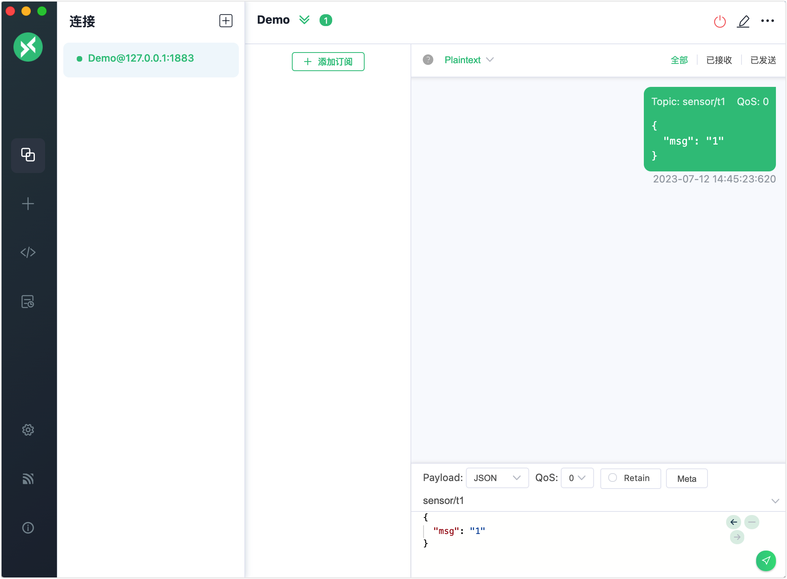
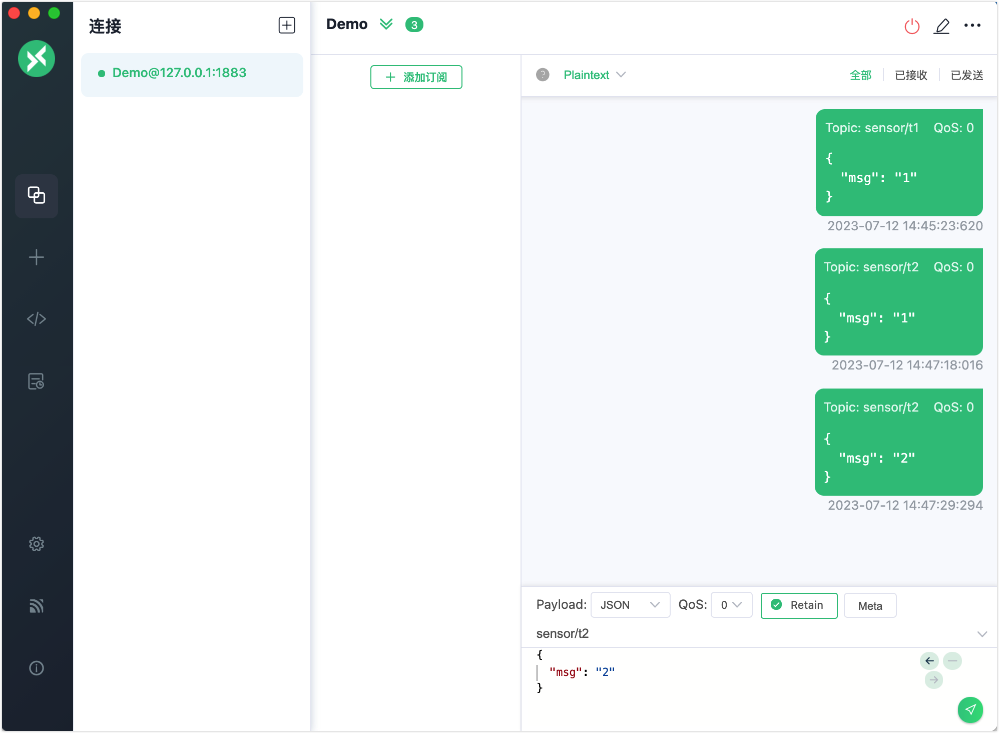
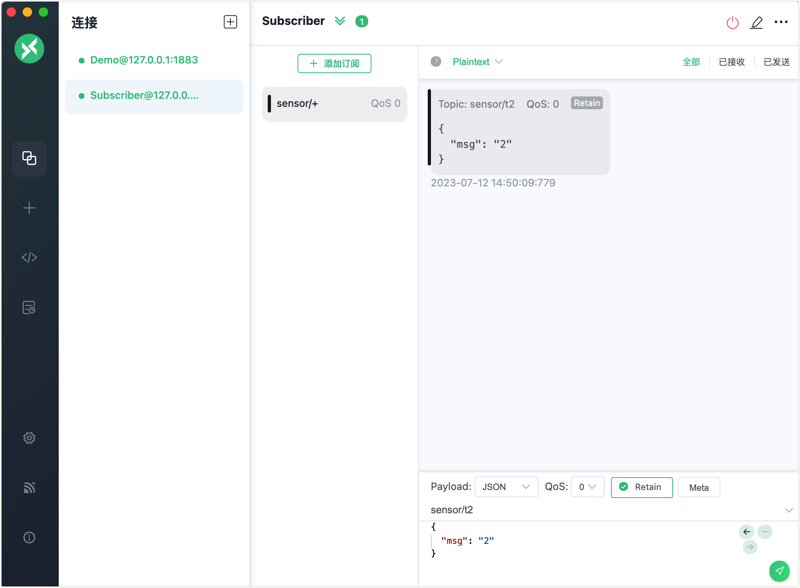
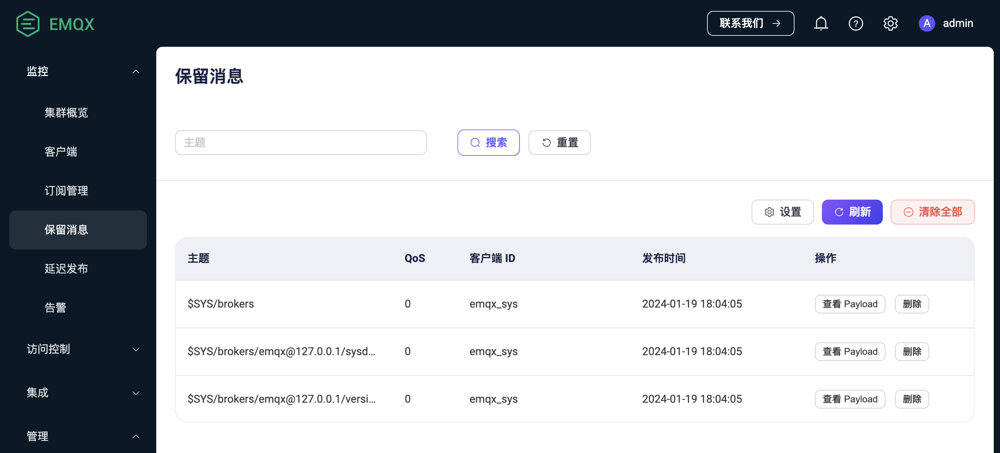

# 保留消息

EMQX 实现了 MQTT 的保留消息功能。您可以将某个特定主题下发布的消息标记为“保留消息”，并将其保存为 EMQX 上的持久消息。当任何新的订阅者订阅与保留消息的主题匹配的主题时，他们会立即接收到该消息，即使该消息是在他们订阅该主题之前发布的。

您可以使用客户端工具连接 EMQX 并尝试这个消息服务。本节介绍如何使用 [MQTTX 客户端](https://mqttx.app/zh)和 [MQTTX CLI](https://mqttx.app/zh/cli) 模拟客户端，并查看如何发布和接收保留消息。

:::tip 前置准备

- 了解 MQTT 的[保留消息](./mqtt-concepts.md#保留消息)。
- 能使用 [MQTTX](./publish-and-subscribe.md) 进行基本的发布和订阅操作。

:::

## 使用 MQTTX 客户端发布保留消息

1. 启动 EMQX 和 MQTTX 客户端。点击**新建连接**创建一个名为 `Demo` 的客户端连接作为发布者。

   - 在**名称**栏中输入`Demo`。
   - 在本演示中，**服务器地址**使用本地主机 `127.0.0.1`作为示例。
   - 其它设置保持默认，点击**连接**。

   ::: tip

   [MQTTX 客户端](./publish-and-subscribe.md/#mqttx-客户端)中介绍了更多详细的连接创建信息。

   :::

   

2. 连接成功后，在文本框中输入主题 `sensor/t1`，并按照屏幕截图中的方式编写消息 payload。点击发送按钮。主题为 `sensor/t1`的消息将出现在消息对话框中。

   

3. 发布两条主题为 `sensor/t2` 的保留消息。

   - 输入 `1` 作为第一条消息内容。选中 **Retain**。点击发送按钮。
   - 输入 `2` 作为第二条消息内容。点击发送按钮。

   

4. 点击**连接**窗格中的 **+** -> **新建连接**创建另一个新连接作为消息接收客户端。将名称设置为 `Subscriber`，其他连接基础信息与客户端`Demo` 相同。

5. 点击**+ 添加订阅**，设置订阅 **Topic** 为 `sensor/+` ，点击**确定**。 

   :::tip

   当主题设置为 `sensor/+`时，客户端同时订阅了主题 `sensor/t1` 和 `sensor/t2`。有关主题和通配符的更多信息，请参阅[理解 MQTT 主题和通配符](https://www.emqx.com/zh/blog/advanced-features-of-mqtt-topics)。

   :::

   您将看到客户端 `Subscriber` 只收到了最后一条保留消息，而没有收到主题 `sensor/t1` 的第一条消息和主题 `sensor/t2` 的第一条保留消息，因为 EMQX 仅存储每个主题的最新保留消息。

   

   

现在您已经尝试了使用 MQTTX 客户端发布保留消息。您还可以通过 EMQX Dashboard 查看保存在 EMQX 中的最后一条保留消息，详见[在 Dashboard 中查看保留消息](#在-dashboard-中查看保留消息)。

## 使用 MQTTX CLI 发布保留消息

1. 使用一个客户端发起连接请求。

2. 使用以下命令发布一条保留消息。将主题设置为`t/1`，payload 设置为`A retained message from MQTTX CLI`，并设置 `retain = true`：

   ```bash
   mqttx pub -t 't/1' -m 'A retained message from MQTTX CLI' --retain true -h 'localhost' -p 1883
   ```

3. 使用另一个新的客户端连接请求连接到同一个 broker。使用新客户端订阅主题 `t/1`，它将接收到保留消息。

   如果您连续创建新的客户端并让它们订阅主题 `t/1`，则所有新创建的客户端都将接收到保留消息。

   ```bash
   $ mqttx sub -t 't/1' -h 'localhost' -p 1883 -v
   topic:  t/1
   payload:  A retained message from MQTTX CLI
   retain: true
   ```

4. 发布一个空消息以清除保留消息：

   ```bash
   mqttx pub -t 't/1' -m '' --retain true -h 'localhost' -p 1883
   ```

5. 创建一个新的客户端连接并订阅主题`t/1`。不会收到保留消息，表示保留消息已被清除。

## 在 Dashboard 中查看保留消息

当用户发布一条保留消息时，EMQX 将在系统中保存该消息。用户可以在保留消息列表页面中查看此消息。当用户订阅与保留消息的主题匹配的主题时，EMQX 将向该主题发布此消息，用户可以立即通过订阅主题来接收该消息。

保留消息的默认过期时间是永不过期，除非用户手动删除该消息。

### 保留消息列表

在**监控** -> **保留消息**页面中，用户可以查看系统中的所有保留消息，包括主题、QoS、发布时间和客户端 ID。页面还提供了**查看 Payload** 和**删除**这两个操作选项用来查看保留消息 Payload 以及删除保留消息。用户可以使用**刷新**按钮刷新列表，并使用**设置**按钮访问保留消息设置页面。

默认情况下，将保存三种类型的保留消息[系统主题](./mqtt-concepts.md#sys-主题)。如果是集群环境，则会根据其他节点名称保留不同系统主题的保留消息，例如：

- $SYS/brokers/+/sysdescr：当前 EMQX 节点的系统描述
- $SYS/brokers/+/version：当前 EMQX 节点的版本号
- $SYS/brokers：当前 EMQX 的节点数量和名称



### 删除保留消息

要删除 EMQX 中的保留消息，用户可以在客户端向保留消息的主题发布一个空消息，或在 EMQX Dashboard 中，简单地点击保留消息列表页面上的**删除**按钮来删除保留消息。此外，用户还可以在保留消息配置页面上设置保留消息的过期时间，使其在过期时自动删除。

