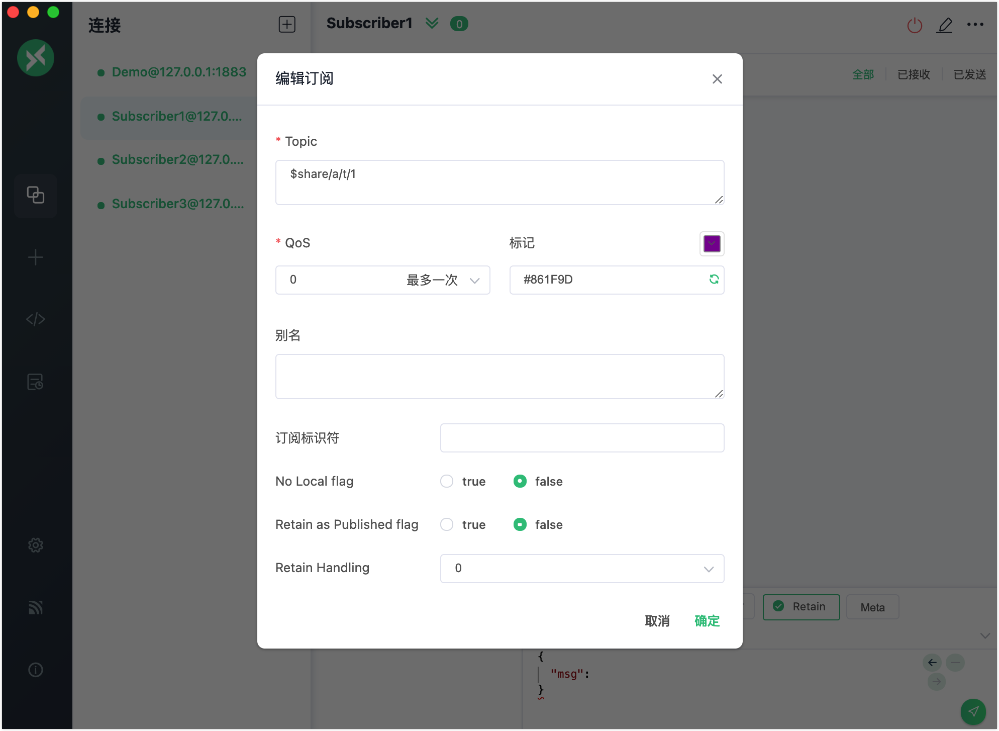
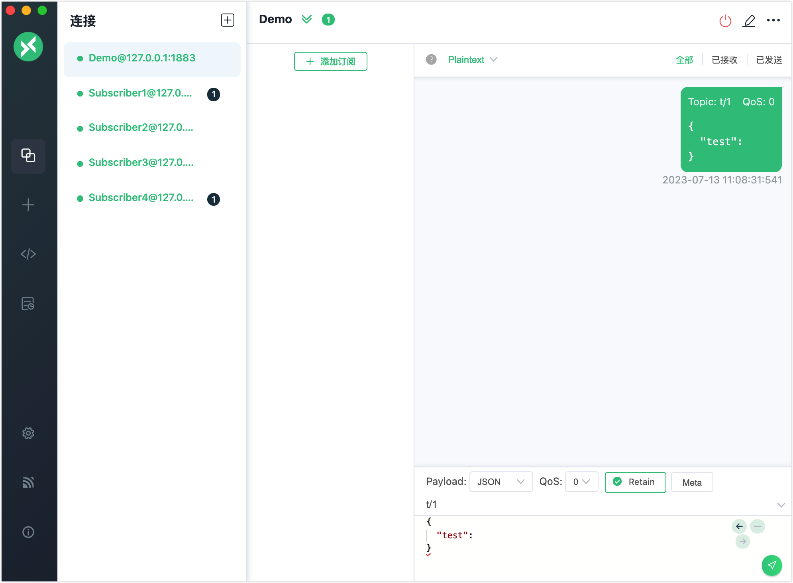
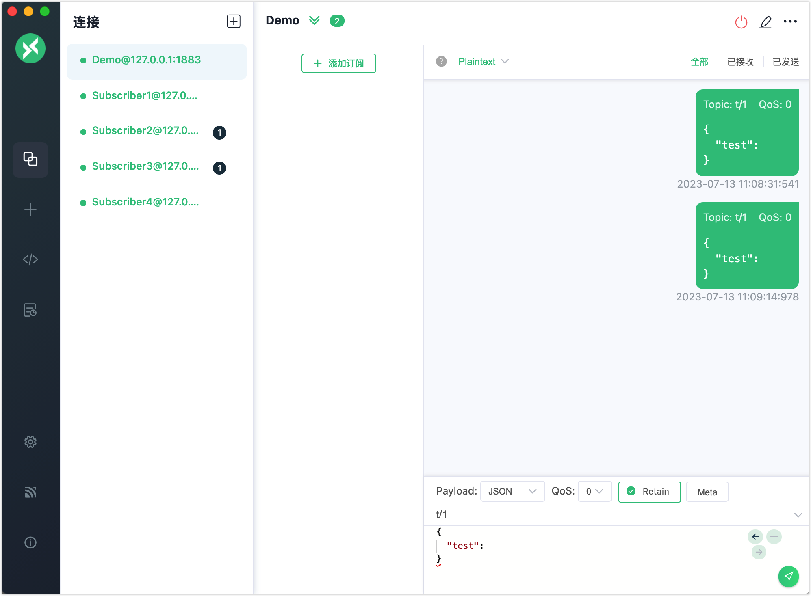

# 共享订阅

EMQX 实现了 MQTT 的共享订阅功能。共享订阅是一种订阅模式，用于在多个订阅者之间实现负载均衡。客户端可以分为多个订阅组，消息仍然会被转发到所有订阅组，但每个订阅组内只有一个客户端接收消息。您可以为一组订阅者的原始主题添加 `$share` 前缀以启用共享订阅。

您可以使用客户端工具连接 EMQX 并尝试这个消息服务。 本节介绍了如何使用 [MQTTX Desktop](https://mqttx.app/zh)和 [MQTTX CLI](https://mqttx.app/zh/cli) 来模拟客户端尝试如何通过共享订阅来接收消息。

:::tip 前置准备

- 了解 MQTT 的[保留消息](./mqtt-concepts.md#保留消息)。
- 能使用 [MQTTX](./publish-and-subscribe.md) 进行基本的发布和订阅操作。

:::

## 使用 MQTTX Desktop 尝试共享订阅

以下步骤演示了如何为多个订阅者分组以共享相同主题的订阅，以及这些订阅者将如何接收来自共享订阅的消息。

在本演示中，您可以创建一个名为 `Demo` 的客户端连接作为发布者，向主题 `t/1` 发布消息。然后，您可以创建 4 个客户端连接作为订阅者，例如 `Subscriber1`、`Subscriber2 `、 `Subscriber3` 和 `Subscriber4`。订阅者可以分为 `a` 和 `b` 两个组，并且两个组都订阅主题 `t/1`。

1. 启动 EMQX 和 MQTTX Desktop。点击**新建连接**创建一个名为 `Demo` 的客户端连接作为发布者。

   - 在**名称**栏中输入`Demo`。
   - 在本演示中，**服务器地址**使用本地主机 `127.0.0.1` 作为示例。
   - 其它设置保持默认，点击**连接**。

   ::: tip

   [MQTTX Desktop](./publish-and-subscribe.md/#mqttx-desktop) 中介绍了更多详细的连接创建信息。

   :::

   

2. 点击**连接**窗格中的 **+** -> **新建连接**创建 4 个新连接作为订阅者。将名称分别设置为 `Subscriber1`，`Subscriber2`，`Subscriber3` 和 `Subscriber4`。

3. 在**连接**窗格中依次选择订阅者客户端，点击**添加订阅**为各个订阅者创建共享订阅。根据下面的规则在主题栏中输入正确的主题。

   为了给多个订阅者分组，您需要在订阅的主题`t/1`前加上组名 `{group}` 。为了使他们同时订阅同一个主题，您还需要在组名前加上前缀 `$share`。

   在**添加订阅**弹出窗口中：

   - 将 `Subscribe1` 和 `Subscriber2` 订阅的**主题**设为 `$share/a/t/1`。
   - 将 `Subscriber3` 和 `Subscriber4`的**主题 **设为 `$share/b/t/1`。

   在以上主题示例中，

   - 前缀 `$share` 表明这是一个共享订阅。
   - `{group}` 为 `a` 和 `b`，也可以是其他自定义的名称。
   - `t/1` 是原始主题。

   其他选项保留为默认设置。点击**确定**。

   

4. 在**连接**窗格中选择客户端 `Demo`发布消息。

   - 发布一条主题为 `t/1` 的消息。`a` 组的客户端 `Subscriber1` 和 `b` 组的 `Subscriber4` 都会收到消息。

     

   - 再次发送一条相同的消息。`a` 组的客户端 `Subscriber2` 和 `b` 组的客户端 `Subscriber3` 都会收到消息。

     

::: tip

当共享订阅的消息被发布， EMQX 会同时将消息转发到不同的组，但是同一个组内一次只有一个订阅者会收到消息。

:::

## 使用 MQTTX CLI 尝试共享订阅

1. 将四个订阅者分为两个组，并订阅主题 `t/1`：

   ```bash
   # 客户端 A 和 B 订阅主题 `$share/my_group1/t/1`
   mqttx sub -t '$share/my_group1/t/1' -h 'localhost' -p 1883
   
   ## 客户端 C 和 D 订阅主题 `$share/my_group2/t/1`
   mqttx sub -t '$share/my_group2/t/1' -h 'localhost' -p 1883
   ```

2. 使用一个新的客户端，向原始主题 `t/1` 发布 4 条 payload 为 `1`、`2`、`3` 和 `4` 的消息：

   ```bash
   mqttx pub -t 't/1' -m '1' -h 'localhost' -p 1883
   mqttx pub -t 't/1' -m '2' -h 'localhost' -p 1883
   mqttx pub -t 't/1' -m '3' -h 'localhost' -p 1883
   mqttx pub -t 't/1' -m '4' -h 'localhost' -p 1883
   ```

3. 检查每个订阅组中的客户端接收到的消息：

   - 订阅组 1(A 和 B) 和 订阅组 2 (C 和 D) 同时接收到消息。
   - 同一组中的订阅者每次只有一个接收到消息。