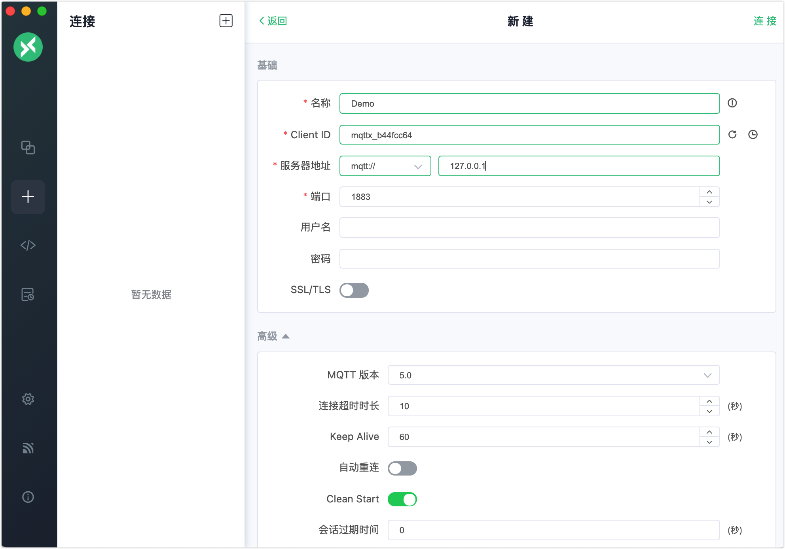
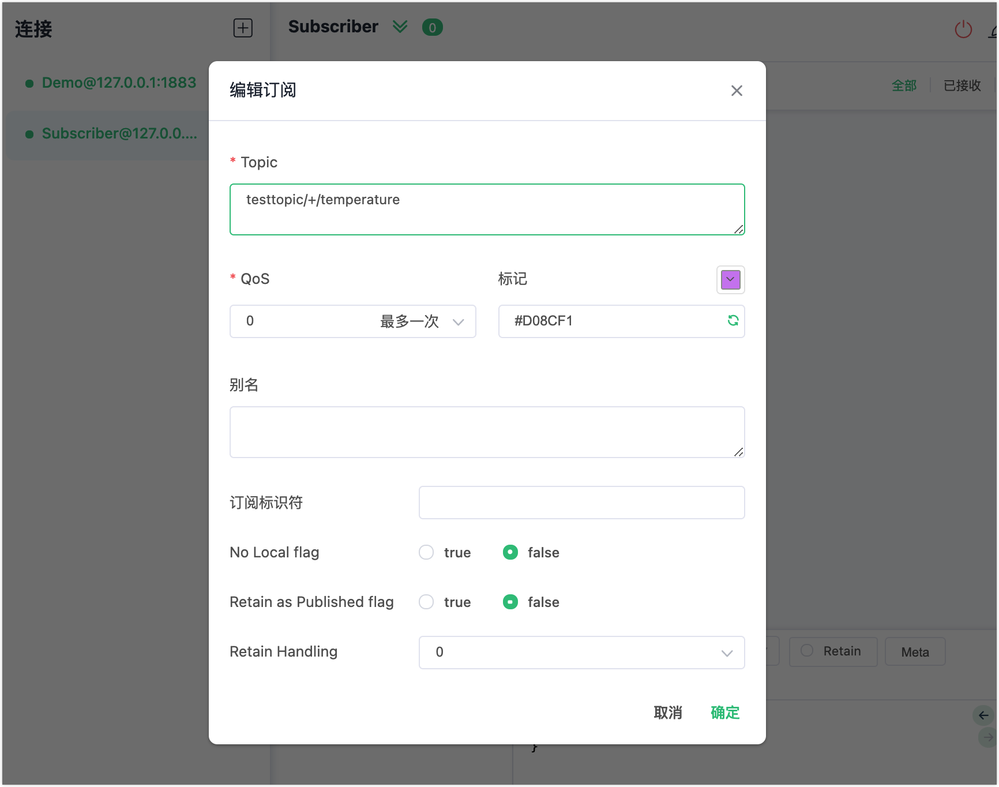
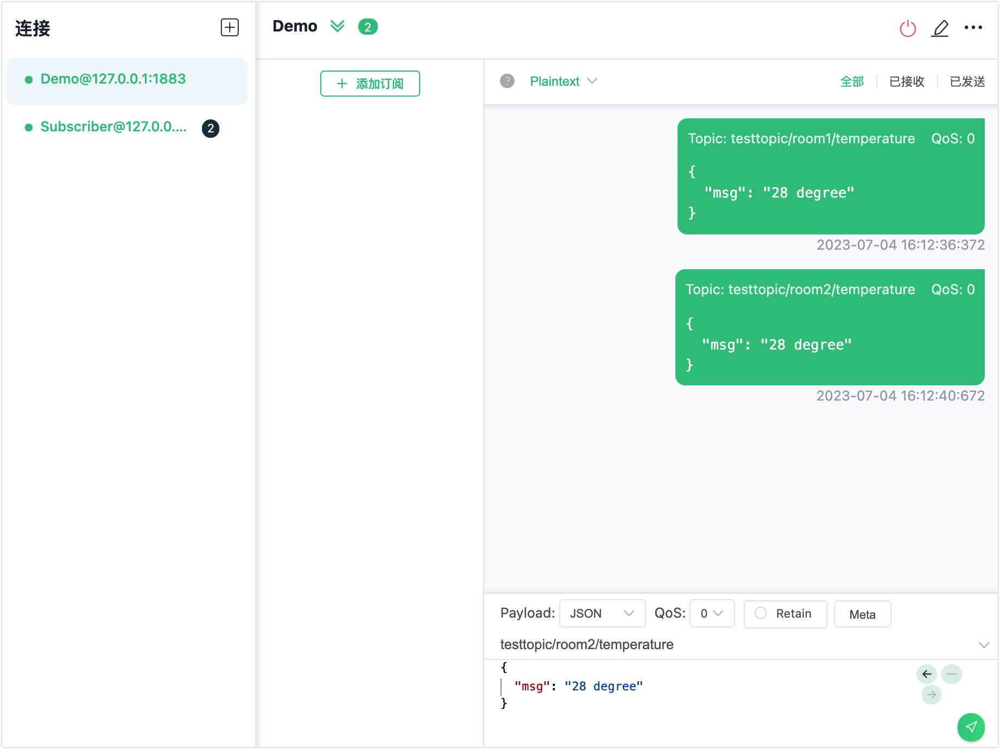
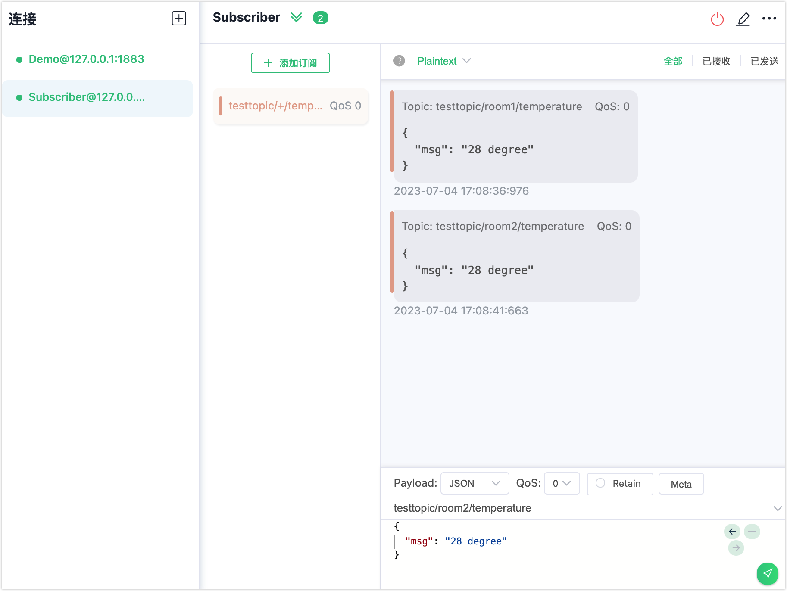
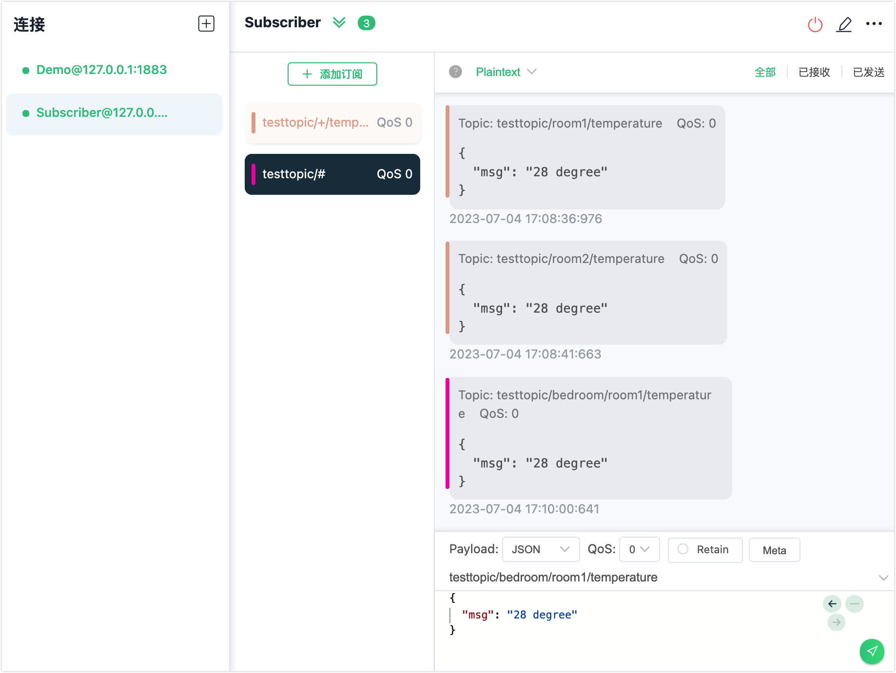

# 通配符订阅

MQTT 主题名称是用于消息路由的 UTF-8 编码字符串。为了提供更大的灵活性，MQTT 支持分层主题命名空间。主题通常按层级分级，并使用斜杠 `/` 在级别之间进行分隔，例如 `chat/room/1`。[通配符订阅](https://docs.oasis-open.org/mqtt/mqtt/v5.0/os/mqtt-v5.0-os.html#_Topic_Names_and)允许客户端在主题名称中包含一个或多个通配符字符，通过主题过滤器匹配多个主题，从而实现一次订阅多个主题。本页介绍了 MQTT 中支持的两种类型的通配符的用法以及如何在 EMQX 中订阅包含通配符的主题。

::: tip

通配符只能用于订阅，不能用于发布。

:::

## 单层通配符

`+`（U+002B）是一个通配符字符，仅匹配一个主题层级。单层通配符可以在主题过滤器的任何层级中使用，包括第一个和最后一个层级。在使用时，它必须占据整个过滤器层级。它可以在主题过滤器的多个层级中使用，并且可以与多层通配符结合使用。下面是一些使用单层通配符的示例：

```
"+" 有效
"sensor/+" 有效
"sensor/+/temperature" 有效
"sensor+" 无效 (没有占据整个层级)
```

如果客户端订阅主题 `sensor/+/temperature`，将会收到来自以下主题的消息：

```awk
sensor/1/temperature
sensor/2/temperature
...
sensor/n/temperature
```

但是不会匹配以下主题：

```bash
sensor/temperature
sensor/bedroom/1/temperature
```

## 多层通配符

`#`（U+0023）是一个通配符字符，匹配主题中的任意层级。多层通配符表示它的父级和任意数量的子层级，在使用多层通配符时，它必须占据整个层级并且必须是主题的最后一个字符，例如：

```pgsql
"#" 有效，匹配所有主题
"sensor/#" 有效
"sensor/bedroom#" 无效 (没有占据整个层级)
"sensor/#/temperature" 无效 (不是主题最后一个字符)
```

如果客户端订阅主题 `sensor/#`，将会收到以下主题的消息：

```pgsql
sensor
sensor/temperature
sensor/1/temperature
```

## 使用 MQTTX 客户端进行通配符订阅

本节演示如何使用 MQTTX 客户端创建通配符主题的订阅。在此演示中，您可以创建一个客户端连接 `Demo` 作为发布者来发布消息。然后，您可以创建另一个客户端连接作为订阅者。订阅者订阅以下通配符主题：

- `testtopic/+/temperature`
- `testtopic/#`

在您开始之前，请确保 EMQX 已启动。

1. 启动 MQTTX 客户端。点击**新建连接**创建一个名为 `Demo` 的 MQTT 连接。

   - 本演示中以本地主机 `127.0.0.1` 为例。

   ::: tip

   有关创建 MQTT 连接的详细说明，请参阅 [MQTTX 客户端](./publish-and-subscribe.md)。

   :::

   

2. 在**连接**区域点击 **+** 新建另一个连接作为订阅者，设置名称为 `Subscriber`。

3. 在**连接**区域选中 `Subscriber` 并点击 **+ 添加订阅**。在弹出的对话框中，在 **Topic** 中输入 `testtopic/+/temperature` 作为主题。其他选项均设为默认值。

   

4. 在**连接**区域选中 `Subscriber`。在消息发布区域的主题栏中输入 `testtopic/room1/temperature`，在消息区域输入消息 payload `28 degree`。 点击发送按钮。 接着发布另一条相同 payload 且主题为 `testtopic/room2/temperature` 的消息。

      

5. 在**连接**区域选中 `Subscriber`。您可以看到订阅者收到了两条来自发布者的不同主题的消息。

      

6. 点击 **+ 添加订阅**。在弹出的对话框中，使用默认主题 `testtopic/#` 。 其他选项均设为默认值。

7. 在**连接**区域选中 `Demo`。在消息发布的主题栏中输入 `testtopic/bedroom/room1/temperature`，在消息区域的 payload 中输入  `28 degree`，点击发送按钮。

8. 在**连接**区域选中 `Subscriber`。您可以看到只有订阅者的 `testtopic/#` 订阅下收到了来自发布者的消息。

      