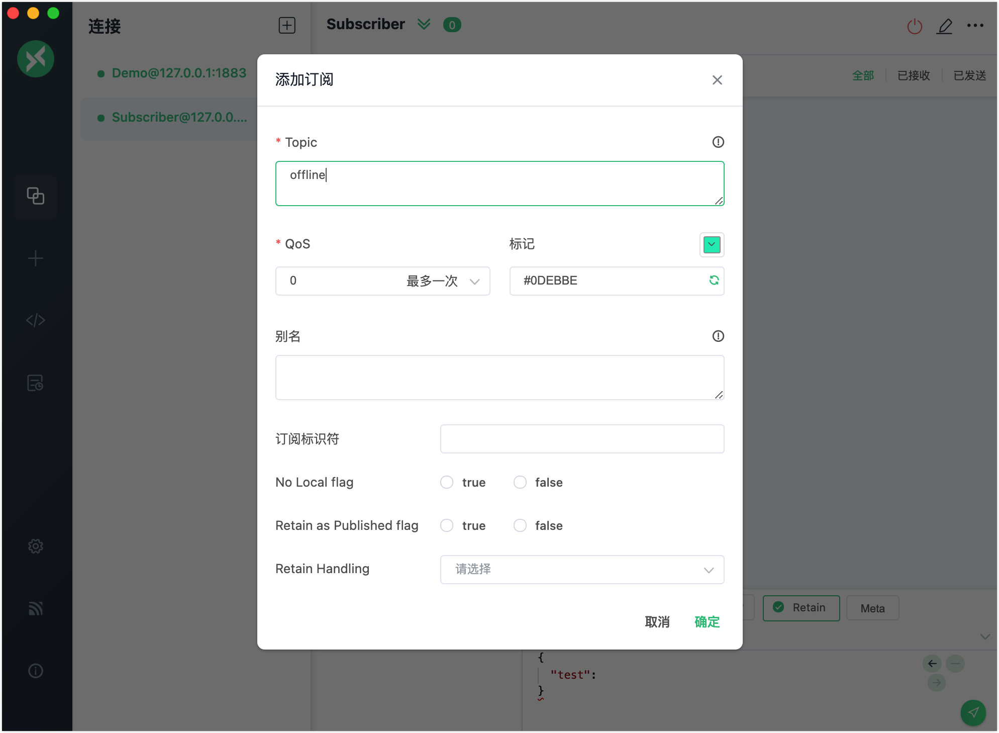
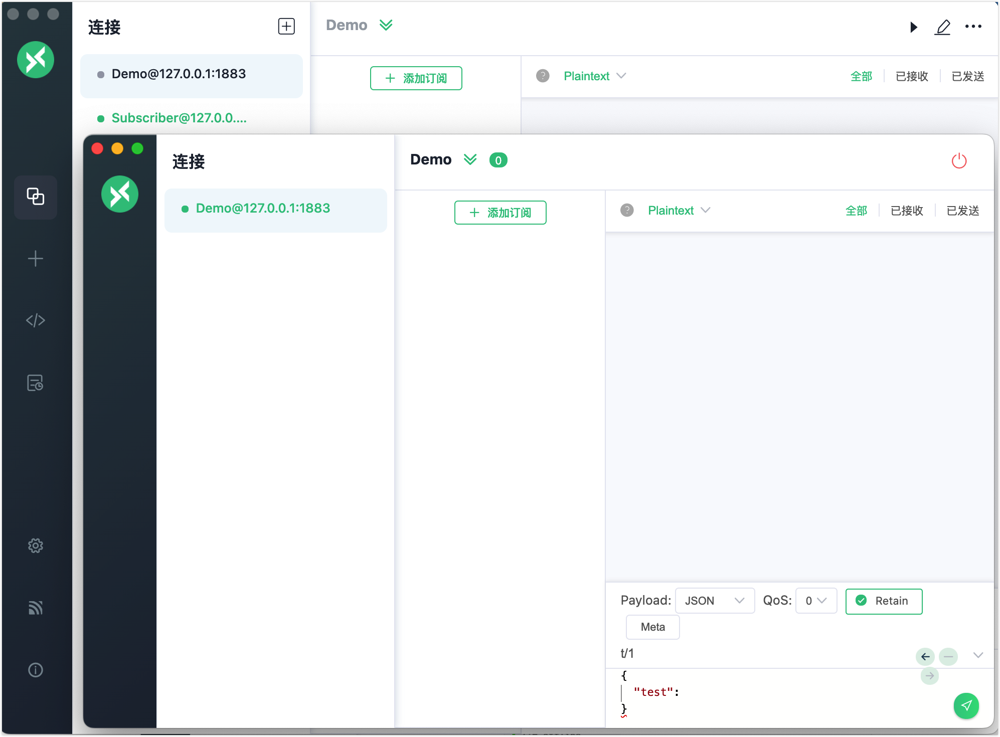
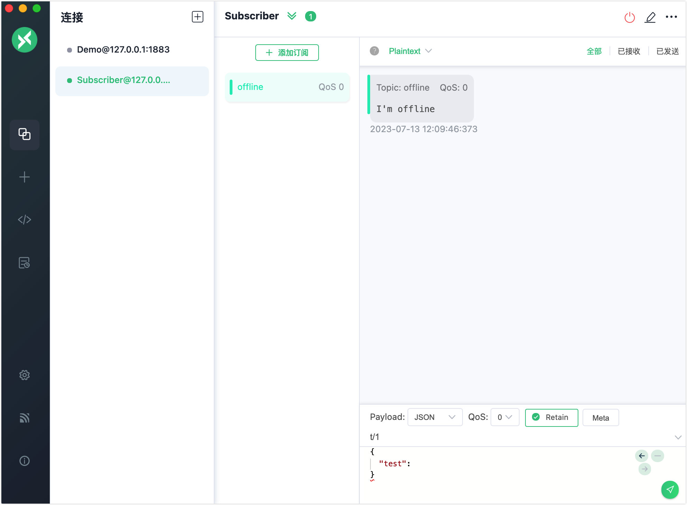

# 遗嘱消息

EMQX 实现了 MQTT 的遗嘱消息功能。如果为客户端设置了遗嘱消息，在客户端意外断开连接时，EMQX 将把遗嘱消息发送给相关的订阅者，以便订阅者可以得知并更新客户端状态。

您可以使用客户端工具在 EMQX 中尝试此消息服务。本节介绍了如何使用 [MQTTX 客户端](https://mqttx.app/zh)和 [MQTTX CLI](https://mqttx.app/zh/cli) 来模拟客户端尝试遗嘱消息的发布和接收。

:::tip 前置准备

- 了解 MQTT 的[遗嘱消息](./mqtt-concepts.md#遗嘱消息)。
- 能使用 [MQTTX](./publish-and-subscribe.md) 进行基本的发布和订阅操作。

:::

## 使用 MQTTX 客户端发布遗嘱消息

1. 启动 EMQX 和 MQTTX 客户端。点击**新建连接**创建一个名为 `Demo` 的客户端连接作为发布者。

   - 在**名称**栏中输入`Demo`。
   - 在本演示中，**服务器地址**使用本地主机 `127.0.0.1`作为示例。

   ::: tip

   [MQTTX 客户端](./publish-and-subscribe.md/#mqttx-客户端)中介绍了更多详细的连接创建信息。

   :::

   

   将页面下拉，在 **Last Will and Testament** 部分，填写遗嘱消息的配置。

   - **Last-Will Topic**：输入 `offline`。
   - **Last-Will QoS**：保持默认值 `0`。
   - **Last-Will Retain**：默认禁用。如果启用，遗嘱消息也将是一个保留消息。
   - **Last-Will Payload**：输入 `I'm offline`。
   - **Will Delay Intervals (s)**：设置为 `5` 秒。

   其他设置保持默认。点击**连接**按钮。

   

2. 在**连接**窗格点击**+** -> **新建连接**，新建一个客户端连接。将**名称**设置为 `Subscriber`，**服务器地址**为 `127.0.0.1`，其他连接信息均保留默认值，点击**连接**。

3. 在 **Subscriber** 窗格中，点击 **添加订阅**。在 **Topic** 文本框中输入 `offline`。其他设置保持默认，点击**确定**。

   

4. 在**连接**窗格中选择客户端 `Demo`。右键点击并选择**新建窗口**。在新窗口中，点击**连接**。

   

5. 关闭新窗口并等待 5 秒钟。客户端 `Subscriber` 将接收到遗嘱消息 `I'm offline`。

   

## 使用 MQTTX CLI 发布遗嘱消息

1. 使用一个客户端发起连接请求。将主题设置为 `t/1`，payload 设置为 `A will message from MQTTX CLI`：

   ```bash
   $ mqttx conn -h 'localhost' -p 1883 --will-topic 't/1' --will-message 'A will message from MQTTX CLI'
   Connected
   ```

2. 使用另一个客户端订阅主题 `t/1`，以接收遗嘱消息：

   ```bash
   mqttx sub -t 't/1' -h 'localhost' -p 1883 -v
   ```

3. 断开步骤 1 中指定的客户端连接，然后步骤 2 中指定的客户端将接收到遗嘱消息：

   ```bash
   topic:  t/1
   payload:  A will message from MQTTX CLI
   ```


