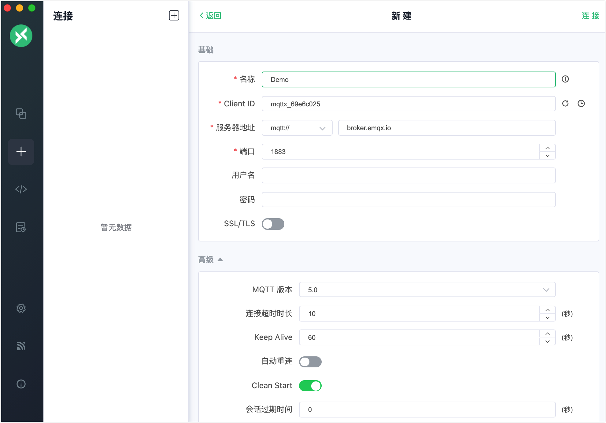
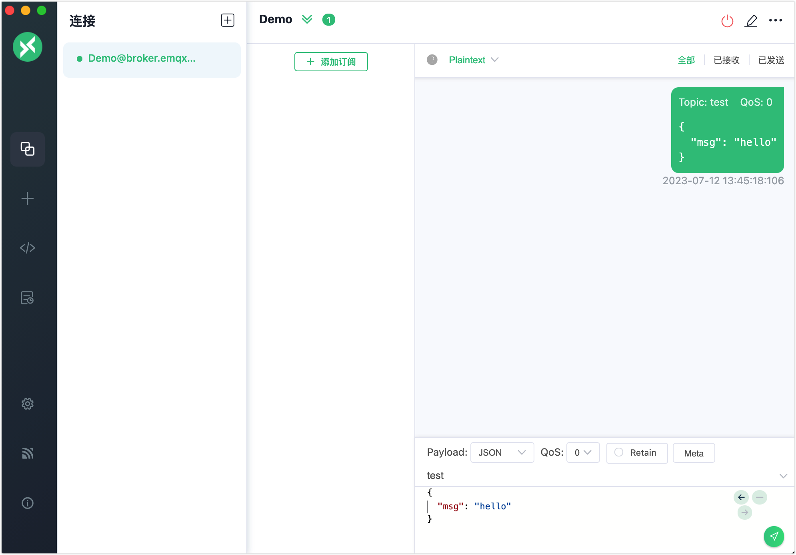
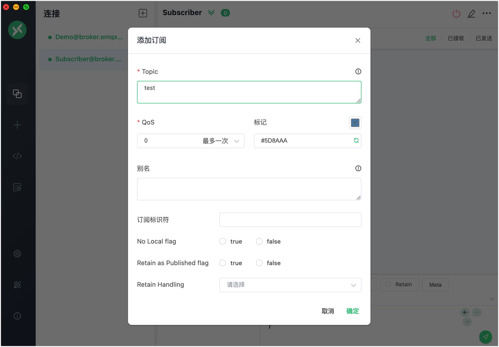
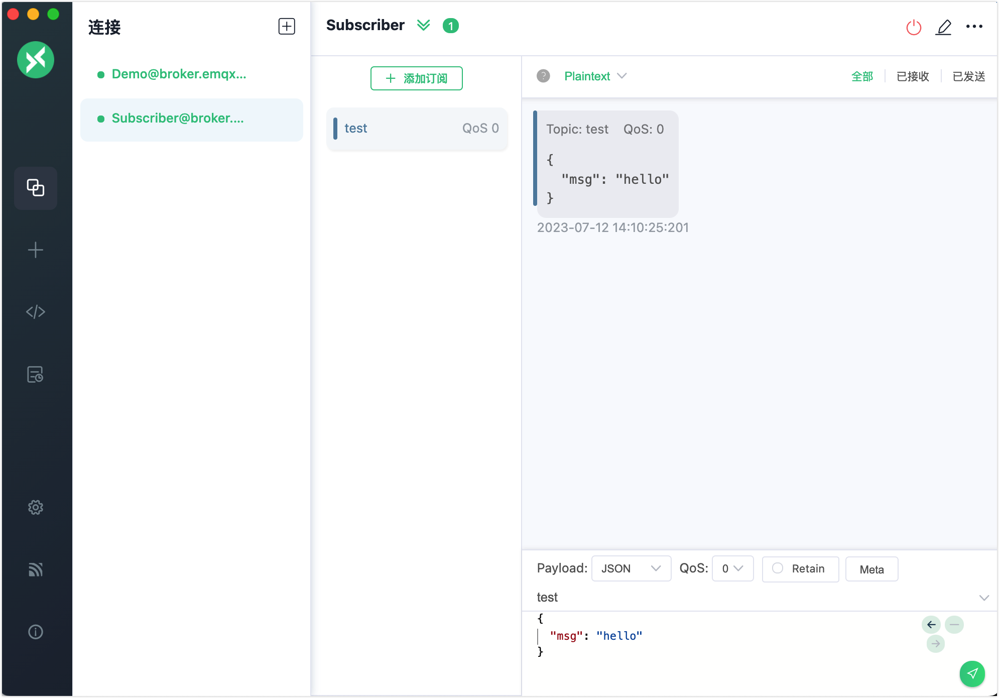
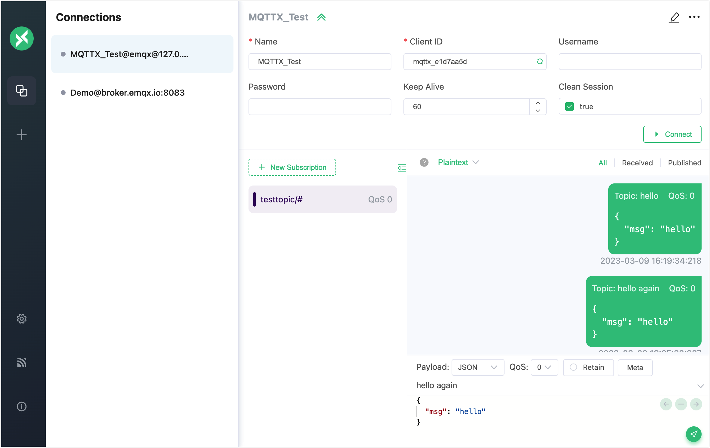
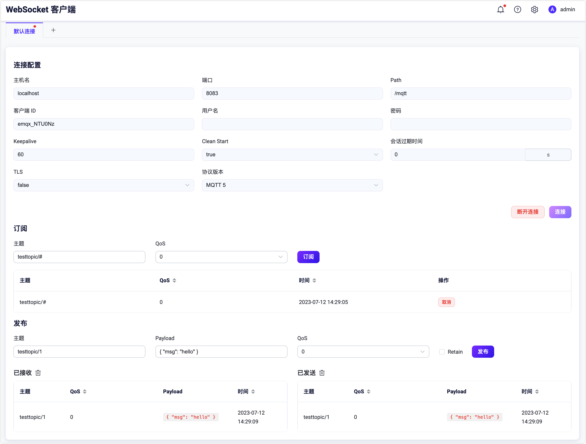

# MQTT 客户端工具演示

对物联网开发人员来说，在将实时设备连接到 EMQX 、开发物联网应用程序之前，先使用客户端工具测试 EMQX 消息服务是一种更加安全和高效的方式。

即使在本地部署 EMQX 之前，您也可以利用 [EMQ](https://www.emqx.com/) 提供的免费在线公共 [MQTT 服务器](https://www.emqx.com/zh/mqtt/public-mqtt5-broker) 和 MQTT 客户端工具作为验证工具，快速测试MQTT 消息服务和应用程序开发。


本节介绍了常用的 MQTT 5.0 客户端工具，并提供了一个简单的演示，介绍如何使用这些工具来测试以下消息服务：

- 建立客户端连接
- 订阅主题
- 发布消息
- 接收和查看消息

## MQTTX

[MQTTX](https://mqttx.app/zh) 是 EMQ 开源的一款跨平台 MQTT 5.0 客户端工具，它支持 macOS, Linux, Windows，并且支持自定义脚本模拟测试、MQTT 消息格式转换、日志记录等多个功能。MQTTX 包含三种类型的工具：

- MQTTX 客户端
- MQTTX 命令行工具
- MQTT Web

### MQTTX 客户端

MQTTX 客户端是一款跨平台的 MQTT 桌面客户端工具。它提供用户友好的图形界面，让用户可以快速创建、测试 MQTT 连接，并进行MQTT 消息的发布和订阅。

在进行测试之前，请按照以下步骤下载并安装 MQTTX 客户端：

1. 前往 [MQTTX 官网](https://mqttx.app/zh)，通过应用商店或直接下载对应操作系统安装包。
1. 安装 MQTTX 客户端。详细操作请参考 [MQTTX - 下载与安装](https://mqttx.app/zh/docs/downloading-and-installation)。

按照以下指南，使用 MQTTX 桌面客户端进行简单测试：

1. 启动 EMQX 和 MQTTX 客户端。点击 **New Connection** 创建一个 MQTT 连接。

2. 配置新建的 MQTT 连接作为消息发送客户端。

   在**基础**部分，填写客户端的一般信息。

   - **名称**: 输入连接的名称。
   - **Client ID**: 保留默认值。这是客户端连接的唯一标识，可以通过点击刷新按钮自动生成。
   - **服务器地址**: 选择要使用的协议。选择 `mqtt://` 或 `ws://`。如果使用 `SSL/TLS` 认证连接，您需要选择 `mqtts://` 或 `wss://`。主机 IP 地址默认设置为 `broker.emqx.io`，表示您将连接到公共服务器。如果您使用私有部署的 EMQX，请替换为实际的IP地址。
   - **端口**: 输入所选协议对应的端口号。
   - **用户名** 和 **密码**: 如果您的 EMQX 启用了用户身份验证，填写用户名和密码，否则留空。
   - **SSL/TLS**: 如果使用 `SSL/TLS` 认证连接，请点击切换按钮启用 SSL/TLS。

   其他设置保持默认值。点击右上角的**连接**按钮。

   

3. 连接成功后，在文本框中输入主题 `test`，并按照截图中的示例编写消息。点击发送按钮。在对话框中会出现一个主题为 `test` 的消息。

   

4. 点击**连接**窗格中的 **+** -> **新建连接**创建另一个新连接作为消息接收客户端。将名称设置为 `Subscriber`，其他连接基础信息与客户端`Demo` 相同。

5. 在**连接**窗格中选择客户端 `Subscriber` 。点击**+ 添加订阅**。

   **Topic**: 在文本框中输入 `test`。

   **QoS**: 保持默认值。

   **标记**: 您可以选择颜色来标记该订阅。

   对于一般的测试，将其他选项保留为空即可。点击**确定**。

   

6. 在**连接**窗格中选择客户端 `Demo`。向主题 `test` 发布一条新消息。您会看到客户端 `Subscriber` 接收到一条新消息。

   

现在您已经尝试了使用 MQTTX 客户端进行基本的发布和订阅操作。有关详细和高级操作，请参考[MQTTX - 消息的发布订阅](https://mqttx.app/zh/docs/get-started#%E6%B6%88%E6%81%AF%E7%9A%84%E5%8F%91%E5%B8%83%E8%AE%A2%E9%98%85)。

### MQTTX CLI

[MQTTX CLI](https://mqttx.app/zh/cli) 是 [EMQ](https://www.emqx.com/zh) 开源的一款 MQTT 5.0 命令行客户端工具，旨在帮助开发者在不需要使用图形化界面的基础上，也能更快的开发和调试 MQTT 服务与应用。

除了跨平台、无依赖、支持完成 MQTT 各项特性之外，MQTTX CLI 还提供了性能测试功能，能够快速测试 MQTT 服务的性能。

以下是使用 MQTTX CLI 完成连接、发布订阅并查看消息全流程：

1. 下载安装 MQTT CLI，此处以 macOS 为例，其他操作系统请参考 [MQTTX CLI 下载与安装](https://mqttx.app/zh/docs/cli/downloading-and-installation)。

   ```bash
   # Homebrew
   brew install emqx/mqttx/mqttx-cli
   
   # Intel Chip
   curl -LO https://www.emqx.com/zh/downloads/MQTTX/v1.9.0/mqttx-cli-macos-x64
   sudo install ./mqttx-cli-macos-x64 /usr/local/bin/mqttx
   
   # Apple Silicon
   curl -LO https://www.emqx.com/zh/downloads/MQTTX/v1.9.0/mqttx-cli-macos-arm64
   sudo install ./mqttx-cli-macos-arm64 /usr/local/bin/mqttx
   ```


2. 打开命令行窗口，执行以下命令连接 EMQX 并订阅 `testtopic/#` 主题：

   ```shell
   mqttx sub -t 'testtopic/#' -q 1 -h 'localhost' -p 1883 'public' -v
   ```

   成功执行后命令行将阻塞等待接收并打印接收到的消息。

   参数说明：

   - `-t`：订阅主题。
   - `-q`：订阅 QoS，默认为 0。
   - `-h`：服务器地址，填写对应监听器的 IP 地址，默认为 `localhost`。
   - `-p`：服务器端口，默认为 `1883`。
   - `-v`：在接收到的 Payload 前显示当前 Topic。

   更多参数请参考 [MQTTX CLI - 订阅](https://mqttx.app/zh/docs/cli/get-started#%E8%AE%A2%E9%98%85)。

3. 打开新的命令行窗口，执行一下命令连接到 EMQX 并发布一条消息到 `testtopic/#` 主题：

   ```bash
   mqttx pub -t 'testtopic/1' -q 1 -h 'localhost' -p 1883 -m 'from MQTTX CLI'
   ```

   成功执行后命令行将完成连接建立、消息发布并断开连接，2 中的命令行窗口将打印如下内容：

   ```bash
   topic:  testtopic/1
   payload:  from MQTTX CLI
   ```

    参数说明：

   - `-t`：订阅主题。
   - `-q`：订阅 QoS，默认为 0。
   - `-h`：服务器地址，填写对应监听器的 IP 地址，默认为 `localhost`。
   - `-p`：服务器端口，默认为 `1883`。
   - `-m`：消息 Payload。

   更多参数请参考 [MQTTX CLI - 发布](https://mqttx.app/zh/docs/cli/get-started#%E5%8F%91%E5%B8%83)。

### MQTTX Web

[MQTTX Web](https://mqttx.app/zh/web) 是一款基于浏览器的 MQTT 5.0 WebSocket 客户端工具。您可以使用它通过 MQTT over WebSocket 来完成开发和调试，无需下载或安装任何工具。使用 MQTTX Web 进行测试操作基本上与使用 [MQTTX 客户端](#mqttx-客户端)相同。



## WebSocket 客户端

[EMQX Dashboard](../dashboard/introduction.md) 包含了一个 WebSocket 客户端工具，旨在于提供一个简易但有效的 MQTT 测试工具，能够通过 MQTT over WebSocket 连接到 EMQX 进行连接、订阅和发布操作。

1. 打开 EMQX Dashboard，在左侧导航目录中点击**问题分析** -> **WebSocket 客户端**。
2. 填入连接配置信息，**主机名**填写对应监听器的 IP 地址，默认为 `localhost`，**端口** `8083`，根据情况填入用户名密码，没有启用访问控制的情况下留空即可。
3. 点击**连接** 按钮即可建立连接。
4. **订阅**功能区主题为要订阅的主题，此处填入 `testtopic/#`，选择对应的 QoS，点击订阅即可为当前连接订阅 `testtopic/#` 主题，下方订阅列表会新增该条订阅记录，在此之后匹配该主题的消息都将转发到当前连接，并记录到下方 **已接收** 列表中。
5. **发布**功能区主题为要发布的主题（注意发布主题不能包含 +、# 通配符），此处填入 `testtopic/1`，Payload 为要发布的消息内容，选择对应的 QoS 以及 Retain 标志位，点击发布即可通过当前客户端发布一条消息，下方**已发送**列表会新增该条消息发布记录。
6. 消息将经过 EMQX 路由转发到所有订阅者，由于填入的订阅主题与填入的发布主题匹配，因此**已接收**列表将新增一条记录。

至此您已经通过 Dashboard 的 WebSocket 工具完成消息的发布订阅操作。


