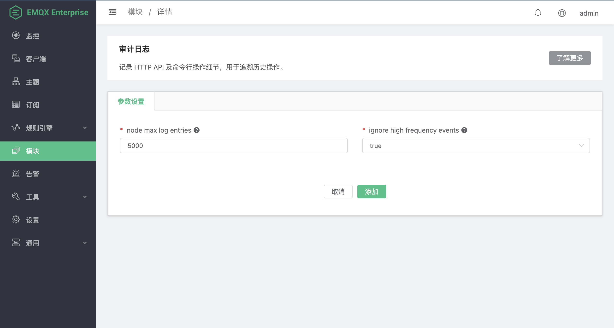

# 审计日志

审计日志功能可以记录对 EMQX 集群的关键操作，以满足企业在合规性和数据安全方面的需求。关于审计日志功能的详细说明，请参考[审计日志](../advanced/audit-log.md)。在 Dashboard 的模块页面，您可以添加审计日志模块并配置审计日志功能。本页介绍了如何在 Dashboard 中添加审计日志模块。

## 添加审计日志模块

1. 在 Dashboard 的左侧导航栏中点击**模块**。

2. 点击页面上的**添加模块**按钮。

3. 选择**内部模块**，找到**审计日志**，点击**选择**。

4. 在模块详情页面上，配置审计日志功能的参数。

   - **单节点储存最大日志条数**：储存的日志条数上限，默认值为 `5000`。一旦存储的日志条数达到预设的上限，将自动删除该节点内最早记录的一条日志，以腾出位置存储新的日志。通过这种方式控制每个节点内日志数量，防止日志占用过多资源影响性能。
   - **忽略上报高频事件**：忽略部分场景下的高频操作，默认值为 `true`。高频事件包括订阅/发布/取消订阅以及踢除指定客户端，这些操作可能通过 REST API 频繁调用，导致审计日志数量过多。启用后，EMQX 将忽略这些高频事件，不记录到审计日志中，以减少日志数量。如果您需要记录这些高频事件，可以将该参数设置为 `false`。

5. 配置完成后点击**添加**。您将看到审计日志模块出现在模块页面上。

   
