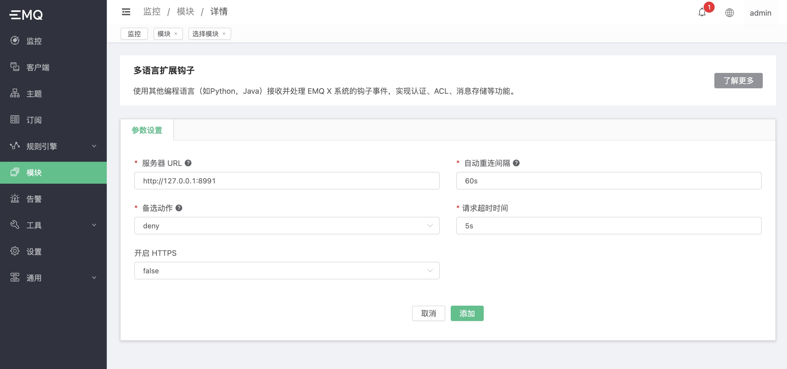

# 多语言扩展 - 钩子

在 EMQ X e4.2.0 中，我们提供了多语言扩展的支持。其中 **多语言扩展钩子** 模块允许使用其他编程语言（例如：Python，Java 等）直接向 EMQ X 系统挂载钩子，以接收并处理 EMQ X 系统的钩子事件，达到扩展和定制 EMQ X 的目的。例如，用户可以使用其他编程语言来自定义：

- 客户端接入的认证授权
- 发布/订阅的 ACL 鉴权
- 消息的持久化，桥接
- 发布/订阅，或者客户端上下线事件的通知处理

## 设计

**多语言扩展钩子**  功能由 `emqx-exhook` 插件提供。它使用 [gRPC](https://www.grpc.io) 作为 RPC 的通信框架。

架构如下图：

```
  EMQ X
+========================+                 +========+==========+
|    ExHook              |                 |        |          |
|   +----------------+   |      gRPC       | gRPC   |  User's  |
|   |   gRPC Client  | ------------------> | Server |  Codes   |
|   +----------------+   |    (HTTP/2)     |        |          |
|                        |                 |        |          |
+========================+                 +========+==========+
```

它表明：EMQ X 中的 ExHook 模块作为一个 gRPC 客户端，将系统中所有的钩子事件发送到用户的 gRPC 服务端。

和 EMQ X 原生的钩子一致，它也支持链式的方式计算和返回：


## 接口设计

作为事件的处理端，即 gRPC 的服务端。它需要用户自定义实现需要挂载的钩子列表，和每个钩子事件到达后如何去处理的回调函数。这些接口在 **多语言扩展钩子** 中被定义为一个名为 `HookProvider`的 gRPC 服务，其需要实现的接口的列表包含：

```
syntax = "proto3";

package emqx.exhook.v1;

service HookProvider {

  rpc OnProviderLoaded(ProviderLoadedRequest) returns (LoadedResponse) {};

  rpc OnProviderUnloaded(ProviderUnloadedRequest) returns (EmptySuccess) {};

  rpc OnClientConnect(ClientConnectRequest) returns (EmptySuccess) {};

  rpc OnClientConnack(ClientConnackRequest) returns (EmptySuccess) {};

  rpc OnClientConnected(ClientConnectedRequest) returns (EmptySuccess) {};

  rpc OnClientDisconnected(ClientDisconnectedRequest) returns (EmptySuccess) {};

  rpc OnClientAuthenticate(ClientAuthenticateRequest) returns (ValuedResponse) {};

  rpc OnClientCheckAcl(ClientCheckAclRequest) returns (ValuedResponse) {};

  rpc OnClientSubscribe(ClientSubscribeRequest) returns (EmptySuccess) {};

  rpc OnClientUnsubscribe(ClientUnsubscribeRequest) returns (EmptySuccess) {};

  rpc OnSessionCreated(SessionCreatedRequest) returns (EmptySuccess) {};

  rpc OnSessionSubscribed(SessionSubscribedRequest) returns (EmptySuccess) {};

  rpc OnSessionUnsubscribed(SessionUnsubscribedRequest) returns (EmptySuccess) {};

  rpc OnSessionResumed(SessionResumedRequest) returns (EmptySuccess) {};

  rpc OnSessionDiscarded(SessionDiscardedRequest) returns (EmptySuccess) {};

  rpc OnSessionTakeovered(SessionTakeoveredRequest) returns (EmptySuccess) {};

  rpc OnSessionTerminated(SessionTerminatedRequest) returns (EmptySuccess) {};

  rpc OnMessagePublish(MessagePublishRequest) returns (ValuedResponse) {};

  rpc OnMessageDelivered(MessageDeliveredRequest) returns (EmptySuccess) {};

  rpc OnMessageDropped(MessageDroppedRequest) returns (EmptySuccess) {};

  rpc OnMessageAcked(MessageAckedRequest) returns (EmptySuccess) {};
}
```

其中 HookProvider 部分：

- `OnProviderLoaded`：定义 HookProvider 如何被加载，返回需要挂载的钩子列表。仅在该列表中的钩子会被回调到 HookProivder 服务。
- `OnProviderUnloaded`：定义 HookProvider 如何被卸载，仅用作通知。

钩子事件部分：

- `OnClient*`，`OnSession*`，`OnMessage*` 为前缀的方法与 [钩子](hooks.md) 的当中的方法一一对应。它们有着相同的调用时机和相似的参数列表。
- 仅 `OnClientAuthenticate`，`OnClientCheckAcl`，`OnMessagePublish` 允许携带返回值到 EMQ X 系统，其它回调则不支持。

其中接口和参数数据结构的详情参考：[exhook.proto](https://github.com/emqx/emqx-exhook/blob/dev/e4.2.0/priv/protos/exhook.proto)


## 开发指南

用户在使用多语言扩展钩子的功能时，需要先实现 `HookProvider` 的 gRPC 服务来接收 ExHook 发送出来的回调事件。

其步骤如下：

1. 拷贝出当前版本的 `lib/emqx_exhook-<x.y.z>/priv/protos/exhook.proto` 文件。
2. 使用对应编程语言的 gRPC 框架，生成 `exhook.proto` 的 gRPC 服务端的代码。
3. 按需实现 exhook.proto 当中定义的接口。

开发完成后，需将该服务部署到与 EMQ X 能够通信的服务器上，并保证端口的开放。

其中各个语言的 gRPC 框架可参考：[grpc-ecosystem/awesome-grpc](https://github.com/grpc-ecosystem/awesome-grpc)


## 创建模块

在成功部署 `HookProvider` 服务后，通过 dashboard 页面可以开启多语言钩子扩展模块，并配置其服务地址即可正常使用。

打开 [EMQ X Dashboard](http://127.0.0.1:18083/#/modules)，点击左侧的 “模块” 选项卡，选择添加：


选择 “多语言扩展钩子”：


配置 `HookProvider` 服务相关参数：



点击添加后，模块添加完成


至此，多语言扩展钩子的配置已经完成。
