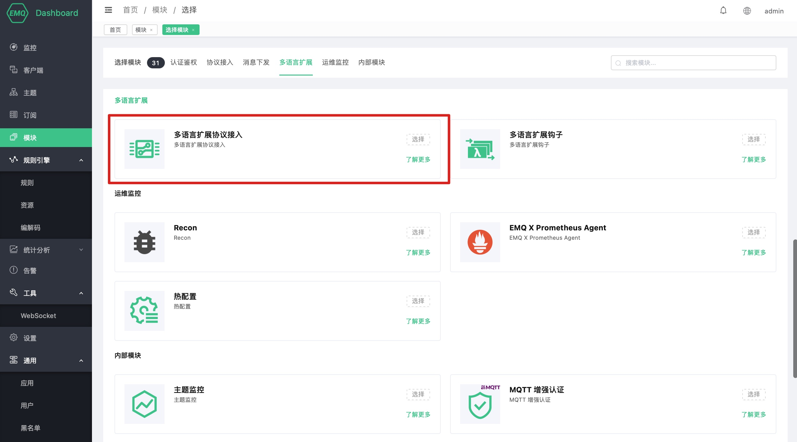
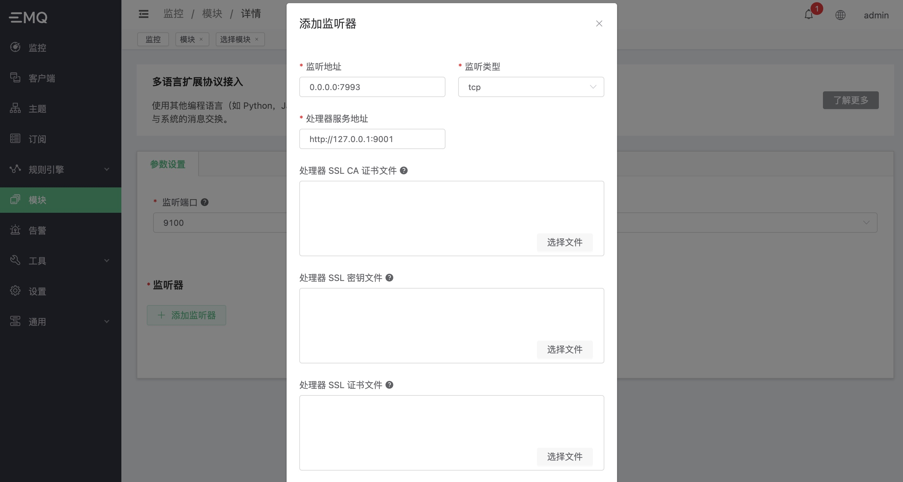
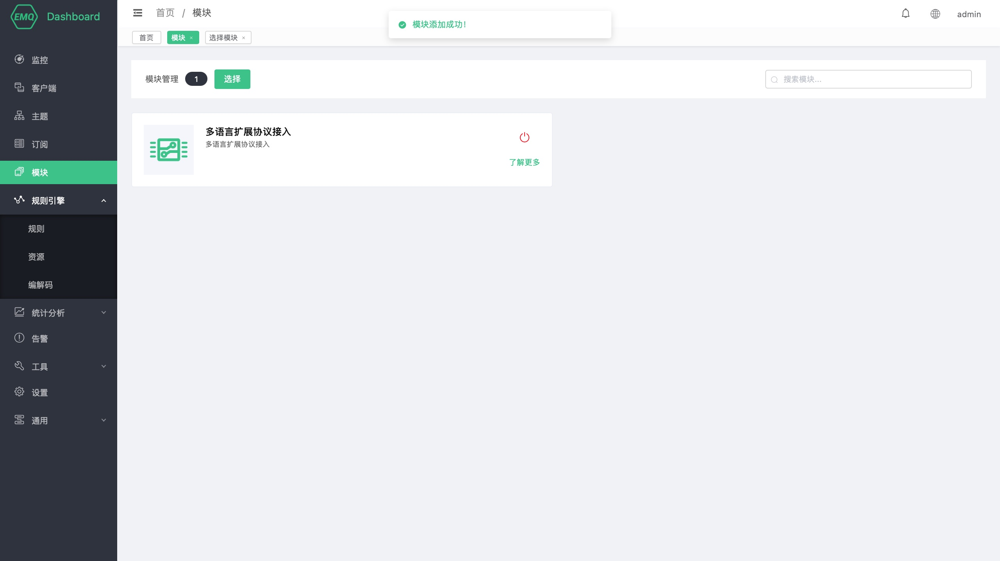

# 多语言扩展 - 协议接入

在 EMQ X e4.2.0 中，我们提供了多语言扩展的支持。其中 **多语言扩展协议接入** 模块允许其他编程语言（例如：Python，Java 等）直接处理字节数据报文实现自定义协议的解析，并提供 Pub/Sub 接口实现与系统的消息交换。

该功能给 EMQ X 带来的扩展性十分的强大，它能以用户熟悉的编程语言处理任何的私有协议，并享受由 EMQ X 系统带来的极高并发连接的优点。

## 特性

- 极强的扩展能力。使用 gRPC 作为 RPC 通信框架，支持各个主流编程语言
- 完全的异步 IO。连接层以完全的异步非阻塞式 I/O 的方式实现
- 连接层透明。完全的支持 TCP\TLS UDP\DTLS 类型的连接管理，并对上层提供统一个 API
- 连接管理能力。例如，最大连接数，连接和吞吐的速率限制，IP 黑名单 等

## 架构


该模块主要需要处理的内容包括：

1. **连接层：** 该部分主要**维持 Socket 的生命周期，和数据的收发**。它的功能要求包括：

    - 监听某个端口。当有新的 TCP/UDP 连接到达后，启动一个连接进程，来维持连接的状态。
    - 调用 `OnSocketCreated` 回调。用于通知外部模块**已新建立了一个连接**。
    - 调用 `OnScoektClosed` 回调。用于通知外部模块连接**已关闭**。
    - 调用 `OnReceivedBytes` 回调。用于通知外部模块**该连接新收到的数据包**。
    - 提供 `Send` 接口。供外部模块调用，**用于发送数据包**。
    - 提供 `Close` 接口。供外部模块调用，**用于主动关闭连接**。

2. **协议/会话层：** 该部分主要**提供 PUB/SUB 接口**，以实现与 EMQ X Broker 系统的消息互通。包括：

    - 提供 `Authenticate` 接口。供外部模块调用，用于向集群注册客户端。
    - 提供 `StartTimer` 接口。供外部模块调用，用于为该连接进程启动心跳等定时器。
    - 提供 `Publish` 接口。供外部模块调用，用于发布消息 EMQ X Broker 中。
    - 提供 `Subscribe` 接口。供外部模块调用，用于订阅某主题，以实现从 EMQ X Broker 中接收某些下行消息。
    - 提供 `Unsubscribe` 接口。供外部模块调用，用于取消订阅某主题。
    - 调用 `OnTimerTimeout` 回调。用于处理定时器超时的事件。
    - 调用 `OnReceivedMessages` 回调。用于接收下行消息（在订阅主题成功后，如果主题上有消息，便会回调该方法）

## 接口设计

从 gRPC 的角度上看，ExProto 会作为客户端向 `ConnectionHandler` 服务发送回调请求。同时，它也会作为服务端向外部模块提供 `ConnectionAdapter` 服务，以提供 各类接口的调用。如图：


详情参见：[exproto.proto](https://github.com/emqx/emqx-exproto/blob/dev/e4.2.0/priv/protos/exproto.proto)，例如接口的定义有：

```bash
syntax = "proto3";

package emqx.exproto.v1;

// The Broker side serivce. It provides a set of APIs to
// handle a protcol access
service ConnectionAdapter {

  // -- socket layer

  rpc Send(SendBytesRequest) returns (CodeResponse) {};

  rpc Close(CloseSocketRequest) returns (CodeResponse) {};

  // -- protocol layer

  rpc Authenticate(AuthenticateRequest) returns (CodeResponse) {};

  rpc StartTimer(TimerRequest) returns (CodeResponse) {};

  // -- pub/sub layer

  rpc Publish(PublishRequest) returns (CodeResponse) {};

  rpc Subscribe(SubscribeRequest) returns (CodeResponse) {};

  rpc Unsubscribe(UnsubscribeRequest) returns (CodeResponse) {};
}

service ConnectionHandler {

  // -- socket layer

  rpc OnSocketCreated(SocketCreatedRequest) returns (EmptySuccess) {};

  rpc OnSocketClosed(SocketClosedRequest) returns (EmptySuccess) {};

  rpc OnReceivedBytes(ReceivedBytesRequest) returns (EmptySuccess) {};

  // -- pub/sub layer

  rpc OnTimerTimeout(TimerTimeoutRequest) returns (EmptySuccess) {};

  rpc OnReceivedMessages(ReceivedMessagesRequest) returns (EmptySuccess) {};
}
```

## 开发指南

在使用该模块之前，用户需要开发和部署一个 gRPC 的服务，并实现 `exproto.proto` 定义的接口。

其步骤如下：

1. 拷贝出当前版本的 `lib/emqx_exproto-<x.y.z>/priv/protos/exproto.proto` 文件。
2. 使用对应编程语言的 gRPC 框架，生成 `exproto.proto` 的 gRPC 服务端的代码。
3. 实现 exproto.proto 当中 `ConnectionHandler` 服务的接口。

开发完成后，需将该服务部署到与 EMQ X 能够通信的服务器上，并保证端口的开放。

其中各个语言的 gRPC 框架可参考：[grpc-ecosystem/awesome-grpc](https://github.com/grpc-ecosystem/awesome-grpc)


## ## 创建模块

成功部署 gRPC 服务后，通过 dashboard 页面可以开启多语言扩展协议接入模块，并配置以下三部分的内容，即可成功使用：

1. ExProto 的 `ConnectionApdapter` 服务的监听地址。用于接收 gRPC 请求。
2. 配置 **监听器(Listener)**，提供 TCP/UDP/SSL/DTLS 的地址监听。用于监听、接收设备的连接。
3. 为每个监听器指定一个 `ConnectionHandler` 的服务地址。用于发送各种事件回调到用户的服务。

打开 [EMQ X Dashboard](http://127.0.0.1:18083/#/modules)，点击左侧的 “模块” 选项卡，选择添加：


选择 “多语言扩展协议接入”：



配置 `ConnectionAdapter` 服务的监听地址，和是否为其开启 SSL 监听：


点击 “添加监听器” 为 ExProto 模块配置监听器，其中包括：

1. 监听器的 `监听地址` 和 `监听类型`，它表明以何种方式接收自定义协议的 Socket 连接。
2. 连接处理服务(ConnectionHandler) 的 `处理器服务地址` 和可能会有的 SSL 证书配置，它表明 ExProto 如何访问 ConnectionHandler 服务。



点击确定，完成监听器添加；在点击添加完成模块的创建：



至此，多语言扩展协议接入的配置已经完成。
