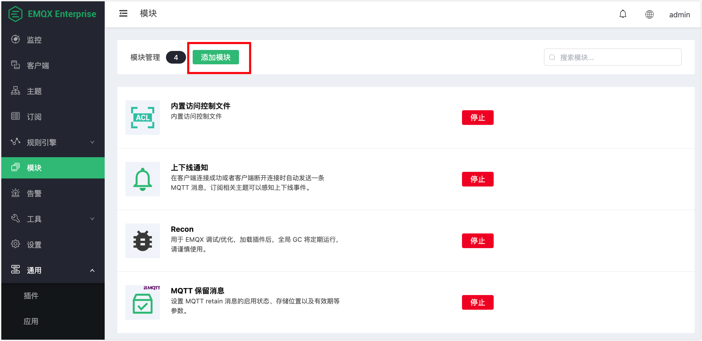

# GB/T 32960 协议网关

## 协议介绍

**emqx-gbt32960** 做为 emqx 的接入网关，按照其功能逻辑和整个系统的关系，将整个消息交换的过程可以分成三个部分：终端侧，平台侧和其它侧：

```
|<-- Terminal -->|<----------- Broker Side ---------->|<---  Others  --->|
|<-    Side    ->|                                    |<--    Side    -->|

+---+                                                   PUB  +-----------+
| D |  INCOMING  +-------------+    PUB     +---------+   -->| subscriber|
| E |----------->|             |----------->|         |--/   +-----------+
| V |            |emqx-gbt32960|            |  EMQX  |
| I |<-----------|             |<-----------|         |<--   +-----------+
| C |  OUTGOING  +-------------+    PUB     +---------+   \--| publisher |
| E |                                                   PUB  +-----------+
+---+
```

1. 终端侧：通过 GB/T 32960 协议进行交换数据，实现不同类型的数据的上报，或者发送下行的消息到终端。
2. 平台侧：emqx-gbt32960 将报文解码后执行 注册/鉴权、或将数据报文 PUBLISH 到特定的主题上；代理订阅下行主题，将下行的 PUBLISH 消息转化为 GB/T 32960 协议的报文结构，下发到终端。
3. 其它侧，可以对 2 中出现的上行的 PUBLISH 消息的主题进行订阅，以接收上行消息。或对发布消息到具体的下行的主题，以发送数据到终端侧。

## 创建模块

打开 [EMQX Dashboard](http://127.0.0.1:18083/#/modules)，点击左侧的 “模块” 选项卡，选择添加：



选择 GB/T 32960 协议接入网关:


配置相关基础参数:


添加监听端口:


配置监听参数:


点击确认到配置参数页面:


点击添加后，模块添加完成:


### 配置参数

| 配置项           | 说明                                |
| ---------------- | ----------------------------------- |
| 允许最大报文长度 | 最大处理的单个GB/T32960协议报文大小 |
| 重传间隔时间     | 消息重传间隔时间                    |
| 最大重传次数     | 最大的消息重传次数                  |
| 消息队列长度     | 最大的消息缓存队列长度              |


约定:
- Payload 采用 Json 格式进行组装
- Json Key 采用大驼峰格式命名

## 数据上报流程
数据流向: Terminal -> emqx_gbt32960 -> EMQX

### 车辆登入
Topic: gbt32960/${vin}/upstream/vlogin

```json
{
    "Cmd": 1,
    "Encrypt": 1,
    "Vin": "1G1BL52P7TR115520",
    "Data": {
        "ICCID": "12345678901234567890",
        "Id": "C",
        "Length": 1,
        "Num": 1,
        "Seq": 1,
        "Time": {
            "Day": 29,
            "Hour": 12,
            "Minute": 19,
            "Month": 12,
            "Second": 20,
            "Year": 12
        }
    }
}
```
### 车辆登出
Topic: gbt32960/${vin}/upstream/vlogout

```json
{
    "Cmd": 4,
    "Encrypt": 1,
    "Vin": "1G1BL52P7TR115520",
    "Data": {
        "Seq": 1,
        "Time": {
            "Day": 1,
            "Hour": 2,
            "Minute": 59,
            "Month": 1,
            "Second": 0,
            "Year": 16
        }
    }
}
```

### 信息上报
Topic: gbt32960/${vin}/upstream/info

> 不同信息类型上报，格式上只有 Infos 里面的对象属性不同，通过 `Type` 进行区分
> Infos 为数组，代表车载终端每次报文可以上报多个信息

#### 整车数据
```json
{
    "Cmd": 2,
    "Encrypt": 1,
    "Vin": "1G1BL52P7TR115520",
    "Data": {
        "Infos": [
            {
                "AcceleratorPedal": 90,
                "BrakePedal": 0,
                "Charging": 1,
                "Current": 15000,
                "DC": 1,
                "Gear": 5,
                "Mileage": 999999,
                "Mode": 1,
                "Resistance": 6000,
                "SOC": 50,
                "Speed": 2000,
                "Status": 1,
                "Type": "Vehicle",
                "Voltage": 5000
            }
        ],
        "Time": {
            "Day": 1,
            "Hour": 2,
            "Minute": 59,
            "Month": 1,
            "Second": 0,
            "Year": 16
        }
    }
}
```

#### 驱动电机数据
```json
{
    "Cmd": 2,
    "Encrypt": 1,
    "Vin": "1G1BL52P7TR115520",
    "Data": {
        "Infos": [
            {
                "Motors": [
                    {
                        "CtrlTemp": 125,
                        "DCBusCurrent": 31203,
                        "InputVoltage": 30012,
                        "MotorTemp": 125,
                        "No": 1,
                        "Rotating": 30000,
                        "Status": 1,
                        "Torque": 25000
                    },
                    {
                        "CtrlTemp": 125,
                        "DCBusCurrent": 30200,
                        "InputVoltage": 32000,
                        "MotorTemp": 145,
                        "No": 2,
                        "Rotating": 30200,
                        "Status": 1,
                        "Torque": 25300
                    }
                ],
                "Number": 2,
                "Type": "DriveMotor"
            }
        ],
        "Time": {
            "Day": 1,
            "Hour": 2,
            "Minute": 59,
            "Month": 1,
            "Second": 0,
            "Year": 16
        }
    }
}
```

#### 燃料电池数据
```json
{
    "Cmd": 2,
    "Encrypt": 1,
    "Vin": "1G1BL52P7TR115520",
    "Data": {
        "Infos": [
            {
                "CellCurrent": 12000,
                "CellVoltage": 10000,
                "DCStatus": 1,
                "FuelConsumption": 45000,
                "H_ConcSensorCode": 11,
                "H_MaxConc": 35000,
                "H_MaxPress": 500,
                "H_MaxTemp": 12500,
                "H_PressSensorCode": 12,
                "H_TempProbeCode": 10,
                "ProbeNum": 2,
                "ProbeTemps": [120, 121],
                "Type": "FuelCell"
            }
        ],
        "Time": {
            "Day": 1,
            "Hour": 2,
            "Minute": 59,
            "Month": 1,
            "Second": 0,
            "Year": 16
        }
    }
}
```

#### 发动机数据
```json
{
    "Cmd": 2,
    "Encrypt": 1,
    "Vin": "1G1BL52P7TR115520",
    "Data": {
        "Infos": [
            {
                "CrankshaftSpeed": 2000,
                "FuelConsumption": 200,
                "Status": 1,
                "Type": "Engine"
            }
        ],
        "Time": {
            "Day": 1,
            "Hour": 22,
            "Minute": 59,
            "Month": 10,
            "Second": 0,
            "Year": 16
        }
    }
}
```

#### 车辆位置数据
```json
{
    "Cmd": 2,
    "Encrypt": 1,
    "Vin": "1G1BL52P7TR115520",
    "Data": {
        "Infos": [
            {
                "Latitude": 100,
                "Longitude": 10,
                "Status": 0,
                "Type": "Location"
            }
        ],
        "Time": {
            "Day": 1,
            "Hour": 22,
            "Minute": 59,
            "Month": 10,
            "Second": 0,
            "Year": 16
        }
    }
}
```

#### 极值数据
```json
{
    "Cmd": 2,
    "Encrypt": 1,
    "Vin": "1G1BL52P7TR115520",
    "Data": {
        "Infos": [
            {
                "MaxBatteryVoltage": 7500,
                "MaxTemp": 120,
                "MaxTempProbeNo": 12,
                "MaxTempSubsysNo": 14,
                "MaxVoltageBatteryCode": 10,
                "MaxVoltageBatterySubsysNo": 12,
                "MinBatteryVoltage": 2000,
                "MinTemp": 40,
                "MinTempProbeNo": 13,
                "MinTempSubsysNo": 15,
                "MinVoltageBatteryCode": 11,
                "MinVoltageBatterySubsysNo": 13,
                "Type": "Extreme"
            }
        ],
        "Time": {
            "Day": 30,
            "Hour": 12,
            "Minute": 22,
            "Month": 5,
            "Second": 59,
            "Year": 17
        }
    }
}
```

#### 报警数据
```json
{
    "Cmd": 2,
    "Encrypt": 1,
    "Vin": "1G1BL52P7TR115520",
    "Data": {
        "Infos": [
            {
                "FaultChargeableDeviceNum": 1,
                "FaultChargeableDeviceList": ["00C8"],
                "FaultDriveMotorNum": 0,
                "FaultDriveMotorList": [],
                "FaultEngineNum": 1,
                "FaultEngineList": ["006F"],
                "FaultOthersNum": 0,
                "FaultOthersList": [],
                "GeneralAlarmFlag": 3,
                "MaxAlarmLevel": 1,
                "Type": "Alarm"
            }
        ],
        "Time": {
            "Day": 20,
            "Hour": 22,
            "Minute": 23,
            "Month": 12,
            "Second": 59,
            "Year": 17
        }
    }
}
```

#### 可充电储能装置电压数据
```json
{
    "Cmd": 2,
    "Encrypt": 1,
    "Vin": "1G1BL52P7TR115520",
    "Data": {
        "Infos": [
            {
                "Number": 2,
                "SubSystems": [
                    {
                        "CellsTotal": 2,
                        "CellsVoltage": [5000],
                        "ChargeableCurrent": 10000,
                        "ChargeableSubsysNo": 1,
                        "ChargeableVoltage": 5000,
                        "FrameCellsCount": 1,
                        "FrameCellsIndex": 0
                    },
                    {
                        "CellsTotal": 2,
                        "CellsVoltage": [5001],
                        "ChargeableCurrent": 10001,
                        "ChargeableSubsysNo": 2,
                        "ChargeableVoltage": 5001,
                        "FrameCellsCount": 1,
                        "FrameCellsIndex": 1
                    }
                ],
                "Type": "ChargeableVoltage"
            }
        ],
        "Time": {
            "Day": 1,
            "Hour": 22,
            "Minute": 59,
            "Month": 10,
            "Second": 0,
            "Year": 16
        }
    }
}
```

#### 可充电储能装置温度数据
```json
{
    "Cmd": 2,
    "Encrypt": 1,
    "Vin": "1G1BL52P7TR115520",
    "Data": {
        "Infos": [
            {
                "Number": 2,
                "SubSystems": [
                    {
                        "ChargeableSubsysNo": 1,
                        "ProbeNum": 10,
                        "ProbesTemp": [0, 0, 0, 0, 0, 0, 0, 0, 19, 136]
                    },
                    {
                        "ChargeableSubsysNo": 2,
                        "ProbeNum": 1,
                        "ProbesTemp": [100]
                    }
                ],
                "Type": "ChargeableTemp"
            }
        ],
        "Time": {
            "Day": 1,
            "Hour": 22,
            "Minute": 59,
            "Month": 10,
            "Second": 0,
            "Year": 16
        }
    }
}
```
### 数据补发
Topic: gbt32960/${vin}/upstream/reinfo

**数据格式: 略** (与实时数据上报相同)

## 数据下发流程

> 请求数据流向: EMQX -> emqx_gbt32960 -> Terminal

> 应答数据流向: Terminal -> emqx_gbt32960 -> EMQX

下行主题: gbt32960/${vin}/dnstream
上行应答主题: gbt32960/${vin}/upstream/response

### 参数查询

**Req:**
```json
{
    "Action": "Query",
    "Total": 2,
    "Ids": ["0x01", "0x02"]
}
```

**Response:**

```json
{
    "Cmd": 128,
    "Encrypt": 1,
    "Vin": "1G1BL52P7TR115520",
    "Data": {
        "Total": 2,
        "Params": [
            {"0x01": 6000},
            {"0x02": 10}
        ],
        "Time": {
            "Day": 2,
            "Hour": 11,
            "Minute": 12,
            "Month": 2,
            "Second": 12,
            "Year": 17
        }
    }
}
```

### 参数设置
**Req:**
```json
{
    "Action": "Setting",
    "Total": 2,
    "Params": [{"0x01": 5000},
               {"0x02": 200}]
}
```

**Response:**
```json
// fixme? 终端是按照这种方式返回?
{
    "Cmd": 129,
    "Encrypt": 1,
    "Vin": "1G1BL52P7TR115520",
    "Data": {
        "Total": 2,
        "Params": [
            {"0x01": 5000},
            {"0x02": 200}
        ],
        "Time": {
            "Day": 2,
            "Hour": 11,
            "Minute": 12,
            "Month": 2,
            "Second": 12,
            "Year": 17
        }
    }
}
```

### 终端控制
**命令的不同, 参数不同; 无参数时为空**

远程升级:
**Req:**
```json
{
    "Action": "Control",
    "Command": "0x01",
    "Param": {
        "DialingName": "hz203",
        "Username": "user001",
        "Password": "password01",
        "Ip": "192.168.199.1",
        "Port": 8080,
        "ManufacturerId": "BMWA",
        "HardwareVer": "1.0.0",
        "SoftwareVer": "1.0.0",
        "UpgradeUrl": "ftp://emqtt.io/ftp/server",
        "Timeout": 10
    }
}
```

车载终端关机:
```json
{
    "Action": "Control",
    "Command": "0x02"
}
```

...

车载终端报警:
```json
{
    "Action": "Control",
    "Command": "0x06",
    "Param": {"Level": 0, "Message": "alarm message"}
}
```
