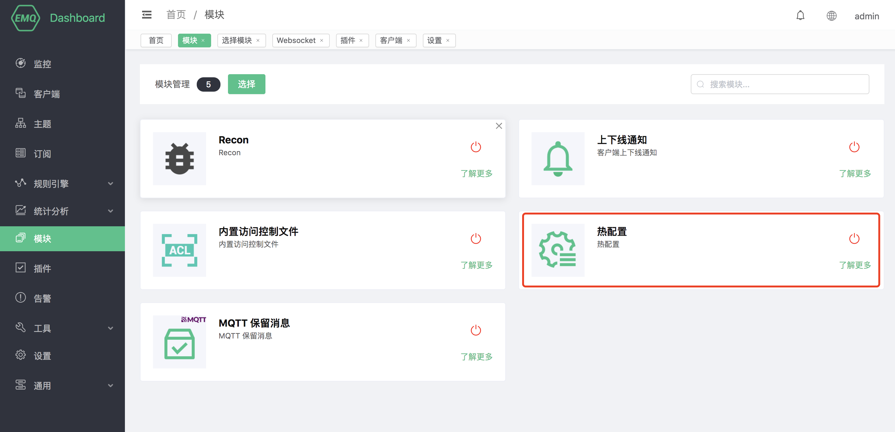
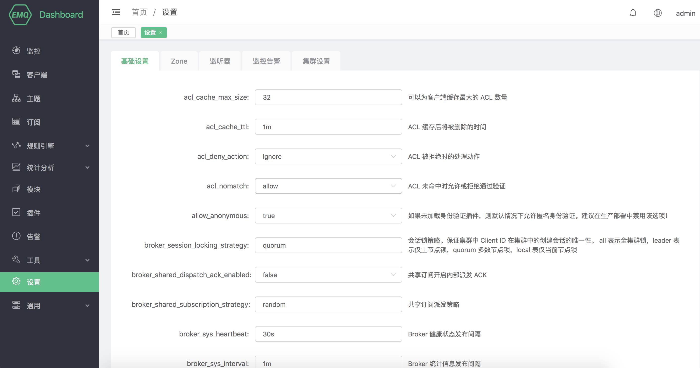

# 热配置

开启热配置后，EMQ X 将从配置文件中拷贝一份配置副本，所有可在 Dashboard 修改的配置都会持久化到磁盘中。
如果修改配置文件将会覆盖热配置，请谨慎使用。

## 创建模块

打开 [EMQ X Dashboard](http://127.0.0.1:18083/#/modules)，点击左侧的 “模块” 选项卡：

选择 热配置模块:

点击选择后，模块添加完成:

emqx提供了较多的配置在dashboard修改，包括基础配置、zones、监听器、监控告警等

