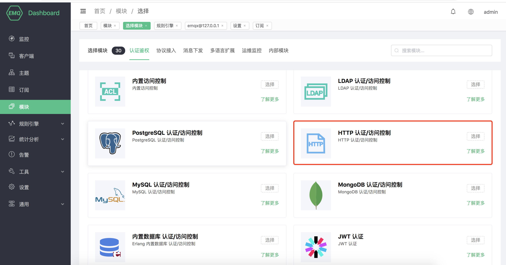
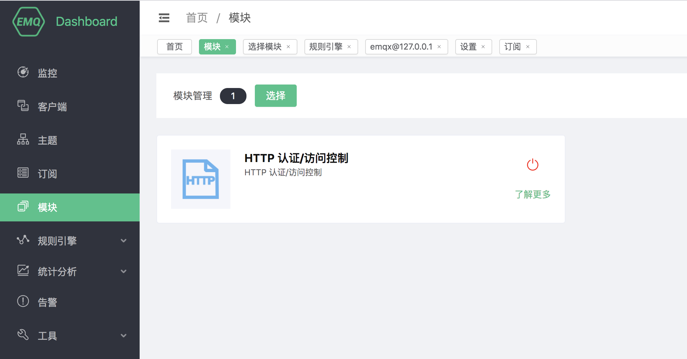

# HTTP 认证/访问控制

HTTP 认证/访问控制使用外部自建 HTTP 应用认证数据源，根据 HTTP API 返回的数据判定认证结果，能够实现复杂的认证鉴权逻辑和实现复杂的 ACL 校验逻辑。

## 创建模块

打开 [EMQ X Dashboard](http://127.0.0.1:18083/#/modules)，点击左侧的 “模块” 选项卡，选择添加：


选择 HTTP 认证/访问控制模块



配置相关参数


点击添加后，模块添加完成




## HTTP 认证原理

EMQ X 在设备连接事件中使用当前客户端相关信息作为参数，向用户自定义的认证服务发起请求查询权限，通过返回的 HTTP **响应状态码** (HTTP statusCode) 来处理认证请求。

 - 认证失败：API 返回 4xx 状态码
 - 认证成功：API 返回 200 状态码
 - 忽略认证：API 返回 200 状态码且消息体 ignore

## 认证请求

进行身份认证时，EMQ X 将使用当前客户端信息填充并发起用户配置的认证查询请求，查询出该客户端在 HTTP 服务器端的认证数据。

```bash

## 认证请求地址
http://127.0.0.1:8991/mqtt/auth

## HTTP 请求方法
## Value: POST | GET
POST

## 请求参数
clientid=%c,username=%u,password=%P
```

HTTP 请求方法为 GET 时，请求参数将以 URL 查询字符串的形式传递；POST 请求则将请求参数以普通表单形式提交（content-type 为 x-www-form-urlencoded）。

你可以在认证请求中使用以下占位符，请求时 EMQ X 将自动填充为客户端信息：

- %u：用户名
- %c：Client ID
- %a：客户端 IP 地址
- %r：客户端接入协议
- %P：明文密码
- %p：客户端端口
- %C：TLS 证书公用名（证书的域名或子域名），仅当 TLS 连接时有效
- %d：TLS 证书 subject，仅当 TLS 连接时有效

::: danger
推荐使用 POST 与 PUT 方法，使用 GET 方法时明文密码可能会随 URL 被记录到传输过程中的服务器日志中。
:::


## HTTP 访问控制原理

EMQ X 在设备发布、订阅事件中使用当前客户端相关信息作为参数，向用户自定义的认证服务发起请求权限，通过返回的 HTTP **响应状态码** (HTTP statusCode) 来处理 ACL 授权请求。

 - 无权限：API 返回 4xx 状态码
 - 授权成功：API 返回 200 状态码
 - 忽略授权：API 返回 200 状态码且消息体为固定内容: "ignore"

## HTTP 请求信息

HTTP API 基础请求信息，配置证书、请求头与重试规则。

进行发布、订阅认证时，EMQ X 将使用当前客户端信息填充并发起用户配置的 ACL 授权查询请求，查询出该客户端在 HTTP 服务器端的授权数据。

## superuser 请求

首先查询客户端是否为超级用户，客户端为超级用户时将跳过 ACL 查询。

```bash
# etc/plugins/emqx_auth_http.conf

## 超级用户请求地址
http://127.0.0.1:8991/mqtt/superuser

## HTTP 请求方法
## Value: POST | GET
POST

## 超级用户请求参数
clientid=%c,username=%u
```

## ACL 访问控制请求

```bash

## 访问控制请求地址
http://127.0.0.1:8991/mqtt/acl

## HTTP 请求方法
## Value: POST | GET
POST

## 访问控制请求参数
access=%A,username=%u,clientid=%c,ipaddr=%a,topic=%t,mountpoint=%m

```

## 请求说明

HTTP 请求方法为 GET 时，请求参数将以 URL 查询字符串的形式传递；POST、PUT 请求则将请求参数以普通表单形式提交（content-type 为 x-www-form-urlencoded）。

你可以在认证请求中使用以下占位符，请求时 EMQ X 将自动填充为客户端信息：

- %A：操作类型，'1' 订阅；'2' 发布
- %u：客户端用户名
- %c：Client ID
- %a：客户端 IP 地址
- %r：客户端接入协议
- %m：Mountpoint
- %t：主题

::: danger
推荐使用 POST 与 PUT 方法，使用 GET 方法时明文密码可能会随 URL 被记录到传输过程中的服务器日志中。
:::