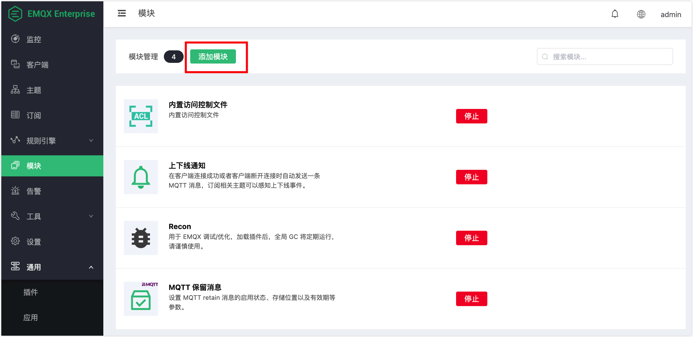
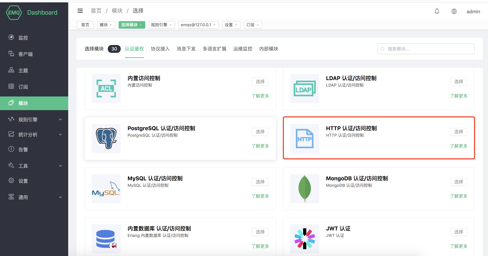
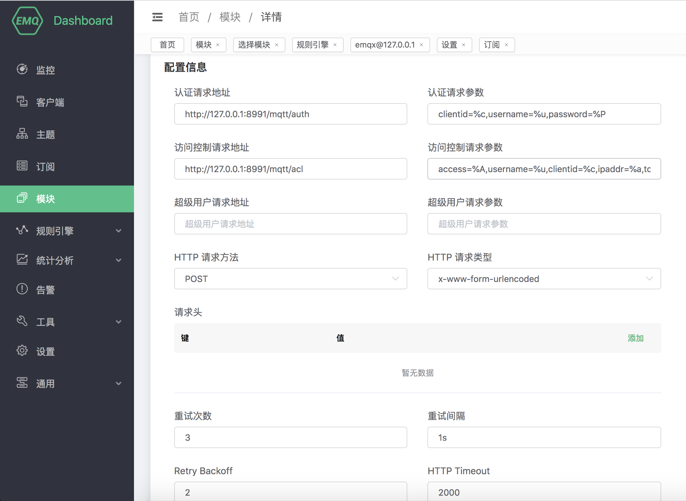
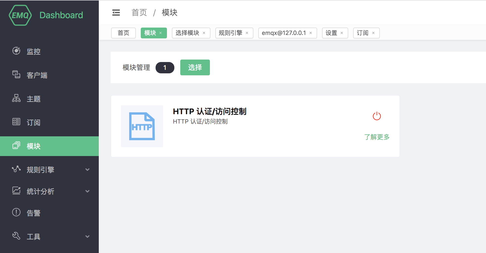

# HTTP 认证/访问控制

HTTP 认证/访问控制功能使用外部自建 HTTP 应用认证数据源，用于客户端的身份认证与权限控制。根据 HTTP API 返回的数据判定认证结果，可实现复杂的认证与访问控制（ACL）校验逻辑。

本文将介绍 EMQX 中 HTTP 认证与访问控制的工作机制，并提供通过 EMQX Dashboard 添加 HTTP AUTH/ACL 模块的操作指南。

## HTTP 认证原理

当客户端尝试连接时，EMQX 会收集相关的客户端信息，并将其作为参数发送至用户配置的 HTTP 认证服务。EMQX 根据认证服务返回的 HTTP 响应状态码判断认证结果：

- **认证失败**：API 返回非 `200` 的状态码
- **认证成功**：API 返回状态码 `200`
- **跳过认证**：API 返回状态码 `200`，且响应体为 `ignore`

这种机制允许将身份验证逻辑下放到外部系统，例如自定义 Web 应用或认证 API 服务。

### 认证请求

为完成客户端认证，EMQX 会向配置的 HTTP 认证接口发送请求，请求中包含客户端连接信息和元数据信息。请求参数会由 EMQX 自动填充为当前连接客户端的实际数据。

**配置示例：**

```bash
## 认证请求地址
http://127.0.0.1:8991/mqtt/auth

## HTTP 请求方法
## 可选值：POST | GET
POST

## 请求参数
clientid=%c,username=%u,password=%P
```

- 当使用 **GET** 方法时，参数将作为查询字符串附加在 URL 上；
- 当使用 **POST**（或 **PUT**）方法时，参数将通过请求体以 `application/x-www-form-urlencoded` 格式发送。

## HTTP 访问控制原理

当已连接的客户端尝试发布或订阅某个主题时，EMQX 会使用客户端连接相关的信息作为参数，向用户自定义的 ACL 服务发起 HTTP 请求，以判断是否允许该操作。

EMQX 根据访问控制服务返回的 HTTP 响应状态码及响应体内容来决定授权结果：

- **无权限**：API 返回非 `200` 的状态码
- **授权成功**：API 返回状态码 `200`
- **忽略授权**：API 返回状态码 `200` 且响应体为 `ignore`

这种机制允许将发布/订阅权限控制委托给外部权限管理系统。

### 超级用户请求

在执行 ACL 校验之前，EMQX 可先判断客户端是否为超级用户。

如果配置了超级用户请求地址，EMQX 会向该地址发送请求，判断客户端是否具备超级用户权限。若返回结果为超级用户，则跳过后续的权限校验，直接授予全部权限。

**配置示例：**

```bash
# etc/plugins/emqx_auth_http.conf

## 超级用户请求地址
http://127.0.0.1:8991/mqtt/superuser

## HTTP 请求方法
## 可选值：POST | GET
POST

## 请求参数
clientid=%c,username=%u
```

### 访问控制请求

若客户端不是超级用户，EMQX 将继续执行 ACL 权限校验，并向配置的访问控制接口发送请求，请求中包含客户端的操作类型及相关元数据。

```bash
## 访问控制请求地址
http://127.0.0.1:8991/mqtt/acl

## HTTP 请求方法
## 可选值：POST | GET
POST

## 请求参数
access=%A,username=%u,clientid=%c,ipaddr=%a,topic=%t,mountpoint=%m
```

- 使用 **GET** 方法时，参数将作为 URL 查询字符串传递；
- 使用 **POST** 方法（推荐）时，参数将以 `application/x-www-form-urlencoded` 格式通过请求体传递。

### 支持的占位符

以下占位符可在认证和访问控制的 HTTP 请求参数中使用。EMQX 会在发起请求时自动将其替换为实际的客户端数据：

| 占位符 | 含义                                        |
| ------ | ------------------------------------------- |
| `%A`   | 操作类型：`1` 表示订阅，`2` 表示发布        |
| `%u`   | 用户名                                      |
| `%P`   | 明文密码                                    |
| `%c`   | Client ID（客户端标识）                     |
| `%a`   | 客户端 IP 地址                              |
| `%p`   | 客户端端口号                                |
| `%r`   | 客户端接入协议（如 MQTT、WebSocket）        |
| `%m`   | Mountpoint（挂载点）                        |
| `%t`   | 主题名（发布/订阅时使用）                   |
| `%C`   | TLS 证书中的通用名称（仅在 TLS 连接时有效） |
| `%d`   | TLS 证书中的 Subject（仅在 TLS 连接时有效） |

::: tip 提示

虽然支持 GET 请求，但推荐使用 **POST** 或 **PUT**，以避免明文密码等敏感信息暴露在 URL 或服务器日志中。

:::

### HTTP 请求配置

除了请求地址和参数外，您还可以自定义 EMQX 在进行认证和授权时发送 HTTP 请求的方式：

- **请求头**：可添加自定义 HTTP 请求头，且请求头值支持占位符（如 `%u`、`%c`、`%a`），EMQX 会在请求前将其替换为实际客户端信息。

  示例：

  - 设置固定 `Host` 请求头：

    > **键**: `Host`
    > **值**: `example.com`

  - 设置自定义 Content-Type：

    > **键**: `content-type`
    >  **值**: `application/json`

  - 传递客户端 ID 到自定义请求头：

    > **键**: `X-Client-ID`
    > **值**: `%c`

- **证书**：可配置客户端 TLS 证书，用于与 HTTPS 认证服务安全通信。

- **重试策略**：可配置当请求超时或失败时的重试行为。

这些配置选项提供了灵活的方式，帮助您安全地将 EMQX 集成到后端认证/授权系统中。

## 通过 Dashboard 添加 HTTP AUTH/ACL 模块

您可以通过 EMQX Dashboard 添加 HTTP AUTH/ACL 模块，启用基于 HTTP 的认证与访问控制功能：

1. 在浏览器中打开 EMQX Dashboard。

2. 在左侧导航栏点击**模块**。

3. 在页面中点击**添加模块**。

   

4. 在模块列表中选择 **HTTP 认证/访问控制**。

   

5. 填写相关配置参数，包括请求地址、请求方法、请求头及所需占位符。

   

6. 点击**添加**保存配置并启用模块。

   

模块启用后，EMQX 将根据您配置的 HTTP 服务处理认证与访问控制请求。
