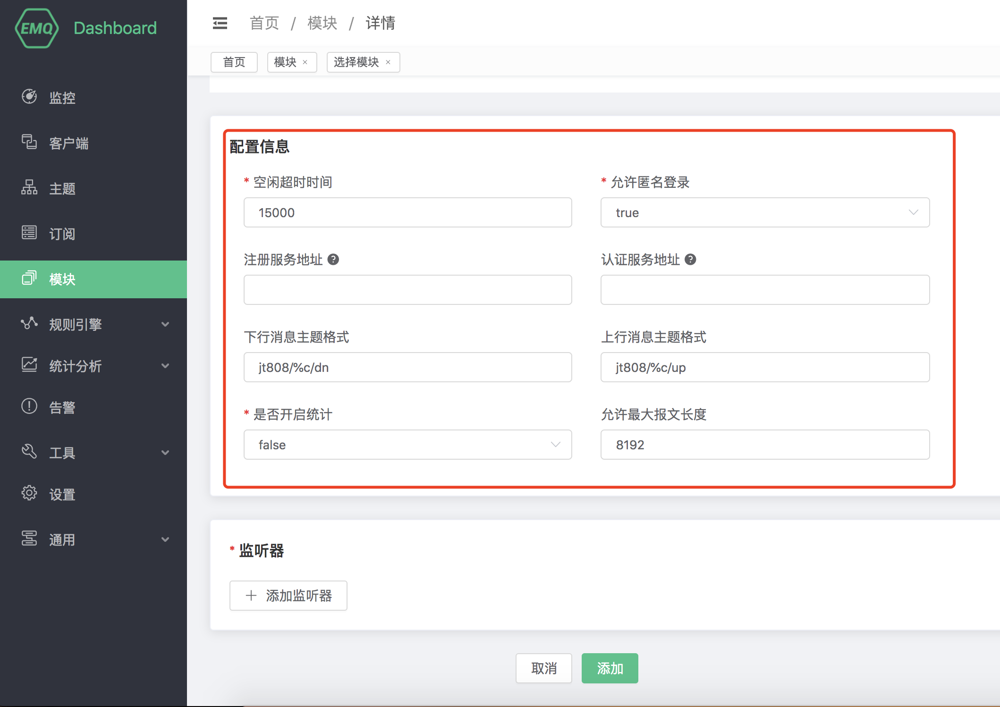
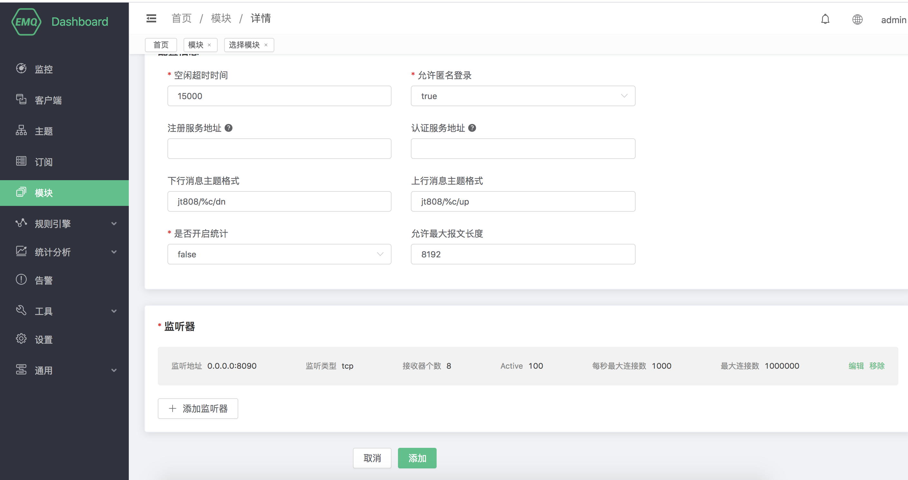

# JT/T808 协议网关

## 协议介绍

**emqx-jt808** 做为 emqx 的接入网关，按照其功能逻辑和整个系统的关系，将整个消息交换的过程可以分成三个部分：终端侧，平台侧和其它侧：

```
|<-- Terminal -->|<---------- Broker Side ---------->|<---  Others  --->|
|<-    Side    ->|                                   |<--    Side    -->|

+---+                                                  PUB  +-----------+
| D |  INCOMING  +------------+    PUB     +---------+   -->| subscriber|
| E |----------->|            |----------->|         |--/   +-----------+
| V |            | emqx-jt808 |            |  EMQ X  |
| I |<-----------|            |<-----------|         |<--   +-----------+
| C |  OUTGOING  +------------+    PUB     +---------+   \--| publisher |
| E |                                                  PUB  +-----------+
+---+
```

1. 终端侧：通过 JT/T 808 协议进行交换数据，实现不同类型的数据的上报，或者发送下行的消息到终端。
2. 平台侧：emqx-jt808 将报文解码后执行 注册/鉴权、或将数据报文 PUBLISH 到特定的主题上；代理订阅下行主题，将下行的 PUBLISH 消息转化为 JT/T 808 协议的报文结构，下发到终端。
3. 其它侧，可以对 2 中出现的上行的 PUBLISH 消息的主题进行订阅，以接收上行消息。或对发布消息到具体的下行的主题，以发送数据到终端侧。

## 创建模块

打开 [EMQ X Dashboard](http://127.0.0.1:18083/#/modules)，点击左侧的 “模块” 选项卡，选择添加：


选择 JT/T808 协议接入网关:


配置相关基础参数:



添加监听端口:


配置监听参数:


点击确认到配置参数页面:



点击添加后，模块添加完成:


**emqx-jt808 实现规定：**

- 系统内以手机号作为一个连接的唯一标识，即 ClientId


### 配置参数

emqx-jt808 的实现支持匿名的方式接入认证：
| 配置项                      |       说明                           |
| --------------------------- | ---------------------------------- |
| 允许匿名登录            | 是否允许匿名用户登录 
| 注册服务地址            | JT/T808 终端注册的 HTTP 接口地址           |
| 认证服务地址            | JT/T808 终端接入鉴权的 HTTP 接口地址           |
| 下行消息主题格式         | 上行主题。上行消息到 EMQ X 系统中的消息主题%c: 接入客户端的 ClientId,%p: 接入客户端的 Phone|
| 上行消息主题格式         | 下行主题。上行消息到 EMQ X 系统中的消息主题%c: 接入客户端的 ClientId,%p: 接入客户端的 Phone|
| 允许最大报文长度         | 最大处理的单个JT/T808协议报文大小|

### 注册及鉴权

注册请求详细格式如下：

**注册请求：**
```
    URL: http://127.0.0.1:8991/jt808/registry
    Method: POST
    Body:
       { "province": 58,
         "city": 59,
         "manufacturer": "Infinity",
         "model": "Q2",
         "license_number": "ZA334455",
         "dev_id": "xx11344",
         "color": 3,
         "phone", "00123456789"
       }
```

**注册应答：**
```
{
  "code": 0,
  "authcode": "132456789"
}

或:

{
  "code": 1
}

其中返回码可以为：

0: 成功
1: 车辆已被注册
2: 数据库中无该车辆
3: 终端已被注册
4: 数据库中无该终端
```

**鉴权请求：**

```properties
    URL: http://127.0.0.1:8991/jt808/auth
    Method: POST
    Body:
       { "code": "authcode",
         "phone", "00123456789"
       }
```

**鉴权应答：**
```
HTTP 状态码 200: 鉴权成功
其他: 鉴权失败
```

注：鉴权请求只会在系统未保存鉴权码时调用（即终端直接发送鉴权报文进行登录系统）

### 数据上下行

emqx-jt808 中通过配置上下行主题来收发终端消息：

#### 上行

例如：**制造商Id** 为 `abcde` 和 **终端Id** 为 `1234567` 的设备。

首先先使用 MQTT 客户端订阅主题 `jt808/abcde1234567/up`：

```properties
$ mosquitto_sub -t jt808/abcde1234567/up
```

例如终端在上报 `数据上行透传(0x0900)` 类型的消息后，订阅端会收到：

```js
{ "body":
    { "data":"MTIzNDU2",
      "type":240
    },
  "header":
     { "encrypt":0,
       "len":7,
       "msg_id":2304,
       "msg_sn":4,
       "phone":"011111111111"
     }
}
```

注：透明传输类，data 域的内容会 base64 编码一次在上报出来

#### 数据下行

同样，以上行的ID为例；在终端鉴权成功后，使用 MQTT 客户端向该终端下发一个 '数据下行透传(0x8900)' 类型的消息：
```
$ mosquitto_pub -t jt808/abcde1234567/dn -m '{"body":{"data":"MTIzNDU2","type":240},"header":{"msg_id":35072}}'
```

注：下行 JSON 中，header 中的内容只需要带 msg_id 即可；body 中的内容根据不同的 msg_id 有不同的结构