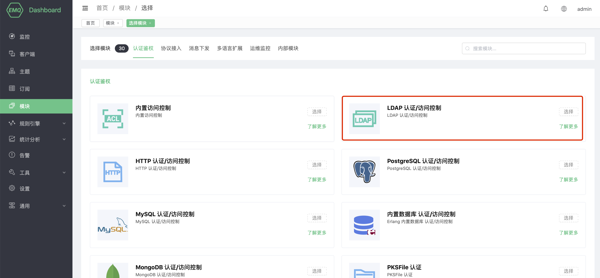

# LDAP 认证/访问控制
LDAP 认证/访问控制使用外部 OpenLDAP 服务器作为认证数据源，可以存储大量数据，同时方便与外部设备管理系统集成。

## 创建模块

打开 [EMQ X Dashboard](http://127.0.0.1:18083/#/modules)，点击左侧的 “模块” 选项卡，选择添加：


选择 LDAP 认证/访问控制模块



配置OpenLDAP相关参数


最后点击“添加”按钮，模块即可添加成功：


## LDAP Schema

需要在 LDAP schema 目录配置数据模型，默认配置下数据模型如下：

**/etc/openldap/schema/emqx.schema**

```bash
attributetype ( 1.3.6.1.4.1.11.2.53.2.2.3.1.2.3.1.3 NAME 'isEnabled'
EQUALITY booleanMatch
SYNTAX 1.3.6.1.4.1.1466.115.121.1.7
SINGLE-VALUE
USAGE userApplications )

attributetype ( 1.3.6.1.4.1.11.2.53.2.2.3.1.2.3.4.1 NAME ( 'mqttPublishTopic' 'mpt' )
EQUALITY caseIgnoreMatch
SUBSTR caseIgnoreSubstringsMatch
SYNTAX 1.3.6.1.4.1.1466.115.121.1.15
USAGE userApplications )
attributetype ( 1.3.6.1.4.1.11.2.53.2.2.3.1.2.3.4.2 NAME ( 'mqttSubscriptionTopic' 'mst' )
EQUALITY caseIgnoreMatch
SUBSTR caseIgnoreSubstringsMatch
SYNTAX 1.3.6.1.4.1.1466.115.121.1.15
USAGE userApplications )
attributetype ( 1.3.6.1.4.1.11.2.53.2.2.3.1.2.3.4.3 NAME ( 'mqttPubSubTopic' 'mpst' )
EQUALITY caseIgnoreMatch
SUBSTR caseIgnoreSubstringsMatch
SYNTAX 1.3.6.1.4.1.1466.115.121.1.15
USAGE userApplications )

objectclass ( 1.3.6.1.4.1.11.2.53.2.2.3.1.2.3.4 NAME 'mqttUser'
AUXILIARY
MAY ( mqttPublishTopic $ mqttSubscriptionTopic $ mqttPubSubTopic) )

objectclass ( 1.3.6.1.4.1.11.2.53.2.2.3.1.2.3.2 NAME 'mqttDevice'
SUP top
STRUCTURAL
MUST ( uid )
MAY ( isEnabled ) )

objectclass ( 1.3.6.1.4.1.11.2.53.2.2.3.1.2.3.3 NAME 'mqttSecurity'
SUP top
AUXILIARY
MAY ( userPassword $ userPKCS12 $ pwdAttribute $ pwdLockout ) )
```

编辑 ldap 的配置文件 slapd.conf 引用 Schema：

**/etc/openldap/slapd.conf**

```bash
include  /etc/openldap/schema/core.schema
include  /etc/openldap/schema/cosine.schema
include  /etc/openldap/schema/inetorgperson.schema
include  /etc/openldap/schema/ppolicy.schema
include  /etc/openldap/schema/emqx.schema

database bdb
suffix "dc=emqx,dc=io"
rootdn "cn=root,dc=emqx,dc=io"
rootpw {SSHA}eoF7NhNrejVYYyGHqnt+MdKNBh4r1w3W

directory       /etc/openldap/data
```

默认配置下示例数据如下：
```
## create emqx.io

dn:dc=emqx,dc=io
objectclass: top
objectclass: dcobject
objectclass: organization
dc:emqx
o:emqx,Inc.

# create testdevice.emqx.io
dn:ou=testdevice,dc=emqx,dc=io
objectClass: top
objectclass:organizationalUnit
ou:testdevice

dn:uid=mqttuser0001,ou=testdevice,dc=emqx,dc=io
objectClass: top
objectClass: mqttUser
objectClass: mqttDevice
objectClass: mqttSecurity
uid: mqttuser0001
isEnabled: TRUE
mqttAccountName: user1
mqttPublishTopic: mqttuser0001/pub/1
mqttSubscriptionTopic: mqttuser0001/sub/1
mqttPubSubTopic: mqttuser0001/pubsub/1
userPassword:: e1NIQX1tbGIzZmF0NDBNS0JUWFVWWndDS21MNzNSLzA9
```

启用 LDAP 认证后，你可以通过用户名： mqttuser0001，密码：public 连接。

## LDAP 访问控制配置方式

`mqttPublishTopic` 允许发布的主题(可以配置多个)

`mqttSubscriptionTopic` 允许订阅的主题(可以配置多个)

`mqttPubSubTopic` 允许订阅/发布的主题(可以配置多个)

::: danger

目前版本仅支持 OpenLDAP，不支持 Microsoft Active Directory。

:::