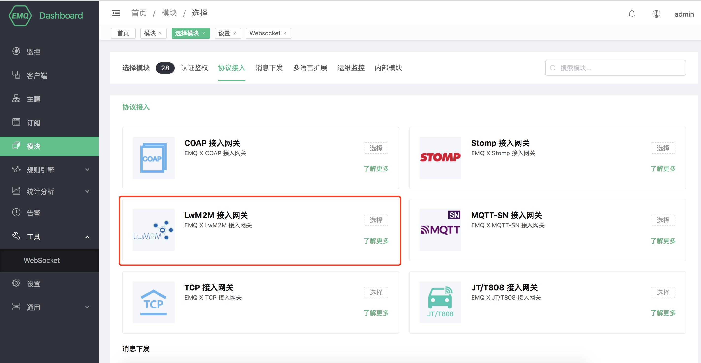

# LwM2M 协议网关

## 协议介绍

LwM2M 全称是 Lightweight Machine-To-Machine，是由 Open Mobile Alliance(OMA)
定义的一套适用于物联网的轻量级协议，它提供了设备管理和通讯的功能，尤其适用于资源有限的终端设备。协议可以在
[这里](http://www.openmobilealliance.org/wp/) 下载。

LwM2M 基于 REST 架构，使用 CoAP 作为底层的传输协议，承载在 UDP 或者 SMS
上，因而报文结构简单小巧，并且在网络资源有限及无法确保设备始终在线的环境里同样适用。

LwM2M 最主要的实体包括 LwM2M Server 和 LwM2M Client。

LwM2M Server 作为服务器，部署在 M2M 服务供应商处或网络服务供应商处。LwM2M 定义了两种服务器

  - 一种是 LwM2M BOOTSTRAP SERVER，emqx-lwm2m 插件并未实现该服务器的功能。
  - 一种是 LwM2M SERVER，emqx-lwm2m 实现该服务器在 UDP 上的功能，SMS 并没有实现。

LwM2M Client 作为客户端，部署在各个 LwM2M 设备上。

在 LwM2M Server 和 LwM2M Client 之间，LwM2M 协议定义了4个接口。

1.  引导接口 Bootstrap：向 LwM2M 客户端提供注册到 LwM2M
    服务器的必要信息，例如服务器访问信息、客户端支持的资源信息等。
2.  客户端注册接口 Client Registration：使 LwM2M 客户端与 LwM2M 服务器互联，将 LwM2M
    客户端的相关信息存储在 LwM2M 服务器上。只有完成注册后，LwM2M
    客户端与服务器端之间的通信与管理才成为可能。
3.  设备管理与服务实现接口 Device Management and Service Enablement：该接口的主控方为 LwM2M
    服务器，服务器向客户端发送指令，客户端对指令做出回应并将回应消息发送给服务器。
4.  信息上报接口 Information Reporting：允许 LwM2M
    服务器端向客户端订阅资源信息，客户端接收订阅后按照约定的模式向服务器端报告自己的资源变化情况。

LwM2M 把设备上的服务抽象为 Object 和 Resource, 在 XML 文件中定义各种 Object 的属性和功能。可以在
[这里](http://www.openmobilealliance.org/wp/OMNA/LwM2M/LwM2MRegistry.html)
找到 XML 的各种定义。

LwM2M 协议预定义了8种 Object 来满足基本的需求，分别是：

  - Security 安全对象
  - Server 服务器对象
  - Access Control 访问控制对象
  - Device 设备对象
  - Connectivity Monitoring 连通性监控对象
  - Firmware 固件对象
  - Location 位置对象
  - Connectivity Statistics 连通性统计对象

## 创建模块

打开 [EMQ X Dashboard](http://127.0.0.1:18083/#/modules)，点击左侧的 “模块” 选项卡，选择添加：


选择 LwM2M 协议接入网关:



配置相关基础参数:


添加监听端口:


配置监听参数:


点击确认到配置参数页面:


点击添加后，模块添加完成:


EMQX-LWM2M 是 EMQ X 服务器的一个网关模块，实现了 LwM2M 的大部分功能。MQTT 客户端可以通过 EMQX-LWM2M
访问支持 LwM2M 的设备。设备也可以往 EMQX-LWM2M 上报 notification，为 EMQ X后端的服务采集数据。

### 配置参数


|   配置项    |         说明                                      |
| -----------| ------------------------------------------------ |
| 最小心跳时间 | 注册/更新允许设置的最小lifetime，以秒为单位 |
| 最大心跳时间 | 注册/更新允许设置的最大lifetime，以秒为单位 |
| QMode 窗口  | QMode时间窗口，指示发送到客户机的下行命令经过多长时间后将被缓存，以秒为单位 |
| 自动 Observe | 注册成功后，是否自动Observe 上报的objectlist |
| 挂载点       | 主题前缀|
| 下行命令主题  | 下行命令主题 %e表示取值endport name|
| 上行应答主题  | 上行应答主题 %e表示取值endport name|
| 注册消息主题  | 注册消息主题 %e表示取值endport name|
| 上行通知主题  | 上行通知主题 %e表示取值endport name|
| 更新消息主题  | 更新消息主题 %e表示取值endport name|
| XML 文件路径 | 存放 XML 文件的目录，这些 XML 用来定义 LwM2M Object            |

### MQTT 和 LwM2M 的转换

从 MQTT 客户端可以发送 Command 给 LwM2M 设备。MQTT 到 LwM2M 的命令使用如下的 topic

```bash
"lwm2m/{?device_end_point_name}/command".
```

其中 MQTT Payload 是一个 json 格式的字符串，指定要发送的命令，更多的细节请参见 emqx-lwm2m 的文档。

LwM2M 设备的回复用如下 topic 传送

```bash
"lwm2m/{?device_end_point_name}/response".
```

MQTT Payload 也是一个 json 格式的字符串，更多的细节请参见 emqx-lwm2m 的文档。