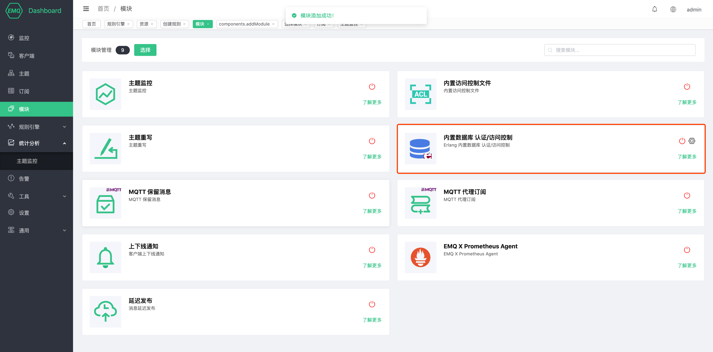

# 内置数据库 认证/访问控制

内置数据库认证使用 EMQ X 内置 Mnesia 数据库存储客户端 Clientid/Username 与密码，支持通过 HTTP API 管理认证数据。

内置数据库认证不依赖外部数据源，使用上足够简单轻量。

## Dashboard 管理

内置数据库认证可以通过 EMQ X Dashboard 的 “模块” 进行开关以及管理

### 创建模块

打开 [EMQ X Dashboard](http://127.0.0.1:18083/#/modules)，点击左侧的 “模块” 选项卡，选择添加：


点击"选择",然后选择内置数据库认证模块


配置相关参数


最后点击“添加”按钮模块即可添加成功。



### 管理数据

内置数据库可以通过 dashboard 管理认证与访问控制数据


#### 认证数据

可以通过 dashboard 对认证数据进行管理


当客户端连接 EMQ X 时，内置数据库认证会获取 CONNENT 报文中的 Clientid 与 Username，然后数据库中记录的密码进行匹配，一旦匹配成功则认证成功。

#### 访问控制数据

可以通过 dashboard 对访问控制数据进行管理


## HTTP API

内置数据库 认证/访问控制 还提供了 HTTP API

### Mnesia 认证

Mnesia 认证使用 EMQ X 内置 Mnesia 数据库存储客户端 Client ID/Username 与密码，支持通过 HTTP API 管理认证数据。

Mnesia 认证不依赖外部数据源，使用上足够简单轻量，Mnesia 支持使用 Client ID 或 Username 进行认证。

#### POST api/v4/auth_clientid

创建基于 Client ID 的认证规则。

**Parameters (json):**

| Name     | Type   | Required | Description |
| -------- | ------ | -------- | ----------- |
| clientid | String | True     | Client ID   |
| password | String | True     | 密码        |

**Success Response Body (JSON):**

| Name | Type    | Description |
| ---- | ------- | ----------- |
| code | Integer | 0           |

**Examples**

```shell
## Request
curl -i \
	--basic \
	-u admin:public \
	-X POST \
	-d '{"clientid": "emqx_c", "password": "emqx_p"}' \
  http://localhost:8081/api/v4/auth_clientid

## Return
{"code":0}
```

#### POST api/v4/auth_username

创建基于 Username 的认证规则。

**Parameters (json):**

| Name     | Type   | Required | Description |
| -------- | ------ | -------- | ----------- |
| username | String | True     | Username    |
| password | String | True     | 密码        |

**Success Response Body (JSON):**

| Name | Type    | Description |
| ---- | ------- | ----------- |
| code | Integer | 0           |

**Examples**

```shell
## Request
curl -i \
	--basic \
	-u admin:public \
	-X POST \
	-d '{"username": "emqx_u", "password": "emqx_p"}' \
  http://localhost:8081/api/v4/auth_username

## Return
{"code":0}
```

#### POST api/v4/auth_clientid

批量创建基于 Client ID 的认证规则。

**Path Parameters:** 无

**Parameters (json):**

| Name        | Type   | Required | Description |
| ----------- | ------ | -------- | ----------- |
| [].clientid | String | True     | Client ID   |
| [].password | String | True     | 密码        |

**Success Response Body (JSON):**

| Name | Type    | Description |
| ---- | ------- | ----------- |
| code | Integer | 0           |
| data | Object  |             |

**Examples**

```shell
## Request
curl -i \
	--basic \
	-u admin:public \
	-X POST \
	-d '[{"clientid": "emqx_c_1", "password": "emqx_p"}, {"clientid": "emqx_c_2", "password": "emqx_p"}]' \
  http://localhost:8081/api/v4/auth_clientid

## Return
{
    "data":{
        "emqx_c_2":"ok",
        "emqx_c_1":"ok"
    },
    "code":0
}
```

#### POST api/v4/auth_username

批量创建基于 Username 的认证规则。

**Path Parameters:** 无

**Parameters (json):**

| Name        | Type   | Required | Description |
| ----------- | ------ | -------- | ----------- |
| [].username | String | True     | Username    |
| [].password | String | True     | 密码        |

**Success Response Body (JSON):**

| Name | Type    | Description |
| ---- | ------- | ----------- |
| code | Integer | 0           |
| data | Object  |             |

**Examples**

```shell
## Request
curl -i \
	--basic \
	-u admin:public \
	-X POST \
	-d '[{"username": "emqx_u_1", "password": "emqx_p"}, {"username": "emqx_u_2", "password": "emqx_p"}]' \
  http://localhost:8081/api/v4/auth_username

## Return
{
  "data":{
    "emqx_u_2":"ok",
    "emqx_u_1":"ok"
  },
  "code":0
}
```

#### GET api/v4/auth_clientid

查看已经添加的认证数据。

**Success Response Body (JSON):**

| Name               | Type    | Description |
| ------------------ | ------- | ----------- |
| code               | Integer | 0           |
| meta               | Object  | 规则对象    |
| data               | Object  | 规则对象    |
| - data.[].clinetid | String  | Client ID   |

**Example**

```shell
## Return
$ curl -i \
  --basic \
  -u admin:public \
  -X GET \
  http://localhost:8081/api/v4/auth_clientid

## Request
{
    "meta":{
        "page":1,
        "limit":10,
        "count":3
    },
    "data":[
        {
            "clientid":"emqx_c_1"
        },
        {
            "clientid":"emqx_c_2"
        },
        {
            "clientid":"emqx_c"
        }
    ],
    "code":0
}
```

#### GET api/v4/auth_username

查看已经添加的认证数据。

**Success Response Body (JSON):**

| Name               | Type    | Description |
| ------------------ | ------- | ----------- |
| code               | Integer | 0           |
| meta               | Object  | 规则对象    |
| data               | Object  | 规则对象    |
| - data.[].username | String  | Client ID   |

**Example**

```shell
## Return
curl -i \
  --basic \
  -u admin:public \
  -X GET \
  http://localhost:8081/api/v4/auth_username

## Request
{
    "meta":{
        "page":1,
        "limit":10,
        "count":3
    },
    "data":[
        {
            "username":"emqx_u"
        },
        {
            "username":"emqx_u_2"
        },
        {
            "username":"emqx_u_1"
        }
    ],
    "code":0
}
```

#### GET api/v4/auth_clientid/{clientid}

获取指定的资源的详细信息。

**Path Parameters:**

| Name     | Type   | Required | Description |
| -------- | ------ | -------- | ----------- |
| clientid | String | True     | Client ID   |

**Success Response Body (JSON):**

| Name            | Type    | Description                                              |
| --------------- | ------- | -------------------------------------------------------- |
| code            | Integer | 0                                                        |
| data            | Object  | 规则对象                                                 |
| - data.clientid | String  | Client ID                                                |
| - data.password | String  | 注意此处返回的密码是使用配置文件指定哈希方式加密后的密码 |

#### **Example**

```shell
## Request
curl -i \
  --basic \
  -u admin:public \
  -X GET \
  http://localhost:8081/api/v4/auth_clientid/emqx_c

## Return
{
  "data":{
    "password":"bb7bb456355aaeb55a4eb26ea286314fc360138720cfca2c852d4dfb8cd834",
    "clientid":"emqx_c"
  },
  "code":0
}
```

#### GET api/v4/auth_username/{username}

获取指定的资源的详细信息。

**Path Parameters:**

| Name     | Type   | Required | Description |
| -------- | ------ | -------- | ----------- |
| username | String | True     | Username    |

**Success Response Body (JSON):**

| Name            | Type    | Description                                              |
| --------------- | ------- | -------------------------------------------------------- |
| code            | Integer | 0                                                        |
| data            | Object  | 规则对象                                                  |
| - data.username | String  | Username                                                 |
| - data.password | String  | 注意此处返回的密码是使用配置文件指定哈希方式加密后的密码 |

#### **Example**

```shell
## Request
curl -i \
  --basic \
  -u admin:public \
  -X GET \
  http://localhost:8081/api/v4/auth_username/emqx_u

## Return
{
  "data":{
    "password":"bb7bb456355aaeb55a4eb26ea286314fc360138720cfca2c852d4dfb8cd834",
    "clientid":"emqx_u"
  },
  "code":0
}
```

#### PUT api/v4/auth_clientid/{clientid}

更新已添加的认证数据。

**Parameters (json):**

| Name     | Type   | Required | Description |
| -------- | ------ | -------- | ----------- |
| clientid | String | True     | Client ID   |

**Parameters (json):**

| Name     | Type   | Required | Description |
| -------- | ------ | -------- | ----------- |
| password | String | True     | 密码        |

**Success Response Body (JSON):**

| Name | Type    | Description |
| ---- | ------- | ----------- |
| code | Integer | 0           |

**Examples**

```shell
## Request
curl -i \
	--basic \
	-u admin:public \
	-X PUT \
	-d '{"password": "emqx_new_p"}' \
  http://localhost:8081/api/v4/auth_clientid/emqx_c

## Return
{"code":0}
```

#### PUT api/v4/auth_username/{username}

更新已添加的认证数据。

**Parameters (json):**

| Name     | Type   | Required | Description |
| -------- | ------ | -------- | ----------- |
| username | String | True     | Username    |

**Parameters (json):**

| Name     | Type   | Required | Description |
| -------- | ------ | -------- | ----------- |
| password | String | True     | 密码        |

**Success Response Body (JSON):**

| Name | Type    | Description |
| ---- | ------- | ----------- |
| code | Integer | 0           |

**Examples**

```shell
## Request
curl -i \
	--basic \
	-u admin:public \
	-X PUT \
	-d '{"password": "emqx_new_p"}' \
  http://localhost:8081/api/v4/auth_username/emqx_u

## Return
{"code":0}
```

#### DELETE /api/v4/auth_clientid/{clientid}

删除认证规则。

**Path Parameters:**

| Name     | Type   | Required | Description |
| -------- | ------ | -------- | ----------- |
| clientid | String | True     | Client ID   |

**Parameters:** 无

**Success Response Body (JSON):**

| Name | Type    | Description |
| ---- | ------- | ----------- |
| code | Integer | 0           |

**Examples:**

```shell
## Request
curl -i \
	--basic \
	-u admin:public \
	-X Delete\
  http://localhost:8081/api/v4/auth_clientid/emqx_c

## Return
{"code":0}
```

#### DELETE /api/v4/auth_username/{username}

删除认证规则。

**Path Parameters:**

| Name     | Type   | Required | Description |
| -------- | ------ | -------- | ----------- |
| username | String | True     | Username    |

**Parameters:** 无

**Success Response Body (JSON):**

| Name | Type    | Description |
| ---- | ------- | ----------- |
| code | Integer | 0           |

**Examples:**

```shell
## Request
curl -i \
	--basic \
	-u admin:public \
	-X Delete\
  http://localhost:8081/api/v4/auth_username/emqx_u

## Return
{"code":0}
```

### Mnesia 访问控制

Mnesia ACL 使用 EMQ X 内置的 Mnesia 数据库存储 ACL 规则，可以存储数据、动态管理 ACL，方便与外部设备管理系统集成

#### POST api/v4/acl

添加 ACL 规则。

+ Clientid ACL

  **Parameters (json):**

  | Name     | Type          | Required | Description |
  | -------- | ------        | -------- | ----------- |
  | clientid | String        | True     | Client ID   |
  | topic    | String        | True     | 主题         |
  | action   | sub/pub/subpub| True     | 动作         |
  | access   | allow/deny    | True     | 是否允许      |

  **Success Response Body (JSON):**

  | Name             | Type    | Description |
  | ----             | ------- | ----------- |
  | code             | Integer | 0           |
  | data             | Object  | 规则对象     |
  | - data.clientid  | String  | Clientid    |
  | - data.topic     | String  | 主题         |
  | - data.action    | String  | 动作         |
  | - data.access    | String  | 是否允许      |

  **Examples**

  ```shell
  ## Request
  curl -i \
  --basic \
  -u admin:public \
  -X POST \
  -d '{"clientid":"emqx_c", "topic":"Topic/A", "action":"pub", "access": "allow"}' \
  http://localhost:8081/api/v4/acl

  ## Return
  {
    "data":{
        "topic":"Topic/A",
        "result":"ok",
        "clientid":"emqx_c",
        "action":"pub",
        "access":"allow"
    },
    "code":0
  }
  ```

+ Username ACL

  **Parameters (json):**

  | Name     | Type          | Required | Description |
  | -------- | ------        | -------- | ----------- |
  | username | String        | True     | Username    |
  | topic    | String        | True     | 主题         |
  | action   | sub/pub/subpub| True     | 动作         |
  | access   | allow/deny    | True     | 是否允许      |

  **Success Response Body (JSON):**

  | Name             | Type    | Description |
  | ----             | ------- | ----------- |
  | code             | Integer | 0           |
  | data             | Object  | 规则对象     |
  | - data.username  | String  | Username    |
  | - data.topic     | String  | 主题         |
  | - data.action    | String  | 动作         |
  | - data.access    | String  | 是否允许      |

  **Examples**

  ```shell
  ## Request
  curl -i \
  --basic \
  -u admin:public \
  -X POST \
  -d '{"username":"emqx_u", "topic":"Topic/A", "action":"pub", "access": "allow"}' \
  http://localhost:8081/api/v4/acl

  ## Return
  {
    "data":{
        "topic":"Topic/A",
        "result":"ok",
        "username":"emqx_u",
        "action":"pub",
        "access":"allow"
    },
    "code":0
  }
  ```

+ $all ACL

  **Parameters (json):**

  | Name     | Type          | Required | Description |
  | -------- | ------        | -------- | ----------- |
  | topic    | String        | True     | 主题         |
  | action   | sub/pub/subpub| True     | 动作         |
  | access   | allow/deny    | True     | 是否允许      |

  **Success Response Body (JSON):**

  | name             | type    | description |
  | ----             | ------- | ----------- |
  | code             | integer | 0           |
  | data             | object  | 规则对象     |
  | - data.all       | string  | $all        |
  | - data.topic     | string  | 主题         |
  | - data.action    | string  | 动作         |
  | - data.access    | string  | 是否允许      |

  **Examples**

  ```shell
  ## Request
  curl -i \
  --basic \
  -u admin:public \
  -X POST \
  -d '{"topic":"Topic/A", "action":"pub", "access": "allow"}' \
  http://localhost:8081/api/v4/acl

  ## Return
  {
    "data":{
        "topic":"Topic/A",
        "result":"ok",
        "all":"$all",
        "action":"pub",
        "access":"allow"
    },
    "code":0
  }
  ```

#### POST api/v4/acl

批量添加 ACL 规则。

**Parameters (json):**

| Name         | Type          | Required | Description |
| --------     | ------        | -------- | ----------- |
| [0].clientid | String        | True     | Clientid    |
| [0].topic    | String        | True     | 主题         |
| [0].action   | sub/pub/subpub| True     | 动作         |
| [0].access   | allow/deny    | True     | 是否允许      |
| [1].username | String        | True     | Username    |
| [1].topic    | String        | True     | 主题         |
| [1].action   | sub/pub/subpub| True     | 动作         |
| [1].access   | allow/deny    | True     | 是否允许      |
| [2].topic    | String        | True     | 主题         |
| [2].action   | sub/pub/subpub| True     | 动作         |
| [2].access   | allow/deny    | True     | 是否允许      |

**Success Response Body (JSON):**

| name                 | type    | description |
| ----                 | ------- | ----------- |
| code                 | integer | 0           |
| data                 | object  | 规则对象     |
| - data.[0].clientid  | string  | Client ID   |
| - data.[0].topic     | string  | 主题         |
| - data.[0].action    | string  | 动作         |
| - data.[0].access    | string  | 是否允许      |
| - data.[1].username  | string  | Username     |
| - data.[1].topic     | string  | 主题         |
| - data.[1].action    | string  | 动作         |
| - data.[1].access    | string  | 是否允许      |
| - data.[2].all       | string  | $all         |
| - data.[2].topic     | string  | 主题         |
| - data.[2].action    | string  | 动作         |
| - data.[2].access    | string  | 是否允许      |

**Examples**

```shell
## Request
curl -i \
	--basic \
	-u admin:public \
	-X POST \
	-d '[
        {
          "clientid":"emqx_c_1",
          "topic":"Topic/A",
          "action":"pub",
          "access": "allow"
        },
        {
          "username":"emqx_u_1",
          "topic":"Topic/A",
          "action":"sub",
          "access": "allow"
        },
        {
          "topic":"Topic/+",
          "action":"pubsub",
          "access": "deny"
        }
      ]' \
  http://localhost:8081/api/v4/auth_clientid

## Return
{
  "data": [
    {
      "clientid":"emqx_c_1",
      "topic":"Topic/A",
      "action":"pub",
      "access": "allow",
      "result": "ok"
    },
    {
      "username":"emqx_u_1",
      "topic":"Topic/A",
      "action":"pub",
      "access": "allow"
      "result": "ok"
    },
    {
      "all": "$all",
      "topic":"Topic/+",
      "action":"pubsub",
      "access": "deny"
    },
  ],
  "code": 0
}
```

#### GET api/v4/acl/clinetid

查看已经添加的 ACL 规则

**Success Response Body (JSON):**

| Name                | Type    | Description |
| ----                | ------- | ----------- |
| code                | Integer | 0           |
| data                | Object  | 规则对象     |
| - data.[].clientid  | String  | Clientid    |
| - data.[].topic     | String  | 主题         |
| - data.[].action    | String  | 动作         |
| - data.[].access    | String  | 是否允许      |

**Examples**

```shell
## Request
curl -i \
	--basic \
	-u admin:public \
	-X GET \
  http://localhost:8081/api/v4/acl/clientid

## Return
{
    "meta": {
      "page": 1,
      "limit": 10,
      "count": 1
    },
    "data": [
      {
        "clientid": "emqx_c",
        "topic": "Topic/A",
        "action": "pub",
        "access": "allow"
      },
      {
        "clientid": "emqx_c_1",
        "topic": "Topic/A",
        "action": "pub",
        "access": "allow"
      },
      {
        "clientid": "emqx_c_2",
        "topic": "Topic/A",
        "action": "pub",
        "access": "allow"
      }
    ],
    "code": 0
  }
```

#### GET api/v4/acl/username

查看已经添加的 ACL 规则

**Success Response Body (JSON):**

| Name                | Type    | Description |
| ----                | ------- | ----------- |
| code                | Integer | 0           |
| data                | Object  | 规则对象     |
| - data.[].username  | String  | Username    |
| - data.[].topic     | String  | 主题         |
| - data.[].action    | String  | 动作         |
| - data.[].access    | String  | 是否允许      |

**Examples**

```shell
## Request
curl -i \
	--basic \
	-u admin:public \
	-X GET \
  http://localhost:8081/api/v4/acl/username

## Return
{
    "meta": {
      "page": 1,
      "limit": 10,
      "count": 1
    },
    "data": [
      {
        "clientid": "emqx_u",
        "topic": "Topic/A",
        "action": "pub",
        "access": "allow"
      },
      {
        "clientid": "emqx_u_1",
        "topic": "Topic/A",
        "action": "pub",
        "access": "allow"
      },
      {
        "clientid": "emqx_u_2",
        "topic": "Topic/A",
        "action": "pub",
        "access": "allow"
      }
    ],
    "code": 0
  }
```

#### GET api/v4/acl/$all

查看已经添加的 ACL 规则

**Success Response Body (JSON):**

| Name                | Type    | Description |
| ----                | ------- | ----------- |
| code                | Integer | 0           |
| data                | Object  | 规则对象     |
| - data.[].all       | String  | $all        |
| - data.[].topic     | String  | 主题         |
| - data.[].action    | String  | 动作         |
| - data.[].access    | String  | 是否允许      |

**Examples**

```shell
## Request
curl -i \
	--basic \
	-u admin:public \
	-X GET \
  http://localhost:8081/api/v4/acl/\$all

## Return
{
  "meta": {
    "page": 1,
    "limit": 10,
    "count": 1
  },
  "data": [
    {
      "all": "$all",
      "topic": "Topic/A",
      "action": "pub",
      "access": "allow"
    },
    {
      "all": "$all",
      "topic": "Topic/+",
      "action": "pubsub",
      "access": "deny"
    }
  ],
  "code": 0
}
```

#### GET /api/v4/acl/clientid/{clientid}

查看指定的 ACL 规则。

**Path Parameters:**

| Name     | Type   | Required | Description |
| -------- | ------ | -------- | ----------- |
| clientid | String | True     | ClientID    |

**Parameters:** 无

**Success Response Body (JSON):**

| Name             | Type        | Description |
| ----             | -------     | ----------- |
| code             | Integer     | 0           |
| data             | object      | 规则对象     |
| - data.clientid  | string      | ClientID        |
| - data.topic     | string      | 主题         |
| - data.action    | string      | 动作         |
| - data.access    | string      | 是否允许     |

**Examples:**

```shell
## Request
curl -i \
	--basic \
	-u admin:public \
	-X GET \
  http://localhost:8081/api/v4/acl/clientid/emqx_c

## Return
{
  "data": {
    "topic": "Topic/A",
    "clientid": "emqx_c",
    "allow": true,
    "action": "pub"
  },
  "code": 0
}
```

#### GET /api/v4/acl/username/{username}

查看指定的 ACL 规则。

**Path Parameters:**

| Name     | Type   | Required | Description |
| -------- | ------ | -------- | ----------- |
| usernmae | String | True     | Username    |

**Parameters:** 无

**Success response body (json):**

| name             | type        | description |
| ----             | -------     | ----------- |
| code             | integer     | 0           |
| data             | object      | 规则对象     |
| - data.username  | string      | Username    |
| - data.topic     | string      | 主题         |
| - data.action    | string      | 动作         |
| - data.access    | string      | 是否允许      |

**Examples:**

```shell
## Request
curl -i \
	--basic \
	-u admin:public \
	-X GET \
  http://localhost:8081/api/v4/acl/usernmae/emqx_u

## Return
{
  "data": {
    "topic": "Topic/A",
    "username": "emqx_u",
    "allow": true,
    "action": "pub"
  },
  "code": 0
}
```

#### DELETE /api/v4/acl/clientid/{clientid}/topic/{topic}

删除指定的 ACL 规则。

**Path Parameters:**

| Name     | Type   | Required | Description                  |
| -------- | ------ | -------- | -----------                  |
| clientid | String | True     | ClientID                     |
| topic    | String | True     | 主题，可能需要使用 UrlEncode 编码|

**Parameters:** 无

**Success response body (json):**

| name             | type        | description |
| ----             | -------     | ----------- |
| code             | integer     | 0           |

**Examples:**

```shell
## Request
curl -i \
	--basic \
	-u admin:public \
	-X DELETE \
  http://localhost:8081/api/v4/acl/clientid/emqx_c/topic/Topic%2fA

## Return
{"code": 0}
```

#### DELETE /api/v4/acl/username/{usernmae}/topic/{topic}

删除指定的 ACL 规则。

**Path Parameters:**

| Name     | Type   | Required | Description                  |
| -------- | ------ | -------- | -----------                  |
| username | String | True     | Username                     |
| topic    | String | True     | 主题，可能需要使用 UrlEncode 编码|

**Parameters:** 无

**Success response body (json):**

| name             | type        | description |
| ----             | -------     | ----------- |
| code             | integer     | 0           |

**Examples:**

```shell
## Request
curl -i \
	--basic \
	-u admin:public \
	-X DELETE \
  http://localhost:8081/api/v4/acl/username/emqx_u/topic/Topic%2fA

## Return
{"code": 0}
```

#### DELETE /api/v4/acl/all/$all/topic/{topic}

删除指定的 ACL 规则。

**Path Parameters:**

| Name     | Type   | Required | Description                  |
| -------- | ------ | -------- | -----------                  |
| topic    | String | True     | 主题，可能需要使用 UrlEncode 编码|

**Parameters:** 无

**Success response body (json):**

| name             | type        | description |
| ----             | -------     | ----------- |
| code             | integer     | 0           |

**Examples:**

```shell
## Request
curl -i \
	--basic \
	-u admin:public \
	-X DELETE \
  http://localhost:8081/api/v4/acl/all/\$all/topic/Topic%2fA

## Return
{"code": 0}
```

## CLI

内置数据库 认证/访问控制 还提供了 `./bin/emqx_ctl` 的管理命令行。

### clientid 命令

clientid 命令查询管理内置数据库的 clientid 认证。

| 命令                             | 描述                         |
| --------------------------------| ---------------------------- |
| `clientid list`                 | 列出 clientid 身份验证规则 |
| `clientid add <ClientID> <Password>` | 添加 clientid 身份验证规则 |
| `clientid update <ClientID> <NewPassword>` | 更新 clientid 身份验证规则 |
| `clientid del <ClientID>` | 删除 clientid 身份验证规则 |

#### `clientid list`

列出 clientid 身份验证规则

```bash
$ ./bin/emqx_ctl clientid list
emqx_clientid
```

### `clientid add <ClientID> <Password>`

添加 clientid 身份验证规则

```bash
./bin/emqx_ctl clientid add emqx_clientid password
ok
```

### `clientid update <ClientID> <NewPassword>`

更新 clientid 身份验证规则

```bash
$ ./bin/emqx_ctl clientid update emqx_clientid new_password
ok
```

### `clientid del <ClientID>`

删除 clientid 身份验证规则

```bash
$ ./bin/emqx_ctl clientid del emqx_clientid
ok
```

### user 命令

user 命令查询管理内置数据库的 username 认证。

| 命令                                   | 描述                   |
| -------------------------------------- | ---------------------- |
| `user list`                            | 列出 user 身份验证规则 |
| `user add <Username> <Password>`       | 添加 user 身份验证规则 |
| `user update <Username> <NewPassword>` | 更新 user 身份验证规则 |
| `user del <Username>`                  | 删除 user 身份验证规则 |

#### `user list`

列出 username 身份验证规则

```bash
$ ./bin/emqx_ctl user list
emqx_username
```

### user add <Username> <Password>`

添加 username 身份验证规则

```bash
./bin/emqx_ctl user add emqx_username password
ok
```

### `user update <Username> <NewPassword>`

更新 username 身份验证规则

```bash
$ ./bin/emqx_ctl user update emqx_username new_password
ok
```

### `user del <Username>`

删除 username 身份验证规则

```bash
$ ./bin/emqx_ctl user del emqx_username
ok
```

### acl 命令

user 命令查询管理内置数据库的访问控制。

| 命令                                   | 描述                   |
| -------------------------------------- | ---------------------- |
| `acl list clientid` | 列出 clientid 访问控制规则 |
| `acl list username` | 列出 username 访问控制规则 |
| `acl list _all` | 列出 $all访问控制规则 |
| `acl show clientid <Clientid>` | 查看 clientid 访问控制详情 |
| `acl show username <Username>` | 查看 username 访问控制详情 |
| `acl aad clientid <Clientid> <Topic> <Action> <Access>` | 增加 clientid 访问控制规则 |
| `acl add Username <Username> <Topic> <Action> <Access>` | 增加 username访问控制规则  |
| `acl add _all <Topic> <Action> <Access>` | 增加 $all 访问控制规则 |
| `acl del clientid <Clientid> <Topic>` | 删除 clientid 访问控制规则 |
| `acl del username <Username> <Topic>` | 删除 username 访问控制规则 |
| `acl del _all <Topic>` | 删除 $all 访问控制规则 |

#### `acl list clientid`

列出 clientid 访问控制规则

```bash
$ ./bin/emqx_ctl acl list clientid             
Acl(clientid = <<"emqx_clientid">> topic = <<"Topic/A">> action = pub access = allow)
```

#### `acl list username`

列出 username 访问控制规则

```bash
$ ./bin/emqx_ctl acl list username             
Acl(username = <<"emqx_username">> topic = <<"Topic/A">> action = pub access = allow)
```

#### `acl list _all`

列出 $all 访问控制规则

```bash
$ ./bin/emqx_ctl acl list _all 
Acl($all topic = <<"Topic/A">> action = pub access = allow)
```

#### `acl show clientid <Clientid>`

查看 clientid 访问控制详情

```bash
$ ./bin/emqx_ctl acl show clientid emqx_clientid
Acl(clientid = <<"emqx_clientid">> topic = <<"Topic/A">> action = pub access = allow)
```

#### `acl show username <Username>`

查看 username 访问控制详情

```bash
$ ./bin/emqx_ctl acl show username emqx_username
Acl(username = <<"emqx_username">> topic = <<"Topic/A">> action = pub access = allow)
```

#### `acl aad clientid <Clientid> <Topic> <Action> <Access>`

增加 clientid 访问控制规则

```bash
$ ./bin/emqx_ctl acl add clientid emqx_clientid Topic/A pub allow
ok
```

#### `acl aad username <Username> <Topic> <Action> <Access>`

增加 username 访问控制规则

```bash
$ ./bin/emqx_ctl acl add username emqx_username Topic/A pub allow
ok
```

#### `acl aad _all <Topic> <Action> <Access>`

增加 $all 访问控制规则

```bash
$ ./bin/emqx_ctl acl add _all Topic/A pub allow
ok
```

#### `acl del clientid <Clientid> <Topic>`

删除 clientid 访问控制规则

```bash
$ ./bin/emqx_ctl acl del clientid emqx_clientid Topic/A
ok
```

#### `acl del username <Username> <Topic>`

删除 username 访问控制规则

```bash
$ ./bin/emqx_ctl acl del username emqx_username Topic/A
ok
```

#### `acl del _all <Topic`

删除 $all 访问控制规则

```bash
$ ./bin/emqx_ctl acl del _all Topic/A
ok
```