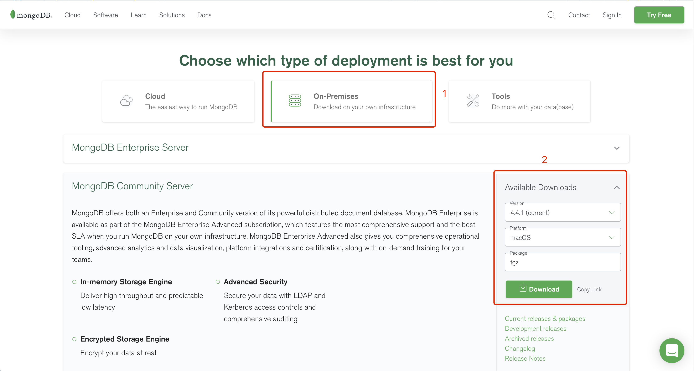
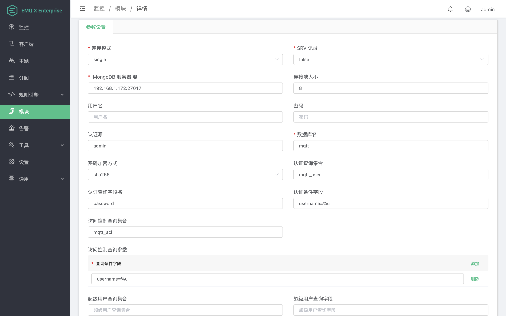

# MongoDB 认证/访问控制

MongoDB 认证/访问控制使⽤外部 MongoBD 数据库作为数据源，可以存储⼤量数据，同时⽅便与外部设备管理系统集成。

## 安装MongoDB

打开MongoDB官网地址:https://www.mongodb.com/try/download/communit, 选择你需要的版本,这里我们用MacOS V4.4.1版本:



安装后启动MongoDB

## 创建模块

打开 [EMQ X Dashboard](http://127.0.0.1:18083/#/modules)，点击左侧的 “模块” 选项卡，选择添加：


选择 MongoDB 认证/访问控制模块


配置 MongoDB 相关参数



点击添加后，模块添加完成:


## 认证集合

```json
{
  username: "user",
  password: "password hash",
  salt: "password salt",
  is_superuser: false,
  created: "2020-02-20 12:12:14"
}
```

进行身份认证时，EMQ X 将使用当前客户端信息填充并执行用户配置的认证 Query，查询出该客户端在数据库中的认证数据。

MongoDB 支持配置集合名称、认证字段、认证占位符等等参数。
| 配置项                         | 说明 |
| ------------------------------ | -------- |
| 认证查询集合         | 认证查询的MongoDB集合 |
| 认证查询字段名 | 需要从集合里面查询出来的字段，如果需要查询多个，使用逗号分隔。例如password,salt |
| 认证条件字段 | 认证查询的条件，如果需要查询多个，使用逗号分隔。例如 username=%u,clientid=%c |

你可以在认证查询占位符中使用以下占位符，执行时 EMQ X 将自动填充为客户端信息：

- %u：用户名
- %c：clientid
- %C：TLS 证书公用名（证书的域名或子域名），仅当 TLS 连接时有效
- %d：TLS 证书 subject，仅当 TLS 连接时有效

你可以根据业务需要调整认证查询，如添加多个查询条件、使用数据库预处理函数，以实现更多业务相关的功能。但是任何情况下认证查询需要满足以下条件：

1. 查询结果中必须包含 password 字段，EMQ X 使用该字段与客户端密码比对
2. 如果启用了加盐配置，查询结果中必须包含 salt 字段，EMQ X 使用该字段作为 salt（盐）值
3. MongoDB 使用 findOne 查询命令，确保你期望的查询结果能够出现在第一条数据中

::: tip

这是默认配置使用的集合结构，熟悉该插件的使用后你可以使用任何满足条件的集合进行认证。

:::

## 访问控制集合

```json
{
    username: "username",
    clientid: "clientid",
    publish: ["topic1", "topic2", ...],
    subscribe: ["subtop1", "subtop2", ...],
    pubsub: ["topic/#", "topic1", ...]
}
```

MongoDB ACL 一条规则中定义了发布、订阅和发布/订阅的信息，在规则中的都是**允许**列表。

规则字段说明：
| 配置项                         | 说明 |
| ------------------------------ | -------- |
| 访问控制查询集合         | 访问控制查询的MongoDB集合 |
| 访问控制查询字段名 | 需要从集合里面查询出来的字段 |
| 访问控制条件字段 | 访问控制查询的条件，支持and 和 or 操作，and操作通过逗号分隔，例如：username=%u,clientid=%c, or 操作需要添加多条数据 |

## 超级用户查询

进行 ACL 鉴权时，EMQ X 将使用当前客户端信息填充并执行用户配置的超级用户查询，查询客户端是否为超级用户。客户端为超级用户时将跳过 ACL 查询。
同一个选择器的多个条件时实际查询中使用 MongoDB and 查询：

```
db.mqtt_user.find({
  "username": "wivwiv"
  "clientid": "$all"
})
```
你可以在查询条件中使用以下占位符，执行时 EMQ X 将自动填充为客户端信息：

- %u：用户名

- %c：clientid

你可以根据业务需要调整超级用户查询，如添加多个查询条件、使用数据库预处理函数，以实现更多业务相关的功能。但是任何情况下超级用户查询需要满足以下条件：
查询结果中必须包含 is_superuser 字段，is_superuser 应该显式的为 true。
MongoDB 支持配置集合名称、认证字段、认证占位符等等参数。
| 配置项                         | 说明 |
| ------------------------------ | -------- |
| 超级用户查询集合         | 超级用户查询的MongoDB集合 |
| 超级用户查询字段名 | 需要从集合里面查询出来的字段 |
| 超级用户条件字段 | 超级用户查询的条件，如果需要查询多个，使用逗号分隔。例如 username=%u,clientid=%c |

::: danger

MongoDB ACL 规则需严格使用上述数据结构。 MongoDB ACL 中添加的所有规则都是 允许 规则，可以搭配 `etc/emqx.conf` 中 `acl_nomatch = deny` 使用。

:::

## 加密规则

```shell
## 不加盐，明文
plain

## 不加盐，仅做哈希处理
sha256

## salt 前缀：使用 sha256 加密 salt + 密码 拼接的字符串
salt,sha256

## salt 后缀：使用 sha256 加密 密码 + salt 拼接的字符串
sha256,salt

## pbkdf2 with macfun iterations dklen
## macfun: md4, md5, ripemd160, sha, sha224, sha256, sha384, sha512
pbkdf2,sha256,1000,20
```

::: tip

可参考:[加盐规则与哈希方法](https://docs.emqx.cn/cn/broker/latest/advanced/auth.html#密码加盐规则与哈希方法)。

:::