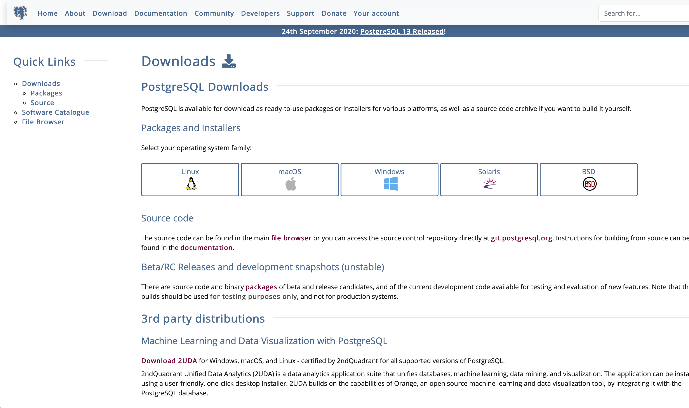
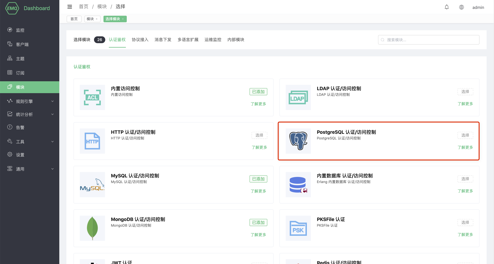
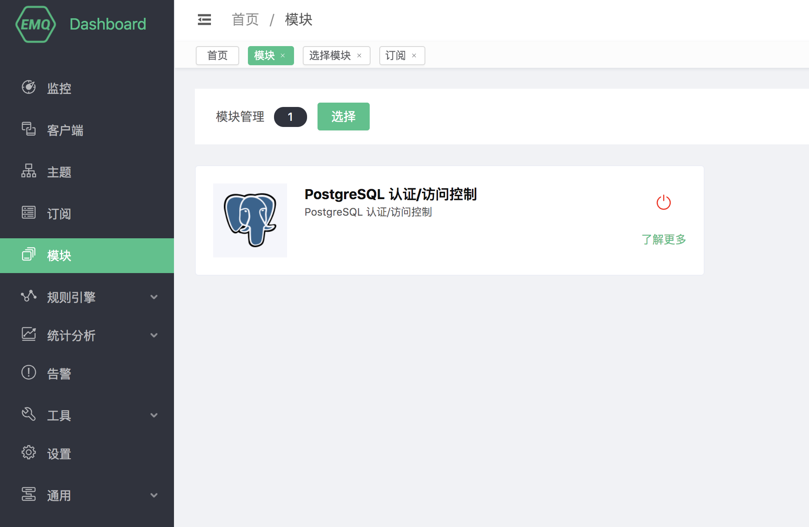

# PostgreSQL 认证/访问控制

PostgreSQL 认证/访问控制使⽤外部 PostgreSQL 数据库作为数据源，可以存储⼤量数据，同时⽅便与外部设备管理系统集成。

## 安装PostgreSQL

打开PostgreSQL官网:https://www.postgresql.org/download/, 选择自己需要的版本，这里我们选择PostgreSQL版本为macos-10.13



安装完毕以后启动PostgreSQL。

## 创建模块

打开 [EMQ X Dashboard](http://127.0.0.1:18083/#/modules)，点击左侧的 “模块” 选项卡，选择添加：


选择PostgreSQL 认证/权限控制模块



需要配置PostgreSQL的地址，用户名，密码（可选）等基本连接参数表


最后点击“添加”按钮，模块即可添加成功



### 认证表：

```sql
CREATE TABLE mqtt_user (
  id SERIAL primary key,
  is_superuser boolean,
  username character varying(100),
  password character varying(100),
  salt character varying(40)
);
```

字段说明:

- username：连接客户端的用户名，此处的值如果设置为 `$all` 表示该规则适用于所有的用户
- password：连接客户端的密码参数
- salt：密码加盐字符串
- is_superuser：是否是超级用户

进行身份认证时，EMQ X 将使用当前客户端信息填充并执行用户配置的认证 SQL，查询出该客户端在数据库中的认证数据。

```sql
select password from mqtt_user where username = '%u' limit 1
```

字段说明

- %u：用户名
- %c：clientid
- %P：明文密码
- %C：TLS 证书公用名（证书的域名或子域名），仅当 TLS 连接时有效
- %d：TLS 证书 subject，仅当 TLS 连接时有效

可以根据业务需要调整认证 SQL，如添加多个查询条件、使用数据库预处理函数，以实现更多业务相关的功能。但是任何情况下认证 SQL 需要满足以下条件：

1. 查询结果中必须包含 password 字段，EMQ X 使用该字段与客户端密码比对
2. 如果启用了加盐配置，查询结果中必须包含 salt 字段，EMQ X 使用该字段作为 salt（盐）值
3. 查询结果只能有一条，多条结果时只取第一条作为有效数据

默认配置下示例数据如下：

```sql
INSERT INTO `mqtt_user` ( `username`, `password`, `salt`)
VALUES
    ('emqx', 'efa1f375d76194fa51a3556a97e641e61685f914d446979da50a551a4333ffd7', NULL);
```

启用 PostgreSQL认证后，你可以通过用户名： emqx，密码：public 连接。

::: tip

可以在 SQL 中使用 AS 语法为字段重命名指定 password，或者将 salt 值设为固定值。

:::

### 访问控制表

```sql
CREATE TABLE mqtt_acl (
  id SERIAL primary key,
  allow integer,
  ipaddr character varying(60),
  username character varying(100),
  clientid character varying(100),
  access  integer,
  topic character varying(100)
);
```

字段说明：

- allow：禁止（0），允许（1）
- ipaddr：设置 IP 地址
- username：连接客户端的用户名，此处的值如果设置为 `$all` 表示该规则适用于所有的用户
- clientid：连接客户端的 clientid
- access：允许的操作：订阅（1），发布（2），订阅发布都可以（3）
- topic：控制的主题，可以使用通配符，并且可以在主题中加入占位符来匹配客户端信息，例如 `t/%c`在匹配时主题将会替换为当前客户端的 clientid

访问控制的原理是从PostgreSQL中查找跟客户端相关的条目，然后进行鉴权，默认的查询SQL如下：

```sql
select allow, ipaddr, username, clientid, access, topic from mqtt_acl where ipaddr = '%a' or username = '%u' or username = '$all' or clientid = '%c'
```

可以在认证 SQL 中使用以下占位符，执行时 EMQ X 将自动填充为客户端信息：

- %u：用户名
- %c：clientid
- %a：客户端 IP 地址
- %P：明文密码
- %C：TLS 证书公用名（证书的域名或子域名），仅当 TLS 连接时有效
- %d：TLS 证书 subject，仅当 TLS 连接时有效

默认配置下示例数据：

```sql
-- 所有用户不可以订阅系统主题
INSERT INTO mqtt_acl (allow, ipaddr, username, clientid, access, topic) VALUES (0, NULL, '$all', NULL, 1, '$SYS/#');

-- 允许 10.59.1.100 上的客户端订阅系统主题
INSERT INTO mqtt_acl (allow, ipaddr, username, clientid, access, topic) VALUES (1, '10.59.1.100', NULL, NULL, 1, '$SYS/#');

-- 禁止客户端订阅 /smarthome/+/temperature 主题
INSERT INTO mqtt_acl (allow, ipaddr, username, clientid, access, topic) VALUES (0, NULL, NULL, NULL, 1, '/smarthome/+/temperature');

-- 允许客户端订阅包含自身 Client ID 的 /smarthome/${clientid}/temperature 主题
INSERT INTO mqtt_acl (allow, ipaddr, username, clientid, access, topic) VALUES (1, NULL, NULL, NULL, 1, '/smarthome/%c/temperature');
```

## 超级用户

超级用户可以订阅和发布任何Topic，默认SQL如下:

```sql
select is_superuser from mqtt_user where username = '%u' limit 1
```

你可以在 SQL 中使用以下占位符，执行时 EMQ X 将自动填充为客户端信息：

- %u：用户名
- %c：clientid
- %C：TLS 证书公用名（证书的域名或子域名），仅当 TLS 连接时有效
- %d：TLS 证书 subject，仅当 TLS 连接时有效

你可以根据业务需要调整超级用户 SQL，如添加多个查询条件、使用数据库预处理函数，以实现更多业务相关的功能。但是任何情况下超级用户 SQL 需要满足以下条件：

1. 查询结果中必须包含 is_superuser 字段，is_superuser 应该显式的为 true
2. 查询结果只能有一条，多条结果时只取第一条作为有效数据

::: tip

如果不需要超级用户功能，注释并禁用该选项能有效提高效率

:::

## 加密规则

```shell
## 不加盐，明文
plain

## 不加盐，仅做哈希处理
sha256

## salt 前缀：使用 sha256 加密 salt + 密码 拼接的字符串
salt,sha256

## salt 后缀：使用 sha256 加密 密码 + salt 拼接的字符串
sha256,salt

## pbkdf2 with macfun iterations dklen
## macfun: md4, md5, ripemd160, sha, sha224, sha256, sha384, sha512
pbkdf2,sha256,1000,20
```

::: tip

可参考:[加盐规则与哈希方法](https://docs.emqx.cn/cn/broker/latest/advanced/auth.html#密码加盐规则与哈希方法)。

:::