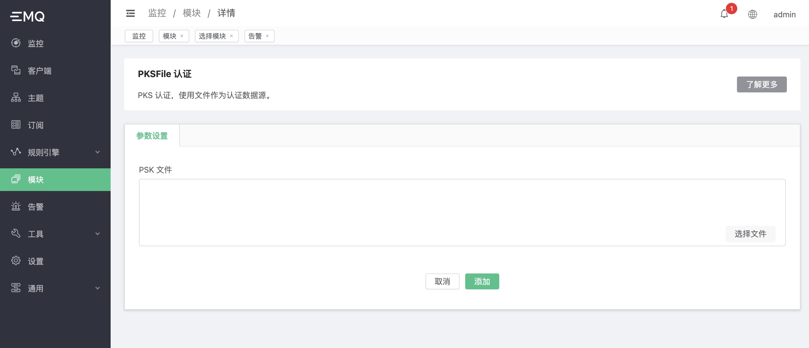

# PSKFile 认证

如果希望使用 PSKFile 认证，需要将 `emqx.conf` 的 `listener.ssl.external.ciphers` 注释掉，然后配置 `listener.ssl.external.psk_ciphers`：

```bash
#listener.ssl.external.ciphers = ECDHE-ECDSA-AES256-GCM-SHA384,...
listener.ssl.external.psk_ciphers = PSK-AES128-CBC-SHA,PSK-AES256-CBC-SHA,PSK-3DES-EDE-CBC-SHA,PSK-RC4-SHA

```

由于 PSK 不支持 `tlsv1.3`，因此需要设置 `tls_versions` 为：
```bash
listener.ssl.external.tls_versions = tlsv1.2,tlsv1.1,tlsv1
```

## 创建模块

打开 [EMQX Dashboard](http://127.0.0.1:18083/#/modules)，点击左侧的 “模块” 选项卡，选择添加：


选择 PSK 认证


配置相关参数



点击添加后，模块添加完成


PSK 的配置文件为 `psk.txt`，使用冒号`:` 分隔 PSK ID 和 PSK：

```bash
client1:1234
client2:abcd
```
