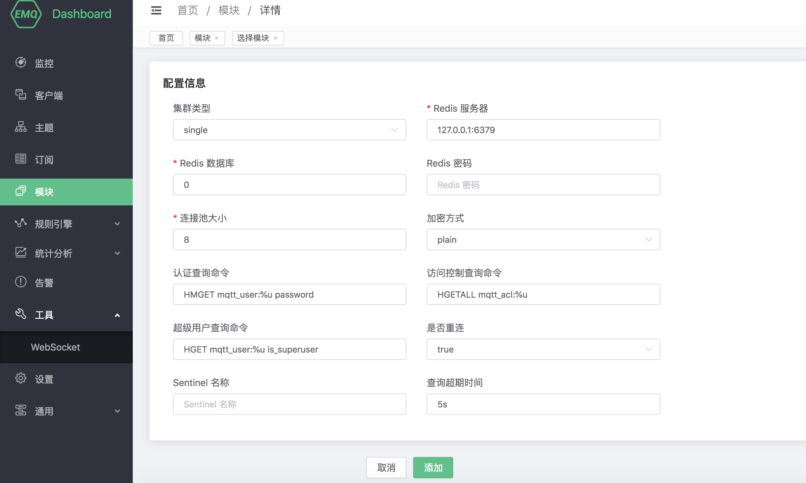
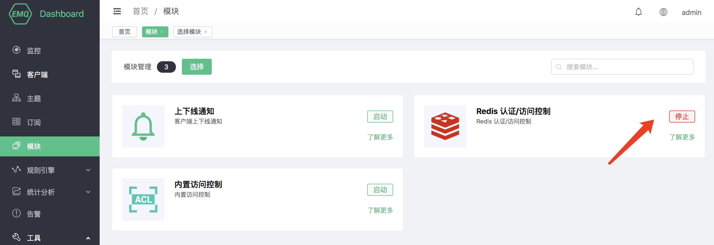

# Redis 认证/访问控制

Redis 认证/访问控制使用外部 Redis 数据库作为数据源，可以存储大量数据，同时方便与外部设备管理系统集成。

搭建 Redis 环境，以 MacOS X 为例:

```bash
 $ wget http://download.redis.io/releases/redis-4.0.14.tar.gz
$ tar xzf redis-4.0.14.tar.gz
$ cd redis-4.0.14
$ make && make install

# 启动 redis
$ redis-server
```

## 创建模块

打开 [EMQ X Dashboard](http://127.0.0.1:18083/#/modules)，点击左侧的 “模块” 选项卡，选择添加：


选择 Redis 认证/访问控制模块


配置相关参数



点击添加后，模块添加完成



## 认证默认数据结构

Redis 认证默认配置下使用哈希表存储认证数据，使用 `mqtt_user:` 作为 Redis 键前缀，数据结构如下：

```
redis> hgetall mqtt_user:emqx
password public
```

默认配置下示例数据如下：

```
HMSET mqtt_user:emqx password public
```

启用 Redis 认证后，你可以通过用户名： emqx，密码：public 连接。

::: tip 

这是默认配置使用的数据结构，熟悉该模块的使用后，你可以使用任何满足条件的数据结构进行认证。

:::

## 加盐规则与哈希方法

```
## 不加盐，明文
plain

## 不加盐，仅做哈希处理
sha256

## salt 前缀：使用 sha256 加密 salt + 密码 拼接的字符串
salt,sha256

## salt 后缀：使用 sha256 加密 密码 + salt 拼接的字符串
sha256,salt

## pbkdf2 with macfun iterations dklen
## macfun: md4, md5, ripemd160, sha, sha224, sha256, sha384, sha512
pbkdf2,sha256,1000,20
```

### 认证查询命令（auth query cmd）

进行身份认证时，EMQ X 将使用当前客户端信息填充并执行用户配置的认证查询命令，查询出该客户端在 Redis 中的认证数据。

```
HMGET mqtt_user:%u password
```

你可以在命令中使用以下占位符，执行时 EMQ X 将自动填充为客户端信息：

- %u：用户名

- %c：Client ID

- %C：TLS 证书公用名（证书的域名或子域名），仅当 TLS 连接时有效

- %d：TLS 证书 subject，仅当 TLS 连接时有效

你可以根据业务需要调整认证查询命令，使用任意 [Redis 支持的命令](http://redisdoc.com/index.html)，但是任何情况下认证查询命令需要满足以下条件：

1. 查询结果中第一个数据必须为 password，EMQ X 使用该字段与客户端密码比对

2. 如果启用了加盐配置，查询结果中第二个数据必须是 salt 字段，EMQ X 使用该字段作为 salt（盐）值

## 访问控制默认数据结构

### ACL 规则数据

```
## 格式
HSET mqtt_acl:[username clientid][topic] [access]

## 结构
redis> hgetall mqtt_acl:emqx
testtopic/1 1
```

默认配置下示例数据：

```
HSET mqtt_acl:emqx # 1

HSET mqtt_acl:testtopic/2 2
```

## ACL 查询命令（acl cmd）

进行 ACL 鉴权时，EMQ X 将使用当前客户端信息填充并执行用户配置的超级用户命令，如果没有启用超级用户命令或客户端不是超级用户，则使用 ACL 查询命令查询出该客户端在数据库中的 ACL 规则。

```bash
HGETALL mqtt_acl:%u
```

你可以在 ACL 查询命令中使用以下占位符，执行时 EMQ X 将自动填充为客户端信息：

- %u：用户名

- %c：Client ID

你可以根据业务需要调整 ACL 查询命令，但是任何情况下 ACL 查询命令需要满足以下条件：

1. 哈希中使用 topic 作为键，access 作为值

## 超级用户查询命令（super cmd）

进行 ACL 鉴权时，EMQ X 将使用当前客户端信息填充并执行用户配置的超级用户查询命令，查询客户端是否为超级用户。客户端为超级用户时将跳过 ACL 查询命令。

```bash
HGET mqtt_user:%u is_superuser
```

你可以在命令中使用以下占位符，执行时 EMQ X 将自动填充为客户端信息：

- %u：用户名

- %c：Client ID

- %C：TLS 证书公用名（证书的域名或子域名），仅当 TLS 连接时有效

- %d：TLS 证书 subject，仅当 TLS 连接时有效

你可以根据业务需要调整超级用户查询命令，如添加多个查询条件、使用数据库预处理函数，以实现更多业务相关的功能。但是任何情况下超级用户查询命令需要满足以下条件：

1. 查询结果中第一个数据必须为 is_superuser 数据

::: tip 

如果不需要超级用户功能，注释并禁用该选项能有效提高效率

:::