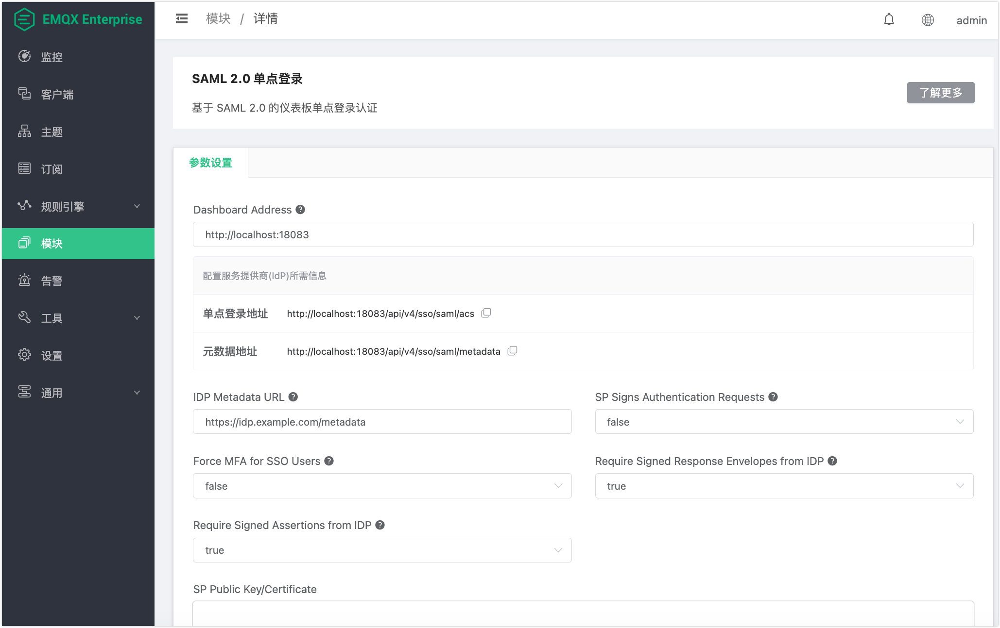

# SAML 2.0 单点登录

SAML 2.0 单点登录（SSO）支持用户通过组织内部的身份提供商（IdP），如 Keycloak、Okta、Azure AD 等，登录 EMQX Dashboard，无需单独管理 Dashboard 密码。

## 工作原理

SAML 2.0 SSO 涉及两个角色：

- **身份提供商（IdP）**：组织内部的认证服务。负责验证用户身份并颁发签名断言。
- **服务提供商（SP）**：EMQX Dashboard。信任 IdP 颁发的断言并据此授予访问权限。

双方通过交换元数据建立信任关系：EMQX 发布 SP 元数据文档供 IdP 注册，同时从 IdP 获取元数据以验证收到的断言。信任关系建立后，登录流程如下：

1. 用户在 Dashboard 登录页面点击**使用 SSO 登录**。
2. EMQX 将用户重定向至 IdP 登录页面。
3. 用户在 IdP 完成身份认证。
4. IdP 将签名后的 `SAMLResponse` POST 至 EMQX。
5. EMQX 验证断言，完成用户登录，并在用户不存在时自动完成初始化。

## 配置概览

配置 SAML SSO 需要在 EMQX 和 IdP 两侧分别操作：

1. **在 EMQX 中添加 SAML SSO 模块**：生成后续步骤所需的 SP 元数据地址和 ACS 地址。
2. **在 IdP 中将 EMQX 注册为 SAML 客户端**：提供 SP 元数据 URL 或文件，并记录 IdP 元数据 URL。
3. **完成 EMQX 配置**：填入 IdP 元数据 URL 并配置签名选项。

## 前提条件

- EMQX 企业版 4.4.34 及以上版本。
- SAML 2.0 兼容的 IdP。本指南以 Keycloak 26.3 及以上版本为例。
- EMQX 节点与 IdP 主机之间网络可达。EMQX 在模块加载时需访问 IdP 元数据 URL。
- EMQX Dashboard 和 IdP 均需启用 HTTPS。Keycloak 26.x 要求 SAML 客户端使用 HTTPS。
- IdP 元数据 URL（IdP 提供的 XML 接口地址）。

## 添加 SAML SSO 模块

1. 在 Dashboard 左侧导航栏中点击**模块**。

2. 点击**添加模块**。

3. 在模块列表中选择 **SAML 2.0 单点登录**，点击**选择**。

4. 填写配置参数。详细说明请参考[配置参数](#配置参数)。

5. 点击**添加**以启用模块。

   

配置页面上显示有两个只读地址：

- **SSO 地址**：`<Dashboard 地址>/api/v4/sso/saml/acs`。即 ACS（断言消费服务）地址，IdP 完成认证后将 `SAMLResponse` POST 至该端点。在 IdP 侧将此地址注册为 ACS URL 或 Valid Redirect URI。
- **元数据地址**：`<Dashboard 地址>/api/v4/sso/saml/metadata`。即需要在 IdP 侧作为 Client ID 注册的服务提供商（SP）元数据 URL。

## 配置参数

| 参数                        | 默认值                   | 说明                                                         |
| --------------------------- | ------------------------ | ------------------------------------------------------------ |
| **Dashboard 地址**          | `http://localhost:18083` | Dashboard 的外部访问基础地址，末尾不带斜杠或路径。EMQX 使用该地址构造 SSO 地址和元数据地址。 |
| **IDP 元数据 URL**          | 必填                     | EMQX 从该地址获取 IdP 的 SAML 元数据 XML。在 Keycloak 中，格式为 `https://<keycloak-host>/realms/<realm>/protocol/saml/descriptor`。 |
| **SP 对认证请求签名**       | `false`                  | 启用后，EMQX 会对发出的 SAML `AuthnRequest` 消息进行签名（EMQX -> IdP）。需同时提供有效的 SP 证书和私钥。 |
| **强制 SSO 用户启用 MFA**   | `false`                  | 启用后，所有通过 SAML SSO 登录的用户必须完成基于 TOTP 的[多因素认证](./mfa.md)。尚未配置 MFA 的用户在首次登录时会收到配置提示。 |
| **要求 IDP 对响应信封签名** | `true`                   | 要求 IdP 对 SAML `Response` 信封进行签名（IdP -> EMQX）。建议在生产环境中保持启用。 |
| **要求 IDP 对断言签名**     | `true`                   | 要求 IdP 对 SAML `Assertion` 元素进行签名（IdP -> EMQX）。建议在生产环境中保持启用。 |
| **SP 公钥/证书**            | —                        | PEM 格式的 SP 证书。启用 **SP 对认证请求签名** 时必填。可直接粘贴 PEM 内容，或点击**选择文件**上传文件。 |
| **SP 私钥**                 | —                        | PEM 格式的 SP 私钥。启用 **SP 对认证请求签名** 时必填。可直接粘贴 PEM 内容，或点击**选择文件**上传文件。 |

::: warning 注意

在生产环境中，**要求 IDP 对响应信封签名**和**要求 IDP 对断言签名**至少应启用一项。同时禁用两者将放弃对身份断言的所有密码学验证，存在严重安全风险。

:::

## 配置 IdP

以下步骤以 Keycloak 为例。不同 IdP 的配置方式有所不同，但需要注册的参数值相同。

### 向 IdP 注册 SP 元数据

启用模块后，EMQX 会在元数据地址发布 SP 元数据文档。该 XML 文档包含 SP Entity ID、ACS 地址，以及启用 SP 签名时的 SP 签名证书。IdP 需要这些信息才能信任 EMQX 并与之通信。

向 IdP 提供元数据有以下两种方式：

- **自动导入**：若 IdP 支持通过 URL 导入元数据，直接粘贴元数据地址即可。IdP 会自动获取 XML 并完成 Entity ID 和 ACS 地址的配置。
- **手动上传**：若 IdP 要求上传文件，在浏览器中打开元数据地址，保存 XML 文件后上传至 IdP。

### 在 Keycloak 中创建 SAML 客户端

1. 登录 Keycloak 管理控制台并选择对应的 Realm。

2. 进入 **Clients** 页面，点击 **Create client**。

3. 将 **Client type** 设置为 `SAML`。

4. 将 **Client ID** 设置为 EMQX 配置页面显示的 SP 元数据地址：

   ```
   https://<dashboard-addr>/api/v4/sso/saml/metadata
   ```

   ::: tip

   EMQX 不支持自定义 SP Client ID，必须使用页面显示的元数据地址。

   :::

5. 将 **Valid Redirect URIs** 或 **ACS URL** 设置为 EMQX 配置页面显示的 SSO 地址：

   ```
   https://<dashboard-addr>/api/v4/sso/saml/acs
   ```

6. 在 **Keys** 标签页下，启用 **Sign documents** 和 **Sign assertions**。除非在 EMQX 中明确关闭了**要求 IDP 对响应信封签名**和**要求 IDP 对断言签名**，否则这两项必须启用（两者在 EMQX 中均默认为 `true`）。

7. 从 **Realm Settings** -> **Endpoints** -> **SAML 2.0 Identity Provider Metadata** 复制 **IDP 元数据 URL**，填入 EMQX 中的 **IDP 元数据 URL** 字段。

### 准备 SP 证书和私钥（启用 SP 签名时）

如果启用了 **SP 对认证请求签名**，需要提供 SP 证书和私钥。在 Keycloak 中生成时：

1. 进入 **Clients** -> 对应的 SAML 客户端 -> **Keys** 标签页。

2. 点击 **Regenerate**（而非 **Export**），密钥文件将自动下载。

   ::: warning

   请勿使用 **Export** 按钮。导出的密钥文件经过密码保护，而 EMQX 不支持带密码保护的 PEM 密钥。

   :::

3. Keycloak 下载的证书和私钥为不带 PEM 头部的原始 Base64 格式，上传至 EMQX 前需转换为 PEM 格式：

   ```bash
   # 转换证书
   ./scripts/convert-keycloak-certs.sh <downloaded-cert-file> sp_public.pem cert
   
   # 转换私钥
   ./scripts/convert-keycloak-certs.sh <downloaded-key-file> sp_private.pem key
   ```

4. 将转换后的 PEM 文件上传或粘贴至 EMQX 的 **SP 公钥/证书**和 **SP 私钥**字段。

## SSO 登录流程

1. 用户打开 Dashboard 登录页面。启用 SSO 后，页面会显示**使用 SSO 登录**按钮。
2. 用户点击**使用 SSO 登录**，被重定向至 IdP 登录页面。
3. 用户在 IdP 完成身份认证。
4. IdP 将 `SAMLResponse` POST 至 EMQX 的 ACS 端点。
5. EMQX 验证断言，对不存在的用户进行自动初始化，并将浏览器重定向回 Dashboard。

如果启用了**强制 SSO 用户启用 MFA**，用户在进入 Dashboard 前需完成 MFA 配置或验证。

### 用户自动初始化

SSO 用户在首次成功登录时会被自动初始化（即时供给，Just-in-Time Provisioning）：

- 新 SSO 用户默认分配 `viewer` 角色。
- 已存在于 Dashboard 中且用户名匹配的用户，保留当前角色和设置不变。

如需为 SSO 用户授予更高权限，可在用户首次登录后，进入 Dashboard **通用** -> **用户**，编辑该用户的角色。

## MFA 集成

启用**强制 SSO 用户启用 MFA** 后，所有通过 SAML SSO 登录的用户必须配置基于 TOTP 的多因素认证。尚未配置 MFA 的用户在首次 SAML 认证成功后会立即收到配置提示。

即使全局启用了该设置，管理员仍可为单个 SSO 用户单独关闭 MFA。操作方法：进入 Dashboard **通用** -> **用户**，选中对应用户，关闭其 MFA 开关。

有关 MFA 的完整配置说明，请参考[多因素认证](./mfa.md)。
