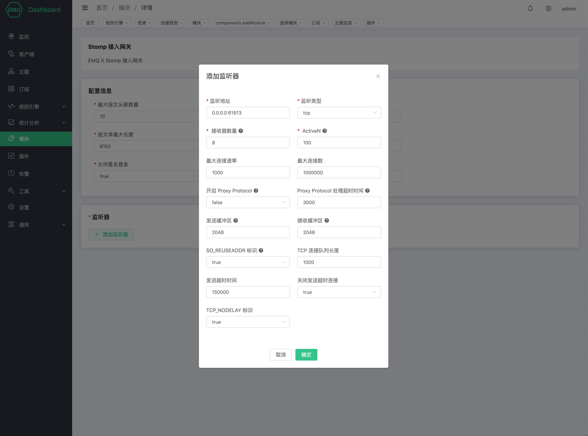

# Stomp 协议网关

Stomp 协议网关为 EMQ X 提供了 Stomp 协议的接入能力。

## 创建模块

打开 [EMQ X Dashboard](http://127.0.0.1:18083/#/modules)，点击左侧的 “模块” 选项卡，选择添加：

点击 “选择”，然后选择 “CoAP 接入网关”：

配置相关基础参数：

添加监听端口：

配置监听参数：

点击 “确定” 完成监听器的配置，然后点击 “添加” 完成模块的创建： 

### 配置参数

| 配置项                      |       说明                           |
| ---------------------------| ---------------------------------- |
| 最大报文头部数量              | Stomp frame headers 的最大数量    |
| 最大报文头部长度              | Stomp frame headers 的最大长度    |
| 报文体最大长度                | Stomp frame body 的最大长度       |
| 允许匿名登录                 | 是否允许匿名登录 |
| 默认用户名                   | 指定 Stomp 模块登录使用的 Username |
| 默认密码                    |  指定 Stomp 模块登录使用的 Password  |
