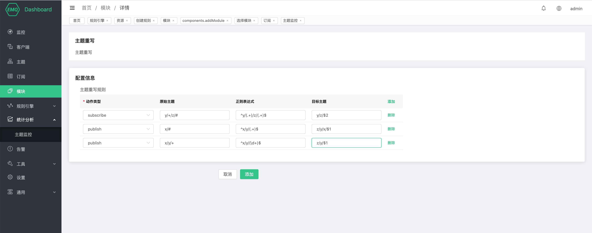

# 主题重写

EMQ X 的主题重写功能支持根据用户配置的规则在客户端订阅主题、发布消息、取消订阅的时候将 A 主题重写为 B 主题。

## 创建模块

打开 [EMQ X Dashboard](http://127.0.0.1:18083/#/modules)，点击左侧的 “模块” 选项卡，选择添加：

选择 MQTT 主题重写模块

配置相关参数

点击添加后，模块添加完成

## 主题重写规则

重写规则分为 Pub 规则和 Sub 规则，Pub 规则匹配 PUSHLISH 报文携带的主题，Sub 规则匹配 SUBSCRIBE、UNSUBSCRIBE 报文携带的主题。

每条重写规则都由主题过滤器、正则表达式、目标表达式三部分组成。在主题重写功能开启的前提下，EMQ X 在收到诸如 PUBLISH 报文等带有主题的 MQTT 报文时，将使用报文中的主题去依次匹配配置文件中规则的主题过滤器部分，一旦成功匹配，则使用正则表达式提取主题中的信息，然后替换至目标表达式以构成新的主题。

目标表达式中可以使用 `$N` 这种格式的变量匹配正则表达中提取出来的元素，`$N` 的值为正则表达式中提取出来的第 N 个元素，比如 `$1` 即为正则表达式提取的第一个元素。

需要注意的是，EMQ X 使用倒序读取配置文件中的重写规则，当一条主题可以同时匹配多条主题重写规则的主题过滤器时，EMQ X 仅会使用它匹配到的第一条规则进行重写，如果该条规则中的正则表达式与 MQTT 报文主题不匹配，则重写失败，不会再尝试使用其他的规则进行重写。因此用户在使用时需要谨慎的设计 MQTT 报文主题以及主题重写规则。

## 主题重写示例

添加上图中的主题重写规则并分别订阅 `y/a/z/b`、`y/def`、`x/1/2`、`x/y/2`、`x/y/z` 五个主题：

+ 当客户端订阅 `y/def` 主题时，`y/def` 不匹配任何一个主题过滤器，因此不执行主题重写，直接订阅 `y/def` 主题。

+ 当客户端订阅 `y/a/z/b` 主题时，`y/a/z/b` 匹配 `y/+/z/#` 主题过滤器，EMQ X 执行 `module.rewrite.sub.rule.1` 规则，通过正则正则表达式匹配出元素 `[a、b]` ，将匹配出来的第二个元素带入 `y/z/$2`，实际订阅了 `y/z/b` 主题。

+ 当客户端向 `x/1/2` 主题发送消息时，`x/1/2` 匹配 `x/#` 主题过滤器，EMQ X 执行 `module.rewrite.pub.rule.1` 规则，通过正则表达式未匹配到元素，不执行主题重写，因此直接向 `x/1/2` 主题发送消息。

+ 当客户端向 `x/y/2` 主题发送消息时，`x/y/2` 同时匹配 `x/#` 和 `x/y/+` 两个主题过滤器，EMQ X 通过倒序读取配置，所以优先匹配 `module.rewrite.pub.rule.2`，通过正则替换，实际向 `z/y/2` 主题发送消息。

+ 当客户端向 `x/y/z` 主题发送消息时，`x/y/z` 同时匹配 `x/#` 和 `x/y/+` 两个主题过滤器，EMQ X 通过倒序读取配置，所以优先匹配 `module.rewrite.pub.rule.2，通过正则表达式未匹配到元素，不执行主题重写，直接向 `x/y/z` 主题发送消息。需要注意的是，即使 `module.rewrite.pub.rule.2` 的正则表达式匹配失败，也不会再次去匹配 `module.rewrite.pub.rule.1` 的规则。