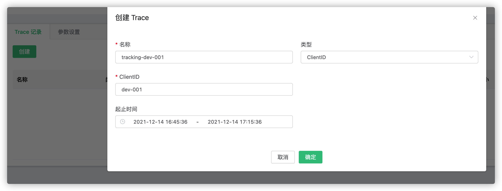
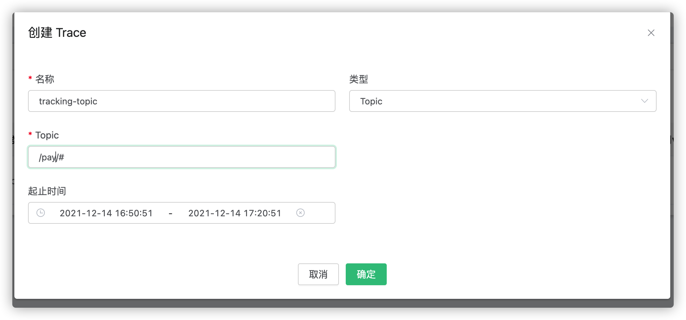
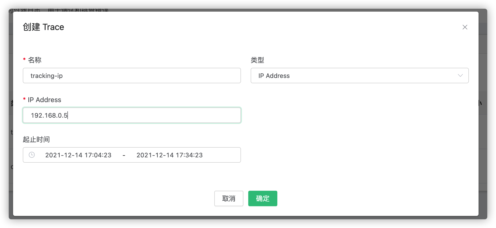
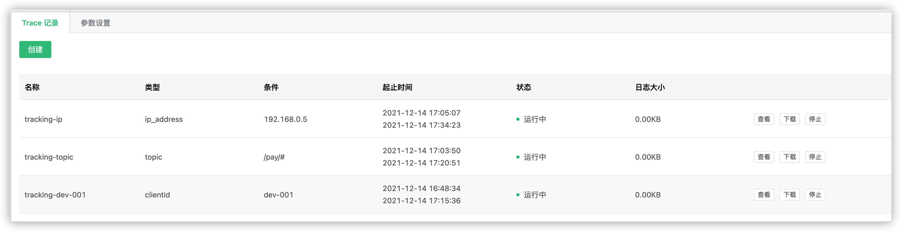

# Trace 日志追踪

## 简介
针对指定 ClientID 或 Topic 或 IP 实时过滤日志，用于调试和排查错误。

## 创建模块

Trace 日志追踪模块默认关闭，可以通过dashboard页面进行开启和停止。

打开 [EMQX Dashboard](http://127.0.0.1:18083/#/modules)，点击左侧的 “模块” 选项卡：

可以创建追踪指定 ClientID 或 Topic 或 IP 客户端的日志。
## 追踪指定 ClientID

1. 点击创建后，选择类型为 ClientID；
2. 填写需要追踪的 ClientID 信息（必须是精确的ClientID）；
3. 选择起止时间，如果开始时间小于等于当前时间，会默认从当前时间开始。

创建成功后，可以在列表中看到当前的Trace记录，可以查看，或下载日志。
日志内容包含了当前 ClientID 与 EMQX 连接所有交互信息。

## 追踪指定 Topic

1. 点击创建后，选择类型为 Topic；
2. 填写需要追踪的 Topic 信息（支持通配符）；
3. 选择起止时间，如果开始时间小于等于当前时间，会默认从当前时间开始。

创建成功后，可以在列表中看到当前的Trace记录，可以查看，或下载日志。
日志内容包含了当前主题在 EMQX 上的 Publish/Subscribe/UnSubscribe 信息。

## 追踪指定 IP

1. 点击创建后，选择类型为 IP Address；
2. 填写需要追踪的 IP 地址信息（必须是精确的IP）；
3. 选择起止时间，如果开始时间小于等于当前时间，会默认从当前时间开始。

创建成功后，可以在列表中看到当前的Trace记录，可以查看，或下载日志。
日志内容包含了当前 IP 与 EMQX 连接所有交互信息。

### 注意事项

1. 最多可保存30个追踪日志。
2. 追踪日志在每个节点产生的日志最大为 512M。如果产生的日志文件达到最大值，则会停止追加日志，并在主日志文件中给出提示。
3. 可以选择手动停止记录，或等到结束时间时自动停止。
4. 列表中查看到的日志文件大小为未压缩过的文件大小总和。
5. EMQX 集群重启后，会继续未完成的追踪。
