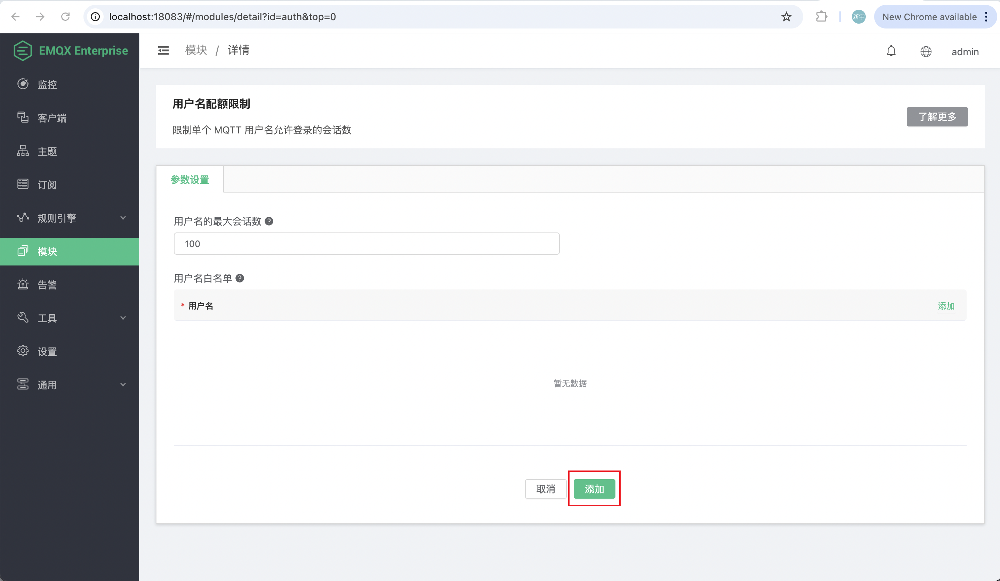
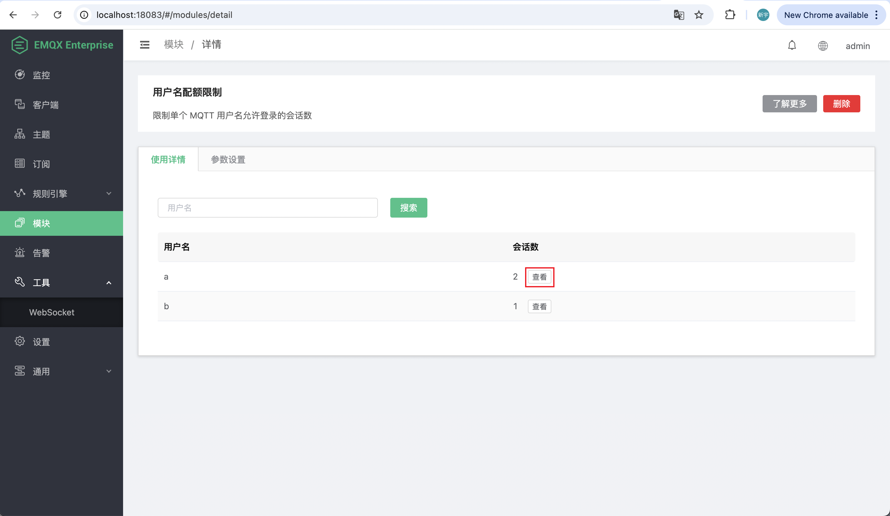

# 用户名配额限制

从 4.4.25 版本开始，新增了用户名配额限制模块，用以限制单个 MQTT 用户名的最大会话数。

当某个用户名超过配额后，新的会话将被拒绝连接，并返回相应的 CONNACK 返回码：“0x97 配额已超”（MQTT 5.0）或 “0x03 服务不可用”（MQTT 3.1.1）。

## 添加模块

1. 在 Dashboard 的左侧导航菜单中点击**模块**。
2. 在页面上点击**添加模块**按钮。
3. 在模块选择页面的**认证**标签下，找到**用户名配额限制**，然后点击**选择**。
4. 为用户名配额限制模块配置以下选项：
   - **用户名最大会话数**：定义每个用户名允许的最大 MQTT 会话数。请注意，如果 MQTT 客户端使用持久会话登录，即使客户端断开连接，会话也会继续保留在服务器上，直到会话过期并被清除。
   - **用户名白名单**：您可以点击右侧的**添加**按钮添加用户名条目。白名单中的用户名不受会话数限制。例如，连接到集群的 MQTT 桥接客户端应绕过配额限制，您可以将 MQTT 桥接使用的用户名添加到白名单中。

5. 点击**添加**完成设置。



## 管理用户名配额

在模块页面，找到您已添加的**用户名配额限制**模块。点击右侧的**管理**。

在**使用详情**标签页，您可以看到 EMQX 集群中的当前用户名及其使用的会话数。点击会话数旁边的**查看**按钮，可以查看当前用户名的会话列表。

点击**参数设置**标签页，您可以编辑用户名配额限制的设置。点击右上角的**删除**可以删除模块。



## HTTP API

除了从 Dashboard 上查看用户名配额模块之外，还可以使用 HTTP API 获取用户名使用详情。

### GET /api/v4/quota/usernames

获取集群中的用户名列表，按照用户名的会话数降序排列。

**成功响应体 (JSON):**

| 名称 | 类型  | 描述 |
| ---- | ------- | ----------- |
| code | Integer | 0 表示成功   |
| data | Array   | 用户名详情列表   |
| data[0].username | String   | 用户名 |
| data[0].used | Integer   | 该用户名的会话数 |
| data[0].clientids | Array | 包含客户端 ID 的列表 |

**示例**

```shell
curl -u admin:public 'http://localhost:18083/api/v4/quota/usernames' | jq .

{
  "meta": {
    "page": 1,
    "limit": 10000,
    "count": 1
  },
  "data": [
    {
      "username": "a",
      "used": 1,
      "clientids": [
        "mqttjs_6916e2ae"
      ]
    }
  ],
  "code": 0
}
```

### GET /api/v4/quota/usernames/:username

获取指定用户名的会话列表。

**成功响应体 (JSON):**

| 名称 | 类型  | 描述 |
| ---- | ------- | ----------- |
| code | Integer | 0 表示成功   |
| data | Object  | 用户名详情   |
| data.username | String   | 用户名 |
| data.used | Integer   | 该用户名的会话数 |
| data.clientids | Array | 包含客户端 ID 的列表 |

**Examples**

```shell
curl -u admin:public 'http://localhost:18083/api/v4/quota/usernames/a' | jq .

{
  "data": {
    "username": "a",
    "used": 1,
    "clientids": [
      "mqttjs_6916e2ae"
    ]
  },
  "code": 0
}
```
