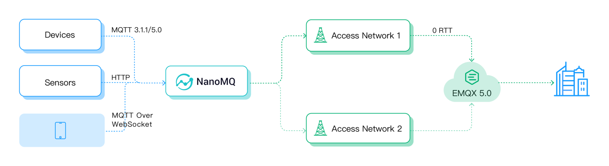

# 快速开始

为了更多用户能体验到 MQTT over QUIC 为物联网消息传输带来的提升，本章节指导您如何从零开始上手使用 MQTT over QUIC。

:::tip
前置条件：

- 熟悉并了解 [MQTT over QUIC](./introduction.md)。
:::

## 环境要求

由于是实验性功能，在 CentOS 6、macOS 以及 Windows 系统下并未包含 QUIC 编译，请自行从源码编译并在编译前指定环境变量 `BUILD_WITH_QUIC=1`，其他操作系统和平台则可以正常使用。

测试环境推荐使用 Docker 镜像，以下命令通过环境变量启用 QUIC 监听器并映射 UDP 14567 作为接入端口：

```bash
docker run -d --name emqx \
  -p 1883:1883 -p 8083:8083 \
  -p 8084:8084 -p 8883:8883 \
  -p 18083:18083 \
  -p 14567:14567/udp \
  -e EMQX_LISTENERS__QUIC__DEFAULT__keyfile="etc/certs/key.pem" \
  -e EMQX_LISTENERS__QUIC__DEFAULT__certfile="etc/certs/cert.pem" \
  -e EMQX_LISTENERS__QUIC__DEFAULT__ENABLED=true \
emqx/emqx:5.0.19
```

有关 Docker 安装更多内容请参考 [Docker 部署指南](../deploy/install-docker.md)。

## 启用 MQTT over QUIC

MQTT over QUIC 默认禁用，请通过以下配置手动开启。

1. 打开配置文件 `etc/emqx.conf`，取消 `listeners.quic.default` 配置组的注释（如果没有此配置组请手动添加）：

   ```bash
   # etc/emqx.conf
   listeners.quic.default {
     enabled = true
     bind = "0.0.0.0:14567"
     max_connections = 1024000
     keyfile = "etc/certs/key.pem"
     certfile = "etc/certs/cert.pem"
   }
   ```

    该配置表示启用 QUIC 监听器并绑定 UDP `14567` 端口，保存成功后请重启 EMQX 以应用配置。

   

2. 通过 CLI 执行 `emqx_ctl listeners` 命令，可在结果中看到 MQTT over QUIC 监听器已启用：

  ```bash
   > emqx_ctl listeners
   quic:default
     listen_on       : :14567
     acceptors       : 16
     proxy_protocol  : undefined
     running         : true
   ssl:default
     listen_on       : 0.0.0.0:8883
     acceptors       : 16
     proxy_protocol  : false
     running         : true
     current_conn    : 0
     max_conns       : 512000
  ```
  

至此，您已经在 EMQX 上启用了 MQTT over QUIC 监听器，下面我们将接入客户端。

## 客户端 SDK 与工具

相比于 MQTT 而言，目前 MQTT over QUIC 仍然缺少完整的客户端库和工具链支持。

EMQ 针对 MQTT over QUIC 的适用场景，计划提供 C、Java、Python、Golang 等多个语言的客户端库并按照优先级逐个支持，确保嵌入式硬件等这类契合场景的业务能够率先将 QUIC 利用起来。


### 已有的客户端 SDK

- [NanoSDK](https://github.com/nanomq/NanoSDK/)：由 EMQ 旗下 NanoMQ 团队发布的 C 语言的 MQTT SDK，除 MQTT over QUIC 外还支持 WebSocket、nanomsg/SP 等多协议。
- [NanoSDK-Python](https://github.com/wanghaEMQ/pynng-mqtt)：NanoSDK 的 Python 语言 binding。
- [NanoSDK-Java](https://github.com/nanomq/nanosdk-java)：NanoSDK 的 Java JNA binding。
- [emqtt](https://github.com/emqx/emqtt)：Erlang 语言的 MQTT 客户端库，支持 QUIC。


除了客户端库之外，EMQ 还在边缘计算产品 NanoMQ 中提供了 MQTT over QUIC 桥接支持，在特定的应用中您可以借助 NanoMQ 实现边缘数据通过 QUIC 桥接上云，无需过多开发集成即可应用 MQTT over QUIC 的特性。

### fallback 支持

考虑到 QUIC 基于 UDP 协议，目前许多运营商仍然对 UDP 包有特殊的路由策略，这往往导致 QUIC 连接无法成功建立或一直被丢包。

因此 MQTT over QUIC 客户端设计支持了 fallback 能力：API 层能够使用统一的操作编写业务，传输层则根据网络情况实时切换，当 QUIC 不可用时自动切换为 TCP/TLS 1.2，确保各类网络环境下业务都能正常运行。


## 通过 NanoSDK 完成 MQTT over QUIC 连接

[NanoSDK](https://github.com/nanomq/NanoSDK/) 基于 MsQuic 项目率先实现了第一个 C 语言的 MQTT over QUIC SDK，能无缝兼容 EMQX 5.0。内部采用全异步 IO 设计，将 QUIC Stream 和 MQTT 连接映射绑定，并内置实现了 0RTT 快速握手重连功能，支持多核任务并行。

NanoSDK API 方面保持了 MQTT over TCP 的使用习惯，一行代码即可基于 QUIC 创建 MQTT 客户端：

```bash
## Create MQTT over Quic client with NanoSDK
nng_mqtt_quic_client_open(&socket, url);
```

消息示例代码请参考：https://github.com/nanomq/NanoSDK/tree/main/demo/quic 。

编译后可以通过以下命令连接 EMQX 5.0 的 14567 端口进行测试。

```bash
quic_client sub/pub mqtt-quic://127.0.0.1:14567 topic msg
```

NanoSDK 也提供 Java) 和 Python 的 binding：

- [Java MQTT over QUIC Client](https://github.com/nanomq/nanosdk-java/blob/main/demo/src/main/java/io/sisu/nng/demo/quicmqtt/MqttQuicClient.java)
- [Python MQTT over QUIC Client](https://github.com/wanghaEMQ/pynng-mqtt/blob/master/examples/mqttsub.py)


## 通过 NanoMQ 桥接 MQTT over QUIC

[NanoMQ](https://nanomq.io/) 是一款超轻量、高性能且跨平台的边缘 MQTT 消息引擎，兼具多协议消息总线功能，支持 MQTT over QUIC 桥接功能。

它能够将传统 MQTT 客户端的数据转换成 QUIC 数据包并发给云端的 EMQX，从而为无法集成或找到合适 MQTT over QUIC SDK 的端侧设备和难以修改固件的嵌入式设备提供在 IoT 场景利用 QUIC 协议优势的捷径，降低使用门槛。



### NanoMQ 桥接示例

下载安装 NanoMQ：

```bash
git clone https://github.com/emqx/nanomq.git
cd nanomq ; git submodule update --init --recursive

mkdir build && cd build
cmake -G Ninja -DNNG_ENABLE_QUIC=ON ..
sudo ninja install
```

开启 QUIC 桥接功能的 NanoMQ 编译安装完成后，可以在配置文件`/etc/nanomq.conf`中配置 MQTT over QUIC 桥接功能和对应的主题，使用 `mqtt-quic` 作为 URL 前缀即是采用 QUIC 作为 MQTT 的传输层：

```bash
## Bridge address: host:port .
##
## Value: String
bridge.mqtt.emqx.address=mqtt-quic://127.0.0.1:14567
```

### MQTT over QUIC CLI 工具

NanoMQ 还提供了 nanomq_cli ，其中包含有 MQTT over QUIC 的客户端工具供用户测试 EMQX 5.0 的MQTT over QUIC 功能：

```bash
nanomq_cli quic --help
Usage: quic conn <url>
       quic sub  <url> <qos> <topic>
       quic pub  <url> <qos> <topic> <data>

## subscribe example
nanomq_cli quic sub mqtt-quic://54.75.171.11:14567 2 msg
```

综上所述，您可以直接将 NanoSDK 集成到项目中，亦可以搭配 NanoMQ 使用，实现设备侧到云端的 QUIC 接入。


