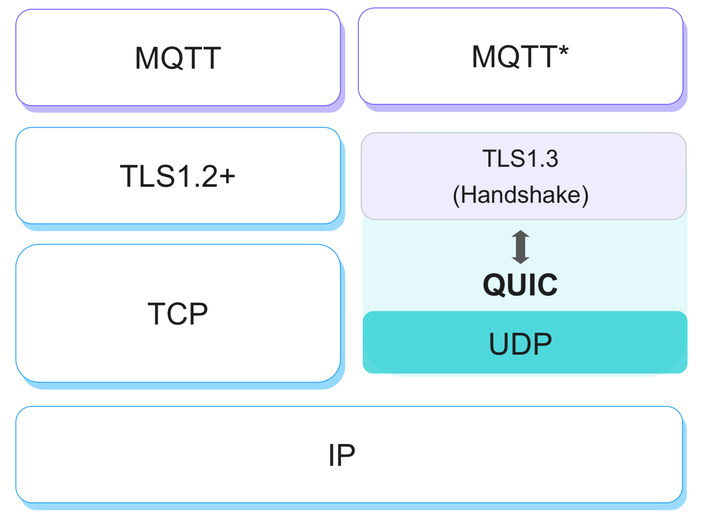

# MQTT over QUIC

[QUIC](https://datatracker.ietf.org/doc/html/rfc9000) 是下一代互联网协议 HTTP/3 的底层传输协议，与 TCP 协议相比，它在减少连接开销与消息延迟的同时，提升了整体吞吐量和移动连接的稳定性。

基于 QUIC 这些极适用于物联网消息传输场景的优势，EMQX 5.0 开创性的引入了 QUIC 支持（MQTT over QUIC）并设计了独特的消息传输机制和管理方式。

:::tip

目前 MQTT over QUIC 仍然是实验性功能，EMQ 正在以 OASIS 成员身份推动其标准化落地。

:::

## 应用场景

MQTT 是基于 TCP 的物联网通信协议，由于底层 TCP 传输协议限制，某些复杂网络环境下 MQTT 协议存在固有的弊端：

- 网络切换导致经常性连接中断
- 断网后重新建立连接困难：断网后操作系统释放资源较慢，且应用层无法及时感知断开状态，重连时 Server/Client 开销较大
- 弱网环境下数据传输受限于拥塞、丢包侦测和重传机制

例如车联网用户通常会面对类似的问题：车辆可能会运行在山区、矿场、隧道等地方，当进入到信号死角或被动切换基站时会导致连接中断，频繁连接中断与较慢的连接恢复速度会导致用户体验变差。

在一些对数据传输实时性和稳定性要求较高的业务，客户需要花费大量的成本来缓解这一问题。

在这类场景中，QUIC 低连接开销和多路径支持的特性就显示出了其优势，基于 QUIC 0 RTT/1 RTT 重连/新建能力，能够在弱网与不固定的网络通路中有效提升用户体验。

## 功能与实现

EMQX 目前的实现将传输层换成 QUIC Stream，由客户端发起连接和创建 Stream，EMQX 和客户端在一个双向 Stream 上实现交互。

考虑到复杂的网络环境，如果客户端因某种原因未能通过 QUIC 握手，客户端将自动退回到传统 TCP 上，避免系统无法建立跟服务器的通信。

目前 EMQX 5.0 中已经实现了以下特性：

- **更高级的拥塞控制：**有效降低数据丢包率，在测试中在网络波动的情况下仍能持续稳定传输数据
- **运维友好：**减少大规模重连导致的开销（时间开销、客户端/服务器性能开销），减少不必要的应用层状态迁移而引发的系统过载（0 RTT）
- **更灵活的架构创新：**比如 Direct server return (DSR，服务器直接返回模式)，只有入口/请求流量经过 LB，出口和响应流量绕过 LB 直接回到客户端，减少 LB 的瓶颈
- **减少握手延迟 （1 RTT）**
- **多路径支持，连接平滑迁移：**从 4G 切换到 WIFI, 或者因为 NAT Rebinding 导致五元组发生变化，QUIC 依然可以在新的五元组上继续进行连接状态，尤其适用于网络经常性变化的移动设备
- **更敏捷的开发部署：**协议栈的实现在 userspace，能够开发快速迭代
- **端到端加密：**未加密的包头带有极少信息， 减少传输路径中中间节点的影响，带来更好的安全性和更可控的用户体验

同时还有以下更多能力有待进一步探索：

- **不同主题的流：**对于独立主题，每个主题可以有独立的 Streams 以消除其他主题长阻塞带来的影响，比如接收端长阻塞或流量控制，亦可以实现优先级主题功能。
- **不同 QoS 的流：**比如在「流量控制」中，QoS 0 传输应该让位给高 QoS 传输。
- **将控制消息分成不同的流：**MQTT 控制消息可以单向或双向发送。如客⼾端可以通过「控制流」异步发送 UNSUBSCRIBE 请求，以要求服务器端停⽌发送不再感兴趣的数据。
- **更细粒度的收发端协同流量控制：**面对每一个流进行流控且对整个连接进行流控，实现更细粒度的流量控制。

## QUIC vs TCP/TLS 测试对比

在与 TCP/TLS 测试的对比中，MQTT over QUIC 的表现如下：

1. 网络时延较高时，QUIC 能够更快的建立连接、完成订阅。
2. 断开连接后，重新发起连接并恢复重连 QUIC 所需的时延更低。
3. 大规模连接/重连时，对于服务器 CPU 和内存使用 QUIC 均优于 TLS。
4. 网络切换时（客户端源 IP 地址/端口变化），TCP/TLS 下客户端重连响应非常慢并出现消息传输中断现象，而 QUIC 的处理则更加平顺，消息发送无任何影响。
5. 在弱网丢包、包传输乱序环境下，TLS 出现因网络环境差而导致的消息拥塞与丢失，而 QUIC 服务端接收的数据稍微有所抖动，但不丢失消息。

## 未来的工作

目前 MQTT over QUIC 已经具备投入生产能力，已有用户开始进行深度测试集成并获得了良好反馈，如需体验请参考 [快速开始](./getting-started.md)。

但 EMQX 还没有利用 QUIC 提供的所有功能，如多流复用、流优先级、流量控制和不可靠的数据报文，这些功能将在以后的版本中得到解决，并希望能成为 OASIS 标准。
