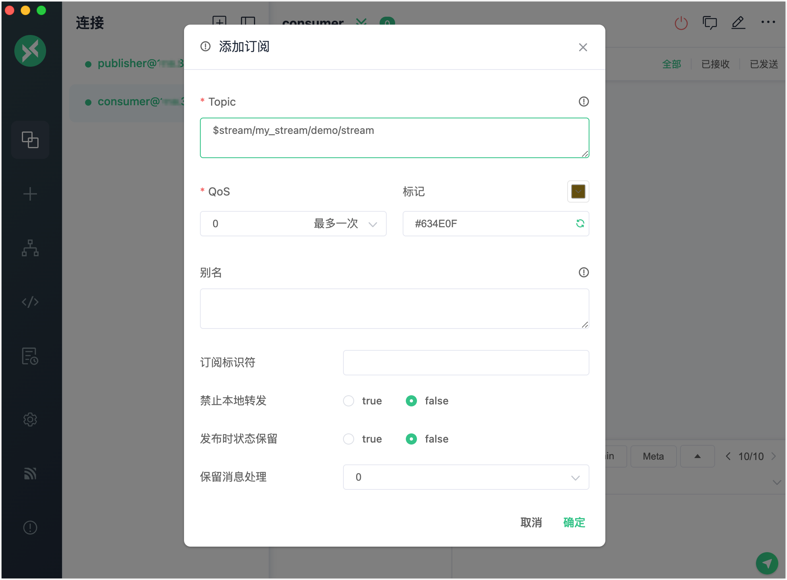
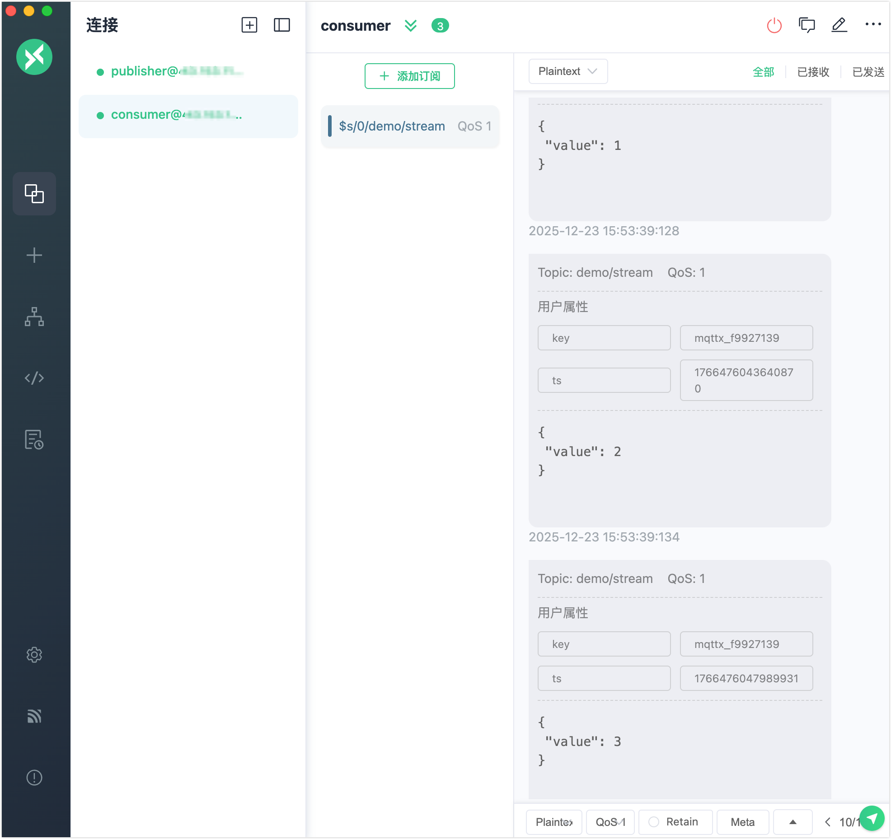
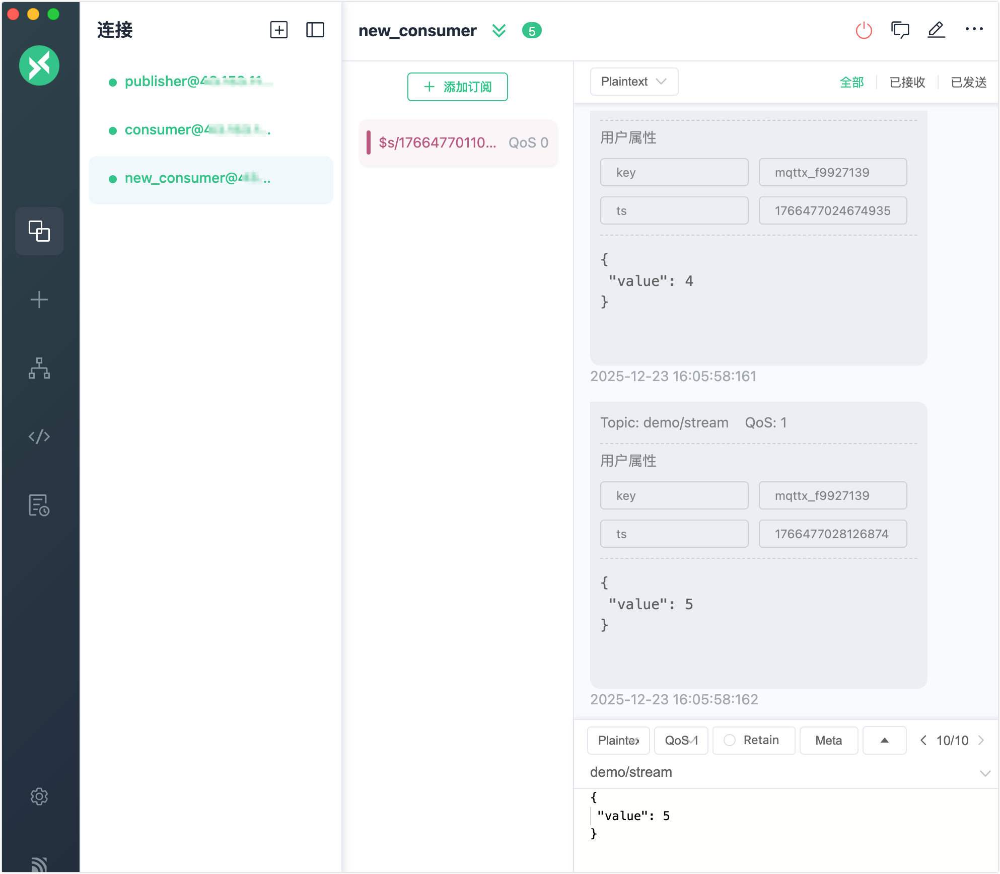
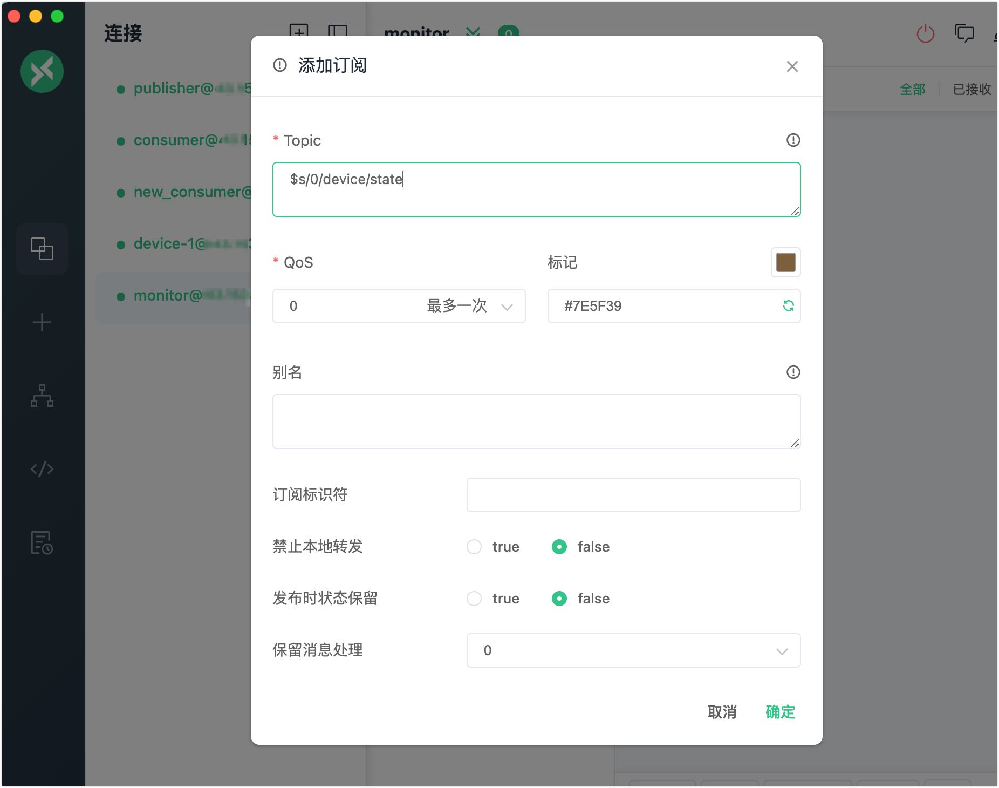
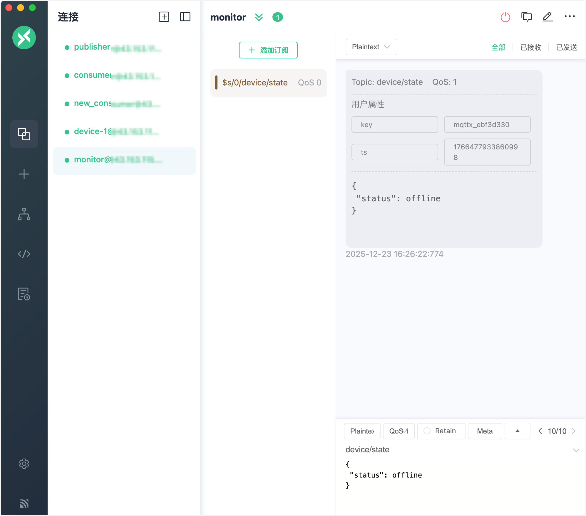

# MQTT 消息流快速开始

本页面将引导您在 EMQX 6.1 中快速体验 MQTT 消息流功能。你将使用 MQTTX 模拟客户端，通过 EMQX Dashboard 创建和管理消息流，并了解消息是如何被持久化存储、按时间回放以及通过最后值语义进行压缩的。

## 目标

本快速入门将演示 MQTT 消息流如何实现以下能力：

- 在订阅者不在线的情况下持久化存储消息
- 支持基于时间戳的消息回放
- 通过最后值语义（Last-Value semantics）支持状态型消息场景

## 前置条件

开始之前，请确保你已具备以下条件：

- 正在运行的 EMQX 6.1 或更高版本
- 已安装 [MQTTX](https://mqttx.app/)（或任何支持 MQTT 5.0 的客户端）
- 可访问 EMQX Dashboard（默认地址：`http://localhost:18083`）

## 测试 MQTT 消息流的基础功能（常规消息流）

本节将演示消息流如何存储消息，并允许消费者回放历史数据。

### 前置检查

在开始之前，请确保 MQTT 消息流功能已启用，并且自动创建行为不会影响本示例。

1. 在左侧导航栏中点击**流**。

2. 如果消息流功能处于禁用状态，点击**设置**，系统将跳转到**管理** -> **MQTT 设置** -> **流**页面。

3. 将**启用流**开关切换为开启状态。

4. 检查自动创建配置，确保使用的是**常规流**：

   - **启用自动创建流**已关闭，或
   - **自动创建流类型**设置为**常规流**

   > 这样可以避免消息流被自动创建为最后值流，否则具有相同流键的消息流只会保留最新一条消息。

5. 如有修改，点击**保存更改**使配置生效。


### 步骤 1：创建命名消息流

1. 在左侧导航栏中点击**流**。
2. 在页面中点击**创建流**，或点击右上角的**创建**按钮。
3. 在**创建流**对话框中配置以下参数：
   - **名称**：`my_stream`
   - **主题过滤器**：`demo/stream`
   - **数据保留时间**：`1` 天
   - **最后值语义**：关闭
   - **流键表达式**：`message.from`
4. 点击**创建**。


### 步骤 2：发布消息

使用 MQTTX 模拟一个发布端客户端：

1. 打开 MQTTX，创建一个客户端（例如 `publisher`）。

2. 连接到 EMQX（`mqtt://localhost:1883`）。

3. 以 QoS 1 向主题 `demo/stream` 发布多条消息。

   示例：

   ```
   Topic: demo/stream
   QoS: 1
   Payload: {"value": 1}
   Payload: {"value": 2}
   Payload: {"value": 3}
   ```

由于这是一个**常规流**，所有消息都会被完整存储。

### 步骤 3：回放消息流中的所有消息

接下来模拟一个消费端客户端，用于回放已存储的消息。

1. 打开第二个 MQTTX 客户端（例如 `consumer`）。

2. 连接到 EMQX。

3. 订阅消息流主题：

   ```
   Topic：$stream/my_stream/demo/stream
   QoS：1
   ```

   

**预期行为**：

您将按发布顺序收到之前发布的所有消息：

```json
{"value": 1}
{"value": 2}
{"value": 3}
```

这表明：

- 当前消息流为常规消息流。
- 基于时间戳的消息回放工作正常。
- 消息未发生覆盖或压缩。



## 从不同位置回放消息

消息流允许消费者在订阅时通过指定时间戳来控制回放的起始位置。

1. 使用 `publisher` 客户端继续发布新消息：

   ```json
   {"value": 4}
   {"value": 5}
   ```

2. 在一个新的 MQTTX 客户端中，使用较新的时间戳订阅消息流：

   ```
   Topic: $s/1766477011000/demo/stream
   QoS: 1
   ```

   在该示例中，`1766477011000` 是一个毫秒级的 Unix 时间戳。只有在该时间点及之后发布的消息才会被投递给订阅者。

   ::: tip

   - 时间戳必须为毫秒级 Unix 时间戳。
   - 使用 `0` 可从最早的可用消息开始回放。
   - 使用较大的时间戳可仅回放较新的消息。

   您可以通过以下方式获取当前的毫秒级时间戳：

   - **Linux / macOS**：

     ```
     date +%s000
     ```

   - **JavaScript**：

     ```
     Date.now()
     ```

   :::

3. 点击**确认**。此时只会收到在指定时间戳之后发布的消息。



这表明由消费者控制的消息回放机制：不同的消费者可以从不同的时间点独立地读取同一条消息流的数据，且彼此之间互不影响。

## 测试最后值语义

本节将演示最后值 MQTT 消息流如何仅保留每个 key 对应的最新消息，适用于状态型数据场景。

### 步骤 1：删除已有消息流

1. 在 EMQX 控制台中进入**消息流**页面。
2. 找到主题过滤器为 `demo/stream` 的消息流。
3. 点击**删除**并确认。

### 步骤 2：创建最后值消息流

1. 在**消息流**页面点击**创建**。
2. 配置以下参数：
   - **主题过滤器**：`device/state`
   - **数据保留时间**：`1` 天
   - **最后值语义**：开启
   - **流键表达式**：`message.from`
3. 点击**创建**。

该消息流现已配置为：对使用相同键的消息流仅保留其中最新一条消息。

### 步骤 3：发布状态更新

1. 在 MQTTX 中使用客户端 ID 为 `device-1` 的客户端。

2. 向 `device/state` 发布消息：

   ```
   Topic: device/state
   QoS: 1
   Payload: {"status": online}
   ```

3. 使用同一个客户端再发布一条消息：

   ```json
   {"status": offline}
   ```

由于**流键表达式**设置为 `message.from`，这两条消息具有相同的键，后发布的消息会覆盖先前发布的消息。

### 步骤 4：订阅消息流

1. 打开一个新的 MQTTX 客户端（例如 `monitor`）。

2. 订阅消息流主题：

   ```
   Topic：$s/0/device/state
   QoS：1
   ```

   

**预期行为**：

只会收到最新的一条消息：

```
{"status": offline}
```

这表明 MQTT 消息流通过最后值语义支持状态型消息模式。

