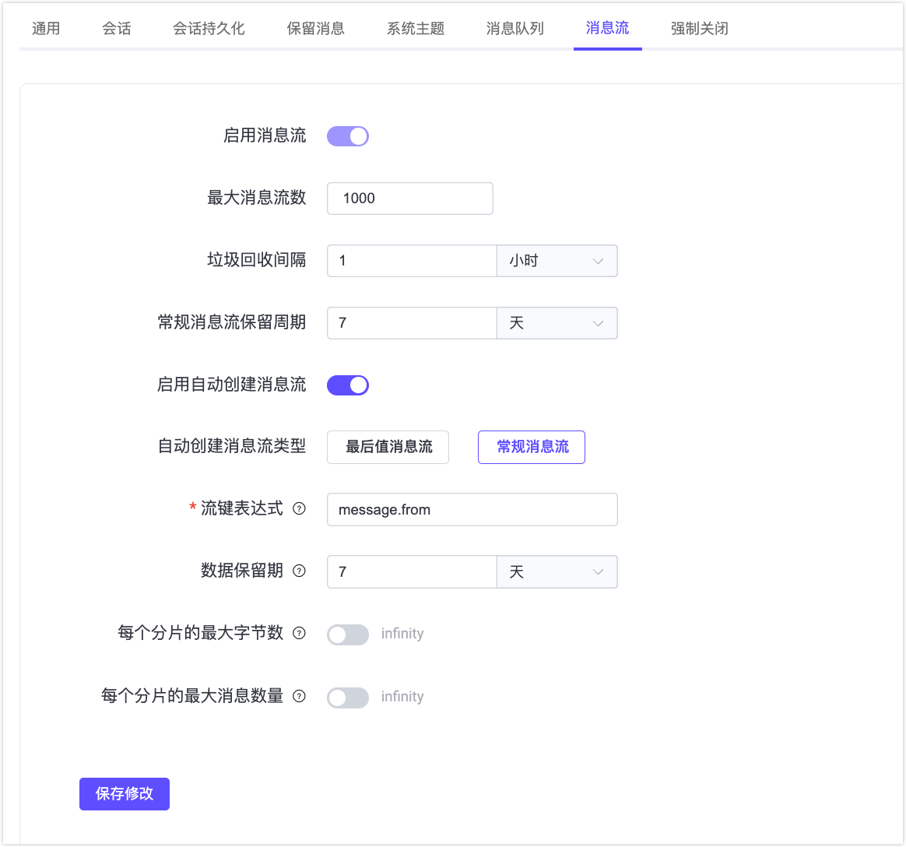
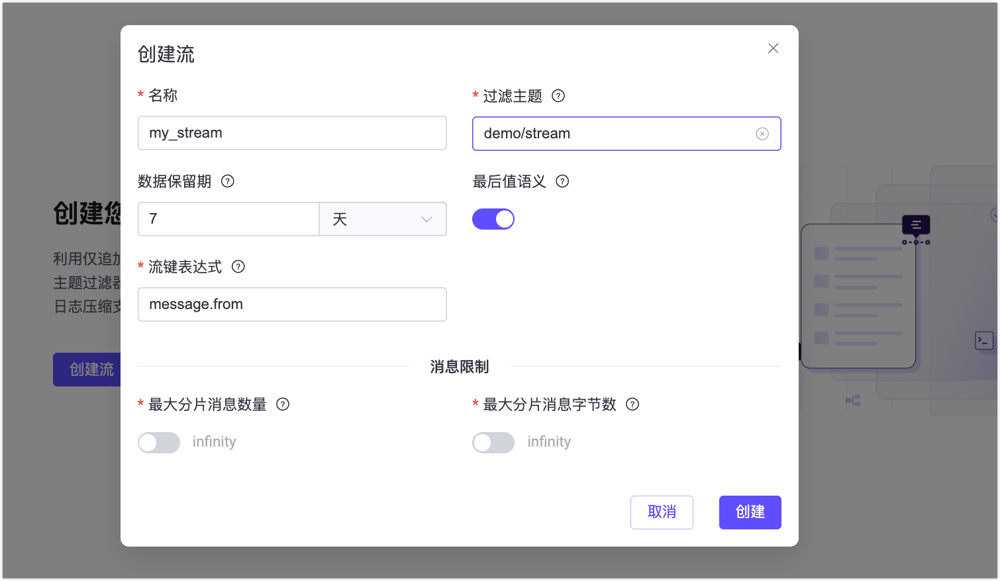
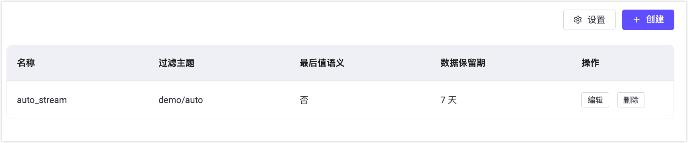

# MQTT 消息流快速开始

本页面将引导您在 EMQX 6.1 中快速体验 MQTT 消息流功能。你将使用 MQTTX 模拟客户端，通过 EMQX Dashboard 创建和管理消息流，并了解消息是如何被持久化存储、按时间回放以及通过最后值语义进行压缩的。

## 目标

本快速入门将演示 MQTT 消息流如何实现以下能力：

- 在订阅者不在线的情况下持久化存储消息
- 支持基于时间戳的消息回放
- 通过最后值语义（Last-Value semantics）支持状态型消息场景
- 通过 `$stream/` 订阅方式按需自动创建流

## 前置条件

开始之前，请确保你已具备以下条件：

- 正在运行的 EMQX 6.1 或更高版本
- 已安装 [MQTTX](https://mqttx.app/)（或任何支持 MQTT 5.0 的客户端）
- 可访问 EMQX Dashboard（默认地址：`http://localhost:18083`）

## 测试 MQTT 消息流的基础功能（常规消息流）

本节将演示消息流如何存储消息，并允许消费者回放历史数据。

### 前置检查

在开始之前，请确保 MQTT 消息流功能已启用，并且自动创建行为不会影响本示例。

1. 在左侧导航栏中点击**流**。

2. 如果消息流功能处于禁用状态，点击**设置**，系统将跳转到**管理** -> **MQTT 设置** -> **流**页面。

3. 将**启用流**开关切换为开启状态。

4. 检查自动创建配置，确保使用的是**常规流**：

   - **启用自动创建流**已关闭，或
   - **自动创建流类型**设置为**常规流**

   > 这样可以避免消息流被自动创建为最后值流，否则具有相同流键的消息流只会保留最新一条消息。

5. 如有修改，点击**保存更改**使配置生效。



### 步骤 1：创建命名消息流

1. 在左侧导航栏中点击**流**。
2. 在页面中点击**创建流**，或点击右上角的**创建**按钮。
3. 在**创建流**对话框中配置以下参数：
   - **名称**：`my_stream`
   - **主题过滤器**：`demo/stream`
   - **数据保留时间**：`7` 天
   - **最后值语义**：关闭
   - **流键表达式**：`message.from`
4. 点击**创建**。



### 步骤 2：发布消息

使用 MQTTX 模拟一个发布端客户端：

1. 确保已安装 MQTTX CLI。详情请参阅[安装](https://mqttx.app/zh/docs/cli/downloading-and-installation)。

2. 连接到 EMQX：

   ```bash
   mqttx conn -h '118.31.55.229' -p 1883
   ```

3. 向主题 `demo/stream` 发布多条 QoS 1 消息：

   ```bash
   mqttx pub -t 'demo/stream' -h '118.31.55.229' -p 1883 -q 1 -m '{"value": 1}'
   mqttx pub -t 'demo/stream' -h '118.31.55.229' -p 1883 -q 1 -m '{"value": 2}'
   mqttx pub -t 'demo/stream' -h '118.31.55.229' -p 1883 -q 1 -m '{"value": 3}'
   ```

   预期输出：

   ```
   ✔ Connected
   ✔ Message published
   ```

由于这是一个常规流，所有消息都会被完整存储。

### 步骤 3：回放消息流中的所有消息

使用 MQTTX CLI 订阅流，并通过设置 MQTT 5 订阅用户属性 `stream-offset` 从头开始回放。

```bash
mqttx sub -t \$stream/my_stream  -q 1  -h 118.31.55.229 -up "stream-offset: 0"
```

**预期行为**：

您将按发布顺序收到之前发布的所有消息：

```json
topic: demo/stream, qos: 0, size: 10B, userProperties: [
  { key: 'key', value: 'mqttx_28c50267' },
  { key: 'ts', value: '1772161077594532' }
]
{"value": 1}

topic: demo/stream, qos: 0, size: 10B, userProperties: [
  { key: 'key', value: 'mqttx_1989d120' },
  { key: 'ts', value: '1772161084921509' }
]
{"value": 2}

topic: demo/stream, qos: 0, size: 10B, userProperties: [
  { key: 'key', value: 'mqttx_085ea00d' },
  { key: 'ts', value: '1772161094020511' }
]
{"value": 3}
```

这表明：

- 当前消息流为常规消息流。
- 基于`stream-offset` 订阅属性的消息回放工作正常。
- 消息未发生覆盖或压缩。

## 从不同位置回放消息

消息流允许消费者在订阅时通过指定 `stream-offset` 值来控制回放起始位置。

本示例演示如何只回放某个时间点之后发布的消息。

### 步骤 1：获取当前时间戳

在发布新消息之前，记录当前的 Unix 时间戳（微秒）。

可以使用以下方式获取毫秒级时间戳：

- **Linux / macOS**：

```
date +%s000
```

- **JavaScript**：

```
Date.now()
```

示例输出：

```
1772162409000
```

将该值乘以 1000 得到微秒时间戳，并保存该值作为回放起始位置。

### 步骤 2：发布新消息

```bash
mqttx pub -t 'demo/stream' -h '118.31.55.229' -p 1883 -q 1 -m '{"value": 4}'
mqttx pub -t 'demo/stream' -h '118.31.55.229' -p 1883 -q 1 -m '{"value": 5}'
```

### 步骤 3：使用记录的时间戳回放

```bash
mqttx sub -t \$stream/my_stream  -q 1  -h 118.31.55.229 -up "stream-offset: 1772162409000000"
```

**预期行为：**

只会接收到在该时间之后发布的消息：

```bash
topic: demo/stream, qos: 1, size: 12B, userProperties: [
  { key: 'key', value: 'mqttx_a5508c54' },
  { key: 'ts', value: '1772163340159513' }
]
{"value": 4}

topic: demo/stream, qos: 1, size: 12B, userProperties: [
  { key: 'key', value: 'mqttx_e0848366' },
  { key: 'ts', value: '1772163350666523' }
]
{"value": 5}
```

不同消费者可以从不同位置独立回放同一个流：

- 一个消费者从头开始回放（`earliest`）
- 一个消费者从指定时间戳回放
- 一个消费者只接收最新消息（`latest`）

每个消费者的回放位置互不影响。

这演示了 MQTT Streams 的消费者自主回放能力。

## 测试最后值语义

本节将演示最后值 MQTT 消息流如何仅保留每个 key 对应的最新消息，适用于状态型数据场景。

### 步骤 1：删除已有消息流

1. 在 EMQX Dashboard 中进入**流**页面。
2. 找到名称为 `my_stream` 的消息流。
3. 点击**删除**并确认。

### 步骤 2：创建最后值消息流

1. 在**流**页面点击**创建**。
2. 配置以下参数：
   - **名称**：`device_stream`
   - **主题过滤器**：`device/state`
   - **数据保留时间**：`7` 天
   - **最后值语义**：开启
   - **流键表达式**：`message.from`
3. 点击**创建**。

由于键表达式为 `message.from`，流键为发布者的客户端 ID。该流现在会对相同键仅保留最新消息。

### 步骤 3：发布状态更新

在 MQTTX 中使用客户端 ID 为 `device-1` 的客户端向 `device/state` 发布消息：

```bash
mqttx pub -t 'device/state' -h '118.31.55.229' -p 1883 -q 1 -i device-1 -m '{"status": "online"}'

mqttx pub -t 'device/state' -h '118.31.55.229' -p 1883 -q 1 -i device-1 -m '{"status": "offline"}'
```

由于**流键表达式**设置为 `message.from`，即从消息元数据中提取客户端 ID 作为流键，因此两条消息具有相同流键，第二条消息将覆盖第一条。

### 步骤 4：订阅消息流

使用一下命令订阅消息流：

```bash
mqttx sub -t '$stream/device_stream' -h '118.31.55.229' -p 1883 -q 1 -up "stream-offset: 0"
```

**预期行为**：

只会收到最新的一条消息：

```bash
topic: device/state, qos: 1, size: 21B, userProperties: [
  { key: 'key', value: 'device-1' },
  { key: 'ts', value: '1772173666097076' }
]
{"status": "offline"}
```

这表明 MQTT 消息流通过最后值语义支持状态型消息模式。

# 自动创建流

在 EMQX 中，当客户端订阅 `$stream/` 前缀主题时，可以自动创建 MQTT 流，从而无需在 Dashboard 中手动创建。

本节演示如何启用并测试自动创建流。

1. 在 Dashboard 中进入**管理** -> **MQTT 配置** -> **流**。

2. 确保**启用自动创建流** 已开启。

3. 选择流类型：

   - **常规流**
   - **最后值流**

   > 同一时间只能启用一种自动创建类型。

4. 其余选项保持默认。

5. 点击**保存修改**。

6. 使用以下命令订阅以触发自动创建：

   ```bash
   mqttx sub -h 118.31.55.229 -p 1883 -q 1 -t '$stream/auto_stream/demo/auto' -up "stream-offset: earliest"
   ```

   与手动创建的流不同，自动创建流必须在订阅中包含过滤主题，改示例中为 `demo/auto`。

   如果流不存在，EMQX 将：

   - 创建名为 `auto_stream` 的新流
   - 将其过滤主题设置为 `demo/auto`
   - 应用当前配置的自动创建类型（常规流或最后值流）

7. 在 Dashboard 的**流**页面验证自动创建结果，您将看到名为 `auto_stream` 的新流。

   