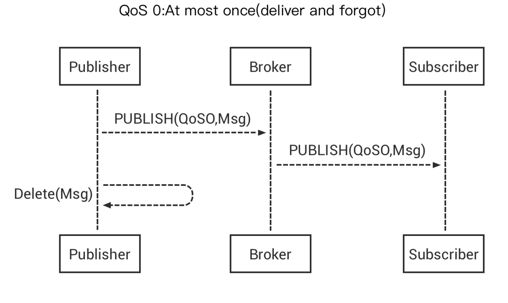
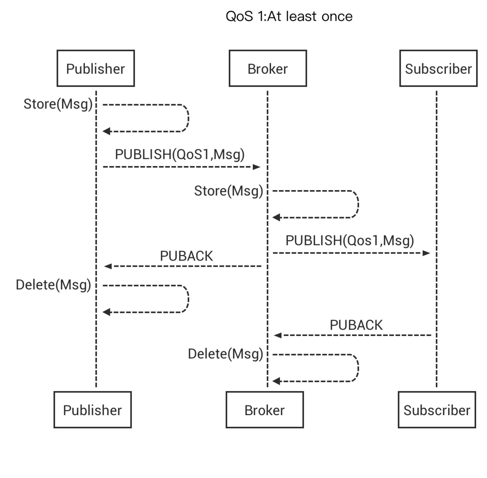
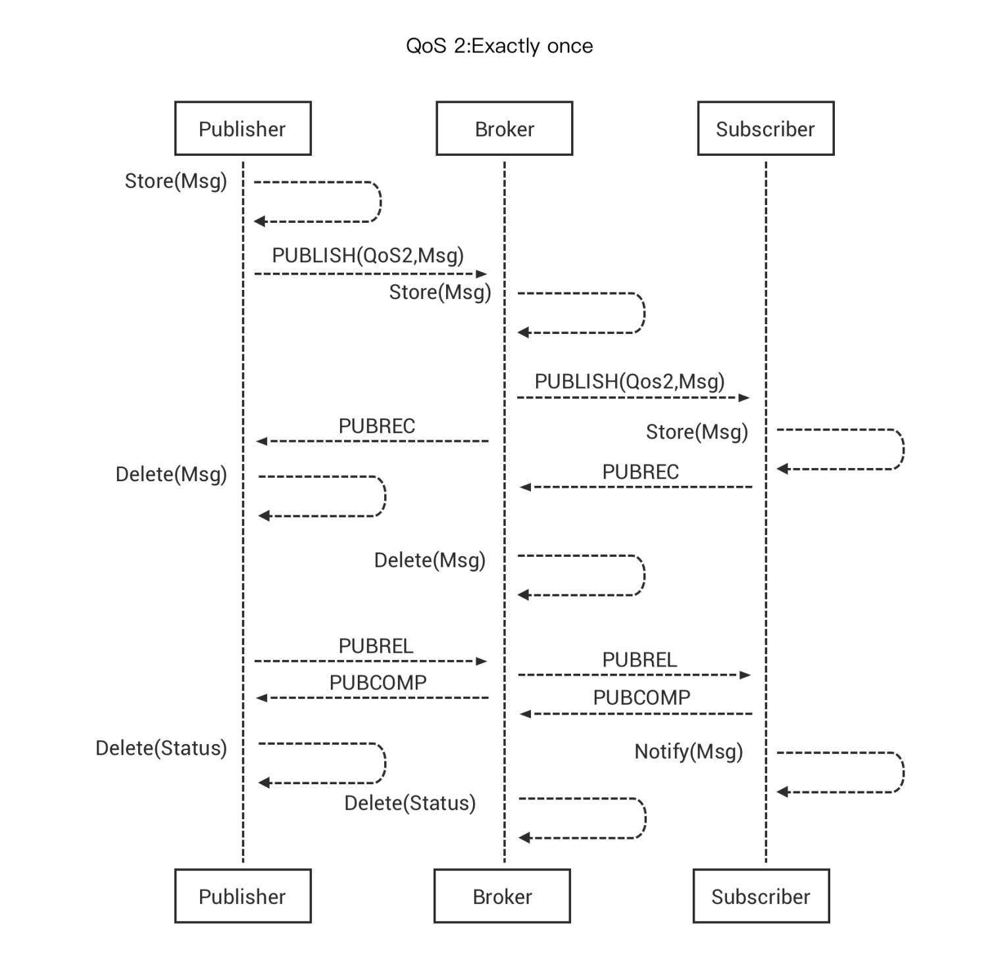

# QoS

MQTT 协议中规定了消息服务质量（Quality of Service），它保证了在不同的网络环境下消息传递的可靠性，QoS 的设计是 MQTT 协议里的重点。

## QoS0 最多分发一次

## QoS1 至少分发一次

## QoS 2 只分发一次

## 如何决定 QoS

MQTT 发布消息 QoS 保证不是端到端的，是客户端与服务器之间的。订阅者收到 MQTT 消息的 QoS 级别，最终取决于发布消息的 QoS 和主题订阅的 QoS。

| 发布消息的 QoS | 主题订阅的 QoS | 接收消息的 QoS |
| -------------- | -------------- | -------------- |
| 0              | 0              | 0              |
| 0              | 1              | 0              |
| 0              | 2              | 0              |
| 1              | 0              | 0              |
| 1              | 1              | 1              |
| 1              | 2              | 1              |
| 2              | 0              | 0              |
| 2              | 1              | 1              |
| 2              | 2              | 2              |

::: tip

更多有关 MQTT 消息 QoS 内容请参考：

- [MQTT QoS（服务质量）介绍](https://www.emqx.com/zh/blog/introduction-to-mqtt-qos)

:::
