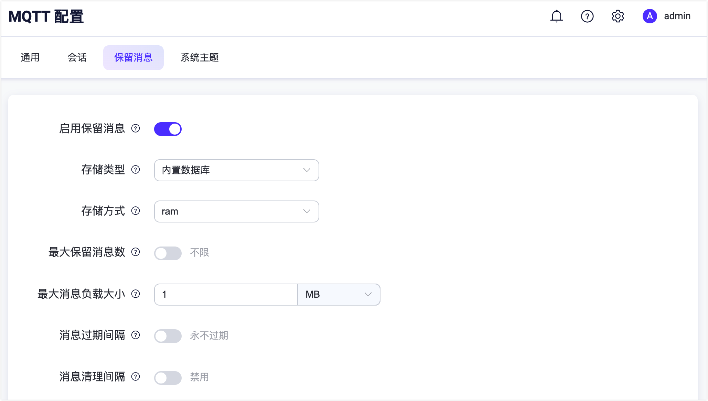

# 保留消息

MQTT 客户端向服务器发布 (PUBLISH) 消息时，可以设置保留消息 (Retained Messages) 标志在当前主题设置一条持久消息，消息将被保存在服务器上，新的订阅者订阅主题时将接收到该消息。

每个主题下只能存在一份保留消息，因此如果已经存在相同主题的保留消息，则该保留消息被替换。

例如 MQTT X CLI 发布一条保留消息到主题 'a/b/c':

```bash
mqttx pub -r -q 1 -t a/b/c -m 'hello'
```

之后连接上来的 MQTT 客户端订阅主题 'a/b/c' 时候，仍可收到该消息:

```bash
$ mqttx sub -t a/b/c -q 1
payload:  hello
```

保留消息虽然存储在服务端中，但它并不属于会话的一部分。也就是说，即便发布这个保留消息的会话终结，保留消息也不会被删除。EMQX 保留消息通过以下方式删除：

1. 客户端向有保留消息的主题发布一个空消息:

```bash
mqttx pub -r -q 1 -t a/b/c -m ''
```

2. 超过 EMQX 设置的最大保留消息数。
3. 通过 EMQX 保留消息 REST API 删除。
4. 设置了消息过期间隔，到期后保留消息将被删除，适用于 MQTT 5.0。

::: tip

更多有关 MQTT保留消息内容请参考：

- [MQTT 保留消息是什么？如何使用？](https://www.emqx.com/zh/blog/mqtt5-features-retain-message)

:::


EMQX 默认开启保留消息的能力和服务，可以在 `etc/emqx.conf` 中修改 `mqtt.retain_available` 为 `false` 来关闭保留消息的能力，
这样客户端将被禁止发送 Retain 标志为 1 的 PUBLISH 报文，否则，客户端将会收到原因码为 0x9A（不支持保留消息）的 DISCONNECT 报文。

保留消息的服务会存储和管理客户端发送的保留消息，并发送给相应的订阅者。

## 保留消息配置

打开 Dashboard，进入 **功能配置**  ->**MQTT** 页面，然后选择 **保留消息** 页面中的 **设置** 栏即可



| 配置项                         | 类型     | 可取值                   | 默认值 | 说明                                                         |
| ------------------------------ | -------- | ------------------------ | ------ | ------------------------------------------------------------ |
| 存储方式       | enum     | `ram`, `disc`| ram |ram：仅储存在内存中；<br />disc：储存在内存和硬盘中。|
| 最大存储条数 | integer  | \>= 0                    | 0      | 保留消息的最大数量，0 表示没有限制。保留消息数量超出最大值限制后，可以替换已存在的保留消息，但不能为新的主题储存保留消息。 |
| 最大存储大小      | bytesize |     | 1MB    | 保留消息的最大 Payload 值。Payload 大小超出最大值后 EMQ Ｘ 消息服务器会把收到的保留消息作为普通消息处理。 |
| 有效期       | duration |       | ０     | 保留消息的过期时间，0 表示永不过期。如果 PUBLISH 报文中设置了消息过期间隔，那么以 PUBLISH 报文中的消息过期间隔为准。 |
| 定时清理       | duration |       | ０     | 清理回收过期消息的间隔时间。 |

## 流控

在保留消息中可以设置消息的读取和派发速率。

当客户端订阅了包含通配符的主题时，它可能会匹配到大量的保留消息，如果没有速率控制，所有匹配到的消息将被一次性发送给订阅者，这可能会导致订阅者的进程因为内存大量激增而被强制关闭。

为了降低风险，可以使用 `retainer.flow_control` 设置保留消息的读取和派发速率, 例如:

```bash
# 每个订阅保留消息的会话每次会加载 10 条消息并投递 10 条消息，所有这些会话的总投递速率被限制为 100/s，而保留消息中的每个工作进程的派发速率被限制为 20/s (大多数情况下，并不需要配置 client 这级)
retainer {
  enable = true
  flow_control {
    batch_read_number = 10
    batch_read_deliver = 10
    batch_read_limiter {
      rate = "100/s"
      capacity = 100
      client {
        rate = "20/s"
        capacity = 20
      }
    }
  }
}
```

配置说明:

| 字段                  | 类型    | 默认值    | 说明                             |
|:----------------------|:--------|:----------|:---------------------------------|
| batch_read_number     | int     | 0         | 每次读取的消息数量(0 表示所有的) |
| batch_deliver_number  | int     | 0         | 每次派发的消息数量(0 表示所有的) |
| batch_deliver_limiter | limiter | undefined | 消息派发的速率限制器             |

关于速率限制器的详细设置，请参考[分层速率控制系统](../rate-limit/rate-limit.md) 中的 `监听器级` 和 `连接级`
