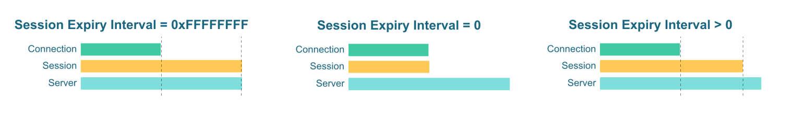

# 会话与消息过期

## MQTT 会话

在协议规范中，QoS 1 和 QoS 2 消息首先会在客户端与 Broker 存储起来，在最终确认抵达订阅端后才会被删除，此过程需要 Broker 将状态与客户端相关联，这称为会话状态。除了消息存储外，订阅信息（客户端订阅的主题列表）也是会话状态的一部分。

当 Broker 中存在会话的时候，消息将持续进入会话，当会话对应的客户端断开连接或不具备消息处理能力时，消息将在会话中堆积。

客户端中的会话状态包括：

- 已发送到服务器，但尚未完全确认的 QoS 1 和 QoS 2 消息
- 已从服务器收到但尚未完全确认的 QoS 2 消息

服务器中的会话状态包括：

- 会话的存在状态，即使会话为空
- 客户订阅信息
- 已发送到客户端，但尚未完全确认的 QoS 1 和 QoS 2 消息
- 等待传输到客户端的 QoS 0（可选）、QoS 1 和 QoS 2 消息
- 已从客户端收到但尚未完全确认的 QoS 2 消息，Will Message（遗嘱消息）和 Will Delay Interval（遗嘱延时间隔）

<!-- TODO 补充链接：
有关 EMQX 会话进阶内容请参考：

- EMQX 会话层设计：EMQX 中消息发送流程，底层消息顺序、报文 ID 与消息 ID 格式设计。
- 消息队列与飞行窗口：存储部分会话数据，会话长度与消息丢弃决定机制。
- 优先级主题
-->

## MQTT 持久会话

为了解决网络连接断开对通信造成的影响，MQTT 协议提供了持久会话功能，需要根据客户端 Clean Session（MQTT v3.1.1）以及 Clean Start + 会话过期间隔（MQTT v5.0）的设置情况决定是否创建持久会话。

启用持久会话后，**在会话有效期内**相同 ClientID 的客户端多次断开连接会话仍然能够保持，能够确保客户端：

- 避免因网络中断导致需要反复订阅带来的额外开销。
- 避免错过离线期间的消息。
- 确保 QoS 1 和 QoS 2 的消息质量保证不被网络中断影响。

MQTT v3.1.1 没有规定持久会话应该在什么时候过期，但在实际场景中会话会占用服务端的资源，因此 EMQX 向用户提供一个全局配置来限制会话的过期时间，会话生命周期与 Clean Session 关系如下：

MQTT v5.0 提供了 Clean Start 与 Session Expiry Interval 来分别决定是否启用会话持久化，以及会话的过期时间，会话生命周期与两者关系如下：

当前版本中，EMQX 的持久会话是基于内存的，这能够带来更出色的吞吐量和消息延迟。这也意味着在对 EMQX 进行重启操作或者 EMQX 意外宕机时也可能会导致会话数据丢失，从而对数据可靠性带来一定影响。

EMQX 企业版提供了外部数据库持久化方案，对于有更高数据可靠性要求的用户可以选择企业版，未来 EMQX 也将提供原生基于磁盘的持久会话能力。

::: tip

更多有关 MQTT 会话内容请参考：

- [MQTT 持久会话与 Clean Session 详解](https://www.emqx.com/zh/blog/mqtt-session)
- [Clean Start 与 Session Expiry Interval - MQTT 5.0 新特性](https://www.emqx.com/zh/blog/mqtt5-new-feature-clean-start-and-session-expiry-interval)

:::
