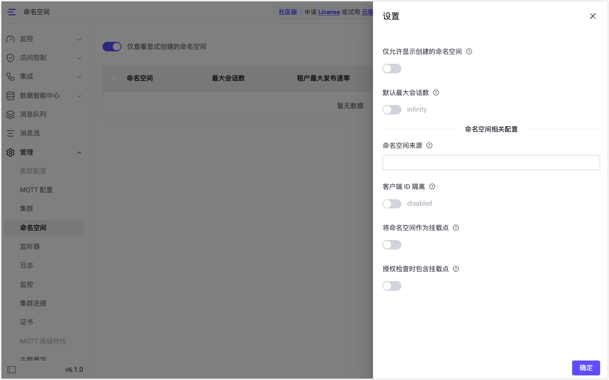

# 全局命名空间设置

在 EMQX 6.1 中，除了可以对单个命名空间实例进行配置外，还提供了一组全局命名空间设置，用于控制命名空间的识别方式、隔离行为以及与主题和授权相关的处理逻辑。

这些设置作用于整个集群，并对所有命名空间和客户端连接生效，通常需要在启用和使用命名空间功能之前进行配置。

全局命名空间设置可通过 Dashboard 进行管理，路径为：**管理** -> **命名空间** -> **设置**。

::: tip 提示

为保持向后兼容性，EMQX 6.1 中的大多数全局命名空间设置（如客户端 ID 隔离、将命名空间作为主题挂载点、授权检查包含挂载点）默认均为关闭状态。  

如需启用相应的隔离能力，请在**命名空间相关配置**中显式开启相关配置。

:::



## 仅允许显示创建的命名空间（Dashboard 显示行为）

**配置项说明**：该配置用于控制 Dashboard 中命名空间列表的显示范围。

- **启用**：
  - 仅显示通过 Dashboard 或 REST API 显式创建的命名空间。
  - 根据命名空间来源规则自动创建的命名空间将被隐藏。
- **关闭**：
  - Dashboard 将同时显示显式创建的命名空间和自动创建的命名空间。

该配置仅影响 Dashboard 的展示行为，不会影响命名空间的实际存在、客户端连接、隔离逻辑或资源控制策略。

## 默认最大会话数

**配置项说明**：该配置用于为新创建的命名空间设置默认的最大会话数上限。

- **启用**：新创建的命名空间将自动继承该最大会话数限制。
- **关闭**：新创建的命名空间默认不限制最大会话数（`infinity`）。

该配置仅对新创建的命名空间生效，不会影响已经存在的命名空间。已存在命名空间的最大会话数需在对应命名空间的配置中单独修改。

## 命名空间来源

**配置项说明**: 命名空间来源用于定义 EMQX 如何从客户端连接信息中识别命名空间。

当客户端连接到 EMQX 时，系统会根据命名空间来源规则，从客户端连接的元数据中提取命名空间标识，并将其写入客户端属性 `client_attrs.tns`。

该配置是以下功能的前提条件：

- 自动创建命名空间
- 基于命名空间的主题隔离
- 基于命名空间的客户端 ID 隔离
- 命名空间级会话限制与速率限制

如果未配置命名空间来源，则客户端不会被分配到任何命名空间，相关隔离和控制功能也不会生效。

### 示例

以下示例从客户端用户名中提取命名空间：

```
nth(1, tokens(username, '-'))
```

在该配置下：

- 客户端使用用户名 `tenantA-user1` 连接
- 命名空间来源规则会从用户名中提取 `tenantA`
- `tenantA` 即为该客户端所属的命名空间标识

::: tip

命名空间来源规则使用 Variform 表达式进行定义，有关 Variform 表达式的语法和可用函数，请参考
[Variform 表达式](../configuration/configuration.md#variform-表达式)。

:::

## 客户端 ID 隔离

**配置项说明**：客户端 ID 隔离用于解决多租户场景下不同命名空间使用相同客户端 ID 导致冲突的问题。

启用该配置后，EMQX 会在内部为客户端 ID 自动添加命名空间前缀，而客户端在连接时使用的原始 Client ID 保持不变。

当启用客户端 ID 隔离时，Dashboard 会自动填入一个推荐的默认表达式：

```
concat([client_attrs.tns, '-', clientid])
```

在上述配置下：

- 不同命名空间中的客户端即使使用相同的 Client ID，也不会发生冲突。
- 内部实际使用的客户端 ID 将包含命名空间前缀。

该表达式仅作为示例，用户可以根据自身业务需要调整，只要最终生成的客户端 ID 在全局范围内保持唯一即可。

### 实际效果示例

假设已配置命名空间来源，并从用户名中提取命名空间：

```text
nth(1, tokens(username, '-'))
```

并启用了客户端 ID 隔离，使用默认表达式：

```text
concat([client_attrs.tns, '-', clientid])
```

#### 客户端连接信息

| 客户端 | 用户名        | Client ID |
| ------ | ------------- | --------- |
| A      | tenantA-user1 | client1   |
| B      | tenantB-user2 | client1   |

#### EMQX 内部实际使用的客户端 ID

| 命名空间 | 原 Client ID | 实际 Client ID  |
| -------- | ------------ | --------------- |
| tenantA  | client1      | tenantA-client1 |
| tenantB  | client1      | tenantB-client1 |

## 将命名空间作为挂载点

**配置项说明**：启用该配置后，EMQX 会在成功识别命名空间的前提下，将客户端所属的命名空间作为主题挂载点（mountpoint），用于实现命名空间级别的主题隔离。

如果监听器已单独配置了 `mountpoint`，则会忽略该设置，以监听器上的 `mountpoint` 配置为准。

### 行为说明

启用**将命名空间作为挂载点**后，EMQX 会通过以下方式对主题进行隔离处理：

- 在客户端执行 PUBLISH、SUBSCRIBE、UNSUBSCRIBE 以及遗嘱消息时：
  - EMQX 会在 Broker 内部自动为主题添加命名空间前缀 `{namespace}/`。
- 在消息投递给客户端时：
  - EMQX 会自动移除该命名空间前缀。
- 对客户端而言：
  - 发布和订阅的主题名称始终保持不变。
  - 客户端无需感知命名空间前缀的存在。

### 示例说明

假设客户端所属命名空间为 `n1`，并已启用**将命名空间作为挂载点**。

#### 客户端侧行为

- 客户端订阅主题：`sensors/#`
- 客户端发布主题：`sensor/data`

#### EMQX 内部处理过程

- Broker 在内部注册订阅主题：`n1/sensors/#`
- Broker 在内部路由消息：`n1/sensors/data`
- 消息最终投递给客户端时：`sensors/data`

可以看到：

- 命名空间前缀仅在 EMQX 内部生效。
- 客户端始终使用原始主题名称。
- 不同命名空间的客户端即使使用相同主题，也不会互相收到消息。

## 授权检查时包含挂载点

**配置项说明**：该配置用于控制在执行授权（ACL）校验时，目标主题和主题过滤器是否在匹配 ACL 规则或授权器之前，自动加上主题挂载点前缀。

该挂载点前缀通常来自命名空间（当启用“将命名空间作为挂载点”时），其格式为：`{namespace}/`。

### 行为说明

启用**授权检查时包含挂载点**后，EMQX 的授权校验流程将发生如下变化：

- 在执行 ACL 规则或授权器匹配之前，EMQX 会先为目标主题或主题过滤器添加主题挂载点前缀。
- 随后，使用带有挂载点前缀的主题进行授权校验。

该行为适用于以下操作场景：

- PUBLISH
- SUBSCRIBE
- UNSUBSCRIBE
- 遗嘱消息

### 示例说明

假设已启用以下配置：

- **将命名空间作为挂载点**
- **授权检查时包含挂载点**
- 客户端所属命名空间为 `n1`

#### 客户端侧行为

客户端尝试订阅主题：`sensors/#`。

#### 授权检查时的实际匹配主题

在执行授权校验时，EMQX 使用的主题为：`n1/sensors/#`。因此，对应的 ACL 规则应配置为：`n1/sensors/#`，而不是 `sensors/#`。

### 使用建议

当启用了 **将命名空间作为挂载点** 用于主题隔离时，建议同时启用本配置。这样可以确保授权校验所使用的主题与 Broker 内部实际生效的主题名称保持一致，避免出现授权结果与实际路由行为不一致的情况。

## 显示自动创建的命名空间（Dashboard 显示行为）

**配置项说明**
 该配置仅影响 Dashboard 中命名空间列表的显示行为，不影响命名空间的创建或实际生效逻辑。

- **启用**：
   Dashboard 仅显示显式创建的命名空间
- **关闭**：
   Dashboard 同时显示显式创建的命名空间和根据命名空间来源规则自动创建的命名空间
