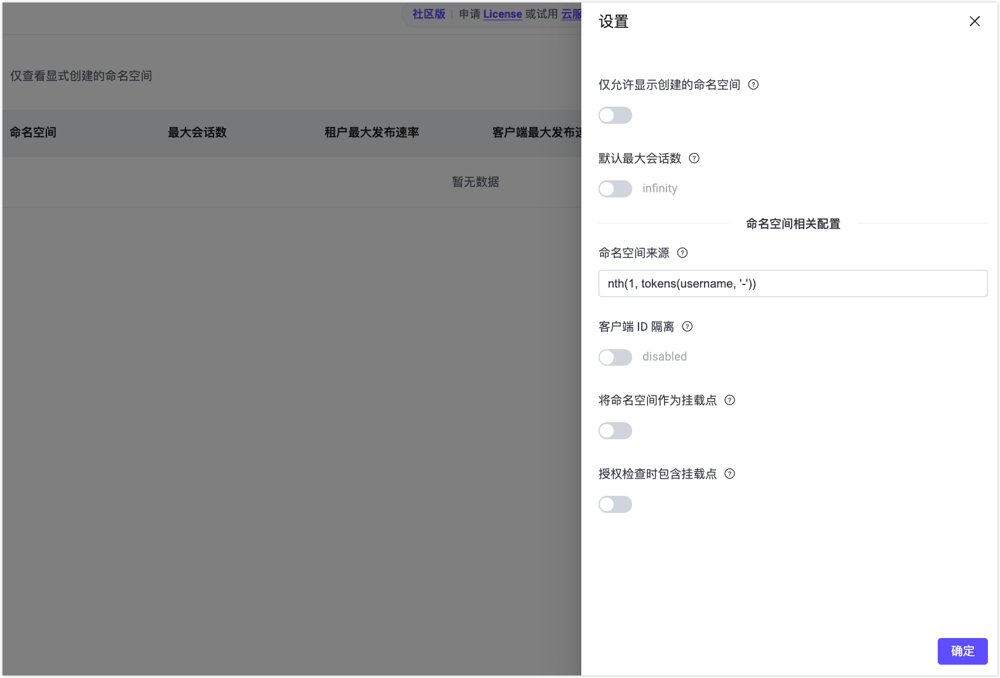
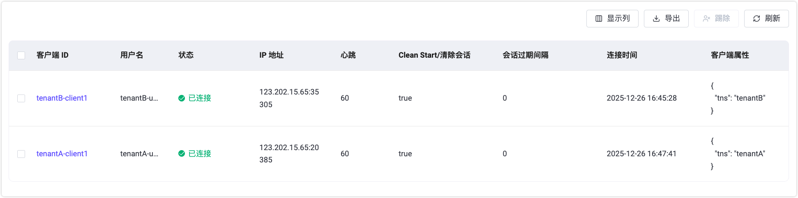
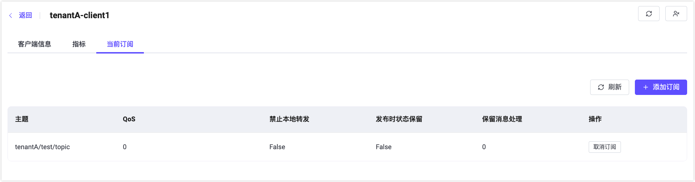

# 快速体验命名空间功能

本节将引导您使用 [MQTTX 客户端](https://mqttx.app/zh)连接 EMQX，并快速体验命名空间功能的关键能力：租户识别、客户端与主题隔离，和 ACL 隔离。

## **启用命名空间来源（生成** **`tns`** **属性）**

要使用命名空间功能，首先需要启用命名空间。通过配置**命名空间来源**，EMQX 可以从客户端连接信息中识别命名空间标识，并在客户端连接时自动创建对应的命名空间。

### 通过配置文件启用

在 EMQX 的 `base.hocon` 中添加以下配置，从用户名中提取命名空间标识：

```hocon
mqtt.client_attrs_init = [
  { expression = "nth(1, tokens(username, '-'))", set_as_attr = tns }
]
```

**示例说明**：如果客户端连接时使用的用户名是 `tenantA-user1`，EMQX 会将 `tenantA` 作为命名空间标识。

### 通过 Dashboard 启用

您也可以通过 Dashboard 配置命名空间来源：

1. 在 Dashboard 中导航到 **管理** -> **命名空间** -> **设置**。

2. 在**命名空间来源**中填写表达式，例如：

   ```
   nth(1, tokens(username, '-'))
   ```

3. 点击**确定**保存设置。

   

### 验证命名空间自动创建

1. 使用 MQTTX 创建一个 MQTT 客户端连接，模拟租户 `tenantA`：

   - **用户名**：`tenantA-user1`
   - 连接到 EMQX。

2. 在**命名空间**页面，关闭**仅查看显示创建的命名空间**开关。

3. 您将看到自动创建的命名空间 `tenantA`。

4. 点击**操作**列中的**客户端**，可以查看连接到该命名空间的客户端。

   

## 配置并验证命名空间隔离效果

### 启用客户端 ID 隔离与主题隔离

为了实现不同命名空间之间的客户端 ID 和主题隔离，需要在全局命名空间设置中启用相关功能。

#### 通过配置文件启用

在 `base.hocon` 中添加以下配置：

```hocon
mqtt.clientid_override = "concat([client_attrs.tns, '-', clientid])"
mqtt.namespace_as_mountpoint = true
```

上述配置将：

- 自动为客户端 ID 添加命名空间前缀，避免不同命名空间之间的客户端 ID 冲突；
- 在 Broker 内部为主题自动添加 `{namespace}/` 前缀，实现命名空间级别的主题隔离。

#### 通过 Dashboard 启用

1. 在 Dashboard 中导航到**管理** -> **命名空间** -> **设置**。
2. 启用以下配置项：
   - **客户端 ID 隔离**，默认值为`concat([client_attrs.tns, '-', clientid])`。
   - **将命名空间作为挂载点**
3. 点击**确定**保存设置。

### 验证客户端与主题隔离

1. 使用 MQTTX 分别创建两个 MQTT 客户端连接，模拟两个租户：`tenantA` 和 `tenantB`。 

   **客户端 A（租户 tenantA）**：

   | 配置项    | 值              |
   | --------- | --------------- |
   | 客户端 ID | `client1`       |
   | 用户名    | `tenantA-user1` |
   | 订阅主题  | `test/topic`    |

   **客户端 B（租户 tenantB）**：

   | 配置项    | 值              |
   | --------- | --------------- |
   | 客户端 ID | `client1`       |
   | 用户名    | `tenantB-user2` |
   | 发布主题  | `test/topic`    |

2. 使用客户端 B 发布一条消息。在 MQTTX 和 Dashboard 中验证结果：

   - 尽管两者使用相同的客户端 ID（`client1`），由于启用了前缀规则，它们在实际连接中的 ID 为 `tenantA-client1` 和 `tenantB-client1`，不会冲突。
   - 另一个命名空间的客户端即使订阅同样的主题，也收不到消息，因此客户端 A 不会收到该消息。

3. 在**监控** -> **客户端**页面查看：

   - 客户端 A 的订阅主题变为 `tenantA/test/topic`。
   
   
      - 客户端 B 的发布主题变为 `tenantB/test/topic`。
   





## 启用基于主题前缀的授权检查

默认情况下，为保持向后兼容性，授权（ACL）检查不会包含主题前缀（mountpoint）。这意味着授权规则会根据原始主题名称（例如 `test/topic`）进行匹配，而不是带命名空间的主题名称（例如 `tenantA/test/topic`）。

从 EMQX 6.1 开始，您可以启用基于主题前缀的授权检查，以实现命名空间级别的 ACL 隔离。

### 通过配置文件启用

在 `base.hocon` 中添加：

```
authorization.include_mountpoint = true
```

### 通过 Dashboard 启用

1. 在 Dashboard 中导航到**管理** -> **命名空间** -> **设置**，或者**访问控制** -> **客户端授权** -> **设置**。
2. 启用**授权检查包含主题前缀**。
3. 保存设置。

::: tip 注意

当启用 `authorization.include_mountpoint=true` 时，所有授权规则都必须在主题匹配模式中包含主题前缀。例如，如果客户端通过带有主题前缀 `tenantA/` 的监听器连接并希望订阅 `test/topic`，对应的授权规则应配置为 `tenantA/test/topic`。

:::