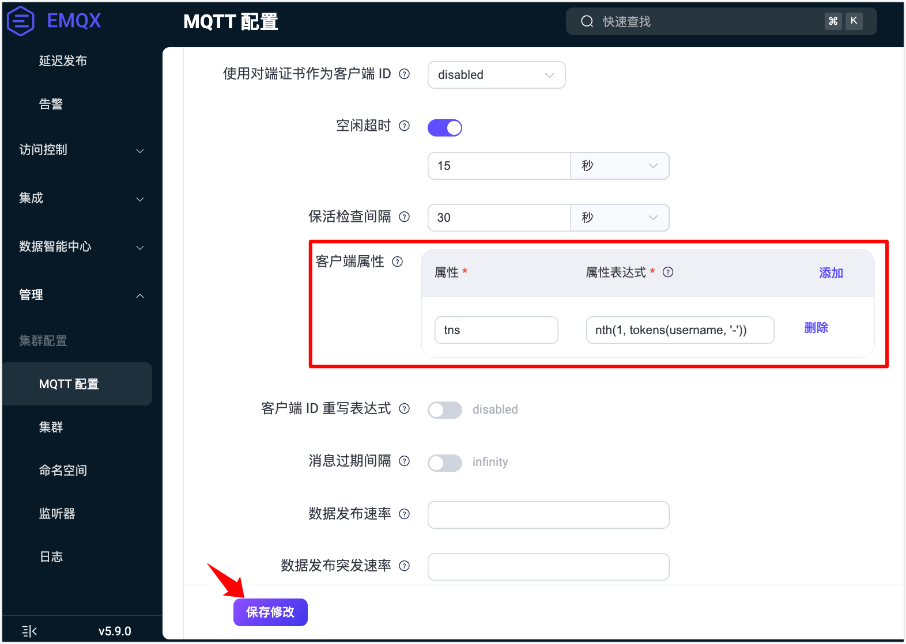
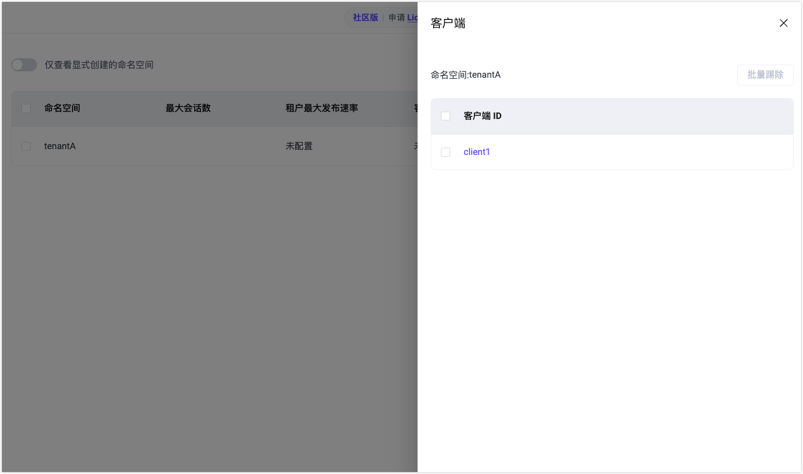
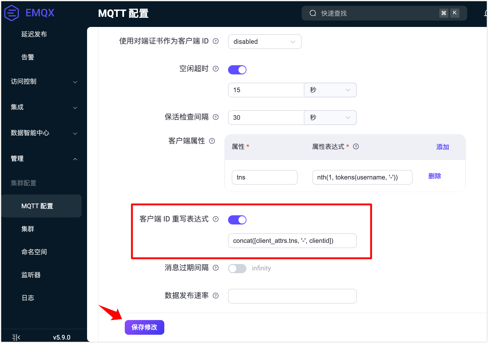
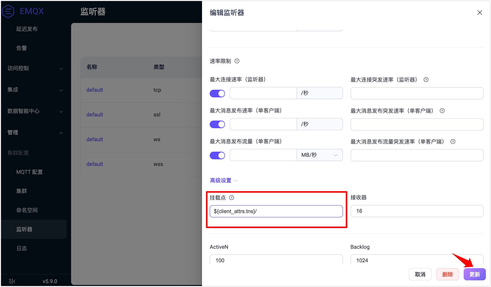

# 快递体验命名空间功能

本节将引导您使用 [MQTTX 客户端](https://mqttx.app/zh)连接 EMQX，并快速体验命名空间功能的关键能力：租户识别、客户端隔离与主题隔离。

## 启用 `tns` 属性作为命名空间识别字段

1. 首先，在 EMQX `emqx.conf` 中配置客户端属性，从用户名中提取命名空间标识用户识别租户：

   ```
   mqtt.client_attrs_init = [{expression = "nth(1, tokens(username, '-'))", set_as_attr = tns}]
   ```

   > 示例说明：如果客户端连接时使用的用户名是 `tenantA-user1`，EMQX 会将 `tenantA` 作为命名空间名（`tns`）提取出来。

    或者，您也可以在 Dashboard 中进行设置：

   

2. 创建一个 MQTT 客户端连接，模拟租户 `tenantA`，将用户名设置为 `tenantA-user1`，连接到 EMQX。

3. 查看 Dashboard 的**命名空间**页面，关闭**仅查看显示创建的命名空间**开关。您将看到自动创建的命名空间 `tenantA`。

   点击**操作**列的**客户端**，可以看到连接到该命名空间的客户端。

   

## 配置并验证命名空间隔离效果

1. 为了实现不同命名空间之间的主题和客户端 ID 隔离，在 `emqx.conf` 中添加以下配置：

   ```
   mqtt.clientid_override = "concat([client_attrs.tns, '-', clientid])"
   listener.tcp.default.mountpoint = "${client_attrs.tns}/"
   ```

   上述配置会：

   - 自动为客户端 ID 添加租户前缀，避免冲突；
   - 自动为主题添加挂载点，实现租户间的主题隔离。

   或者，您也可以在 Dashboard 中进行设置：

   

   

2. 使用 MQTTX 分别创建两个 MQTT 客户端连接，模拟两个租户：`tenantA` 和 `tenantB`。 

   **客户端 A（租户 tenantA）**：

   | 配置项    | 值              |
   | --------- | --------------- |
   | Client ID | `client1`       |
   | Username  | `tenantA-user1` |
   | 订阅主题  | `test/topic`    |

   **客户端 B（租户 tenantB）**：

   | 配置项    | 值              |
   | --------- | --------------- |
   | Client ID | `client1`       |
   | Username  | `tenantB-user2` |
   | 发布主题  | `test/topic`    |

3. 使用客户端 B 发布一条消息。在 MQTTX 和 Dashboard 中验证结果：

   - 尽管两者使用相同的客户端 ID（`client1`），由于启用了前缀规则，它们在实际连接中的 ID 为 `tenantA-client1` 和 `tenantB-client1`，不会冲突。

   - 另一个命名空间的客户端即使订阅同样的主题，也收不到消息，因此客户端 A 不会收到该消息。

   - 在**监控** -> **客户端**页面查看：

     - 客户端 A 的订阅主题变为 `tenantA/test/topic`。

     - 客户端 B 的发布主题变为 `tenantB/test/topic`。