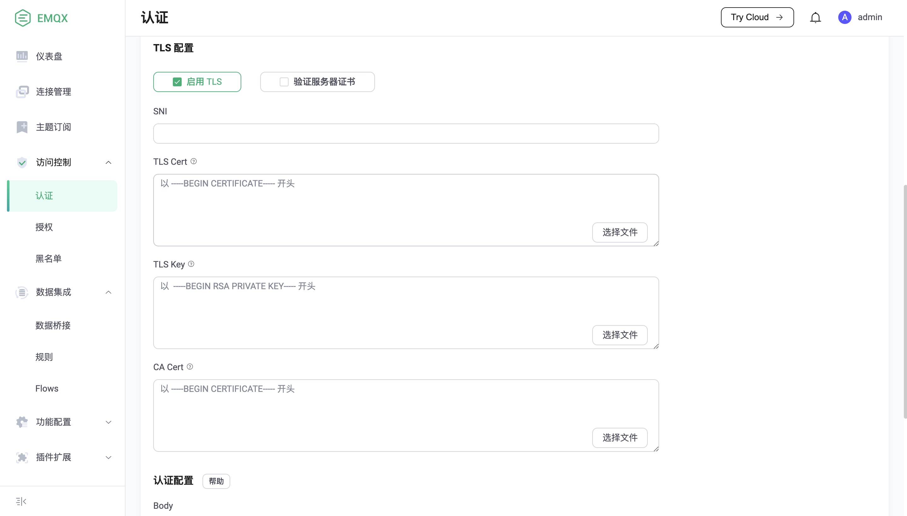

# SSL/TLS

当接收 MQTT 客户端连接或连接到外部资源时，EMQX 支持以 SSL/TLS 的方式
建立安全的连接。

## MQTT SSL 监听器

### TLS 双向认证

如果要为 MQTT 客户端添加 TLS 认证，仅需要添加一个 `ssl` 类型的监听器，并设置
其 `ssl_options.verify = verify_peer` 来验证客户端证书。

默认的 `ssl` MQTT 监听器运行在 8883 端口：

```
listeners.ssl.default {
  bind = "0.0.0.0:8883"

  access_rules = [
    "allow all"
  ]

  proxy_protocol = false
  proxy_protocol_timeout = 3s

  ssl_options.keyfile = "etc/certs/key.pem"
  ssl_options.certfile = "etc/certs/cert.pem"
  ssl_options.cacertfile = "etc/certs/cacert.pem"

  # to verify client certs
  ssl_options.verify = verify_peer

  ssl_options.versions = ["tlsv1.3", "tlsv1.2", "tlsv1.1", "tlsv1"]
  tcp_options.backlog = 1024
  tcp_options.buffer = 4KB
}
```

::: tip
`key.pem`，`cert.pem` 和 `cacert.pem` 是由 EMQX Broker 生成的自签名证书。
因此，如果需支持 SSL 双向认证，需要把 `etc/certs/cacert.pem` 配置到 MQTT
客户端上。
:::

::: warning
生产环境请替换默认证书以确保安全。
:::

### PSK 认证

除常规的 SSL 配置外，EMQX 还提供了对 [PSK (Pre-Shared-Key)](https://en.wikipedia.org/wiki/Pre-shared_key) 的支持。

为开启 PSK 认证，需要先在 `psk_authentication` 中预先配置密钥：

```
psk_authentication {
    ## Whether to enable the PSK feature.
    enable = true

    ## If init file is specified, emqx will import PSKs from the file
    ## into the built-in database at startup for use by the runtime.
    ##
    ## The file has to be structured line-by-line, each line must be in
    ## the format: <PSKIdentity>:<SharedSecret>
    init_file = "data/init.psk"

    ## Specifies the separator for PSKIdentity and SharedSecret in the init file.
    ## The default is colon (:)
    separator = ":"

    ## The size of each chunk used to import to the built-in database from psk file
    ## chunk_size = 50
}
```

以上的配置，表明预设密钥存放在 `data/init.psk` 文件里，其格式为：

```
myclient1:8c701116e9127c57a99d5563709af3deaca75563e2c4dd0865701ae839fb6d79
myclient2:d1e617d3b963757bfc21dad3fea169716c3a2f053f23decaea5cdfaabd04bfc4
```

然后，需要将 `ssl` 监听器的 `cipher` 修改为支持 PSK 的加密套件：

```
listeners.ssl.default {
  ...
  ssl_options.versions = ["tlsv1.2"]
  ssl_options.ciphers = "PSK-AES256-GCM-SHA384,PSK-AES128-GCM-SHA256,PSK-AES256-CBC-SHA384,PSK-AES256-CBC-SHA,PSK-AES128-CBC-SHA256,PSK-AES128-CBC-SHA,RSA-PSK-AES256-GCM-SHA384,RSA-PSK-AES256-CBC-SHA384,RSA-PSK-AES128-GCM-SHA256,RSA-PSK-AES128-CBC-SHA256,RSA-PSK-AES256-CBC-SHA,RSA-PSK-AES128-CBC-SHA,RSA-PSK-RC4-SHA"
  ...
}
```

::: tip
PSK 仅支持 tlsv1.2 及以下的版本。
:::

**注意**:

如果使用 `RSA-PSK` 密码套件，则仍然需要 `RSA` 证书，详见 [RFC4279](https://www.rfc-editor.org/rfc/rfc4279#section-4)

## 使用 SSL 连接外部资源

除了允许接收一个双向 SSL 的 MQTT 客户端，EMQX 还提供了以 SSL 的方式访问外部资源。
例如，通过 HTTPS 的方式访问一个 Web 服务器：



在创建任何对外部资源的连接时，可以选择启用 TLS 并配置其 SSL 客户端证书。其中：

- 当启用 **验证服务证书** 后，必须填写 **CA Cert** 字段来验证服务器证书的合法性。
- 当服务器需要验证客户端证书时，则必须填写 **TLS Cert** 和 **TLS Key**。
- **SNI** 即 Server Name Indication，表示是否验证服务器域名和证书是否一致；为空时表示不验证。

此外，在 `emqx.conf` 配置文件中同样完成该配置：

```
authentication {
  url = "https://127.0.0.1:8080"
  backend = "http"

  ...

  ssl {
    enable = true
    cacertfile = "etc/certs/cacert.pem"
    certfile = "etc/certs/cert.pem"
    keyfile = "etc/certs/key.pem"
    ## verify_peer 表示，开启验证服务器证书
    verify = verify_peer
  }
}
```

## SSL 配置项

完整的 SSL 监听器配置参考：[broker:listener_ssl_opts](../admin/cfg.md#broker-listener-ssl-opts)

SSL 客户端配置参考：[broker:ssl_client_opts](../admin/cfg.md#broker-ssl-client-opts)

### Ciphers

无论是 SSL 监听器或 SSL 客户端，它们可配置的 `ciphers` 为：

```
# TLS 1.3:
TLS_AES_256_GCM_SHA384
TLS_AES_128_GCM_SHA256
TLS_CHACHA20_POLY1305_SHA256
TLS_AES_128_CCM_SHA256
TLS_AES_128_CCM_8_SHA256

# TLS 1.2 and below:
ECDHE-ECDSA-AES256-GCM-SHA384
ECDHE-RSA-AES256-GCM-SHA384
ECDHE-ECDSA-AES256-SHA384
ECDHE-RSA-AES256-SHA384
ECDH-ECDSA-AES256-GCM-SHA384
ECDH-RSA-AES256-GCM-SHA384
ECDH-ECDSA-AES256-SHA384
ECDH-RSA-AES256-SHA384
DHE-DSS-AES256-GCM-SHA384
DHE-DSS-AES256-SHA256
AES256-GCM-SHA384
AES256-SHA256
ECDHE-ECDSA-AES128-GCM-SHA256
ECDHE-RSA-AES128-GCM-SHA256
ECDHE-ECDSA-AES128-SHA256
ECDHE-RSA-AES128-SHA256
ECDH-ECDSA-AES128-GCM-SHA256
ECDH-RSA-AES128-GCM-SHA256
ECDH-ECDSA-AES128-SHA256
ECDH-RSA-AES128-SHA256
DHE-DSS-AES128-GCM-SHA256
DHE-DSS-AES128-SHA256
AES128-GCM-SHA256
AES128-SHA256
ECDHE-ECDSA-AES256-SHA
ECDHE-RSA-AES256-SHA
DHE-DSS-AES256-SHA
ECDH-ECDSA-AES256-SHA
ECDH-RSA-AES256-SHA
ECDHE-ECDSA-AES128-SHA
ECDHE-RSA-AES128-SHA
DHE-DSS-AES128-SHA
ECDH-ECDSA-AES128-SHA
ECDH-RSA-AES128-SHA

# PSK ciphers:
RSA-PSK-AES256-GCM-SHA384
RSA-PSK-AES256-CBC-SHA384
RSA-PSK-AES128-GCM-SHA256
RSA-PSK-AES128-CBC-SHA256
RSA-PSK-AES256-CBC-SHA
RSA-PSK-AES128-CBC-SHA
```
