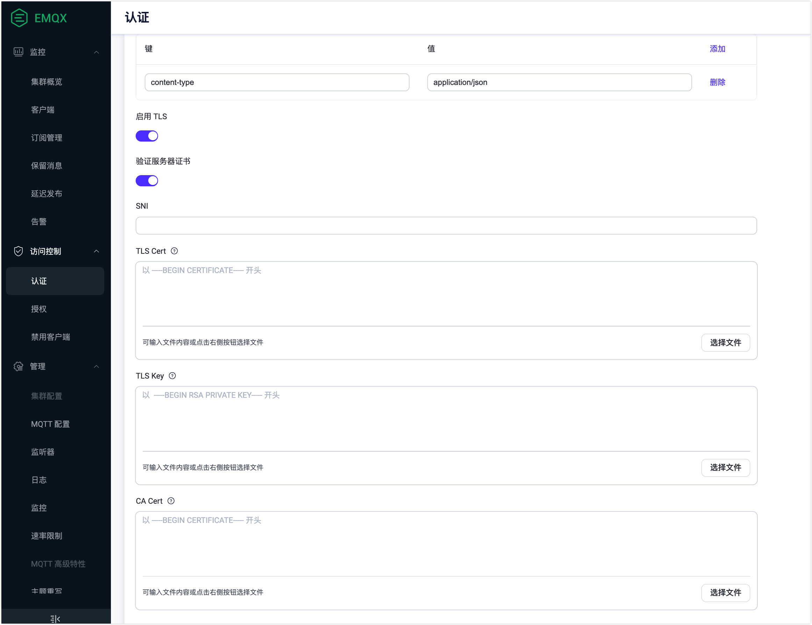

# 开启 SSL/TLS 连接

SSL/TLS 加密功能会在传输层对网络连接进行加密，它能在提升通信数据安全性的同时，保证数据的完整性。EMQX 提供了非常完整的 SSL/TLS 能力支持，包括支持单/双向认证、X.509 证书认证，您可以为包括 MQTT 在内的所有连接启用 SSL/TLS 加密连接，保证接入与消息传输安全。

本章节将向您详细介绍 SSL/TLS 加密连接以及如何在 EMQX 中开启 SSL/TLS 连接。

## 安全优势

1. 强认证：开启 TLS 连接后，通讯双方将互相检查对方的身份，比如通过检查对方持有的 X.509 数字证书；这类数字证书通常是由受信机构 CA（Certificate Authority）颁发，不可伪造。

2. 机密性：开启 TLS 连接后，每次会话都会根据双方协商得到的会话密钥进行加密。任何第三方都无法知晓通讯内容，因此即使一次会话的密钥泄露，也不影响其他会话的安全性。

3. 完整性：加密通讯中的数据被篡改的可能性极低。

对于客户端的 SSL/TLS 连接，您可以根据使用场景选择以下两种使用方式之一：

| 使用方式                                  | 优势                                       | 缺点                                                                                                                |
| ----------------------------------------- | ------------------------------------------ | ------------------------------------------------------------------------------------------------------------------- |
| 直接在客户端与 EMQX 之间开启 SSL/TLS 连接 | 简单易用，不需要额外的组件。               | 会增加 EMQX 的资源消耗，如果连接数量巨大，可能会导致较高的 CPU 和内存消耗。                                         |
| 通过代理或负载均衡终结 TLS 连接           | 不影响 EMQX 性能，同时提供了负载均衡能力。 | 只有少数云厂商的负载均衡器支持 TCP SSL/TLS 终结，此外，用户还需自己部署 [HAProxy](http://www.haproxy.org/) 等软件。 |

本章节将重点介绍如何直接在客户端与 EMQX 之间开启 SSL/TLS 连接，有关如何通过代理或负载均衡终结 TLS 连接，请参考 [集群负载均衡](../../zh_CN/deploy/cluster/lb.md)。

## 配置 SSL 监听器

要为客户端启用 TLS 身份验证，您需要配置监听传入 SSL 连接的 `ssl` 监听器。您需要在 `emqx.conf` 文件中添加 `listeners.ssl` 配置项，并将其 `ssl_options.verify` 选项设置为 `verify_peer`。

以下示例显示了如何在默认端口 `8883` 上配置 `SSL` 监听器：

```bash
listeners.ssl.default {
  bind = "0.0.0.0:8883"

  access_rules = [
    "allow all"
  ]

  proxy_protocol = false
  proxy_protocol_timeout = 3s

  ssl_options.keyfile = "etc/certs/key.pem"
  ssl_options.certfile = "etc/certs/cert.pem"
  ssl_options.cacertfile = "etc/certs/cacert.pem"

  # to verify client certs
  ssl_options.verify = verify_peer

  ssl_options.versions = ["tlsv1.3", "tlsv1.2", "tlsv1.1", "tlsv1"]
  tcp_options.backlog = 1024
  tcp_options.buffer = 4KB
}
```

::: tip

在默认目录 `etc/certs` 下的 `key.pem`、`cert.pem` 和 `cacert.pem` 是由 EMQX 生成的自签名证书。因此，在使用支持 TLS 的客户端进行测试时，您需要将上述证书颁发机构（CA）颁发的证书 `etc/certs/cacert.pem` 配置到客户端上。

在生产环境中，必须使用由可信的 CA 颁发的安全证书。

:::

### SSL 选项

完整的 SSL 监听器选项，详见：[broker:listener_ssl_opts](../configuration/configuration-manual.md#broker-listener-ssl-opts)
SSL 客户端选项，详见: [broker:ssl_client_opts](../configuration/configuration-manual.md#broker-ssl-client-opts)

### 密码套件

作为 SSL 监听器或 SSL 客户端，可以通过以下密码套件进行配置：

```
# TLS 1.3:
TLS_AES_256_GCM_SHA384
TLS_AES_128_GCM_SHA256
TLS_CHACHA20_POLY1305_SHA256
TLS_AES_128_CCM_SHA256
TLS_AES_128_CCM_8_SHA256

# TLS 1.2 and below:
ECDHE-ECDSA-AES256-GCM-SHA384
ECDHE-RSA-AES256-GCM-SHA384
ECDHE-ECDSA-AES256-SHA384
ECDHE-RSA-AES256-SHA384
ECDH-ECDSA-AES256-GCM-SHA384
ECDH-RSA-AES256-GCM-SHA384
ECDH-ECDSA-AES256-SHA384
ECDH-RSA-AES256-SHA384
DHE-DSS-AES256-GCM-SHA384
DHE-DSS-AES256-SHA256
AES256-GCM-SHA384
AES256-SHA256
ECDHE-ECDSA-AES128-GCM-SHA256
ECDHE-RSA-AES128-GCM-SHA256
ECDHE-ECDSA-AES128-SHA256
ECDHE-RSA-AES128-SHA256
ECDH-ECDSA-AES128-GCM-SHA256
ECDH-RSA-AES128-GCM-SHA256
ECDH-ECDSA-AES128-SHA256
ECDH-RSA-AES128-SHA256
DHE-DSS-AES128-GCM-SHA256
DHE-DSS-AES128-SHA256
AES128-GCM-SHA256
AES128-SHA256
ECDHE-ECDSA-AES256-SHA
ECDHE-RSA-AES256-SHA
DHE-DSS-AES256-SHA
ECDH-ECDSA-AES256-SHA
ECDH-RSA-AES256-SHA
ECDHE-ECDSA-AES128-SHA
ECDHE-RSA-AES128-SHA
DHE-DSS-AES128-SHA
ECDH-ECDSA-AES128-SHA
ECDH-RSA-AES128-SHA

# PSK ciphers:
RSA-PSK-AES256-GCM-SHA384
RSA-PSK-AES256-CBC-SHA384
RSA-PSK-AES128-GCM-SHA256
RSA-PSK-AES128-CBC-SHA256
RSA-PSK-AES256-CBC-SHA
RSA-PSK-AES128-CBC-SHA
```

## 通过配置文件开启 SSL/TLS 连接

:::tip 前置准备：

已具备 SSL/TLS 证书。

EMQX 随安装包提供了一组仅用于测试的 SSL/TLS 证书（位于 `etc/certs` 目录），并在 `8883` 端口启用了 SSL/TLS 连接。当应用于生产环境时，应切换至由可靠 CA 签发的证书。有关如何申请相关证书，请阅读拓展阅读 [如何获取 SSL/TLS 证书](#扩展阅读-如何获取-ssl-tls-证书)部分。

:::

1. 将 SSL/TLS 证书文件移动到 EMQX `etc/cert` 目录。
2. 打开配置文件 `emqx.conf` （根据您的安装方式，可能位于 `./etc` 或 `/etc/emqx/etc` 目录），修改 `listeners.ssl.default` 配置组，将证书替换为您的证书，并添加 `verify = verify_none`：

```bash
listeners.ssl.default {
  bind = "0.0.0.0:8883"
  max_connections = 512000
  ssl_options {
    # keyfile = "etc/certs/key.pem"
    keyfile = "etc/certs/server.key"
    # certfile = "etc/certs/cert.pem"
    certfile = "etc/certs/server.crt"
    # cacertfile = "etc/certs/cacert.pem"
    cacertfile = "etc/certs/rootCA.crt"

    # 不开启对端验证
    verify = verify_none
  }
}
```

至此您已经完成 EMQX 上的 SSL/TLS 单向认证配置，单向认证仅保证通信已经被加密，无法验证客户端身份。

如需启用双向认证，请在 `listeners.ssl.default` 配置组中添加如下配置：

```bash
listeners.ssl.default {
  ...
  ssl_options {
    ...
    # 开启对端验证
    verify = verify_peer
    # 强制开启双向认证，如果客户端无法提供证书，则 SSL/TLS 连接将被拒绝
    fail_if_no_peer_cert = true
  }
}
```

3. 重启 EMQX，应用以上配置。

## 启用 TLS 加密访问外部资源

除了允许接收启用了双向 SSL 认证的MQTT 客户端外，EMQX 还提供了通过 SSL 加密访问外部资源的功能。比如，在使用 HTTP 服务进行密码认证时，通过 HTTPS 访问 web 服务器。下面的示例将介绍如何在 Dashboard 和配置文件中开启 TLS 加密。

在 Dashboard 的左侧导航栏点击**访问控制**->**认证**，在**认证**页面，创建 **Password-Based** 认证。



如上所示，连接到外部资源时，您可以启用 TLS 并配置其 SSL 证书。

- **SNI** 意为服务器名称指示，指示服务器域名和证书是否验证为相同；空值表示没有验证。
- 当服务器需要验证客户端证书时，则必须填写 **TLS 证书** 和 **TLS 密钥**。
- 当启用 **TLS 验证** 时，必须填写 **CA 证书** 字段以验证服务器证书的合法性。

除了在 Dashboard 中开启 SSL 加密连接外部资源，您还可以通过 `emqx.conf` 配置，例如在 `authentication` 配置组中添加配置：

```
authentication {
  url = "https://127.0.0.1:8080"
  backend = "http"

  ...

  ssl {
    enable = true
    cacertfile = "etc/certs/cacert.pem"
    certfile = "etc/certs/cert.pem"
    keyfile = "etc/certs/key.pem"
    ## `verify_peer` means turn on verification for server certificate
    verify = verify_peer
  }
}
```

## 启用 PSK 验证 

您可以在 EMQX 中启用 TLS PSK 支持功能。该功能使用预共享密钥来建立安全连接。客户端和 EMQX 在之前的交互中协商出一个共享密钥，然后使用该密钥在 TLS 连接和随后的通信中加密和解密数据，允许客户端和 EMQX 互相验证，并建立安全连接而无需证书或证书授权机构。

您可以在配置文件 `emqx.conf` 中启用 `psk_authentication`:

```bash
psk_authentication {
    ## Whether to enable the PSK feature.
    enable = true

    ## If init file is specified, emqx will import PSKs from the file
    ## into the built-in database at startup for use by the runtime.
    ##
    ## The file has to be structured line-by-line, each line must be in
    ## the format: <PSKIdentity>:<SharedSecret>
    init_file = "data/init.psk"

    ## Specifies the separator for PSKIdentity and SharedSecret in the init file.
    ## The default is colon (:)
    separator = ":"

    ## The size of each chunk used to import to the built-in database from psk file
    ## chunk_size = 50
}
```

创建包含PSK身份和密钥的文件 `data/init.psk`：

```bash
myclient1:8c701116e9127c57a99d5563709af3deaca75563e2c4dd0865701ae839fb6d79
myclient2:d1e617d3b963757bfc21dad3fea169716c3a2f053f23decaea5cdfaabd04bfc4
```

使用 PSK 密码套件配置 `ssl` 监听器:

```bash
listeners.ssl.default {
  ...
  ssl_options.versions = ["tlsv1.2"]
  ssl_options.ciphers = "PSK-AES256-GCM-SHA384,PSK-AES128-GCM-SHA256,PSK-AES256-CBC-SHA384,PSK-AES256-CBC-SHA,PSK-AES128-CBC-SHA256,PSK-AES128-CBC-SHA,RSA-PSK-AES256-GCM-SHA384,RSA-PSK-AES256-CBC-SHA384,RSA-PSK-AES128-GCM-SHA256,RSA-PSK-AES128-CBC-SHA256,RSA-PSK-AES256-CBC-SHA,RSA-PSK-AES128-CBC-SHA,RSA-PSK-RC4-SHA"
  ...
}

```

::: tip

如果使用了 `RSA-PSK` 密码套件，则仍需要 `RSA` 证书，详情请参见 [RFC4279](https://www.rfc-editor.org/rfc/rfc4279#section-4)。

:::

## 扩展阅读：如何获取 SSL/TLS 证书

您可通过以下两种方式获取相关 SSL/TLS 证书：

1. 自签名证书：即使用自己签发的证书，由于自签名证书存在较多的安全隐患，因此只建议用于测试验证环境。
2. 申请或购买证书：您可以向 [Let's Encrypt](https://letsencrypt.org/zh-cn/) 或华为云、腾讯云等云厂商申请免费证书，也可以向 [DigiCert](https://www.digicert.com/) 等机构购买收费证书。对于企业级用户，一般建议申请收费的 OV 及以上类型的证书，以获取更高等级的安全保护。

### 创建自签名证书

:::tip 前置准备

已安装 [OpenSSL](https://www.openssl.org/)。

:::

1. 运行以下命令生成密钥对，该命令随即会提示您输入密钥保护密码，后续在生成、签发、验证证书时均需要此密码。请妥善相关密钥及密码。

```bash
openssl genrsa -des3 -out rootCA.key 2048
```

2. 运行以下命令通过密钥对中的私有密钥生成 CA 证书，该命令随即会提示您设置证书的唯一标识名称 DN（Distinguished Name）。

```bash
openssl req -x509 -new -nodes -key rootCA.key -sha256 -days 3650 -out rootCA.crt
```

3.  使用步骤 2 中的 CA 证书来签发服务端证书，用于验证服务器所有者的身份，服务端证书通常颁发给主机名、服务器名称或域名（如 www.emqx.com）。我们需要 CA 密钥（rootCA.key）、CA 证书（ rootCA.crt）和服务端 CSR （server.csr）生成服务端证书。

  3.1 运行以下命令生成服务端证书密钥对：

  ```bash
  openssl genrsa -out server.key 2048
  ```

  3.2 运行以下命令使用 Server 密钥对制作 CSR。经 CA 根证书私钥签名后，CSR 可生成颁发给用户的证书公钥文件。该命令随即也会要求设置证书的唯一标识名称。

  ```bash
  openssl req -new -key server.key -out server.csr
  ```

  系统将提示以下信息，对应的含义如下：

  ```bash
  You are about to be asked to enter information that will be incorporated
  into your certificate request.
  What you are about to enter is what is called a Distinguished Name or a DN.
  There are quite a few fields but you can leave some blank
  For some fields there will be a default value,
  If you enter '.', the field will be left blank.
  -----
  Country Name (2 letter code) [AU]: # 国家/地区
  State or Province Name (full name) [Some-State]: # 省/市
  Locality Name (eg, city) []: # 城市
  Organization Name (eg, company) [Internet Widgits Pty Ltd]: # 组织机构（或公司名），如 EMQ
  Organizational Unit Name (eg, section) []: # 机构部门，如 EMQX
  Common Name (e.g. server FQDN or YOUR name) []: # 通用名称，此处应当设置为服务器域名如 mqtt.emqx.com
  ...
  ```

  3.3 生成服务端证书，此时也可指定证书的有效天数，此处为 365 天：

  ```bash
  openssl x509 -req -in server.csr -CA rootCA.crt -CAkey rootCA.key -CAcreateserial -out server.crt -days 365
  ```

至此您就得到了一组证书。

```bash
.
├── rootCA.crt
├── rootCA.key
├── rootCA.srl
├── server.crt
├── server.csr
└── server.key
```

<!--申请或购买证书 -->
