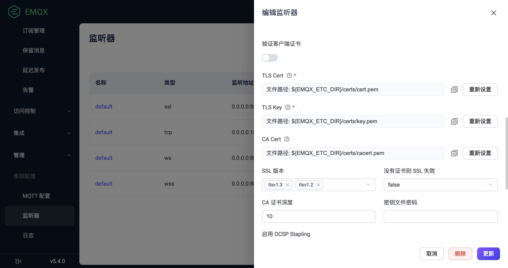

# 开启 SSL/TLS 连接

SSL/TLS 加密功能会在传输层对网络连接进行加密，它能在提升通信数据安全性的同时，保证数据的完整性。EMQX 提供了非常完整的 SSL/TLS 能力支持，包括支持单/双向认证、X.509 证书认证，您可以为包括 MQTT 在内的所有连接启用 SSL/TLS 加密连接，保证接入与消息传输安全。单向认证只保证通信被加密但无法验证客户端身份。而双向认证可以同时验证客户端身份，如果客户端无法提供证书，SSL/TLS 连接将被拒绝。

对于客户端的 SSL/TLS 连接，您可以根据使用场景选择以下两种使用方式之一：

| 使用方式                                  | 优势                                       | 缺点                                                                                                                |
| ----------------------------------------- | ------------------------------------------ | ------------------------------------------------------------------------------------------------------------------- |
| 直接在客户端与 EMQX 之间开启 SSL/TLS 连接 | 简单易用，不需要额外的组件。               | 会增加 EMQX 的资源消耗，如果连接数量巨大，可能会导致较高的 CPU 和内存消耗。                                         |
| 通过代理或负载均衡终结 TLS 连接           | 不影响 EMQX 性能，同时提供了负载均衡能力。 | 只有少数云厂商的负载均衡器支持 TCP SSL/TLS 终结，此外，用户还需自己部署 [HAProxy](http://www.haproxy.org/) 等软件。 |

本章节将向您详细介绍 SSL/TLS 加密连接以及如何在 EMQX 中通过 Dashboard 和 配置文件开启 SSL/TLS 连接。有关如何通过代理或负载均衡终结 TLS 连接，请参考[集群负载均衡](../deploy/cluster/lb.md)。

## 安全优势

启用 SSL/TLS 连接提供了以下安全优势：

1. 强认证：开启 TLS 连接后，通讯双方将互相检查对方的身份，比如通过检查对方持有的 X.509 数字证书；这类数字证书通常是由受信机构 CA（Certificate Authority）颁发，不可伪造。
2. 机密性：开启 TLS 连接后，每次会话都会根据双方协商得到的会话密钥进行加密。任何第三方都无法知晓通讯内容，因此即使一次会话的密钥泄露，也不影响其他会话的安全性。
3. 完整性：加密通讯中的数据被篡改的可能性极低。

## 前置准备

开始之前，您需要具备 SSL/TLS 证书。EMQX 随安装包提供了一组仅用于测试的 SSL/TLS 证书（位于 `etc/certs` 目录），并在 `8883` 端口启用了 SSL/TLS 连接。当应用于生产环境时，应切换至由可靠 CA 签发的证书。有关如何申请相关证书，请参考[获取 SSL/TLS 证书](./tls-certificate.md)部分。

## 通过 Dashboard 开启 SSL/TLS 连接

在 `8883` 端口上启用的 SSL 监听器用来加密客户端与 EMQX 之前的数据传输。在 EMQX Dashboard 中，您可以通过修改 SSL 监听器的设置来开启 SSL/TLS 连接。

1. 将您的私人SSL/TLS 证书文件保存到 EMQX 的 `etc/certs` 目录下。

2. 转到 EMQX Dashboard，在左侧导航栏中点击**管理** -> **监听器**。

3. 在**监听器**页面, 在类型为 SSL 的监听器的**名称**列中点击 **default**。

   - **验证服务器证书**：默认为不启用。如果需要验证客户端身份进行双向认证，点击切换开关。
   - **TLS Cert**, **TLS Key** 和 **CA Cert**：点击**重新设置**上传您的私人证书文件以替换当前的证书文件。
   - **SSL 版本**:  支持所有 TLS/DTLS 版本。默认设置为 `tlsv1.3` 和 `tlsv1.2`。如果 PSK 验证中使用了 PSK 密码套件，确保在此处设置 `tlsv1.2` ， `tlsv1.1` 和 `tlsv1`。更多关于 PSK 验证的内容，参阅 [启用 PSK 验证](./psk-authentication.md)。
   - **没有证书则 SSL 失败**：在**验证服务器证书**启用时使用。默认设置为 `false`。
     - 如果设置为 `true`，如果客户端发送空证书，则客户端身份验证失败，SSL/TLS 连接将被拒绝。
     - 如果设置为 `false`，只有当客户端发送无效证书时，客户端身份验证失败（空证书被认为是有效证书），SSL/TLS 连接将被拒绝。
   - **CA 证书深度**：允许的证书文件路径最大深度； 默认值为 `10`。
   - **密钥文件密码**：如果密钥文件由密码保护，则需要输入密码。
   - **启用 OCSP Stapling**: 默认为不启用；如需获取 X509 数字证书的撤销状态，可以点击切换开关。具体可参阅 [OCSP Stapling](./ocsp.md)。
   - **启用 CRL 检查**：默认为不启用；如需设置证书吊销列表（CRL）检查功能，可以点击切换开关。具体可参阅 [CRL 检查](./crl.md)。

4. 完成编辑后，点击**更新**。

   

## 通过配置文件开启 SSL/TLS 连接

1. 将 SSL/TLS 证书文件移动到 EMQX `etc/cert` 目录。

2. 打开配置文件 `emqx.conf` （根据您的安装方式，可能位于 `./etc` 或 `/etc/emqx/etc` 目录），修改 `listeners.ssl.default` 配置组，将证书替换为您的证书，并添加 `verify = verify_none`：

   ```bash
   listeners.ssl.default {
     bind = "0.0.0.0:8883"
     max_connections = 512000
     ssl_options {
       # keyfile = "etc/certs/key.pem"
       keyfile = "etc/certs/server.key"
       # certfile = "etc/certs/cert.pem"
       certfile = "etc/certs/server.crt"
       # cacertfile = "etc/certs/cacert.pem"
       cacertfile = "etc/certs/rootCA.crt"
   
       # 不开启对端验证
       verify = verify_none
     }
   }
   ```

   至此您已经完成 EMQX 上的 SSL/TLS 单向认证配置，单向认证仅保证通信已经被加密，无法    验证客户端身份。

   如需启用双向认证，请在 `listeners.ssl.default` 配置组中添加如下配置：
   
   ```bash
   listeners.ssl.default {
     ...
     ssl_options {
       ...
       # 开启对端验证
       verify = verify_peer
       # 强制开启双向认证，如果客户端无法提供证书，则 SSL/TLS 连接将被拒绝
       fail_if_no_peer_cert = true
     }
   }
   ```

3. 重启 EMQX，应用以上配置。

## 更新 SSL/TLS 证书

当您的私有 SSL/TLS 证书文件过期时，需要使用新证书替换在 `./etc` 或 `/etc/emqx/etc` 目录下的旧证书来手动更新它们。

EMQX 支持在不重启的情况下轮换 SSL/TLS 证书。默认情况下，EMQX 每 120 秒重新加载 SSL/TLS 证书。


